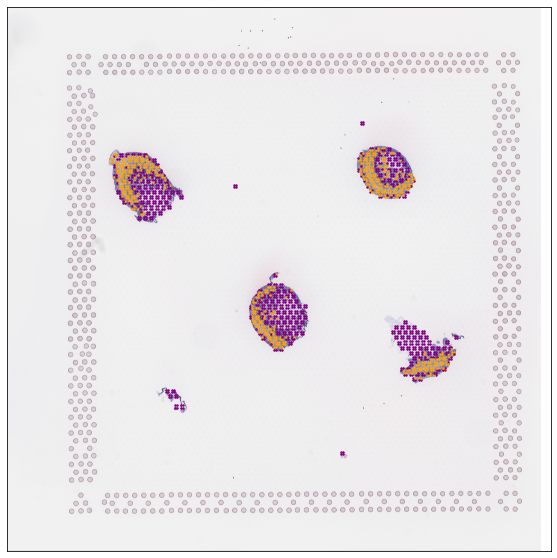

.. _getting_started:

******************************
Getting quickly started
******************************

.. parsed-literal::

Here we present a quickly re-analysis of slide6 on the human intestinal dataset (Fawkner-Corbett et al., Cell, 2021), which including 346 raw ST spots.

This tutorial demonstrates how to enhanced the cellular resolution on 10x Visium data using STASCAN quickly. 

The slide6 data are available at https://github.com/AbbyWY/STASCAN/tree/master/Vignettes/Fawkner-Corbett_Intestinal_Slide6.

For reference, we employed STASCAN on this dataset with three modules in 14 minutes. The experiment was conducted on the GPU platform (NVIDIA Tesla V100s with 32 GB memory).

.. _Preparation:

Preparation
=============================

.. code:: ipython3

    import sys
    import os

.. code:: ipython3

    vignettes_path = "./Vignettes/Fawkner-Corbett_Intestinal_Slide6/" # the path of downloaded slide6 data. 
    output_path = "./"
    
    # You can optionally set the parameter 'epochs=2' to quickly test the pipeline, but you should set the parameter 'epochs=50' for the official run in this tutorial.   
    
    #epochs = 2
    epochs = 50

.. code:: ipython3

    import STASCAN
    

.. code:: ipython3

    label_list = ['Epithelium', 'Fibroblasts', 'Muscularis', 'Neural'] # The list of cell types.
    color_list = ["purple", "orange", "red", "gold"]
    dict_label = dict(zip(label_list, color_list))
    
    
    crop_size = 40 # Pixel radius of spot images.
    raw_image = vignettes_path + "/A6.jpg" # The original H&E staining image, used for Space Ranger previously.
    adjacent_image = vignettes_path+"/Simulated_A7.jpg"
    

.. _Module 1:

Module 1: Cell annotation for unseen spots 
==========================================================

.. _Model running:
Model running
--------------

.. code:: ipython3
    
    if not os.path.exists(output_path + "/Module1/"):
    	os.makedirs(output_path + "/Module1/")
    	
    Module1_output = output_path + "/Module1/"
    
    # The results will be automatically saved in the default Module1_output path.
    run = STASCAN.run_STASCAN.Module()
    run.UnseenSpot(Module1_output, vignettes_path + "/tissue_positions_list.csv", raw_image, crop_size, vignettes_path, epochs=epochs)
    

.. _Running reports:
Running reports
----------------------------

.. parsed-literal::

    The number of raw spots :  346
    The strategy of pre-labelling is: joint
    The number of prior spots :  288
    The number of imputed spots :  614
    Found 231 images belonging to 4 classes.
    Found 57 images belonging to 4 classes.
    {'Epithelium': 0, 'Fibroblasts': 1, 'Muscularis': 2, 'Neural': 3}
    {'Epithelium': 0, 'Fibroblasts': 1, 'Muscularis': 2, 'Neural': 3}
    

.. raw:: html

   

       <pre>
	   
	   
.. parsed-literal::

    Epoch 1/50
    8/8 [==============================] - 10s 589ms/step - loss: 1.2529 - accuracy: 0.5541 - val_loss: 0.9509 - val_accuracy: 0.6316
    Epoch 2/50
    8/8 [==============================] - 3s 385ms/step - loss: 1.0719 - accuracy: 0.5455 - val_loss: 1.0987 - val_accuracy: 0.6316
    Epoch 3/50
    8/8 [==============================] - 3s 373ms/step - loss: 1.0329 - accuracy: 0.6061 - val_loss: 0.8360 - val_accuracy: 0.7018
    Epoch 4/50
    8/8 [==============================] - 3s 439ms/step - loss: 0.9308 - accuracy: 0.6277 - val_loss: 0.7543 - val_accuracy: 0.6667
    Epoch 5/50
    8/8 [==============================] - 3s 386ms/step - loss: 0.8571 - accuracy: 0.6883 - val_loss: 0.7092 - val_accuracy: 0.7368
    Epoch 6/50
    8/8 [==============================] - 3s 371ms/step - loss: 0.8062 - accuracy: 0.7143 - val_loss: 0.7969 - val_accuracy: 0.6316
    Epoch 7/50
    8/8 [==============================] - 3s 388ms/step - loss: 0.7512 - accuracy: 0.7143 - val_loss: 0.7314 - val_accuracy: 0.6667
    Epoch 8/50
    8/8 [==============================] - 3s 390ms/step - loss: 0.8180 - accuracy: 0.6797 - val_loss: 0.9108 - val_accuracy: 0.6316
    Epoch 9/50
    8/8 [==============================] - 3s 387ms/step - loss: 0.9679 - accuracy: 0.6277 - val_loss: 0.7732 - val_accuracy: 0.6316
    Epoch 10/50
    8/8 [==============================] - 3s 372ms/step - loss: 0.8724 - accuracy: 0.6883 - val_loss: 0.6475 - val_accuracy: 0.7719
    Epoch 11/50
    8/8 [==============================] - 3s 388ms/step - loss: 0.7356 - accuracy: 0.7359 - val_loss: 0.7226 - val_accuracy: 0.7018
    Epoch 12/50
    8/8 [==============================] - 3s 383ms/step - loss: 0.7953 - accuracy: 0.7056 - val_loss: 0.6358 - val_accuracy: 0.7895
    Epoch 13/50
    8/8 [==============================] - 3s 376ms/step - loss: 0.6318 - accuracy: 0.7792 - val_loss: 0.6780 - val_accuracy: 0.7368
    Epoch 14/50
    8/8 [==============================] - 3s 396ms/step - loss: 0.7530 - accuracy: 0.7489 - val_loss: 0.5250 - val_accuracy: 0.8246
    Epoch 15/50
    8/8 [==============================] - 3s 386ms/step - loss: 0.6392 - accuracy: 0.7835 - val_loss: 0.4861 - val_accuracy: 0.8421
    Epoch 16/50
    8/8 [==============================] - 3s 388ms/step - loss: 0.6003 - accuracy: 0.7922 - val_loss: 0.6001 - val_accuracy: 0.7544
    Epoch 17/50
    8/8 [==============================] - 3s 374ms/step - loss: 0.5739 - accuracy: 0.7879 - val_loss: 0.7940 - val_accuracy: 0.7018
    Epoch 18/50
    8/8 [==============================] - 3s 391ms/step - loss: 0.6568 - accuracy: 0.7922 - val_loss: 0.6823 - val_accuracy: 0.7193
    Epoch 19/50
    8/8 [==============================] - 3s 388ms/step - loss: 0.6321 - accuracy: 0.7532 - val_loss: 0.5100 - val_accuracy: 0.8421
    Epoch 20/50
    8/8 [==============================] - 3s 387ms/step - loss: 0.6485 - accuracy: 0.7879 - val_loss: 0.6803 - val_accuracy: 0.7544
    Epoch 21/50
    8/8 [==============================] - 3s 386ms/step - loss: 0.5430 - accuracy: 0.8225 - val_loss: 0.4647 - val_accuracy: 0.8070
    Epoch 22/50
    8/8 [==============================] - 3s 443ms/step - loss: 0.5112 - accuracy: 0.8139 - val_loss: 0.4715 - val_accuracy: 0.8246
    Epoch 23/50
    8/8 [==============================] - 3s 394ms/step - loss: 0.5262 - accuracy: 0.8139 - val_loss: 0.4027 - val_accuracy: 0.8421
    Epoch 24/50
    8/8 [==============================] - 3s 385ms/step - loss: 0.4891 - accuracy: 0.8225 - val_loss: 0.3832 - val_accuracy: 0.8421
    Epoch 25/50
    8/8 [==============================] - 3s 384ms/step - loss: 0.5453 - accuracy: 0.8009 - val_loss: 0.5432 - val_accuracy: 0.8070
    Epoch 26/50
    8/8 [==============================] - 3s 388ms/step - loss: 0.5616 - accuracy: 0.8052 - val_loss: 0.6269 - val_accuracy: 0.7895
    Epoch 27/50
    8/8 [==============================] - 3s 387ms/step - loss: 0.7241 - accuracy: 0.7229 - val_loss: 0.7899 - val_accuracy: 0.6316
    Epoch 28/50
    8/8 [==============================] - 3s 390ms/step - loss: 0.7617 - accuracy: 0.6364 - val_loss: 0.5832 - val_accuracy: 0.8246
    Epoch 29/50
    8/8 [==============================] - 3s 373ms/step - loss: 0.5885 - accuracy: 0.7835 - val_loss: 0.4726 - val_accuracy: 0.8246
    Epoch 30/50
    8/8 [==============================] - 3s 394ms/step - loss: 0.5091 - accuracy: 0.8225 - val_loss: 0.3974 - val_accuracy: 0.8596
    Epoch 31/50
    8/8 [==============================] - 3s 384ms/step - loss: 0.4623 - accuracy: 0.8355 - val_loss: 0.4177 - val_accuracy: 0.8772
    Epoch 32/50
    8/8 [==============================] - 3s 384ms/step - loss: 0.4702 - accuracy: 0.8268 - val_loss: 0.3325 - val_accuracy: 0.8596
    Epoch 33/50
    8/8 [==============================] - 3s 386ms/step - loss: 0.4183 - accuracy: 0.8268 - val_loss: 0.3291 - val_accuracy: 0.8596
    Epoch 34/50
    8/8 [==============================] - 3s 368ms/step - loss: 0.3732 - accuracy: 0.8571 - val_loss: 0.3183 - val_accuracy: 0.8772
    Epoch 35/50
    8/8 [==============================] - 3s 382ms/step - loss: 0.3735 - accuracy: 0.8615 - val_loss: 0.3958 - val_accuracy: 0.8421
    Epoch 36/50
    8/8 [==============================] - 3s 386ms/step - loss: 0.4011 - accuracy: 0.8528 - val_loss: 0.3298 - val_accuracy: 0.8421
    Epoch 37/50
    8/8 [==============================] - 3s 375ms/step - loss: 0.3407 - accuracy: 0.8615 - val_loss: 0.3932 - val_accuracy: 0.8596
    Epoch 38/50
    8/8 [==============================] - 3s 391ms/step - loss: 0.4359 - accuracy: 0.8398 - val_loss: 0.3584 - val_accuracy: 0.8772
    Epoch 39/50
    8/8 [==============================] - 3s 384ms/step - loss: 0.6582 - accuracy: 0.7835 - val_loss: 0.5134 - val_accuracy: 0.7895
    Epoch 40/50
    8/8 [==============================] - 3s 388ms/step - loss: 0.5390 - accuracy: 0.7749 - val_loss: 0.3622 - val_accuracy: 0.8421
    Epoch 41/50
    8/8 [==============================] - 3s 373ms/step - loss: 0.3892 - accuracy: 0.8571 - val_loss: 0.3431 - val_accuracy: 0.8772
    Epoch 42/50
    8/8 [==============================] - 3s 371ms/step - loss: 0.3348 - accuracy: 0.8701 - val_loss: 0.3722 - val_accuracy: 0.8772
    Epoch 43/50
    8/8 [==============================] - 3s 392ms/step - loss: 0.5298 - accuracy: 0.8139 - val_loss: 0.6732 - val_accuracy: 0.7368
    Epoch 44/50
    8/8 [==============================] - 3s 396ms/step - loss: 0.6072 - accuracy: 0.7835 - val_loss: 0.5309 - val_accuracy: 0.7895
    Epoch 45/50
    8/8 [==============================] - 3s 387ms/step - loss: 0.4821 - accuracy: 0.8139 - val_loss: 0.4598 - val_accuracy: 0.8421
    Epoch 46/50
    8/8 [==============================] - 3s 387ms/step - loss: 0.3751 - accuracy: 0.8355 - val_loss: 0.5681 - val_accuracy: 0.8246
    Epoch 47/50
    8/8 [==============================] - 3s 434ms/step - loss: 0.3721 - accuracy: 0.8485 - val_loss: 0.3583 - val_accuracy: 0.8421
    Epoch 48/50
    8/8 [==============================] - 3s 393ms/step - loss: 0.3207 - accuracy: 0.8701 - val_loss: 0.3952 - val_accuracy: 0.8246
    Epoch 49/50
    8/8 [==============================] - 3s 434ms/step - loss: 0.3372 - accuracy: 0.8571 - val_loss: 0.3400 - val_accuracy: 0.8772
    Epoch 50/50
    8/8 [==============================] - 3s 382ms/step - loss: 0.2969 - accuracy: 0.8874 - val_loss: 0.3144 - val_accuracy: 0.8772
    {0: 'Epithelium', 1: 'Fibroblasts', 2: 'Muscularis', 3: 'Neural'}
    1/1 [==============================] - 0s 438ms/step
    1/1 [==============================] - 0s 34ms/step
    1/1 [==============================] - 0s 30ms/step
    1/1 [==============================] - 0s 33ms/step
    1/1 [==============================] - 0s 32ms/step
    1/1 [==============================] - 0s 30ms/step
    1/1 [==============================] - 0s 32ms/step
    1/1 [==============================] - 0s 32ms/step
    1/1 [==============================] - 0s 33ms/step
    1/1 [==============================] - 0s 32ms/step
    1/1 [==============================] - 0s 32ms/step
    1/1 [==============================] - 0s 32ms/step
    1/1 [==============================] - 0s 30ms/step
    1/1 [==============================] - 0s 32ms/step
    1/1 [==============================] - 0s 33ms/step
    1/1 [==============================] - 0s 34ms/step
    1/1 [==============================] - 0s 32ms/step
    1/1 [==============================] - 0s 33ms/step
    1/1 [==============================] - 0s 32ms/step
    1/1 [==============================] - 0s 32ms/step
    1/1 [==============================] - 0s 31ms/step
    1/1 [==============================] - 0s 34ms/step
    1/1 [==============================] - 0s 32ms/step
    1/1 [==============================] - 0s 32ms/step
    1/1 [==============================] - 0s 30ms/step
    1/1 [==============================] - 0s 32ms/step
    1/1 [==============================] - 0s 32ms/step
    1/1 [==============================] - 0s 30ms/step
    1/1 [==============================] - 0s 33ms/step
    1/1 [==============================] - 0s 32ms/step
    1/1 [==============================] - 0s 32ms/step
    1/1 [==============================] - 0s 29ms/step
    1/1 [==============================] - 0s 30ms/step
    1/1 [==============================] - 0s 30ms/step
    1/1 [==============================] - 0s 33ms/step
    1/1 [==============================] - 0s 33ms/step
    1/1 [==============================] - 0s 32ms/step
    1/1 [==============================] - 0s 29ms/step
    1/1 [==============================] - 0s 32ms/step
    1/1 [==============================] - 0s 32ms/step
    1/1 [==============================] - 0s 32ms/step
    1/1 [==============================] - 0s 32ms/step
    1/1 [==============================] - 0s 33ms/step
    1/1 [==============================] - 0s 33ms/step
    1/1 [==============================] - 0s 32ms/step
    1/1 [==============================] - 0s 33ms/step
    1/1 [==============================] - 0s 32ms/step
    1/1 [==============================] - 0s 36ms/step
    1/1 [==============================] - 0s 32ms/step
    1/1 [==============================] - 0s 32ms/step
    1/1 [==============================] - 0s 33ms/step
    1/1 [==============================] - 0s 36ms/step
    1/1 [==============================] - 0s 33ms/step
    1/1 [==============================] - 0s 32ms/step
    1/1 [==============================] - 0s 33ms/step
    1/1 [==============================] - 0s 34ms/step
    1/1 [==============================] - 0s 32ms/step
    1/1 [==============================] - 0s 32ms/step
    1/1 [==============================] - 0s 33ms/step
    1/1 [==============================] - 0s 31ms/step
    1/1 [==============================] - 0s 33ms/step
    1/1 [==============================] - 0s 31ms/step
    1/1 [==============================] - 0s 33ms/step
    1/1 [==============================] - 0s 32ms/step
    1/1 [==============================] - 0s 33ms/step
    1/1 [==============================] - 0s 32ms/step
    1/1 [==============================] - 0s 34ms/step
    1/1 [==============================] - 0s 32ms/step
    1/1 [==============================] - 0s 31ms/step
    1/1 [==============================] - 0s 32ms/step
    1/1 [==============================] - 0s 33ms/step
    1/1 [==============================] - 0s 31ms/step
    1/1 [==============================] - 0s 33ms/step
    1/1 [==============================] - 0s 33ms/step
    1/1 [==============================] - 0s 32ms/step
    1/1 [==============================] - 0s 31ms/step
    1/1 [==============================] - 0s 30ms/step
    1/1 [==============================] - 0s 33ms/step
    1/1 [==============================] - 0s 33ms/step
    1/1 [==============================] - 0s 32ms/step
    1/1 [==============================] - 0s 30ms/step
    1/1 [==============================] - 0s 32ms/step
    1/1 [==============================] - 0s 33ms/step
    1/1 [==============================] - 0s 32ms/step
    1/1 [==============================] - 0s 33ms/step
    1/1 [==============================] - 0s 32ms/step
    1/1 [==============================] - 0s 33ms/step
    1/1 [==============================] - 0s 33ms/step
    1/1 [==============================] - 0s 34ms/step
    1/1 [==============================] - 0s 31ms/step
    1/1 [==============================] - 0s 29ms/step
    1/1 [==============================] - 0s 29ms/step
    1/1 [==============================] - 0s 30ms/step
    1/1 [==============================] - 0s 33ms/step
    1/1 [==============================] - 0s 30ms/step
    1/1 [==============================] - 0s 31ms/step
    1/1 [==============================] - 0s 30ms/step
    1/1 [==============================] - 0s 29ms/step
    1/1 [==============================] - 0s 32ms/step
    1/1 [==============================] - 0s 32ms/step
    1/1 [==============================] - 0s 32ms/step
    1/1 [==============================] - 0s 29ms/step
    1/1 [==============================] - 0s 32ms/step
    1/1 [==============================] - 0s 32ms/step
    1/1 [==============================] - 0s 32ms/step
    1/1 [==============================] - 0s 33ms/step
    1/1 [==============================] - 0s 31ms/step
    1/1 [==============================] - 0s 34ms/step
    1/1 [==============================] - 0s 32ms/step
    1/1 [==============================] - 0s 32ms/step
    1/1 [==============================] - 0s 32ms/step
    1/1 [==============================] - 0s 33ms/step
    1/1 [==============================] - 0s 31ms/step
    1/1 [==============================] - 0s 33ms/step
    1/1 [==============================] - 0s 32ms/step
    1/1 [==============================] - 0s 33ms/step
    1/1 [==============================] - 0s 33ms/step
    1/1 [==============================] - 0s 30ms/step
    1/1 [==============================] - 0s 32ms/step
    1/1 [==============================] - 0s 32ms/step
    1/1 [==============================] - 0s 32ms/step
    1/1 [==============================] - 0s 33ms/step
    1/1 [==============================] - 0s 32ms/step
    1/1 [==============================] - 0s 32ms/step
    1/1 [==============================] - 0s 30ms/step
    1/1 [==============================] - 0s 30ms/step
    1/1 [==============================] - 0s 30ms/step
    1/1 [==============================] - 0s 31ms/step
    1/1 [==============================] - 0s 33ms/step
    1/1 [==============================] - 0s 30ms/step
    1/1 [==============================] - 0s 34ms/step
    1/1 [==============================] - 0s 33ms/step
    1/1 [==============================] - 0s 32ms/step
    1/1 [==============================] - 0s 32ms/step
    1/1 [==============================] - 0s 33ms/step
    1/1 [==============================] - 0s 32ms/step
    1/1 [==============================] - 0s 33ms/step
    1/1 [==============================] - 0s 30ms/step
    1/1 [==============================] - 0s 31ms/step
    1/1 [==============================] - 0s 33ms/step
    1/1 [==============================] - 0s 32ms/step
    1/1 [==============================] - 0s 32ms/step
    1/1 [==============================] - 0s 34ms/step
    1/1 [==============================] - 0s 33ms/step
    1/1 [==============================] - 0s 32ms/step
    1/1 [==============================] - 0s 30ms/step
    1/1 [==============================] - 0s 30ms/step
    1/1 [==============================] - 0s 32ms/step
    1/1 [==============================] - 0s 33ms/step
    1/1 [==============================] - 0s 34ms/step
    1/1 [==============================] - 0s 32ms/step
    1/1 [==============================] - 0s 31ms/step
    1/1 [==============================] - 0s 32ms/step
    1/1 [==============================] - 0s 33ms/step
    1/1 [==============================] - 0s 32ms/step
    1/1 [==============================] - 0s 32ms/step
    1/1 [==============================] - 0s 32ms/step
    1/1 [==============================] - 0s 38ms/step
    1/1 [==============================] - 0s 34ms/step
    1/1 [==============================] - 0s 30ms/step
    1/1 [==============================] - 0s 32ms/step
    1/1 [==============================] - 0s 33ms/step
    1/1 [==============================] - 0s 34ms/step
    1/1 [==============================] - 0s 33ms/step
    1/1 [==============================] - 0s 32ms/step
    1/1 [==============================] - 0s 32ms/step
    1/1 [==============================] - 0s 32ms/step
    1/1 [==============================] - 0s 32ms/step
    1/1 [==============================] - 0s 32ms/step
    1/1 [==============================] - 0s 33ms/step
    1/1 [==============================] - 0s 32ms/step
    1/1 [==============================] - 0s 32ms/step
    1/1 [==============================] - 0s 34ms/step
    1/1 [==============================] - 0s 32ms/step
    1/1 [==============================] - 0s 32ms/step
    1/1 [==============================] - 0s 32ms/step
    1/1 [==============================] - 0s 36ms/step
    1/1 [==============================] - 0s 33ms/step
    1/1 [==============================] - 0s 33ms/step
    1/1 [==============================] - 0s 33ms/step
    1/1 [==============================] - 0s 32ms/step
    1/1 [==============================] - 0s 31ms/step
    1/1 [==============================] - 0s 33ms/step
    1/1 [==============================] - 0s 33ms/step
    1/1 [==============================] - 0s 32ms/step
    1/1 [==============================] - 0s 34ms/step
    1/1 [==============================] - 0s 32ms/step
    1/1 [==============================] - 0s 32ms/step
    1/1 [==============================] - 0s 32ms/step
    1/1 [==============================] - 0s 34ms/step
    1/1 [==============================] - 0s 30ms/step
    1/1 [==============================] - 0s 30ms/step
    1/1 [==============================] - 0s 32ms/step
    1/1 [==============================] - 0s 32ms/step
    1/1 [==============================] - 0s 32ms/step
    1/1 [==============================] - 0s 29ms/step
    1/1 [==============================] - 0s 33ms/step
    1/1 [==============================] - 0s 33ms/step
    1/1 [==============================] - 0s 34ms/step
    1/1 [==============================] - 0s 33ms/step
    1/1 [==============================] - 0s 33ms/step
    1/1 [==============================] - 0s 32ms/step
    1/1 [==============================] - 0s 32ms/step
    1/1 [==============================] - 0s 32ms/step
    1/1 [==============================] - 0s 32ms/step
    1/1 [==============================] - 0s 34ms/step
    1/1 [==============================] - 0s 30ms/step
    1/1 [==============================] - 0s 35ms/step
    1/1 [==============================] - 0s 30ms/step
    1/1 [==============================] - 0s 32ms/step
    1/1 [==============================] - 0s 30ms/step
    1/1 [==============================] - 0s 33ms/step
    1/1 [==============================] - 0s 31ms/step
    1/1 [==============================] - 0s 33ms/step
    1/1 [==============================] - 0s 32ms/step
    1/1 [==============================] - 0s 32ms/step
    1/1 [==============================] - 0s 30ms/step
    1/1 [==============================] - 0s 33ms/step
    1/1 [==============================] - 0s 32ms/step
    1/1 [==============================] - 0s 32ms/step
    1/1 [==============================] - 0s 33ms/step
    1/1 [==============================] - 0s 34ms/step
    1/1 [==============================] - 0s 33ms/step
    1/1 [==============================] - 0s 33ms/step
    1/1 [==============================] - 0s 32ms/step
    1/1 [==============================] - 0s 30ms/step
    1/1 [==============================] - 0s 33ms/step
    1/1 [==============================] - 0s 32ms/step
    1/1 [==============================] - 0s 32ms/step
    1/1 [==============================] - 0s 32ms/step
    1/1 [==============================] - 0s 33ms/step
    1/1 [==============================] - 0s 32ms/step
    1/1 [==============================] - 0s 32ms/step
    1/1 [==============================] - 0s 32ms/step
    1/1 [==============================] - 0s 31ms/step
    1/1 [==============================] - 0s 30ms/step
    1/1 [==============================] - 0s 29ms/step
    1/1 [==============================] - 0s 32ms/step
    1/1 [==============================] - 0s 32ms/step
    1/1 [==============================] - 0s 32ms/step
    1/1 [==============================] - 0s 32ms/step
    1/1 [==============================] - 0s 33ms/step
    1/1 [==============================] - 0s 32ms/step
    1/1 [==============================] - 0s 32ms/step
    1/1 [==============================] - 0s 33ms/step
    1/1 [==============================] - 0s 32ms/step
    1/1 [==============================] - 0s 30ms/step
    1/1 [==============================] - 0s 32ms/step
    1/1 [==============================] - 0s 32ms/step
    1/1 [==============================] - 0s 32ms/step
    1/1 [==============================] - 0s 33ms/step
    1/1 [==============================] - 0s 32ms/step
    1/1 [==============================] - 0s 33ms/step
    1/1 [==============================] - 0s 32ms/step
    1/1 [==============================] - 0s 32ms/step
    1/1 [==============================] - 0s 30ms/step
    1/1 [==============================] - 0s 32ms/step
    1/1 [==============================] - 0s 33ms/step
    1/1 [==============================] - 0s 34ms/step
    1/1 [==============================] - 0s 32ms/step
    1/1 [==============================] - 0s 33ms/step
    1/1 [==============================] - 0s 32ms/step
    1/1 [==============================] - 0s 30ms/step
    1/1 [==============================] - 0s 30ms/step
    1/1 [==============================] - 0s 32ms/step
    1/1 [==============================] - 0s 32ms/step
    1/1 [==============================] - 0s 32ms/step
    1/1 [==============================] - 0s 32ms/step
    1/1 [==============================] - 0s 33ms/step
    1/1 [==============================] - 0s 36ms/step
    1/1 [==============================] - 0s 30ms/step
    1/1 [==============================] - 0s 34ms/step
    1/1 [==============================] - 0s 33ms/step
    1/1 [==============================] - 0s 30ms/step
    1/1 [==============================] - 0s 33ms/step
    1/1 [==============================] - 0s 32ms/step
    1/1 [==============================] - 0s 33ms/step
    1/1 [==============================] - 0s 32ms/step
    1/1 [==============================] - 0s 30ms/step
    1/1 [==============================] - 0s 29ms/step
    1/1 [==============================] - 0s 36ms/step
    1/1 [==============================] - 0s 32ms/step
    1/1 [==============================] - 0s 30ms/step
    1/1 [==============================] - 0s 32ms/step
    1/1 [==============================] - 0s 32ms/step
    1/1 [==============================] - 0s 33ms/step
    1/1 [==============================] - 0s 36ms/step
    1/1 [==============================] - 0s 32ms/step
    1/1 [==============================] - 0s 30ms/step
    1/1 [==============================] - 0s 33ms/step
    1/1 [==============================] - 0s 33ms/step
    1/1 [==============================] - 0s 30ms/step
    1/1 [==============================] - 0s 33ms/step
    1/1 [==============================] - 0s 32ms/step
    1/1 [==============================] - 0s 32ms/step
    1/1 [==============================] - 0s 33ms/step
    1/1 [==============================] - 0s 32ms/step
    1/1 [==============================] - 0s 34ms/step
    1/1 [==============================] - 0s 30ms/step
    1/1 [==============================] - 0s 30ms/step
    1/1 [==============================] - 0s 32ms/step
    1/1 [==============================] - 0s 32ms/step
    1/1 [==============================] - 0s 30ms/step
    1/1 [==============================] - 0s 32ms/step
    1/1 [==============================] - 0s 32ms/step
    1/1 [==============================] - 0s 32ms/step
    1/1 [==============================] - 0s 32ms/step
    1/1 [==============================] - 0s 32ms/step
    1/1 [==============================] - 0s 32ms/step
    1/1 [==============================] - 0s 32ms/step
    1/1 [==============================] - 0s 31ms/step
    1/1 [==============================] - 0s 32ms/step
    1/1 [==============================] - 0s 32ms/step
    1/1 [==============================] - 0s 32ms/step
    1/1 [==============================] - 0s 32ms/step
    1/1 [==============================] - 0s 33ms/step
    1/1 [==============================] - 0s 32ms/step
    1/1 [==============================] - 0s 31ms/step
    1/1 [==============================] - 0s 32ms/step
    1/1 [==============================] - 0s 32ms/step
    1/1 [==============================] - 0s 30ms/step
    1/1 [==============================] - 0s 33ms/step
    1/1 [==============================] - 0s 31ms/step
    1/1 [==============================] - 0s 30ms/step
    1/1 [==============================] - 0s 32ms/step
    1/1 [==============================] - 0s 32ms/step
    1/1 [==============================] - 0s 33ms/step
    1/1 [==============================] - 0s 33ms/step
    1/1 [==============================] - 0s 33ms/step
    1/1 [==============================] - 0s 32ms/step
    1/1 [==============================] - 0s 31ms/step
    1/1 [==============================] - 0s 30ms/step
    1/1 [==============================] - 0s 33ms/step
    1/1 [==============================] - 0s 32ms/step
    1/1 [==============================] - 0s 33ms/step
    1/1 [==============================] - 0s 32ms/step
    1/1 [==============================] - 0s 30ms/step
    1/1 [==============================] - 0s 34ms/step
    1/1 [==============================] - 0s 30ms/step
    1/1 [==============================] - 0s 32ms/step
    1/1 [==============================] - 0s 32ms/step
    1/1 [==============================] - 0s 32ms/step
    1/1 [==============================] - 0s 32ms/step
    1/1 [==============================] - 0s 32ms/step
    1/1 [==============================] - 0s 32ms/step
    1/1 [==============================] - 0s 30ms/step
    1/1 [==============================] - 0s 33ms/step
    1/1 [==============================] - 0s 33ms/step
    1/1 [==============================] - 0s 34ms/step
    1/1 [==============================] - 0s 32ms/step
    1/1 [==============================] - 0s 30ms/step
    1/1 [==============================] - 0s 32ms/step
    1/1 [==============================] - 0s 33ms/step
    1/1 [==============================] - 0s 33ms/step
    1/1 [==============================] - 0s 30ms/step
    1/1 [==============================] - 0s 31ms/step
    1/1 [==============================] - 0s 30ms/step
    1/1 [==============================] - 0s 30ms/step
    1/1 [==============================] - 0s 32ms/step
    1/1 [==============================] - 0s 32ms/step
    1/1 [==============================] - 0s 32ms/step
    1/1 [==============================] - 0s 32ms/step
    1/1 [==============================] - 0s 33ms/step
    1/1 [==============================] - 0s 32ms/step
    1/1 [==============================] - 0s 32ms/step
    1/1 [==============================] - 0s 30ms/step
    1/1 [==============================] - 0s 32ms/step
    1/1 [==============================] - 0s 32ms/step
    1/1 [==============================] - 0s 33ms/step
    1/1 [==============================] - 0s 33ms/step
    1/1 [==============================] - 0s 33ms/step
    1/1 [==============================] - 0s 35ms/step
    1/1 [==============================] - 0s 32ms/step
    1/1 [==============================] - 0s 30ms/step
    1/1 [==============================] - 0s 32ms/step
    1/1 [==============================] - 0s 32ms/step
    1/1 [==============================] - 0s 32ms/step
    1/1 [==============================] - 0s 30ms/step
    1/1 [==============================] - 0s 32ms/step
    1/1 [==============================] - 0s 32ms/step
    1/1 [==============================] - 0s 32ms/step
    1/1 [==============================] - 0s 32ms/step
    1/1 [==============================] - 0s 32ms/step
    1/1 [==============================] - 0s 32ms/step
    1/1 [==============================] - 0s 32ms/step
    1/1 [==============================] - 0s 32ms/step
    1/1 [==============================] - 0s 32ms/step
    1/1 [==============================] - 0s 32ms/step
    1/1 [==============================] - 0s 32ms/step
    1/1 [==============================] - 0s 33ms/step
    1/1 [==============================] - 0s 33ms/step
    1/1 [==============================] - 0s 31ms/step
    1/1 [==============================] - 0s 31ms/step
    1/1 [==============================] - 0s 33ms/step
    1/1 [==============================] - 0s 35ms/step
    1/1 [==============================] - 0s 34ms/step
    1/1 [==============================] - 0s 33ms/step
    1/1 [==============================] - 0s 33ms/step
    1/1 [==============================] - 0s 33ms/step
    1/1 [==============================] - 0s 34ms/step
    1/1 [==============================] - 0s 33ms/step
    1/1 [==============================] - 0s 31ms/step
    1/1 [==============================] - 0s 31ms/step
    1/1 [==============================] - 0s 32ms/step
    1/1 [==============================] - 0s 34ms/step
    1/1 [==============================] - 0s 34ms/step
    1/1 [==============================] - 0s 33ms/step
    1/1 [==============================] - 0s 34ms/step
    1/1 [==============================] - 0s 33ms/step
    1/1 [==============================] - 0s 32ms/step
    1/1 [==============================] - 0s 33ms/step
    1/1 [==============================] - 0s 36ms/step
    1/1 [==============================] - 0s 33ms/step
    1/1 [==============================] - 0s 33ms/step
    1/1 [==============================] - 0s 34ms/step
    1/1 [==============================] - 0s 33ms/step
    1/1 [==============================] - 0s 33ms/step
    1/1 [==============================] - 0s 32ms/step
    1/1 [==============================] - 0s 33ms/step
    1/1 [==============================] - 0s 33ms/step
    1/1 [==============================] - 0s 30ms/step
    1/1 [==============================] - 0s 34ms/step
    1/1 [==============================] - 0s 33ms/step
    1/1 [==============================] - 0s 32ms/step
    1/1 [==============================] - 0s 33ms/step
    1/1 [==============================] - 0s 33ms/step
    1/1 [==============================] - 0s 33ms/step
    1/1 [==============================] - 0s 32ms/step
    1/1 [==============================] - 0s 32ms/step
    1/1 [==============================] - 0s 32ms/step
    1/1 [==============================] - 0s 33ms/step
    1/1 [==============================] - 0s 32ms/step
    1/1 [==============================] - 0s 33ms/step
    1/1 [==============================] - 0s 32ms/step
    1/1 [==============================] - 0s 33ms/step
    1/1 [==============================] - 0s 33ms/step
    1/1 [==============================] - 0s 33ms/step
    1/1 [==============================] - 0s 33ms/step
    1/1 [==============================] - 0s 35ms/step
    1/1 [==============================] - 0s 32ms/step
    1/1 [==============================] - 0s 33ms/step
    1/1 [==============================] - 0s 33ms/step
    1/1 [==============================] - 0s 33ms/step
    1/1 [==============================] - 0s 33ms/step
    1/1 [==============================] - 0s 33ms/step
    1/1 [==============================] - 0s 33ms/step
    1/1 [==============================] - 0s 33ms/step
    1/1 [==============================] - 0s 32ms/step
    1/1 [==============================] - 0s 33ms/step
    1/1 [==============================] - 0s 33ms/step
    1/1 [==============================] - 0s 32ms/step
    1/1 [==============================] - 0s 32ms/step
    1/1 [==============================] - 0s 32ms/step
    1/1 [==============================] - 0s 33ms/step
    1/1 [==============================] - 0s 33ms/step
    1/1 [==============================] - 0s 33ms/step
    1/1 [==============================] - 0s 32ms/step
    1/1 [==============================] - 0s 30ms/step
    1/1 [==============================] - 0s 35ms/step
    1/1 [==============================] - 0s 33ms/step
    1/1 [==============================] - 0s 31ms/step
    1/1 [==============================] - 0s 32ms/step
    1/1 [==============================] - 0s 33ms/step
    1/1 [==============================] - 0s 33ms/step
    1/1 [==============================] - 0s 33ms/step
    1/1 [==============================] - 0s 33ms/step
    1/1 [==============================] - 0s 33ms/step
    1/1 [==============================] - 0s 33ms/step
    1/1 [==============================] - 0s 33ms/step
    1/1 [==============================] - 0s 33ms/step
    1/1 [==============================] - 0s 30ms/step
    1/1 [==============================] - 0s 34ms/step
    1/1 [==============================] - 0s 33ms/step
    1/1 [==============================] - 0s 32ms/step
    1/1 [==============================] - 0s 34ms/step
    1/1 [==============================] - 0s 33ms/step
    1/1 [==============================] - 0s 33ms/step
    1/1 [==============================] - 0s 33ms/step
    1/1 [==============================] - 0s 32ms/step
    1/1 [==============================] - 0s 32ms/step
    1/1 [==============================] - 0s 32ms/step
    1/1 [==============================] - 0s 32ms/step
    1/1 [==============================] - 0s 33ms/step
    1/1 [==============================] - 0s 32ms/step
    1/1 [==============================] - 0s 32ms/step
    1/1 [==============================] - 0s 32ms/step
    1/1 [==============================] - 0s 33ms/step
    1/1 [==============================] - 0s 32ms/step
    1/1 [==============================] - 0s 32ms/step
    1/1 [==============================] - 0s 32ms/step
    1/1 [==============================] - 0s 30ms/step
    1/1 [==============================] - 0s 33ms/step
    1/1 [==============================] - 0s 32ms/step
    1/1 [==============================] - 0s 33ms/step
    1/1 [==============================] - 0s 33ms/step
    1/1 [==============================] - 0s 33ms/step
    1/1 [==============================] - 0s 31ms/step
    1/1 [==============================] - 0s 34ms/step
    1/1 [==============================] - 0s 32ms/step
    1/1 [==============================] - 0s 35ms/step
    1/1 [==============================] - 0s 33ms/step
    1/1 [==============================] - 0s 34ms/step
    1/1 [==============================] - 0s 32ms/step
    1/1 [==============================] - 0s 32ms/step
    1/1 [==============================] - 0s 33ms/step
    1/1 [==============================] - 0s 32ms/step
    1/1 [==============================] - 0s 33ms/step
    1/1 [==============================] - 0s 33ms/step
    1/1 [==============================] - 0s 33ms/step
    1/1 [==============================] - 0s 33ms/step
    1/1 [==============================] - 0s 33ms/step
    1/1 [==============================] - 0s 32ms/step
    1/1 [==============================] - 0s 33ms/step
    1/1 [==============================] - 0s 32ms/step
    1/1 [==============================] - 0s 33ms/step
    1/1 [==============================] - 0s 34ms/step
    1/1 [==============================] - 0s 33ms/step
    1/1 [==============================] - 0s 35ms/step
    1/1 [==============================] - 0s 33ms/step
    1/1 [==============================] - 0s 33ms/step
    1/1 [==============================] - 0s 32ms/step
    1/1 [==============================] - 0s 32ms/step
    1/1 [==============================] - 0s 31ms/step
    1/1 [==============================] - 0s 33ms/step
    1/1 [==============================] - 0s 32ms/step
    1/1 [==============================] - 0s 33ms/step
    1/1 [==============================] - 0s 33ms/step
    1/1 [==============================] - 0s 35ms/step
    1/1 [==============================] - 0s 33ms/step
    1/1 [==============================] - 0s 32ms/step
    1/1 [==============================] - 0s 33ms/step
    1/1 [==============================] - 0s 33ms/step
    1/1 [==============================] - 0s 33ms/step
    1/1 [==============================] - 0s 32ms/step
    1/1 [==============================] - 0s 33ms/step
    1/1 [==============================] - 0s 33ms/step
    1/1 [==============================] - 0s 33ms/step
    1/1 [==============================] - 0s 33ms/step
    1/1 [==============================] - 0s 33ms/step
    1/1 [==============================] - 0s 32ms/step
    1/1 [==============================] - 0s 33ms/step
    1/1 [==============================] - 0s 33ms/step
    1/1 [==============================] - 0s 32ms/step
    1/1 [==============================] - 0s 33ms/step
    1/1 [==============================] - 0s 33ms/step
    1/1 [==============================] - 0s 34ms/step
    1/1 [==============================] - 0s 33ms/step
    1/1 [==============================] - 0s 33ms/step
    1/1 [==============================] - 0s 33ms/step
    1/1 [==============================] - 0s 33ms/step
    1/1 [==============================] - 0s 33ms/step
    1/1 [==============================] - 0s 32ms/step
    1/1 [==============================] - 0s 32ms/step
    1/1 [==============================] - 0s 33ms/step
    1/1 [==============================] - 0s 32ms/step
    1/1 [==============================] - 0s 35ms/step
    1/1 [==============================] - 0s 32ms/step
    1/1 [==============================] - 0s 32ms/step
    1/1 [==============================] - 0s 34ms/step
    1/1 [==============================] - 0s 33ms/step
    1/1 [==============================] - 0s 32ms/step
    1/1 [==============================] - 0s 33ms/step
    1/1 [==============================] - 0s 33ms/step
    1/1 [==============================] - 0s 31ms/step
    1/1 [==============================] - 0s 32ms/step
    1/1 [==============================] - 0s 32ms/step
    1/1 [==============================] - 0s 35ms/step
    1/1 [==============================] - 0s 32ms/step
    1/1 [==============================] - 0s 32ms/step
    1/1 [==============================] - 0s 34ms/step
    1/1 [==============================] - 0s 32ms/step
    1/1 [==============================] - 0s 33ms/step
    1/1 [==============================] - 0s 34ms/step
    1/1 [==============================] - 0s 33ms/step
    1/1 [==============================] - 0s 31ms/step
    1/1 [==============================] - 0s 33ms/step
    1/1 [==============================] - 0s 32ms/step
    1/1 [==============================] - 0s 33ms/step
    1/1 [==============================] - 0s 33ms/step
    1/1 [==============================] - 0s 33ms/step
    1/1 [==============================] - 0s 33ms/step
    1/1 [==============================] - 0s 32ms/step
    1/1 [==============================] - 0s 33ms/step
    1/1 [==============================] - 0s 33ms/step
    1/1 [==============================] - 0s 33ms/step
    1/1 [==============================] - 0s 32ms/step
    1/1 [==============================] - 0s 35ms/step
    1/1 [==============================] - 0s 33ms/step
    1/1 [==============================] - 0s 33ms/step
    1/1 [==============================] - 0s 35ms/step
    1/1 [==============================] - 0s 33ms/step
    1/1 [==============================] - 0s 32ms/step
    1/1 [==============================] - 0s 33ms/step
    1/1 [==============================] - 0s 32ms/step
    1/1 [==============================] - 0s 33ms/step
    1/1 [==============================] - 0s 32ms/step
    1/1 [==============================] - 0s 33ms/step
    1/1 [==============================] - 0s 32ms/step
    1/1 [==============================] - 0s 33ms/step
    1/1 [==============================] - 0s 32ms/step
    1/1 [==============================] - 0s 33ms/step
    1/1 [==============================] - 0s 32ms/step
    1/1 [==============================] - 0s 33ms/step
    1/1 [==============================] - 0s 30ms/step
    1/1 [==============================] - 0s 34ms/step
    1/1 [==============================] - 0s 33ms/step
    1/1 [==============================] - 0s 33ms/step
    1/1 [==============================] - 0s 32ms/step
    1/1 [==============================] - 0s 32ms/step
    1/1 [==============================] - 0s 33ms/step
    1/1 [==============================] - 0s 33ms/step
    1/1 [==============================] - 0s 33ms/step
    1/1 [==============================] - 0s 33ms/step
    1/1 [==============================] - 0s 33ms/step
    {0: 'Epithelium', 1: 'Fibroblasts', 2: 'Muscularis', 3: 'Neural'}
    1/1 [==============================] - 0s 32ms/step
    1/1 [==============================] - 0s 32ms/step
    1/1 [==============================] - 0s 33ms/step
    1/1 [==============================] - 0s 40ms/step
    1/1 [==============================] - 0s 32ms/step
    1/1 [==============================] - 0s 32ms/step
    1/1 [==============================] - 0s 32ms/step
    1/1 [==============================] - 0s 32ms/step
    1/1 [==============================] - 0s 33ms/step
    1/1 [==============================] - 0s 30ms/step
    1/1 [==============================] - 0s 33ms/step
    1/1 [==============================] - 0s 33ms/step
    1/1 [==============================] - 0s 38ms/step
    1/1 [==============================] - 0s 32ms/step
    1/1 [==============================] - 0s 33ms/step
    1/1 [==============================] - 0s 33ms/step
    1/1 [==============================] - 0s 34ms/step
    1/1 [==============================] - 0s 33ms/step
    1/1 [==============================] - 0s 33ms/step
    1/1 [==============================] - 0s 33ms/step
    1/1 [==============================] - 0s 33ms/step
    1/1 [==============================] - 0s 33ms/step
    1/1 [==============================] - 0s 32ms/step
    1/1 [==============================] - 0s 32ms/step
    1/1 [==============================] - 0s 32ms/step
    1/1 [==============================] - 0s 33ms/step
    1/1 [==============================] - 0s 32ms/step
    1/1 [==============================] - 0s 33ms/step
    1/1 [==============================] - 0s 36ms/step
    1/1 [==============================] - 0s 33ms/step
    1/1 [==============================] - 0s 32ms/step
    1/1 [==============================] - 0s 34ms/step
    1/1 [==============================] - 0s 33ms/step
    1/1 [==============================] - 0s 32ms/step
    1/1 [==============================] - 0s 32ms/step
    1/1 [==============================] - 0s 32ms/step
    1/1 [==============================] - 0s 33ms/step
    1/1 [==============================] - 0s 33ms/step
    1/1 [==============================] - 0s 32ms/step
    1/1 [==============================] - 0s 32ms/step
    1/1 [==============================] - 0s 34ms/step
    1/1 [==============================] - 0s 33ms/step
    1/1 [==============================] - 0s 32ms/step
    1/1 [==============================] - 0s 36ms/step
    1/1 [==============================] - 0s 32ms/step
    1/1 [==============================] - 0s 30ms/step
    1/1 [==============================] - 0s 32ms/step
    1/1 [==============================] - 0s 33ms/step
    1/1 [==============================] - 0s 32ms/step
    1/1 [==============================] - 0s 32ms/step
    1/1 [==============================] - 0s 32ms/step
    1/1 [==============================] - 0s 32ms/step
    1/1 [==============================] - 0s 32ms/step
    1/1 [==============================] - 0s 32ms/step
    1/1 [==============================] - 0s 30ms/step
    1/1 [==============================] - 0s 32ms/step
    1/1 [==============================] - 0s 31ms/step
    1/1 [==============================] - 0s 32ms/step
    1/1 [==============================] - 0s 32ms/step
    1/1 [==============================] - 0s 30ms/step
    1/1 [==============================] - 0s 33ms/step
    1/1 [==============================] - 0s 33ms/step
    1/1 [==============================] - 0s 32ms/step
    1/1 [==============================] - 0s 33ms/step
    1/1 [==============================] - 0s 31ms/step
    1/1 [==============================] - 0s 32ms/step
    1/1 [==============================] - 0s 32ms/step
    1/1 [==============================] - 0s 32ms/step
    1/1 [==============================] - 0s 39ms/step
    1/1 [==============================] - 0s 30ms/step
    1/1 [==============================] - 0s 32ms/step
    1/1 [==============================] - 0s 32ms/step
    1/1 [==============================] - 0s 35ms/step
    1/1 [==============================] - 0s 32ms/step
    1/1 [==============================] - 0s 33ms/step
    1/1 [==============================] - 0s 30ms/step
    1/1 [==============================] - 0s 33ms/step
    1/1 [==============================] - 0s 32ms/step
    1/1 [==============================] - 0s 32ms/step
    1/1 [==============================] - 0s 32ms/step
    1/1 [==============================] - 0s 32ms/step
    1/1 [==============================] - 0s 32ms/step
    1/1 [==============================] - 0s 32ms/step
    1/1 [==============================] - 0s 32ms/step
    1/1 [==============================] - 0s 32ms/step
    1/1 [==============================] - 0s 32ms/step
    1/1 [==============================] - 0s 33ms/step
    1/1 [==============================] - 0s 31ms/step
    1/1 [==============================] - 0s 32ms/step
    1/1 [==============================] - 0s 32ms/step
    1/1 [==============================] - 0s 32ms/step
    1/1 [==============================] - 0s 31ms/step
    1/1 [==============================] - 0s 29ms/step
    1/1 [==============================] - 0s 32ms/step
    1/1 [==============================] - 0s 32ms/step
    1/1 [==============================] - 0s 36ms/step
    1/1 [==============================] - 0s 32ms/step
    1/1 [==============================] - 0s 32ms/step
    1/1 [==============================] - 0s 32ms/step
    1/1 [==============================] - 0s 34ms/step
    1/1 [==============================] - 0s 33ms/step
    1/1 [==============================] - 0s 31ms/step
    1/1 [==============================] - 0s 35ms/step
    1/1 [==============================] - 0s 32ms/step
    1/1 [==============================] - 0s 32ms/step
    1/1 [==============================] - 0s 32ms/step
    1/1 [==============================] - 0s 33ms/step
    1/1 [==============================] - 0s 32ms/step
    1/1 [==============================] - 0s 33ms/step
    1/1 [==============================] - 0s 33ms/step
    1/1 [==============================] - 0s 30ms/step
    1/1 [==============================] - 0s 32ms/step
    1/1 [==============================] - 0s 32ms/step
    1/1 [==============================] - 0s 33ms/step
    1/1 [==============================] - 0s 32ms/step
    1/1 [==============================] - 0s 31ms/step
    1/1 [==============================] - 0s 35ms/step
    1/1 [==============================] - 0s 33ms/step
    1/1 [==============================] - 0s 33ms/step
    1/1 [==============================] - 0s 32ms/step
    1/1 [==============================] - 0s 32ms/step
    1/1 [==============================] - 0s 31ms/step
    1/1 [==============================] - 0s 32ms/step
    1/1 [==============================] - 0s 34ms/step
    1/1 [==============================] - 0s 32ms/step
    1/1 [==============================] - 0s 32ms/step
    1/1 [==============================] - 0s 32ms/step
    1/1 [==============================] - 0s 32ms/step
    1/1 [==============================] - 0s 33ms/step
    1/1 [==============================] - 0s 33ms/step
    1/1 [==============================] - 0s 33ms/step
    1/1 [==============================] - 0s 33ms/step
    1/1 [==============================] - 0s 33ms/step
    1/1 [==============================] - 0s 32ms/step
    1/1 [==============================] - 0s 32ms/step
    1/1 [==============================] - 0s 32ms/step
    1/1 [==============================] - 0s 32ms/step
    1/1 [==============================] - 0s 32ms/step
    1/1 [==============================] - 0s 32ms/step
    1/1 [==============================] - 0s 32ms/step
    1/1 [==============================] - 0s 32ms/step
    1/1 [==============================] - 0s 32ms/step
    1/1 [==============================] - 0s 32ms/step
    1/1 [==============================] - 0s 31ms/step
    1/1 [==============================] - 0s 33ms/step
    1/1 [==============================] - 0s 32ms/step
    1/1 [==============================] - 0s 32ms/step
    1/1 [==============================] - 0s 34ms/step
    1/1 [==============================] - 0s 30ms/step
    1/1 [==============================] - 0s 30ms/step
    1/1 [==============================] - 0s 33ms/step
    1/1 [==============================] - 0s 32ms/step
    1/1 [==============================] - 0s 30ms/step
    1/1 [==============================] - 0s 33ms/step
    1/1 [==============================] - 0s 33ms/step
    1/1 [==============================] - 0s 32ms/step
    1/1 [==============================] - 0s 36ms/step
    1/1 [==============================] - 0s 32ms/step
    1/1 [==============================] - 0s 32ms/step
    1/1 [==============================] - 0s 30ms/step
    1/1 [==============================] - 0s 34ms/step
    1/1 [==============================] - 0s 32ms/step
    1/1 [==============================] - 0s 32ms/step
    1/1 [==============================] - 0s 32ms/step
    1/1 [==============================] - 0s 33ms/step
    1/1 [==============================] - 0s 32ms/step
    1/1 [==============================] - 0s 33ms/step
    1/1 [==============================] - 0s 32ms/step
    1/1 [==============================] - 0s 32ms/step
    1/1 [==============================] - 0s 32ms/step
    1/1 [==============================] - 0s 32ms/step
    1/1 [==============================] - 0s 32ms/step
    1/1 [==============================] - 0s 32ms/step
    1/1 [==============================] - 0s 33ms/step
    1/1 [==============================] - 0s 30ms/step
    1/1 [==============================] - 0s 33ms/step
    1/1 [==============================] - 0s 33ms/step
    1/1 [==============================] - 0s 32ms/step
    1/1 [==============================] - 0s 32ms/step
    1/1 [==============================] - 0s 32ms/step
    1/1 [==============================] - 0s 32ms/step
    1/1 [==============================] - 0s 32ms/step
    1/1 [==============================] - 0s 32ms/step
    1/1 [==============================] - 0s 32ms/step
    1/1 [==============================] - 0s 33ms/step
    1/1 [==============================] - 0s 30ms/step
    1/1 [==============================] - 0s 32ms/step
    1/1 [==============================] - 0s 32ms/step
    1/1 [==============================] - 0s 29ms/step
    1/1 [==============================] - 0s 32ms/step
    1/1 [==============================] - 0s 32ms/step
    1/1 [==============================] - 0s 32ms/step
    1/1 [==============================] - 0s 32ms/step
    1/1 [==============================] - 0s 33ms/step
    1/1 [==============================] - 0s 30ms/step
    1/1 [==============================] - 0s 32ms/step
    1/1 [==============================] - 0s 33ms/step
    1/1 [==============================] - 0s 32ms/step
    1/1 [==============================] - 0s 35ms/step
    1/1 [==============================] - 0s 32ms/step
    1/1 [==============================] - 0s 29ms/step
    1/1 [==============================] - 0s 31ms/step
    1/1 [==============================] - 0s 29ms/step
    1/1 [==============================] - 0s 32ms/step
    1/1 [==============================] - 0s 33ms/step
    1/1 [==============================] - 0s 30ms/step
    1/1 [==============================] - 0s 33ms/step
    1/1 [==============================] - 0s 31ms/step
    1/1 [==============================] - 0s 32ms/step
    1/1 [==============================] - 0s 31ms/step
    1/1 [==============================] - 0s 32ms/step
    1/1 [==============================] - 0s 32ms/step
    1/1 [==============================] - 0s 32ms/step
    1/1 [==============================] - 0s 32ms/step
    1/1 [==============================] - 0s 32ms/step
    1/1 [==============================] - 0s 32ms/step
    1/1 [==============================] - 0s 36ms/step
    1/1 [==============================] - 0s 32ms/step
    1/1 [==============================] - 0s 32ms/step
    1/1 [==============================] - 0s 32ms/step
    1/1 [==============================] - 0s 32ms/step
    1/1 [==============================] - 0s 35ms/step
    1/1 [==============================] - 0s 32ms/step
    1/1 [==============================] - 0s 32ms/step
    1/1 [==============================] - 0s 32ms/step
    1/1 [==============================] - 0s 32ms/step
    1/1 [==============================] - 0s 32ms/step
    1/1 [==============================] - 0s 32ms/step
    1/1 [==============================] - 0s 32ms/step
    1/1 [==============================] - 0s 32ms/step
    1/1 [==============================] - 0s 29ms/step
    1/1 [==============================] - 0s 31ms/step
    1/1 [==============================] - 0s 33ms/step
    1/1 [==============================] - 0s 32ms/step
    1/1 [==============================] - 0s 32ms/step
    1/1 [==============================] - 0s 32ms/step
    1/1 [==============================] - 0s 30ms/step
    1/1 [==============================] - 0s 33ms/step
    1/1 [==============================] - 0s 32ms/step
    1/1 [==============================] - 0s 34ms/step
    1/1 [==============================] - 0s 32ms/step
    1/1 [==============================] - 0s 32ms/step
    1/1 [==============================] - 0s 33ms/step
    1/1 [==============================] - 0s 34ms/step
    1/1 [==============================] - 0s 32ms/step
    1/1 [==============================] - 0s 32ms/step
    1/1 [==============================] - 0s 32ms/step
    1/1 [==============================] - 0s 32ms/step
    1/1 [==============================] - 0s 33ms/step
    1/1 [==============================] - 0s 32ms/step
    1/1 [==============================] - 0s 32ms/step
    1/1 [==============================] - 0s 32ms/step
    1/1 [==============================] - 0s 39ms/step
    1/1 [==============================] - 0s 30ms/step
    1/1 [==============================] - 0s 32ms/step
    1/1 [==============================] - 0s 32ms/step
    1/1 [==============================] - 0s 32ms/step
    1/1 [==============================] - 0s 32ms/step
    1/1 [==============================] - 0s 33ms/step
    1/1 [==============================] - 0s 32ms/step
    1/1 [==============================] - 0s 37ms/step
    1/1 [==============================] - 0s 32ms/step
    1/1 [==============================] - 0s 35ms/step
    1/1 [==============================] - 0s 33ms/step
    1/1 [==============================] - 0s 32ms/step
    1/1 [==============================] - 0s 32ms/step
    1/1 [==============================] - 0s 32ms/step
    1/1 [==============================] - 0s 32ms/step
    1/1 [==============================] - 0s 32ms/step
    1/1 [==============================] - 0s 32ms/step
    1/1 [==============================] - 0s 32ms/step
    1/1 [==============================] - 0s 32ms/step
    1/1 [==============================] - 0s 32ms/step
    1/1 [==============================] - 0s 32ms/step
    1/1 [==============================] - 0s 30ms/step
    1/1 [==============================] - 0s 33ms/step
    1/1 [==============================] - 0s 30ms/step
    1/1 [==============================] - 0s 34ms/step
    1/1 [==============================] - 0s 32ms/step
    1/1 [==============================] - 0s 32ms/step
    1/1 [==============================] - 0s 32ms/step
    1/1 [==============================] - 0s 32ms/step
    1/1 [==============================] - 0s 32ms/step
    1/1 [==============================] - 0s 32ms/step
    1/1 [==============================] - 0s 30ms/step
    1/1 [==============================] - 0s 32ms/step
    1/1 [==============================] - 0s 32ms/step
    1/1 [==============================] - 0s 32ms/step
    1/1 [==============================] - 0s 33ms/step
    1/1 [==============================] - 0s 32ms/step
    1/1 [==============================] - 0s 32ms/step
    1/1 [==============================] - 0s 32ms/step
    1/1 [==============================] - 0s 31ms/step
    1/1 [==============================] - 0s 32ms/step
    1/1 [==============================] - 0s 32ms/step
    1/1 [==============================] - 0s 32ms/step
    1/1 [==============================] - 0s 33ms/step
    1/1 [==============================] - 0s 32ms/step
    1/1 [==============================] - 0s 32ms/step
    1/1 [==============================] - 0s 32ms/step
    1/1 [==============================] - 0s 32ms/step
    1/1 [==============================] - 0s 32ms/step
    1/1 [==============================] - 0s 32ms/step
    1/1 [==============================] - 0s 32ms/step
    1/1 [==============================] - 0s 30ms/step
    1/1 [==============================] - 0s 32ms/step
    1/1 [==============================] - 0s 32ms/step
    1/1 [==============================] - 0s 33ms/step
    1/1 [==============================] - 0s 32ms/step
    1/1 [==============================] - 0s 32ms/step
    1/1 [==============================] - 0s 32ms/step
    1/1 [==============================] - 0s 32ms/step
    1/1 [==============================] - 0s 35ms/step
    1/1 [==============================] - 0s 32ms/step
    1/1 [==============================] - 0s 32ms/step
    1/1 [==============================] - 0s 32ms/step
    1/1 [==============================] - 0s 32ms/step
    1/1 [==============================] - 0s 37ms/step
    1/1 [==============================] - 0s 32ms/step
    1/1 [==============================] - 0s 32ms/step
    1/1 [==============================] - 0s 32ms/step
    1/1 [==============================] - 0s 32ms/step
    1/1 [==============================] - 0s 31ms/step
    1/1 [==============================] - 0s 32ms/step
    1/1 [==============================] - 0s 32ms/step
    1/1 [==============================] - 0s 32ms/step
    1/1 [==============================] - 0s 33ms/step
    1/1 [==============================] - 0s 32ms/step
    1/1 [==============================] - 0s 33ms/step
    1/1 [==============================] - 0s 31ms/step
    1/1 [==============================] - 0s 32ms/step
    1/1 [==============================] - 0s 31ms/step
    1/1 [==============================] - 0s 30ms/step
    1/1 [==============================] - 0s 30ms/step
    1/1 [==============================] - 0s 32ms/step
    1/1 [==============================] - 0s 32ms/step
    1/1 [==============================] - 0s 32ms/step
    1/1 [==============================] - 0s 30ms/step
    1/1 [==============================] - 0s 33ms/step
    1/1 [==============================] - 0s 32ms/step
    1/1 [==============================] - 0s 32ms/step
    1/1 [==============================] - 0s 32ms/step
    1/1 [==============================] - 0s 30ms/step
    1/1 [==============================] - 0s 30ms/step
    1/1 [==============================] - 0s 30ms/step
    1/1 [==============================] - 0s 32ms/step

       </pre>
   

   
.. _Model evaluation:
Model evaluation
----------------------------

.. code:: ipython3

    # Training metrics
    fig = STASCAN.StatPlot.Metric()
    fig.ROC_Curve(Module1_output + "/PriorSpot/test/", Module1_output + "/Predict/Rawpredict_detail.txt", label_list, color_list, Module1_output + "/Models/ROC.pdf")
    fig.Loss_Accuracy_Curve(Module1_output + "/Models/Log_BaseModel.txt", Module1_output + "/Models/")
    

.. image:: output_5_0.png
   :scale: 70 %

.. image:: output_5_1.png
   :scale: 70 %

.. code:: ipython3

    # Check
    fig = STASCAN.StatPlot.Check()
    fig.Check_PriorSpot(Module1_output + "/ImputedSpot/adjust_raw_spot.txt", Module1_output +  "/PriorSpot/prior_spot.txt", raw_image, dict_label, Module1_output) # Check the selection of prior spots
    fig.Check_ImputedSpot(Module1_output + "/ImputedSpot/adjust_raw_spot.txt", Module1_output + "ImputedSpot/imputed_spot.txt", raw_image, Module1_output) # Check the imputed location of unseen spots

.. image:: output_6_2.png
   :scale: 40 %

.. _Visualization:
Visualization
----------------------------

.. code:: ipython3

    # Visualization
    fig = STASCAN.run_STASCAN.Visualization()
    fig.EnhancedPlot(Module1_output + "/Predict/Raw_predict.txt", Module1_output + "/PriorSpot/prior_spot.txt", Module1_output + "/Predict/Imputed_predict.txt", raw_image, dict_label, Module1_output)
   

.. image:: output_7_0.png
   :scale: 80 %

.. _Module 2:

Module 2: Cell annotation for subdivided spots 
==========================================================

.. _Model running:
Model running
--------------

.. code:: ipython3

    
    if not os.path.exists(output_path + "/Module2/"):
    	os.makedirs(output_path + "/Module2/")
    	
    Module2_output = output_path + "/Module2/"
    
    # The results will be automatically saved in the default Module2_output path.
    run.SubdividedSpot(Module2_output, vignettes_path + "/tissue_positions_list.csv", raw_image, crop_size, vignettes_path, threshold_proportion=0.5, epochs=epochs)
    
    
.. _Running reports:
Running reports
----------------------------

.. parsed-literal::

    The number of raw spots :  346
    The strategy of pre-labelling is: single_proportion
    The threshold of cell proportion is: 0.5
    The number of prior spots :  156
    Found 502 images belonging to 4 classes.
    Found 122 images belonging to 4 classes.
    {'Epithelium': 0, 'Fibroblasts': 1, 'Muscularis': 2, 'Neural': 3}
    {'Epithelium': 0, 'Fibroblasts': 1, 'Muscularis': 2, 'Neural': 3}
    

.. raw:: html

   

       <pre>  

.. parsed-literal::

    Epoch 1/50
    16/16 [==============================] - 11s 635ms/step - loss: 1.1288 - accuracy: 0.5896 - val_loss: 0.7579 - val_accuracy: 0.7295
    Epoch 2/50
    16/16 [==============================] - 7s 408ms/step - loss: 1.0111 - accuracy: 0.7052 - val_loss: 0.8268 - val_accuracy: 0.7295
    Epoch 3/50
    16/16 [==============================] - 6s 395ms/step - loss: 0.8286 - accuracy: 0.7151 - val_loss: 0.6827 - val_accuracy: 0.7295
    Epoch 4/50
    16/16 [==============================] - 7s 413ms/step - loss: 0.7143 - accuracy: 0.7211 - val_loss: 0.6401 - val_accuracy: 0.7295
    Epoch 5/50
    16/16 [==============================] - 7s 403ms/step - loss: 0.6399 - accuracy: 0.7311 - val_loss: 0.6236 - val_accuracy: 0.7787
    Epoch 6/50
    16/16 [==============================] - 7s 416ms/step - loss: 0.6456 - accuracy: 0.6992 - val_loss: 0.6339 - val_accuracy: 0.7295
    Epoch 7/50
    16/16 [==============================] - 7s 407ms/step - loss: 0.6252 - accuracy: 0.7251 - val_loss: 0.6347 - val_accuracy: 0.7869
    Epoch 8/50
    16/16 [==============================] - 7s 405ms/step - loss: 0.7326 - accuracy: 0.6793 - val_loss: 0.6503 - val_accuracy: 0.7295
    Epoch 9/50
    16/16 [==============================] - 7s 404ms/step - loss: 0.6399 - accuracy: 0.7072 - val_loss: 0.6068 - val_accuracy: 0.7295
    Epoch 10/50
    16/16 [==============================] - 7s 424ms/step - loss: 0.6037 - accuracy: 0.7191 - val_loss: 0.5947 - val_accuracy: 0.7705
    Epoch 11/50
    16/16 [==============================] - 7s 403ms/step - loss: 0.5975 - accuracy: 0.7470 - val_loss: 0.6114 - val_accuracy: 0.7787
    Epoch 12/50
    16/16 [==============================] - 7s 404ms/step - loss: 0.5946 - accuracy: 0.7271 - val_loss: 0.5771 - val_accuracy: 0.7705
    Epoch 13/50
    16/16 [==============================] - 7s 399ms/step - loss: 0.5916 - accuracy: 0.7291 - val_loss: 0.6157 - val_accuracy: 0.8033
    Epoch 14/50
    16/16 [==============================] - 7s 401ms/step - loss: 0.5884 - accuracy: 0.7470 - val_loss: 0.5664 - val_accuracy: 0.8115
    Epoch 15/50
    16/16 [==============================] - 7s 411ms/step - loss: 0.5718 - accuracy: 0.7450 - val_loss: 0.6638 - val_accuracy: 0.7459
    Epoch 16/50
    16/16 [==============================] - 7s 405ms/step - loss: 0.6152 - accuracy: 0.7470 - val_loss: 0.5709 - val_accuracy: 0.8115
    Epoch 17/50
    16/16 [==============================] - 7s 403ms/step - loss: 0.5673 - accuracy: 0.7749 - val_loss: 0.5432 - val_accuracy: 0.8197
    Epoch 18/50
    16/16 [==============================] - 7s 409ms/step - loss: 0.5717 - accuracy: 0.7649 - val_loss: 0.5564 - val_accuracy: 0.8033
    Epoch 19/50
    16/16 [==============================] - 7s 404ms/step - loss: 0.5179 - accuracy: 0.8088 - val_loss: 0.5605 - val_accuracy: 0.7951
    Epoch 20/50
    16/16 [==============================] - 7s 406ms/step - loss: 0.6320 - accuracy: 0.7231 - val_loss: 0.6627 - val_accuracy: 0.6721
    Epoch 21/50
    16/16 [==============================] - 7s 407ms/step - loss: 0.6510 - accuracy: 0.6853 - val_loss: 0.6173 - val_accuracy: 0.7623
    Epoch 22/50
    16/16 [==============================] - 7s 406ms/step - loss: 0.6092 - accuracy: 0.7649 - val_loss: 0.5421 - val_accuracy: 0.7869
    Epoch 23/50
    16/16 [==============================] - 7s 403ms/step - loss: 0.5557 - accuracy: 0.7769 - val_loss: 0.5496 - val_accuracy: 0.7869
    Epoch 24/50
    16/16 [==============================] - 7s 401ms/step - loss: 0.5528 - accuracy: 0.7829 - val_loss: 0.5130 - val_accuracy: 0.8197
    Epoch 25/50
    16/16 [==============================] - 7s 402ms/step - loss: 0.5176 - accuracy: 0.7908 - val_loss: 0.5661 - val_accuracy: 0.7869
    Epoch 26/50
    16/16 [==============================] - 7s 408ms/step - loss: 0.4521 - accuracy: 0.8386 - val_loss: 0.4750 - val_accuracy: 0.8361
    Epoch 27/50
    16/16 [==============================] - 7s 402ms/step - loss: 0.4994 - accuracy: 0.8207 - val_loss: 0.5807 - val_accuracy: 0.7541
    Epoch 28/50
    16/16 [==============================] - 7s 404ms/step - loss: 0.5707 - accuracy: 0.7610 - val_loss: 0.6020 - val_accuracy: 0.7295
    Epoch 29/50
    16/16 [==============================] - 7s 401ms/step - loss: 0.6282 - accuracy: 0.7351 - val_loss: 0.5437 - val_accuracy: 0.8361
    Epoch 30/50
    16/16 [==============================] - 7s 403ms/step - loss: 0.5640 - accuracy: 0.7371 - val_loss: 0.5522 - val_accuracy: 0.7951
    Epoch 31/50
    16/16 [==============================] - 7s 403ms/step - loss: 0.5402 - accuracy: 0.7669 - val_loss: 0.5312 - val_accuracy: 0.8361
    Epoch 32/50
    16/16 [==============================] - 7s 405ms/step - loss: 0.5443 - accuracy: 0.7948 - val_loss: 0.5404 - val_accuracy: 0.7869
    Epoch 33/50
    16/16 [==============================] - 7s 404ms/step - loss: 0.4684 - accuracy: 0.8167 - val_loss: 0.4673 - val_accuracy: 0.8443
    Epoch 34/50
    16/16 [==============================] - 7s 412ms/step - loss: 0.4452 - accuracy: 0.8287 - val_loss: 0.5045 - val_accuracy: 0.8197
    Epoch 35/50
    16/16 [==============================] - 7s 402ms/step - loss: 0.4562 - accuracy: 0.8247 - val_loss: 0.6192 - val_accuracy: 0.7377
    Epoch 36/50
    16/16 [==============================] - 7s 404ms/step - loss: 0.4727 - accuracy: 0.8267 - val_loss: 0.5430 - val_accuracy: 0.8279
    Epoch 37/50
    16/16 [==============================] - 7s 403ms/step - loss: 0.4811 - accuracy: 0.8048 - val_loss: 0.4300 - val_accuracy: 0.8607
    Epoch 38/50
    16/16 [==============================] - 7s 404ms/step - loss: 0.5053 - accuracy: 0.8167 - val_loss: 0.4978 - val_accuracy: 0.8197
    Epoch 39/50
    16/16 [==============================] - 7s 416ms/step - loss: 0.5355 - accuracy: 0.8187 - val_loss: 0.4676 - val_accuracy: 0.8197
    Epoch 40/50
    16/16 [==============================] - 7s 402ms/step - loss: 0.4721 - accuracy: 0.8147 - val_loss: 0.4551 - val_accuracy: 0.8525
    Epoch 41/50
    16/16 [==============================] - 7s 410ms/step - loss: 0.5267 - accuracy: 0.7888 - val_loss: 0.4732 - val_accuracy: 0.8607
    Epoch 42/50
    16/16 [==============================] - 7s 404ms/step - loss: 0.4355 - accuracy: 0.8267 - val_loss: 0.5184 - val_accuracy: 0.7869
    Epoch 43/50
    16/16 [==============================] - 7s 403ms/step - loss: 0.4019 - accuracy: 0.8606 - val_loss: 0.3984 - val_accuracy: 0.8770
    Epoch 44/50
    16/16 [==============================] - 7s 403ms/step - loss: 0.4024 - accuracy: 0.8486 - val_loss: 0.6094 - val_accuracy: 0.7295
    Epoch 45/50
    16/16 [==============================] - 7s 408ms/step - loss: 0.3645 - accuracy: 0.8586 - val_loss: 0.3998 - val_accuracy: 0.8770
    Epoch 46/50
    16/16 [==============================] - 7s 400ms/step - loss: 0.3904 - accuracy: 0.8546 - val_loss: 0.4001 - val_accuracy: 0.8689
    Epoch 47/50
    16/16 [==============================] - 6s 395ms/step - loss: 0.4341 - accuracy: 0.8267 - val_loss: 0.4238 - val_accuracy: 0.8443
    Epoch 48/50
    16/16 [==============================] - 7s 399ms/step - loss: 0.3886 - accuracy: 0.8625 - val_loss: 0.3884 - val_accuracy: 0.8770
    Epoch 49/50
    16/16 [==============================] - 6s 398ms/step - loss: 0.3712 - accuracy: 0.8645 - val_loss: 0.4753 - val_accuracy: 0.8525
    Epoch 50/50
    16/16 [==============================] - 7s 399ms/step - loss: 0.3370 - accuracy: 0.8765 - val_loss: 0.4061 - val_accuracy: 0.8852
    {0: 'Epithelium', 1: 'Fibroblasts', 2: 'Muscularis', 3: 'Neural'}
    1/1 [==============================] - 0s 194ms/step
    1/1 [==============================] - 0s 32ms/step
    1/1 [==============================] - 0s 32ms/step
    1/1 [==============================] - 0s 33ms/step
    1/1 [==============================] - 0s 32ms/step
    1/1 [==============================] - 0s 33ms/step
    1/1 [==============================] - 0s 32ms/step
    1/1 [==============================] - 0s 33ms/step
    1/1 [==============================] - 0s 32ms/step
    1/1 [==============================] - 0s 32ms/step
    1/1 [==============================] - 0s 32ms/step
    1/1 [==============================] - 0s 33ms/step
    1/1 [==============================] - 0s 32ms/step
    1/1 [==============================] - 0s 32ms/step
    1/1 [==============================] - 0s 32ms/step
    1/1 [==============================] - 0s 33ms/step
    1/1 [==============================] - 0s 32ms/step
    1/1 [==============================] - 0s 32ms/step
    1/1 [==============================] - 0s 33ms/step
    1/1 [==============================] - 0s 32ms/step
    1/1 [==============================] - 0s 32ms/step
    1/1 [==============================] - 0s 32ms/step
    1/1 [==============================] - 0s 32ms/step
    1/1 [==============================] - 0s 32ms/step
    1/1 [==============================] - 0s 32ms/step
    1/1 [==============================] - 0s 32ms/step
    1/1 [==============================] - 0s 32ms/step
    1/1 [==============================] - 0s 32ms/step
    1/1 [==============================] - 0s 33ms/step
    1/1 [==============================] - 0s 33ms/step
    1/1 [==============================] - 0s 32ms/step
    1/1 [==============================] - 0s 32ms/step
    1/1 [==============================] - 0s 32ms/step
    1/1 [==============================] - 0s 32ms/step
    1/1 [==============================] - 0s 32ms/step
    1/1 [==============================] - 0s 32ms/step
    1/1 [==============================] - 0s 32ms/step
    1/1 [==============================] - 0s 32ms/step
    1/1 [==============================] - 0s 32ms/step
    1/1 [==============================] - 0s 30ms/step
    1/1 [==============================] - 0s 33ms/step
    1/1 [==============================] - 0s 32ms/step
    1/1 [==============================] - 0s 32ms/step
    1/1 [==============================] - 0s 32ms/step
    1/1 [==============================] - 0s 32ms/step
    1/1 [==============================] - 0s 29ms/step
    1/1 [==============================] - 0s 32ms/step
    1/1 [==============================] - 0s 32ms/step
    1/1 [==============================] - 0s 32ms/step
    1/1 [==============================] - 0s 32ms/step
    1/1 [==============================] - 0s 32ms/step
    1/1 [==============================] - 0s 32ms/step
    1/1 [==============================] - 0s 33ms/step
    1/1 [==============================] - 0s 32ms/step
    1/1 [==============================] - 0s 32ms/step
    1/1 [==============================] - 0s 32ms/step
    1/1 [==============================] - 0s 32ms/step
    1/1 [==============================] - 0s 32ms/step
    1/1 [==============================] - 0s 32ms/step
    1/1 [==============================] - 0s 33ms/step
    1/1 [==============================] - 0s 31ms/step
    1/1 [==============================] - 0s 32ms/step
    1/1 [==============================] - 0s 32ms/step
    1/1 [==============================] - 0s 32ms/step
    1/1 [==============================] - 0s 30ms/step
    1/1 [==============================] - 0s 30ms/step
    1/1 [==============================] - 0s 29ms/step
    1/1 [==============================] - 0s 29ms/step
    1/1 [==============================] - 0s 31ms/step
    1/1 [==============================] - 0s 34ms/step
    1/1 [==============================] - 0s 32ms/step
    1/1 [==============================] - 0s 33ms/step
    1/1 [==============================] - 0s 32ms/step
    1/1 [==============================] - 0s 33ms/step
    1/1 [==============================] - 0s 33ms/step
    1/1 [==============================] - 0s 32ms/step
    1/1 [==============================] - 0s 33ms/step
    1/1 [==============================] - 0s 33ms/step
    1/1 [==============================] - 0s 32ms/step
    1/1 [==============================] - 0s 33ms/step
    1/1 [==============================] - 0s 30ms/step
    1/1 [==============================] - 0s 32ms/step
    1/1 [==============================] - 0s 32ms/step
    1/1 [==============================] - 0s 33ms/step
    1/1 [==============================] - 0s 33ms/step
    1/1 [==============================] - 0s 33ms/step
    1/1 [==============================] - 0s 33ms/step
    1/1 [==============================] - 0s 32ms/step
    1/1 [==============================] - 0s 32ms/step
    1/1 [==============================] - 0s 32ms/step
    1/1 [==============================] - 0s 32ms/step
    1/1 [==============================] - 0s 32ms/step
    1/1 [==============================] - 0s 32ms/step
    1/1 [==============================] - 0s 32ms/step
    1/1 [==============================] - 0s 34ms/step
    1/1 [==============================] - 0s 32ms/step
    1/1 [==============================] - 0s 32ms/step
    1/1 [==============================] - 0s 32ms/step
    1/1 [==============================] - 0s 32ms/step
    1/1 [==============================] - 0s 31ms/step
    1/1 [==============================] - 0s 33ms/step
    1/1 [==============================] - 0s 33ms/step
    1/1 [==============================] - 0s 30ms/step
    1/1 [==============================] - 0s 32ms/step
    1/1 [==============================] - 0s 32ms/step
    1/1 [==============================] - 0s 32ms/step
    1/1 [==============================] - 0s 32ms/step
    1/1 [==============================] - 0s 32ms/step
    1/1 [==============================] - 0s 32ms/step
    1/1 [==============================] - 0s 32ms/step
    1/1 [==============================] - 0s 32ms/step
    1/1 [==============================] - 0s 32ms/step
    1/1 [==============================] - 0s 33ms/step
    1/1 [==============================] - 0s 32ms/step
    1/1 [==============================] - 0s 32ms/step
    1/1 [==============================] - 0s 32ms/step
    1/1 [==============================] - 0s 32ms/step
    1/1 [==============================] - 0s 32ms/step
    1/1 [==============================] - 0s 32ms/step
    1/1 [==============================] - 0s 32ms/step
    1/1 [==============================] - 0s 32ms/step
    1/1 [==============================] - 0s 33ms/step
    1/1 [==============================] - 0s 33ms/step
    1/1 [==============================] - 0s 32ms/step
    1/1 [==============================] - 0s 32ms/step
    1/1 [==============================] - 0s 33ms/step
    1/1 [==============================] - 0s 30ms/step
    1/1 [==============================] - 0s 32ms/step
    1/1 [==============================] - 0s 32ms/step
    1/1 [==============================] - 0s 33ms/step
    1/1 [==============================] - 0s 33ms/step
    1/1 [==============================] - 0s 32ms/step
    1/1 [==============================] - 0s 32ms/step
    1/1 [==============================] - 0s 32ms/step
    1/1 [==============================] - 0s 33ms/step
    1/1 [==============================] - 0s 32ms/step
    1/1 [==============================] - 0s 32ms/step
    1/1 [==============================] - 0s 34ms/step
    1/1 [==============================] - 0s 32ms/step
    1/1 [==============================] - 0s 32ms/step
    1/1 [==============================] - 0s 32ms/step
    1/1 [==============================] - 0s 32ms/step
    1/1 [==============================] - 0s 32ms/step
    1/1 [==============================] - 0s 32ms/step
    1/1 [==============================] - 0s 33ms/step
    1/1 [==============================] - 0s 32ms/step
    1/1 [==============================] - 0s 32ms/step
    1/1 [==============================] - 0s 32ms/step
    1/1 [==============================] - 0s 32ms/step
    1/1 [==============================] - 0s 31ms/step
    1/1 [==============================] - 0s 32ms/step
    1/1 [==============================] - 0s 32ms/step
    1/1 [==============================] - 0s 32ms/step
    1/1 [==============================] - 0s 32ms/step
    1/1 [==============================] - 0s 33ms/step
    1/1 [==============================] - 0s 32ms/step
    1/1 [==============================] - 0s 32ms/step
    1/1 [==============================] - 0s 32ms/step
    1/1 [==============================] - 0s 31ms/step
    1/1 [==============================] - 0s 32ms/step
    1/1 [==============================] - 0s 32ms/step
    1/1 [==============================] - 0s 32ms/step
    1/1 [==============================] - 0s 34ms/step
    1/1 [==============================] - 0s 32ms/step
    1/1 [==============================] - 0s 32ms/step
    1/1 [==============================] - 0s 32ms/step
    1/1 [==============================] - 0s 33ms/step
    1/1 [==============================] - 0s 30ms/step
    1/1 [==============================] - 0s 32ms/step
    1/1 [==============================] - 0s 32ms/step
    1/1 [==============================] - 0s 32ms/step
    1/1 [==============================] - 0s 32ms/step
    1/1 [==============================] - 0s 30ms/step
    1/1 [==============================] - 0s 32ms/step
    1/1 [==============================] - 0s 32ms/step
    1/1 [==============================] - 0s 32ms/step
    1/1 [==============================] - 0s 32ms/step
    1/1 [==============================] - 0s 32ms/step
    1/1 [==============================] - 0s 32ms/step
    1/1 [==============================] - 0s 32ms/step
    1/1 [==============================] - 0s 32ms/step
    1/1 [==============================] - 0s 31ms/step
    1/1 [==============================] - 0s 32ms/step
    1/1 [==============================] - 0s 32ms/step
    1/1 [==============================] - 0s 32ms/step
    1/1 [==============================] - 0s 32ms/step
    1/1 [==============================] - 0s 32ms/step
    1/1 [==============================] - 0s 33ms/step
    1/1 [==============================] - 0s 33ms/step
    1/1 [==============================] - 0s 32ms/step
    1/1 [==============================] - 0s 32ms/step
    1/1 [==============================] - 0s 32ms/step
    1/1 [==============================] - 0s 32ms/step
    1/1 [==============================] - 0s 32ms/step
    1/1 [==============================] - 0s 32ms/step
    1/1 [==============================] - 0s 33ms/step
    1/1 [==============================] - 0s 33ms/step
    1/1 [==============================] - 0s 33ms/step
    1/1 [==============================] - 0s 30ms/step
    1/1 [==============================] - 0s 32ms/step
    1/1 [==============================] - 0s 32ms/step
    1/1 [==============================] - 0s 33ms/step
    1/1 [==============================] - 0s 30ms/step
    1/1 [==============================] - 0s 32ms/step
    1/1 [==============================] - 0s 32ms/step
    1/1 [==============================] - 0s 38ms/step
    1/1 [==============================] - 0s 32ms/step
    1/1 [==============================] - 0s 33ms/step
    1/1 [==============================] - 0s 32ms/step
    1/1 [==============================] - 0s 32ms/step
    1/1 [==============================] - 0s 33ms/step
    1/1 [==============================] - 0s 32ms/step
    1/1 [==============================] - 0s 32ms/step
    1/1 [==============================] - 0s 29ms/step
    1/1 [==============================] - 0s 30ms/step
    1/1 [==============================] - 0s 29ms/step
    1/1 [==============================] - 0s 29ms/step
    1/1 [==============================] - 0s 32ms/step
    1/1 [==============================] - 0s 33ms/step
    1/1 [==============================] - 0s 32ms/step
    1/1 [==============================] - 0s 32ms/step
    1/1 [==============================] - 0s 33ms/step
    1/1 [==============================] - 0s 31ms/step
    1/1 [==============================] - 0s 32ms/step
    1/1 [==============================] - 0s 32ms/step
    1/1 [==============================] - 0s 32ms/step
    1/1 [==============================] - 0s 33ms/step
    1/1 [==============================] - 0s 32ms/step
    1/1 [==============================] - 0s 32ms/step
    1/1 [==============================] - 0s 32ms/step
    1/1 [==============================] - 0s 30ms/step
    1/1 [==============================] - 0s 29ms/step
    1/1 [==============================] - 0s 32ms/step
    1/1 [==============================] - 0s 31ms/step
    1/1 [==============================] - 0s 32ms/step
    1/1 [==============================] - 0s 32ms/step
    1/1 [==============================] - 0s 32ms/step
    1/1 [==============================] - 0s 32ms/step
    1/1 [==============================] - 0s 33ms/step
    1/1 [==============================] - 0s 30ms/step
    1/1 [==============================] - 0s 33ms/step
    1/1 [==============================] - 0s 29ms/step
    1/1 [==============================] - 0s 32ms/step
    1/1 [==============================] - 0s 31ms/step
    1/1 [==============================] - 0s 32ms/step
    1/1 [==============================] - 0s 32ms/step
    1/1 [==============================] - 0s 33ms/step
    1/1 [==============================] - 0s 32ms/step
    1/1 [==============================] - 0s 32ms/step
    1/1 [==============================] - 0s 33ms/step
    1/1 [==============================] - 0s 32ms/step
    1/1 [==============================] - 0s 31ms/step
    1/1 [==============================] - 0s 32ms/step
    1/1 [==============================] - 0s 32ms/step
    1/1 [==============================] - 0s 32ms/step
    1/1 [==============================] - 0s 32ms/step
    1/1 [==============================] - 0s 31ms/step
    1/1 [==============================] - 0s 30ms/step
    1/1 [==============================] - 0s 30ms/step
    1/1 [==============================] - 0s 30ms/step
    1/1 [==============================] - 0s 32ms/step
    1/1 [==============================] - 0s 32ms/step
    1/1 [==============================] - 0s 32ms/step
    1/1 [==============================] - 0s 31ms/step
    1/1 [==============================] - 0s 31ms/step
    1/1 [==============================] - 0s 32ms/step
    1/1 [==============================] - 0s 32ms/step
    1/1 [==============================] - 0s 32ms/step
    1/1 [==============================] - 0s 33ms/step
    1/1 [==============================] - 0s 33ms/step
    1/1 [==============================] - 0s 30ms/step
    1/1 [==============================] - 0s 32ms/step
    1/1 [==============================] - 0s 33ms/step
    1/1 [==============================] - 0s 32ms/step
    1/1 [==============================] - 0s 31ms/step
    1/1 [==============================] - 0s 31ms/step
    1/1 [==============================] - 0s 31ms/step
    1/1 [==============================] - 0s 30ms/step
    1/1 [==============================] - 0s 31ms/step
    1/1 [==============================] - 0s 30ms/step
    1/1 [==============================] - 0s 32ms/step
    1/1 [==============================] - 0s 32ms/step
    1/1 [==============================] - 0s 32ms/step
    1/1 [==============================] - 0s 33ms/step
    1/1 [==============================] - 0s 32ms/step
    1/1 [==============================] - 0s 32ms/step
    1/1 [==============================] - 0s 32ms/step
    1/1 [==============================] - 0s 30ms/step
    1/1 [==============================] - 0s 32ms/step
    1/1 [==============================] - 0s 32ms/step
    1/1 [==============================] - 0s 32ms/step
    1/1 [==============================] - 0s 32ms/step
    1/1 [==============================] - 0s 32ms/step
    1/1 [==============================] - 0s 33ms/step
    1/1 [==============================] - 0s 32ms/step
    1/1 [==============================] - 0s 32ms/step
    1/1 [==============================] - 0s 32ms/step
    1/1 [==============================] - 0s 32ms/step
    1/1 [==============================] - 0s 32ms/step
    1/1 [==============================] - 0s 34ms/step
    1/1 [==============================] - 0s 30ms/step
    1/1 [==============================] - 0s 32ms/step
    1/1 [==============================] - 0s 30ms/step
    1/1 [==============================] - 0s 30ms/step
    1/1 [==============================] - 0s 29ms/step
    1/1 [==============================] - 0s 32ms/step
    1/1 [==============================] - 0s 34ms/step
    1/1 [==============================] - 0s 32ms/step
    1/1 [==============================] - 0s 32ms/step
    1/1 [==============================] - 0s 32ms/step
    1/1 [==============================] - 0s 32ms/step
    1/1 [==============================] - 0s 32ms/step
    1/1 [==============================] - 0s 32ms/step
    1/1 [==============================] - 0s 32ms/step
    1/1 [==============================] - 0s 32ms/step
    1/1 [==============================] - 0s 31ms/step
    1/1 [==============================] - 0s 31ms/step
    1/1 [==============================] - 0s 32ms/step
    1/1 [==============================] - 0s 32ms/step
    1/1 [==============================] - 0s 33ms/step
    1/1 [==============================] - 0s 32ms/step
    1/1 [==============================] - 0s 30ms/step
    1/1 [==============================] - 0s 33ms/step
    1/1 [==============================] - 0s 32ms/step
    1/1 [==============================] - 0s 30ms/step
    1/1 [==============================] - 0s 31ms/step
    1/1 [==============================] - 0s 32ms/step
    1/1 [==============================] - 0s 32ms/step
    1/1 [==============================] - 0s 32ms/step
    1/1 [==============================] - 0s 32ms/step
    1/1 [==============================] - 0s 32ms/step
    1/1 [==============================] - 0s 33ms/step
    1/1 [==============================] - 0s 31ms/step
    1/1 [==============================] - 0s 30ms/step
    1/1 [==============================] - 0s 32ms/step
    1/1 [==============================] - 0s 30ms/step
    1/1 [==============================] - 0s 32ms/step
    1/1 [==============================] - 0s 32ms/step
    1/1 [==============================] - 0s 33ms/step
    1/1 [==============================] - 0s 32ms/step
    1/1 [==============================] - 0s 32ms/step
    1/1 [==============================] - 0s 32ms/step
    1/1 [==============================] - 0s 32ms/step
    1/1 [==============================] - 0s 32ms/step
    1/1 [==============================] - 0s 33ms/step
    1/1 [==============================] - 0s 32ms/step
    1/1 [==============================] - 0s 32ms/step
    1/1 [==============================] - 0s 31ms/step
    1/1 [==============================] - 0s 30ms/step
    1/1 [==============================] - 0s 32ms/step
    1/1 [==============================] - 0s 32ms/step
    1/1 [==============================] - 0s 32ms/step
    1/1 [==============================] - 0s 32ms/step
    1/1 [==============================] - 0s 33ms/step
    1/1 [==============================] - 0s 31ms/step
    1/1 [==============================] - 0s 32ms/step
    1/1 [==============================] - 0s 32ms/step
    1/1 [==============================] - 0s 32ms/step
    1/1 [==============================] - 0s 33ms/step
    1/1 [==============================] - 0s 31ms/step
    1/1 [==============================] - 0s 29ms/step
    1/1 [==============================] - 0s 29ms/step
    1/1 [==============================] - 0s 32ms/step
    1/1 [==============================] - 0s 32ms/step
    1/1 [==============================] - 0s 32ms/step
    1/1 [==============================] - 0s 34ms/step
    1/1 [==============================] - 0s 32ms/step
    1/1 [==============================] - 0s 30ms/step
    1/1 [==============================] - 0s 30ms/step
    1/1 [==============================] - 0s 33ms/step
    1/1 [==============================] - 0s 32ms/step
    1/1 [==============================] - 0s 32ms/step
    1/1 [==============================] - 0s 33ms/step
    1/1 [==============================] - 0s 32ms/step
    1/1 [==============================] - 0s 32ms/step
    1/1 [==============================] - 0s 32ms/step
    1/1 [==============================] - 0s 32ms/step
    1/1 [==============================] - 0s 32ms/step
    1/1 [==============================] - 0s 32ms/step
    1/1 [==============================] - 0s 32ms/step
    1/1 [==============================] - 0s 32ms/step
    1/1 [==============================] - 0s 32ms/step
    1/1 [==============================] - 0s 32ms/step
    1/1 [==============================] - 0s 32ms/step
    1/1 [==============================] - 0s 32ms/step
    1/1 [==============================] - 0s 33ms/step
    1/1 [==============================] - 0s 32ms/step
    1/1 [==============================] - 0s 32ms/step
    1/1 [==============================] - 0s 32ms/step
    1/1 [==============================] - 0s 32ms/step
    1/1 [==============================] - 0s 32ms/step
    1/1 [==============================] - 0s 30ms/step
    1/1 [==============================] - 0s 32ms/step
    1/1 [==============================] - 0s 32ms/step
    1/1 [==============================] - 0s 32ms/step
    1/1 [==============================] - 0s 32ms/step
    1/1 [==============================] - 0s 32ms/step
    1/1 [==============================] - 0s 32ms/step
    1/1 [==============================] - 0s 34ms/step
    1/1 [==============================] - 0s 31ms/step
    1/1 [==============================] - 0s 32ms/step
    1/1 [==============================] - 0s 33ms/step
    1/1 [==============================] - 0s 32ms/step
    1/1 [==============================] - 0s 32ms/step
    1/1 [==============================] - 0s 32ms/step
    1/1 [==============================] - 0s 33ms/step
    1/1 [==============================] - 0s 32ms/step
    1/1 [==============================] - 0s 32ms/step
    1/1 [==============================] - 0s 29ms/step
    1/1 [==============================] - 0s 33ms/step
    1/1 [==============================] - 0s 32ms/step
    1/1 [==============================] - 0s 32ms/step
    1/1 [==============================] - 0s 31ms/step
    1/1 [==============================] - 0s 30ms/step
    1/1 [==============================] - 0s 32ms/step
    1/1 [==============================] - 0s 33ms/step
    1/1 [==============================] - 0s 32ms/step
    1/1 [==============================] - 0s 32ms/step
    1/1 [==============================] - 0s 32ms/step
    1/1 [==============================] - 0s 32ms/step
    1/1 [==============================] - 0s 31ms/step
    1/1 [==============================] - 0s 33ms/step
    1/1 [==============================] - 0s 30ms/step
    1/1 [==============================] - 0s 33ms/step
    1/1 [==============================] - 0s 33ms/step
    1/1 [==============================] - 0s 32ms/step
    1/1 [==============================] - 0s 32ms/step
    1/1 [==============================] - 0s 32ms/step
    1/1 [==============================] - 0s 32ms/step
    1/1 [==============================] - 0s 32ms/step
    1/1 [==============================] - 0s 31ms/step
    1/1 [==============================] - 0s 33ms/step
    1/1 [==============================] - 0s 30ms/step
    1/1 [==============================] - 0s 30ms/step
    1/1 [==============================] - 0s 30ms/step
    1/1 [==============================] - 0s 29ms/step
    1/1 [==============================] - 0s 30ms/step
    1/1 [==============================] - 0s 30ms/step
    1/1 [==============================] - 0s 34ms/step
    1/1 [==============================] - 0s 32ms/step
    1/1 [==============================] - 0s 30ms/step
    1/1 [==============================] - 0s 33ms/step
    1/1 [==============================] - 0s 32ms/step
    1/1 [==============================] - 0s 30ms/step
    1/1 [==============================] - 0s 33ms/step
    1/1 [==============================] - 0s 30ms/step
    1/1 [==============================] - 0s 31ms/step
    1/1 [==============================] - 0s 37ms/step
    1/1 [==============================] - 0s 33ms/step
    1/1 [==============================] - 0s 32ms/step
    1/1 [==============================] - 0s 33ms/step
    1/1 [==============================] - 0s 33ms/step
    1/1 [==============================] - 0s 32ms/step
    1/1 [==============================] - 0s 34ms/step
    1/1 [==============================] - 0s 33ms/step
    1/1 [==============================] - 0s 35ms/step
    1/1 [==============================] - 0s 32ms/step
    1/1 [==============================] - 0s 32ms/step
    1/1 [==============================] - 0s 34ms/step
    1/1 [==============================] - 0s 30ms/step
    1/1 [==============================] - 0s 29ms/step
    1/1 [==============================] - 0s 30ms/step
    1/1 [==============================] - 0s 33ms/step
    1/1 [==============================] - 0s 37ms/step
    1/1 [==============================] - 0s 32ms/step
    1/1 [==============================] - 0s 33ms/step
    1/1 [==============================] - 0s 32ms/step
    1/1 [==============================] - 0s 32ms/step
    1/1 [==============================] - 0s 33ms/step
    1/1 [==============================] - 0s 33ms/step
    1/1 [==============================] - 0s 33ms/step
    1/1 [==============================] - 0s 32ms/step
    1/1 [==============================] - 0s 33ms/step
    1/1 [==============================] - 0s 34ms/step
    1/1 [==============================] - 0s 33ms/step
    1/1 [==============================] - 0s 36ms/step
    1/1 [==============================] - 0s 32ms/step
    1/1 [==============================] - 0s 32ms/step
    1/1 [==============================] - 0s 33ms/step
    1/1 [==============================] - 0s 32ms/step
    1/1 [==============================] - 0s 32ms/step
    1/1 [==============================] - 0s 32ms/step
    1/1 [==============================] - 0s 32ms/step
    1/1 [==============================] - 0s 32ms/step
    1/1 [==============================] - 0s 34ms/step
    1/1 [==============================] - 0s 32ms/step
    1/1 [==============================] - 0s 30ms/step
    1/1 [==============================] - 0s 33ms/step
    1/1 [==============================] - 0s 32ms/step
    1/1 [==============================] - 0s 32ms/step
    1/1 [==============================] - 0s 32ms/step
    1/1 [==============================] - 0s 30ms/step
    1/1 [==============================] - 0s 32ms/step
    1/1 [==============================] - 0s 32ms/step
    1/1 [==============================] - 0s 35ms/step
    1/1 [==============================] - 0s 32ms/step
    1/1 [==============================] - 0s 32ms/step
    1/1 [==============================] - 0s 32ms/step
    1/1 [==============================] - 0s 33ms/step
    1/1 [==============================] - 0s 31ms/step
    1/1 [==============================] - 0s 33ms/step
    1/1 [==============================] - 0s 32ms/step
    1/1 [==============================] - 0s 32ms/step
    1/1 [==============================] - 0s 32ms/step
    1/1 [==============================] - 0s 32ms/step
    1/1 [==============================] - 0s 32ms/step
    1/1 [==============================] - 0s 32ms/step
    1/1 [==============================] - 0s 32ms/step
    1/1 [==============================] - 0s 33ms/step
    1/1 [==============================] - 0s 32ms/step
    1/1 [==============================] - 0s 32ms/step
    1/1 [==============================] - 0s 33ms/step
    1/1 [==============================] - 0s 32ms/step
    1/1 [==============================] - 0s 32ms/step
    1/1 [==============================] - 0s 32ms/step
    1/1 [==============================] - 0s 32ms/step
    1/1 [==============================] - 0s 37ms/step
    1/1 [==============================] - 0s 32ms/step
    1/1 [==============================] - 0s 30ms/step
    1/1 [==============================] - 0s 33ms/step
    1/1 [==============================] - 0s 32ms/step
    1/1 [==============================] - 0s 32ms/step
    1/1 [==============================] - 0s 32ms/step
    1/1 [==============================] - 0s 30ms/step
    1/1 [==============================] - 0s 33ms/step
    1/1 [==============================] - 0s 37ms/step
    1/1 [==============================] - 0s 32ms/step
    1/1 [==============================] - 0s 32ms/step
    1/1 [==============================] - 0s 37ms/step
    1/1 [==============================] - 0s 33ms/step
    1/1 [==============================] - 0s 32ms/step
    1/1 [==============================] - 0s 36ms/step
    1/1 [==============================] - 0s 32ms/step
    1/1 [==============================] - 0s 32ms/step
    1/1 [==============================] - 0s 33ms/step
    1/1 [==============================] - 0s 33ms/step
    1/1 [==============================] - 0s 32ms/step
    1/1 [==============================] - 0s 32ms/step
    1/1 [==============================] - 0s 32ms/step
    1/1 [==============================] - 0s 33ms/step
    1/1 [==============================] - 0s 32ms/step
    1/1 [==============================] - 0s 35ms/step
    1/1 [==============================] - 0s 32ms/step
    1/1 [==============================] - 0s 35ms/step
    1/1 [==============================] - 0s 32ms/step
    1/1 [==============================] - 0s 32ms/step
    1/1 [==============================] - 0s 31ms/step
    1/1 [==============================] - 0s 32ms/step
    1/1 [==============================] - 0s 35ms/step
    1/1 [==============================] - 0s 32ms/step
    1/1 [==============================] - 0s 32ms/step
    1/1 [==============================] - 0s 33ms/step
    1/1 [==============================] - 0s 30ms/step
    1/1 [==============================] - 0s 32ms/step
    1/1 [==============================] - 0s 32ms/step
    1/1 [==============================] - 0s 33ms/step
    1/1 [==============================] - 0s 33ms/step
    1/1 [==============================] - 0s 32ms/step
    1/1 [==============================] - 0s 32ms/step
    1/1 [==============================] - 0s 35ms/step
    1/1 [==============================] - 0s 32ms/step
    1/1 [==============================] - 0s 32ms/step
    1/1 [==============================] - 0s 32ms/step
    1/1 [==============================] - 0s 32ms/step
    1/1 [==============================] - 0s 35ms/step
    1/1 [==============================] - 0s 32ms/step
    1/1 [==============================] - 0s 34ms/step
    1/1 [==============================] - 0s 33ms/step
    1/1 [==============================] - 0s 30ms/step
    1/1 [==============================] - 0s 32ms/step
    1/1 [==============================] - 0s 32ms/step
    1/1 [==============================] - 0s 32ms/step
    1/1 [==============================] - 0s 32ms/step
    1/1 [==============================] - 0s 32ms/step
    1/1 [==============================] - 0s 32ms/step
    1/1 [==============================] - 0s 33ms/step
    1/1 [==============================] - 0s 32ms/step
    1/1 [==============================] - 0s 33ms/step
    1/1 [==============================] - 0s 30ms/step
    1/1 [==============================] - 0s 32ms/step
    1/1 [==============================] - 0s 41ms/step
    1/1 [==============================] - 0s 32ms/step
    1/1 [==============================] - 0s 33ms/step
    1/1 [==============================] - 0s 33ms/step
    1/1 [==============================] - 0s 32ms/step
    1/1 [==============================] - 0s 32ms/step
    1/1 [==============================] - 0s 33ms/step
    1/1 [==============================] - 0s 35ms/step
    1/1 [==============================] - 0s 34ms/step
    1/1 [==============================] - 0s 34ms/step
    1/1 [==============================] - 0s 34ms/step
    1/1 [==============================] - 0s 35ms/step
    1/1 [==============================] - 0s 34ms/step
    1/1 [==============================] - 0s 33ms/step
    1/1 [==============================] - 0s 33ms/step
    1/1 [==============================] - 0s 31ms/step
    1/1 [==============================] - 0s 35ms/step
    1/1 [==============================] - 0s 41ms/step
    1/1 [==============================] - 0s 34ms/step
    1/1 [==============================] - 0s 34ms/step
    1/1 [==============================] - 0s 35ms/step
    1/1 [==============================] - 0s 33ms/step
    1/1 [==============================] - 0s 36ms/step
    1/1 [==============================] - 0s 33ms/step
    1/1 [==============================] - 0s 33ms/step
    1/1 [==============================] - 0s 34ms/step
    1/1 [==============================] - 0s 34ms/step
    1/1 [==============================] - 0s 33ms/step
    1/1 [==============================] - 0s 34ms/step
    1/1 [==============================] - 0s 35ms/step
    1/1 [==============================] - 0s 32ms/step
    1/1 [==============================] - 0s 33ms/step
    1/1 [==============================] - 0s 33ms/step
    1/1 [==============================] - 0s 34ms/step
    1/1 [==============================] - 0s 33ms/step
    1/1 [==============================] - 0s 33ms/step
    1/1 [==============================] - 0s 38ms/step
    1/1 [==============================] - 0s 34ms/step
    1/1 [==============================] - 0s 35ms/step
    1/1 [==============================] - 0s 34ms/step
    1/1 [==============================] - 0s 31ms/step
    1/1 [==============================] - 0s 31ms/step
    1/1 [==============================] - 0s 33ms/step
    1/1 [==============================] - 0s 33ms/step
    1/1 [==============================] - 0s 34ms/step
    1/1 [==============================] - 0s 33ms/step
    1/1 [==============================] - 0s 32ms/step
    1/1 [==============================] - 0s 34ms/step
    1/1 [==============================] - 0s 33ms/step
    1/1 [==============================] - 0s 32ms/step
    1/1 [==============================] - 0s 34ms/step
    1/1 [==============================] - 0s 33ms/step
    1/1 [==============================] - 0s 36ms/step
    1/1 [==============================] - 0s 33ms/step
    1/1 [==============================] - 0s 33ms/step
    1/1 [==============================] - 0s 32ms/step
    1/1 [==============================] - 0s 34ms/step
    1/1 [==============================] - 0s 33ms/step
    1/1 [==============================] - 0s 33ms/step
    1/1 [==============================] - 0s 34ms/step
    1/1 [==============================] - 0s 33ms/step
    1/1 [==============================] - 0s 31ms/step
    1/1 [==============================] - 0s 33ms/step
    1/1 [==============================] - 0s 36ms/step
    1/1 [==============================] - 0s 33ms/step
    1/1 [==============================] - 0s 33ms/step
    1/1 [==============================] - 0s 35ms/step
    1/1 [==============================] - 0s 32ms/step
    1/1 [==============================] - 0s 33ms/step
    1/1 [==============================] - 0s 33ms/step
    1/1 [==============================] - 0s 34ms/step
    1/1 [==============================] - 0s 33ms/step
    1/1 [==============================] - 0s 34ms/step
    1/1 [==============================] - 0s 33ms/step
    1/1 [==============================] - 0s 32ms/step
    1/1 [==============================] - 0s 33ms/step
    1/1 [==============================] - 0s 33ms/step
    1/1 [==============================] - 0s 33ms/step
    1/1 [==============================] - 0s 33ms/step
    1/1 [==============================] - 0s 33ms/step
    1/1 [==============================] - 0s 33ms/step
    1/1 [==============================] - 0s 33ms/step
    1/1 [==============================] - 0s 31ms/step
    1/1 [==============================] - 0s 33ms/step
    1/1 [==============================] - 0s 33ms/step
    1/1 [==============================] - 0s 31ms/step
    1/1 [==============================] - 0s 33ms/step
    1/1 [==============================] - 0s 36ms/step
    1/1 [==============================] - 0s 31ms/step
    1/1 [==============================] - 0s 31ms/step
    1/1 [==============================] - 0s 34ms/step
    1/1 [==============================] - 0s 33ms/step
    1/1 [==============================] - 0s 33ms/step
    1/1 [==============================] - 0s 34ms/step
    1/1 [==============================] - 0s 31ms/step
    1/1 [==============================] - 0s 33ms/step
    1/1 [==============================] - 0s 33ms/step
    1/1 [==============================] - 0s 33ms/step
    1/1 [==============================] - 0s 33ms/step
    1/1 [==============================] - 0s 33ms/step
    1/1 [==============================] - 0s 33ms/step
    1/1 [==============================] - 0s 33ms/step
    1/1 [==============================] - 0s 33ms/step
    1/1 [==============================] - 0s 33ms/step
    1/1 [==============================] - 0s 33ms/step
    1/1 [==============================] - 0s 33ms/step
    1/1 [==============================] - 0s 33ms/step
    1/1 [==============================] - 0s 32ms/step
    1/1 [==============================] - 0s 34ms/step
    1/1 [==============================] - 0s 33ms/step
    1/1 [==============================] - 0s 33ms/step
    1/1 [==============================] - 0s 38ms/step
    1/1 [==============================] - 0s 33ms/step
    1/1 [==============================] - 0s 33ms/step
    1/1 [==============================] - 0s 33ms/step
    1/1 [==============================] - 0s 32ms/step
    1/1 [==============================] - 0s 36ms/step
    1/1 [==============================] - 0s 33ms/step
    1/1 [==============================] - 0s 35ms/step
    1/1 [==============================] - 0s 33ms/step
    1/1 [==============================] - 0s 37ms/step
    1/1 [==============================] - 0s 33ms/step
    1/1 [==============================] - 0s 32ms/step
    1/1 [==============================] - 0s 37ms/step
    1/1 [==============================] - 0s 31ms/step
    1/1 [==============================] - 0s 33ms/step
    1/1 [==============================] - 0s 33ms/step
    1/1 [==============================] - 0s 33ms/step
    1/1 [==============================] - 0s 33ms/step
    1/1 [==============================] - 0s 33ms/step
    1/1 [==============================] - 0s 33ms/step
    1/1 [==============================] - 0s 33ms/step
    1/1 [==============================] - 0s 33ms/step
    1/1 [==============================] - 0s 33ms/step
    1/1 [==============================] - 0s 33ms/step
    1/1 [==============================] - 0s 33ms/step
    1/1 [==============================] - 0s 32ms/step
    1/1 [==============================] - 0s 32ms/step
    1/1 [==============================] - 0s 33ms/step
    1/1 [==============================] - 0s 33ms/step
    1/1 [==============================] - 0s 33ms/step
    1/1 [==============================] - 0s 33ms/step
    1/1 [==============================] - 0s 33ms/step
    1/1 [==============================] - 0s 31ms/step
    1/1 [==============================] - 0s 34ms/step
    1/1 [==============================] - 0s 31ms/step
    1/1 [==============================] - 0s 32ms/step
    1/1 [==============================] - 0s 33ms/step
    1/1 [==============================] - 0s 32ms/step
    1/1 [==============================] - 0s 34ms/step
    1/1 [==============================] - 0s 32ms/step
    1/1 [==============================] - 0s 34ms/step
    1/1 [==============================] - 0s 32ms/step
    1/1 [==============================] - 0s 33ms/step
    1/1 [==============================] - 0s 30ms/step
    1/1 [==============================] - 0s 34ms/step
    1/1 [==============================] - 0s 32ms/step
    1/1 [==============================] - 0s 35ms/step
    1/1 [==============================] - 0s 31ms/step
    1/1 [==============================] - 0s 34ms/step
    1/1 [==============================] - 0s 33ms/step
    1/1 [==============================] - 0s 31ms/step
    1/1 [==============================] - 0s 32ms/step
    1/1 [==============================] - 0s 32ms/step
    1/1 [==============================] - 0s 32ms/step
    1/1 [==============================] - 0s 33ms/step
    1/1 [==============================] - 0s 32ms/step
    1/1 [==============================] - 0s 36ms/step
    1/1 [==============================] - 0s 33ms/step
    1/1 [==============================] - 0s 39ms/step
    1/1 [==============================] - 0s 33ms/step
    1/1 [==============================] - 0s 33ms/step
    1/1 [==============================] - 0s 33ms/step
    1/1 [==============================] - 0s 33ms/step
    1/1 [==============================] - 0s 31ms/step
    1/1 [==============================] - 0s 30ms/step
    1/1 [==============================] - 0s 30ms/step
    1/1 [==============================] - 0s 30ms/step
    1/1 [==============================] - 0s 33ms/step
    1/1 [==============================] - 0s 32ms/step
    1/1 [==============================] - 0s 32ms/step
    1/1 [==============================] - 0s 33ms/step
    1/1 [==============================] - 0s 33ms/step
    1/1 [==============================] - 0s 33ms/step
    1/1 [==============================] - 0s 32ms/step
    1/1 [==============================] - 0s 33ms/step
    1/1 [==============================] - 0s 33ms/step
    1/1 [==============================] - 0s 33ms/step
    1/1 [==============================] - 0s 33ms/step
    1/1 [==============================] - 0s 33ms/step
    1/1 [==============================] - 0s 32ms/step
    1/1 [==============================] - 0s 34ms/step
    1/1 [==============================] - 0s 33ms/step
    1/1 [==============================] - 0s 33ms/step
    1/1 [==============================] - 0s 35ms/step
    1/1 [==============================] - 0s 31ms/step
    1/1 [==============================] - 0s 33ms/step
    1/1 [==============================] - 0s 35ms/step
    1/1 [==============================] - 0s 33ms/step
    1/1 [==============================] - 0s 33ms/step
    1/1 [==============================] - 0s 37ms/step
    1/1 [==============================] - 0s 33ms/step
    1/1 [==============================] - 0s 31ms/step
    1/1 [==============================] - 0s 33ms/step
    1/1 [==============================] - 0s 34ms/step
    1/1 [==============================] - 0s 33ms/step
    1/1 [==============================] - 0s 33ms/step
    1/1 [==============================] - 0s 32ms/step
    1/1 [==============================] - 0s 36ms/step
    1/1 [==============================] - 0s 32ms/step
    1/1 [==============================] - 0s 31ms/step
    1/1 [==============================] - 0s 32ms/step
    1/1 [==============================] - 0s 33ms/step
    1/1 [==============================] - 0s 33ms/step
    1/1 [==============================] - 0s 34ms/step
    1/1 [==============================] - 0s 33ms/step
    1/1 [==============================] - 0s 33ms/step
    1/1 [==============================] - 0s 33ms/step
    1/1 [==============================] - 0s 31ms/step
    1/1 [==============================] - 0s 30ms/step
    1/1 [==============================] - 0s 33ms/step
    1/1 [==============================] - 0s 31ms/step
    1/1 [==============================] - 0s 30ms/step
    1/1 [==============================] - 0s 30ms/step
    1/1 [==============================] - 0s 31ms/step
    1/1 [==============================] - 0s 30ms/step
    1/1 [==============================] - 0s 32ms/step
    1/1 [==============================] - 0s 33ms/step
    1/1 [==============================] - 0s 33ms/step
    1/1 [==============================] - 0s 33ms/step
    1/1 [==============================] - 0s 34ms/step
    1/1 [==============================] - 0s 31ms/step
    1/1 [==============================] - 0s 33ms/step
    1/1 [==============================] - 0s 33ms/step
    1/1 [==============================] - 0s 33ms/step
    1/1 [==============================] - 0s 35ms/step
    1/1 [==============================] - 0s 33ms/step
    1/1 [==============================] - 0s 33ms/step
    1/1 [==============================] - 0s 33ms/step
    1/1 [==============================] - 0s 33ms/step
    1/1 [==============================] - 0s 30ms/step
    1/1 [==============================] - 0s 35ms/step
    1/1 [==============================] - 0s 33ms/step
    1/1 [==============================] - 0s 33ms/step
    1/1 [==============================] - 0s 34ms/step
    1/1 [==============================] - 0s 32ms/step
    1/1 [==============================] - 0s 33ms/step
    1/1 [==============================] - 0s 31ms/step
    1/1 [==============================] - 0s 32ms/step
    1/1 [==============================] - 0s 31ms/step
    1/1 [==============================] - 0s 33ms/step
    1/1 [==============================] - 0s 33ms/step
    1/1 [==============================] - 0s 34ms/step
    1/1 [==============================] - 0s 33ms/step
    1/1 [==============================] - 0s 33ms/step
    1/1 [==============================] - 0s 33ms/step
    1/1 [==============================] - 0s 32ms/step
    1/1 [==============================] - 0s 32ms/step
    1/1 [==============================] - 0s 33ms/step
    1/1 [==============================] - 0s 32ms/step
    1/1 [==============================] - 0s 33ms/step
    1/1 [==============================] - 0s 34ms/step
    1/1 [==============================] - 0s 33ms/step
    1/1 [==============================] - 0s 33ms/step
    1/1 [==============================] - 0s 33ms/step
    1/1 [==============================] - 0s 32ms/step
    1/1 [==============================] - 0s 32ms/step
    1/1 [==============================] - 0s 32ms/step
    1/1 [==============================] - 0s 35ms/step
    1/1 [==============================] - 0s 32ms/step
    1/1 [==============================] - 0s 32ms/step
    1/1 [==============================] - 0s 32ms/step
    1/1 [==============================] - 0s 32ms/step
    1/1 [==============================] - 0s 33ms/step
    1/1 [==============================] - 0s 32ms/step
    1/1 [==============================] - 0s 33ms/step
    1/1 [==============================] - 0s 32ms/step
    1/1 [==============================] - 0s 33ms/step
    1/1 [==============================] - 0s 32ms/step
    1/1 [==============================] - 0s 32ms/step
    1/1 [==============================] - 0s 32ms/step
    1/1 [==============================] - 0s 32ms/step
    1/1 [==============================] - 0s 33ms/step
    1/1 [==============================] - 0s 33ms/step
    1/1 [==============================] - 0s 32ms/step
    1/1 [==============================] - 0s 32ms/step
    1/1 [==============================] - 0s 34ms/step
    1/1 [==============================] - 0s 32ms/step
    1/1 [==============================] - 0s 32ms/step
    1/1 [==============================] - 0s 33ms/step
    1/1 [==============================] - 0s 33ms/step
    1/1 [==============================] - 0s 33ms/step
    1/1 [==============================] - 0s 32ms/step
    1/1 [==============================] - 0s 33ms/step
    1/1 [==============================] - 0s 32ms/step
    1/1 [==============================] - 0s 34ms/step
    1/1 [==============================] - 0s 33ms/step
    1/1 [==============================] - 0s 33ms/step
    1/1 [==============================] - 0s 33ms/step
    1/1 [==============================] - 0s 33ms/step
    1/1 [==============================] - 0s 34ms/step
    1/1 [==============================] - 0s 33ms/step
    1/1 [==============================] - 0s 33ms/step
    1/1 [==============================] - 0s 33ms/step
    1/1 [==============================] - 0s 33ms/step
    1/1 [==============================] - 0s 33ms/step
    1/1 [==============================] - 0s 32ms/step
    1/1 [==============================] - 0s 32ms/step
    1/1 [==============================] - 0s 33ms/step
    1/1 [==============================] - 0s 32ms/step
    1/1 [==============================] - 0s 32ms/step
    1/1 [==============================] - 0s 30ms/step
    1/1 [==============================] - 0s 33ms/step
    1/1 [==============================] - 0s 34ms/step
    1/1 [==============================] - 0s 31ms/step
    1/1 [==============================] - 0s 33ms/step
    1/1 [==============================] - 0s 33ms/step
    1/1 [==============================] - 0s 35ms/step
    1/1 [==============================] - 0s 30ms/step
    1/1 [==============================] - 0s 33ms/step
    1/1 [==============================] - 0s 32ms/step
    1/1 [==============================] - 0s 35ms/step
    1/1 [==============================] - 0s 32ms/step
    1/1 [==============================] - 0s 33ms/step
    1/1 [==============================] - 0s 33ms/step
    1/1 [==============================] - 0s 33ms/step
    1/1 [==============================] - 0s 31ms/step
    1/1 [==============================] - 0s 31ms/step
    1/1 [==============================] - 0s 33ms/step
    1/1 [==============================] - 0s 34ms/step
    1/1 [==============================] - 0s 33ms/step
    1/1 [==============================] - 0s 33ms/step
    1/1 [==============================] - 0s 33ms/step
    1/1 [==============================] - 0s 33ms/step
    1/1 [==============================] - 0s 33ms/step
    1/1 [==============================] - 0s 32ms/step
    1/1 [==============================] - 0s 32ms/step
    1/1 [==============================] - 0s 34ms/step
    1/1 [==============================] - 0s 33ms/step
    1/1 [==============================] - 0s 33ms/step
    1/1 [==============================] - 0s 31ms/step
    1/1 [==============================] - 0s 35ms/step
    1/1 [==============================] - 0s 33ms/step
    1/1 [==============================] - 0s 33ms/step
    1/1 [==============================] - 0s 33ms/step
    1/1 [==============================] - 0s 35ms/step
    1/1 [==============================] - 0s 32ms/step
    1/1 [==============================] - 0s 31ms/step
    1/1 [==============================] - 0s 32ms/step
    1/1 [==============================] - 0s 36ms/step
    1/1 [==============================] - 0s 33ms/step
    1/1 [==============================] - 0s 32ms/step
    1/1 [==============================] - 0s 32ms/step
    1/1 [==============================] - 0s 33ms/step
    1/1 [==============================] - 0s 33ms/step
    1/1 [==============================] - 0s 33ms/step
    1/1 [==============================] - 0s 31ms/step
    1/1 [==============================] - 0s 31ms/step
    1/1 [==============================] - 0s 33ms/step
    1/1 [==============================] - 0s 33ms/step
    1/1 [==============================] - 0s 32ms/step
    1/1 [==============================] - 0s 33ms/step
    1/1 [==============================] - 0s 33ms/step
    1/1 [==============================] - 0s 33ms/step
    1/1 [==============================] - 0s 32ms/step
    1/1 [==============================] - 0s 34ms/step
    1/1 [==============================] - 0s 33ms/step
    1/1 [==============================] - 0s 33ms/step
    1/1 [==============================] - 0s 33ms/step
    1/1 [==============================] - 0s 31ms/step
    1/1 [==============================] - 0s 31ms/step
    1/1 [==============================] - 0s 35ms/step
    1/1 [==============================] - 0s 34ms/step
    1/1 [==============================] - 0s 33ms/step
    1/1 [==============================] - 0s 33ms/step
    1/1 [==============================] - 0s 30ms/step
    1/1 [==============================] - 0s 33ms/step
    1/1 [==============================] - 0s 33ms/step
    1/1 [==============================] - 0s 32ms/step
    1/1 [==============================] - 0s 33ms/step
    1/1 [==============================] - 0s 30ms/step
    1/1 [==============================] - 0s 31ms/step
    1/1 [==============================] - 0s 33ms/step
    1/1 [==============================] - 0s 32ms/step
    1/1 [==============================] - 0s 33ms/step
    1/1 [==============================] - 0s 33ms/step
    1/1 [==============================] - 0s 32ms/step
    1/1 [==============================] - 0s 34ms/step
    1/1 [==============================] - 0s 33ms/step
    1/1 [==============================] - 0s 32ms/step
    1/1 [==============================] - 0s 32ms/step
    1/1 [==============================] - 0s 38ms/step
    1/1 [==============================] - 0s 33ms/step
    1/1 [==============================] - 0s 31ms/step
    1/1 [==============================] - 0s 33ms/step
    1/1 [==============================] - 0s 32ms/step
    1/1 [==============================] - 0s 36ms/step
    1/1 [==============================] - 0s 32ms/step
    1/1 [==============================] - 0s 32ms/step
    1/1 [==============================] - 0s 32ms/step
    1/1 [==============================] - 0s 32ms/step
    1/1 [==============================] - 0s 31ms/step
    1/1 [==============================] - 0s 30ms/step
    1/1 [==============================] - 0s 32ms/step
    1/1 [==============================] - 0s 32ms/step
    1/1 [==============================] - 0s 30ms/step
    1/1 [==============================] - 0s 30ms/step
    1/1 [==============================] - 0s 33ms/step
    1/1 [==============================] - 0s 32ms/step
    1/1 [==============================] - 0s 32ms/step
    1/1 [==============================] - 0s 32ms/step
    1/1 [==============================] - 0s 33ms/step
    1/1 [==============================] - 0s 32ms/step
    1/1 [==============================] - 0s 32ms/step
    1/1 [==============================] - 0s 32ms/step
    1/1 [==============================] - 0s 32ms/step
    1/1 [==============================] - 0s 33ms/step
    1/1 [==============================] - 0s 33ms/step
    1/1 [==============================] - 0s 33ms/step
    1/1 [==============================] - 0s 31ms/step
    1/1 [==============================] - 0s 31ms/step
    1/1 [==============================] - 0s 32ms/step
    1/1 [==============================] - 0s 32ms/step
    1/1 [==============================] - 0s 30ms/step
    1/1 [==============================] - 0s 32ms/step
    1/1 [==============================] - 0s 33ms/step
    1/1 [==============================] - 0s 32ms/step
    1/1 [==============================] - 0s 32ms/step
    1/1 [==============================] - 0s 34ms/step
    1/1 [==============================] - 0s 33ms/step
    1/1 [==============================] - 0s 33ms/step
    1/1 [==============================] - 0s 33ms/step
    1/1 [==============================] - 0s 33ms/step
    1/1 [==============================] - 0s 33ms/step
    1/1 [==============================] - 0s 31ms/step
    1/1 [==============================] - 0s 33ms/step
    1/1 [==============================] - 0s 33ms/step
    1/1 [==============================] - 0s 33ms/step
    1/1 [==============================] - 0s 33ms/step
    1/1 [==============================] - 0s 34ms/step
    1/1 [==============================] - 0s 31ms/step
    1/1 [==============================] - 0s 33ms/step
    1/1 [==============================] - 0s 33ms/step
    1/1 [==============================] - 0s 32ms/step
    1/1 [==============================] - 0s 32ms/step
    1/1 [==============================] - 0s 36ms/step
    1/1 [==============================] - 0s 33ms/step
    1/1 [==============================] - 0s 33ms/step
    1/1 [==============================] - 0s 33ms/step
    1/1 [==============================] - 0s 32ms/step
    1/1 [==============================] - 0s 32ms/step
    1/1 [==============================] - 0s 36ms/step
    1/1 [==============================] - 0s 33ms/step
    1/1 [==============================] - 0s 32ms/step
    1/1 [==============================] - 0s 33ms/step
    1/1 [==============================] - 0s 33ms/step
    1/1 [==============================] - 0s 32ms/step
    1/1 [==============================] - 0s 36ms/step
    1/1 [==============================] - 0s 32ms/step
    1/1 [==============================] - 0s 32ms/step
    1/1 [==============================] - 0s 32ms/step
    1/1 [==============================] - 0s 32ms/step
    1/1 [==============================] - 0s 30ms/step
    1/1 [==============================] - 0s 34ms/step
    1/1 [==============================] - 0s 32ms/step
    1/1 [==============================] - 0s 32ms/step
    1/1 [==============================] - 0s 32ms/step
    1/1 [==============================] - 0s 32ms/step
    1/1 [==============================] - 0s 32ms/step
    1/1 [==============================] - 0s 31ms/step
    1/1 [==============================] - 0s 33ms/step
    1/1 [==============================] - 0s 33ms/step
    1/1 [==============================] - 0s 32ms/step
    1/1 [==============================] - 0s 35ms/step
    1/1 [==============================] - 0s 32ms/step
    1/1 [==============================] - 0s 31ms/step
    1/1 [==============================] - 0s 30ms/step
    1/1 [==============================] - 0s 33ms/step
    1/1 [==============================] - 0s 30ms/step
    1/1 [==============================] - 0s 30ms/step
    1/1 [==============================] - 0s 33ms/step
    1/1 [==============================] - 0s 32ms/step
    1/1 [==============================] - 0s 32ms/step
    1/1 [==============================] - 0s 32ms/step
    1/1 [==============================] - 0s 33ms/step
    1/1 [==============================] - 0s 31ms/step
    1/1 [==============================] - 0s 31ms/step
    1/1 [==============================] - 0s 32ms/step
    1/1 [==============================] - 0s 32ms/step
    1/1 [==============================] - 0s 32ms/step
    1/1 [==============================] - 0s 33ms/step
    1/1 [==============================] - 0s 32ms/step
    1/1 [==============================] - 0s 32ms/step
    1/1 [==============================] - 0s 32ms/step
    1/1 [==============================] - 0s 32ms/step
    1/1 [==============================] - 0s 32ms/step
    1/1 [==============================] - 0s 32ms/step
    1/1 [==============================] - 0s 32ms/step
    1/1 [==============================] - 0s 32ms/step
    1/1 [==============================] - 0s 30ms/step
    1/1 [==============================] - 0s 33ms/step
    1/1 [==============================] - 0s 33ms/step
    1/1 [==============================] - 0s 32ms/step
    1/1 [==============================] - 0s 32ms/step
    1/1 [==============================] - 0s 32ms/step
    1/1 [==============================] - 0s 31ms/step
    1/1 [==============================] - 0s 33ms/step
    1/1 [==============================] - 0s 32ms/step
    1/1 [==============================] - 0s 32ms/step
    1/1 [==============================] - 0s 33ms/step
    1/1 [==============================] - 0s 33ms/step
    1/1 [==============================] - 0s 33ms/step
    1/1 [==============================] - 0s 33ms/step
    1/1 [==============================] - 0s 32ms/step
    1/1 [==============================] - 0s 32ms/step
    1/1 [==============================] - 0s 32ms/step
    1/1 [==============================] - 0s 32ms/step
    1/1 [==============================] - 0s 31ms/step
    1/1 [==============================] - 0s 33ms/step
    1/1 [==============================] - 0s 32ms/step
    1/1 [==============================] - 0s 30ms/step
    1/1 [==============================] - 0s 32ms/step
    1/1 [==============================] - 0s 32ms/step
    1/1 [==============================] - 0s 34ms/step
    1/1 [==============================] - 0s 33ms/step
    1/1 [==============================] - 0s 32ms/step
    1/1 [==============================] - 0s 32ms/step
    1/1 [==============================] - 0s 32ms/step
    1/1 [==============================] - 0s 33ms/step
    1/1 [==============================] - 0s 33ms/step
    1/1 [==============================] - 0s 30ms/step
    1/1 [==============================] - 0s 33ms/step
    1/1 [==============================] - 0s 33ms/step
    1/1 [==============================] - 0s 32ms/step
    1/1 [==============================] - 0s 36ms/step
    1/1 [==============================] - 0s 33ms/step
    1/1 [==============================] - 0s 33ms/step
    1/1 [==============================] - 0s 32ms/step
    1/1 [==============================] - 0s 32ms/step
    1/1 [==============================] - 0s 32ms/step
    1/1 [==============================] - 0s 32ms/step
    1/1 [==============================] - 0s 33ms/step
    1/1 [==============================] - 0s 33ms/step
    1/1 [==============================] - 0s 33ms/step
    1/1 [==============================] - 0s 33ms/step
    1/1 [==============================] - 0s 33ms/step
    1/1 [==============================] - 0s 32ms/step
    1/1 [==============================] - 0s 33ms/step
    1/1 [==============================] - 0s 32ms/step
    1/1 [==============================] - 0s 30ms/step
    1/1 [==============================] - 0s 33ms/step
    1/1 [==============================] - 0s 31ms/step
    1/1 [==============================] - 0s 33ms/step
    1/1 [==============================] - 0s 33ms/step
    1/1 [==============================] - 0s 32ms/step
    1/1 [==============================] - 0s 33ms/step
    1/1 [==============================] - 0s 33ms/step
    1/1 [==============================] - 0s 31ms/step
    1/1 [==============================] - 0s 30ms/step
    1/1 [==============================] - 0s 32ms/step
    1/1 [==============================] - 0s 32ms/step
    1/1 [==============================] - 0s 33ms/step
    1/1 [==============================] - 0s 33ms/step
    1/1 [==============================] - 0s 32ms/step
    1/1 [==============================] - 0s 32ms/step
    1/1 [==============================] - 0s 30ms/step
    1/1 [==============================] - 0s 30ms/step
    1/1 [==============================] - 0s 33ms/step
    1/1 [==============================] - 0s 37ms/step
    1/1 [==============================] - 0s 33ms/step
    1/1 [==============================] - 0s 33ms/step
    1/1 [==============================] - 0s 33ms/step
    1/1 [==============================] - 0s 33ms/step
    1/1 [==============================] - 0s 33ms/step
    1/1 [==============================] - 0s 32ms/step
    1/1 [==============================] - 0s 33ms/step
    1/1 [==============================] - 0s 30ms/step
    1/1 [==============================] - 0s 33ms/step
    1/1 [==============================] - 0s 32ms/step
    1/1 [==============================] - 0s 33ms/step
    1/1 [==============================] - 0s 33ms/step
    1/1 [==============================] - 0s 33ms/step
    1/1 [==============================] - 0s 33ms/step
    1/1 [==============================] - 0s 33ms/step
    1/1 [==============================] - 0s 31ms/step
    1/1 [==============================] - 0s 32ms/step
    1/1 [==============================] - 0s 32ms/step
    1/1 [==============================] - 0s 32ms/step
    1/1 [==============================] - 0s 32ms/step
    1/1 [==============================] - 0s 32ms/step
    1/1 [==============================] - 0s 30ms/step
    1/1 [==============================] - 0s 32ms/step
    1/1 [==============================] - 0s 31ms/step
    1/1 [==============================] - 0s 33ms/step
    1/1 [==============================] - 0s 33ms/step
    1/1 [==============================] - 0s 33ms/step
    1/1 [==============================] - 0s 33ms/step
    1/1 [==============================] - 0s 33ms/step
    1/1 [==============================] - 0s 32ms/step
    1/1 [==============================] - 0s 33ms/step
    1/1 [==============================] - 0s 33ms/step
    1/1 [==============================] - 0s 32ms/step
    1/1 [==============================] - 0s 32ms/step
    1/1 [==============================] - 0s 33ms/step
    1/1 [==============================] - 0s 36ms/step
    1/1 [==============================] - 0s 32ms/step
    1/1 [==============================] - 0s 30ms/step
    1/1 [==============================] - 0s 30ms/step
    1/1 [==============================] - 0s 33ms/step
    1/1 [==============================] - 0s 33ms/step
    1/1 [==============================] - 0s 32ms/step
    1/1 [==============================] - 0s 33ms/step
    1/1 [==============================] - 0s 33ms/step
    1/1 [==============================] - 0s 33ms/step
    1/1 [==============================] - 0s 33ms/step
    1/1 [==============================] - 0s 33ms/step
    1/1 [==============================] - 0s 32ms/step
    1/1 [==============================] - 0s 33ms/step
    1/1 [==============================] - 0s 33ms/step
    1/1 [==============================] - 0s 32ms/step
    1/1 [==============================] - 0s 33ms/step
    1/1 [==============================] - 0s 33ms/step
    1/1 [==============================] - 0s 33ms/step
    1/1 [==============================] - 0s 33ms/step
    1/1 [==============================] - 0s 33ms/step
    1/1 [==============================] - 0s 30ms/step
    1/1 [==============================] - 0s 30ms/step
    1/1 [==============================] - 0s 32ms/step
    1/1 [==============================] - 0s 33ms/step
    1/1 [==============================] - 0s 32ms/step
    1/1 [==============================] - 0s 32ms/step
    1/1 [==============================] - 0s 32ms/step
    1/1 [==============================] - 0s 33ms/step
    1/1 [==============================] - 0s 33ms/step
    1/1 [==============================] - 0s 35ms/step
    1/1 [==============================] - 0s 32ms/step
    1/1 [==============================] - 0s 32ms/step
    1/1 [==============================] - 0s 31ms/step
    1/1 [==============================] - 0s 32ms/step
    1/1 [==============================] - 0s 32ms/step
    1/1 [==============================] - 0s 33ms/step
    1/1 [==============================] - 0s 32ms/step
    1/1 [==============================] - 0s 30ms/step
    1/1 [==============================] - 0s 30ms/step
    1/1 [==============================] - 0s 33ms/step
    1/1 [==============================] - 0s 33ms/step
    1/1 [==============================] - 0s 33ms/step
    1/1 [==============================] - 0s 33ms/step
    1/1 [==============================] - 0s 31ms/step
    1/1 [==============================] - 0s 32ms/step
    1/1 [==============================] - 0s 32ms/step
    1/1 [==============================] - 0s 30ms/step
    1/1 [==============================] - 0s 33ms/step
    1/1 [==============================] - 0s 33ms/step
    1/1 [==============================] - 0s 33ms/step
    1/1 [==============================] - 0s 33ms/step
    1/1 [==============================] - 0s 33ms/step
    1/1 [==============================] - 0s 33ms/step
    1/1 [==============================] - 0s 33ms/step
    1/1 [==============================] - 0s 33ms/step
    1/1 [==============================] - 0s 33ms/step
    1/1 [==============================] - 0s 33ms/step
    1/1 [==============================] - 0s 32ms/step
    1/1 [==============================] - 0s 33ms/step
    1/1 [==============================] - 0s 33ms/step
    1/1 [==============================] - 0s 31ms/step
    1/1 [==============================] - 0s 33ms/step
    1/1 [==============================] - 0s 33ms/step
    1/1 [==============================] - 0s 31ms/step
    1/1 [==============================] - 0s 33ms/step
    1/1 [==============================] - 0s 33ms/step
    1/1 [==============================] - 0s 32ms/step
    1/1 [==============================] - 0s 32ms/step
    1/1 [==============================] - 0s 32ms/step
    1/1 [==============================] - 0s 30ms/step
    1/1 [==============================] - 0s 33ms/step
    1/1 [==============================] - 0s 33ms/step
    1/1 [==============================] - 0s 33ms/step
    1/1 [==============================] - 0s 33ms/step
    1/1 [==============================] - 0s 32ms/step
    1/1 [==============================] - 0s 33ms/step
    1/1 [==============================] - 0s 33ms/step
    1/1 [==============================] - 0s 33ms/step
    1/1 [==============================] - 0s 33ms/step
    1/1 [==============================] - 0s 33ms/step
    1/1 [==============================] - 0s 34ms/step
    1/1 [==============================] - 0s 35ms/step
    1/1 [==============================] - 0s 31ms/step
    1/1 [==============================] - 0s 31ms/step
    1/1 [==============================] - 0s 31ms/step
    1/1 [==============================] - 0s 30ms/step
    1/1 [==============================] - 0s 34ms/step
    1/1 [==============================] - 0s 32ms/step
    1/1 [==============================] - 0s 33ms/step
    1/1 [==============================] - 0s 35ms/step
    1/1 [==============================] - 0s 33ms/step
    1/1 [==============================] - 0s 33ms/step
    1/1 [==============================] - 0s 33ms/step
    1/1 [==============================] - 0s 33ms/step
    1/1 [==============================] - 0s 33ms/step
    1/1 [==============================] - 0s 32ms/step
    1/1 [==============================] - 0s 34ms/step
    1/1 [==============================] - 0s 32ms/step
    1/1 [==============================] - 0s 32ms/step
    1/1 [==============================] - 0s 37ms/step
    1/1 [==============================] - 0s 32ms/step
    1/1 [==============================] - 0s 32ms/step
    1/1 [==============================] - 0s 32ms/step
    1/1 [==============================] - 0s 32ms/step
    1/1 [==============================] - 0s 34ms/step
    1/1 [==============================] - 0s 33ms/step
    1/1 [==============================] - 0s 35ms/step
    1/1 [==============================] - 0s 33ms/step
    1/1 [==============================] - 0s 32ms/step
    1/1 [==============================] - 0s 33ms/step
    1/1 [==============================] - 0s 33ms/step
    1/1 [==============================] - 0s 32ms/step
    1/1 [==============================] - 0s 33ms/step
    1/1 [==============================] - 0s 32ms/step
    1/1 [==============================] - 0s 32ms/step
    1/1 [==============================] - 0s 32ms/step
    1/1 [==============================] - 0s 33ms/step
    1/1 [==============================] - 0s 33ms/step
    1/1 [==============================] - 0s 32ms/step
    1/1 [==============================] - 0s 33ms/step
    1/1 [==============================] - 0s 30ms/step
    1/1 [==============================] - 0s 33ms/step
    1/1 [==============================] - 0s 33ms/step
    1/1 [==============================] - 0s 35ms/step
    1/1 [==============================] - 0s 33ms/step
    1/1 [==============================] - 0s 35ms/step
    1/1 [==============================] - 0s 32ms/step
    1/1 [==============================] - 0s 30ms/step
    1/1 [==============================] - 0s 30ms/step
    1/1 [==============================] - 0s 32ms/step
    1/1 [==============================] - 0s 33ms/step
    1/1 [==============================] - 0s 30ms/step
    1/1 [==============================] - 0s 33ms/step
    1/1 [==============================] - 0s 33ms/step
    1/1 [==============================] - 0s 31ms/step
    1/1 [==============================] - 0s 36ms/step
    1/1 [==============================] - 0s 31ms/step
    1/1 [==============================] - 0s 31ms/step
    1/1 [==============================] - 0s 32ms/step
    1/1 [==============================] - 0s 33ms/step
    1/1 [==============================] - 0s 33ms/step
    1/1 [==============================] - 0s 34ms/step
    1/1 [==============================] - 0s 33ms/step
    1/1 [==============================] - 0s 35ms/step
    1/1 [==============================] - 0s 32ms/step
    1/1 [==============================] - 0s 32ms/step
    1/1 [==============================] - 0s 33ms/step
    1/1 [==============================] - 0s 33ms/step
    1/1 [==============================] - 0s 32ms/step
    1/1 [==============================] - 0s 32ms/step
    1/1 [==============================] - 0s 34ms/step
    1/1 [==============================] - 0s 33ms/step
    1/1 [==============================] - 0s 33ms/step
    1/1 [==============================] - 0s 33ms/step
    1/1 [==============================] - 0s 34ms/step
    1/1 [==============================] - 0s 33ms/step
    1/1 [==============================] - 0s 34ms/step
    1/1 [==============================] - 0s 33ms/step
    1/1 [==============================] - 0s 37ms/step
    1/1 [==============================] - 0s 32ms/step
    1/1 [==============================] - 0s 33ms/step
    1/1 [==============================] - 0s 33ms/step
    1/1 [==============================] - 0s 33ms/step
    1/1 [==============================] - 0s 33ms/step
    1/1 [==============================] - 0s 33ms/step
    1/1 [==============================] - 0s 33ms/step
    1/1 [==============================] - 0s 34ms/step
    1/1 [==============================] - 0s 31ms/step
    1/1 [==============================] - 0s 32ms/step
    1/1 [==============================] - 0s 33ms/step
    1/1 [==============================] - 0s 33ms/step
    1/1 [==============================] - 0s 33ms/step
    1/1 [==============================] - 0s 35ms/step
    1/1 [==============================] - 0s 33ms/step
    1/1 [==============================] - 0s 33ms/step
    1/1 [==============================] - 0s 33ms/step
    1/1 [==============================] - 0s 34ms/step
    1/1 [==============================] - 0s 33ms/step
    1/1 [==============================] - 0s 33ms/step
    1/1 [==============================] - 0s 33ms/step
    1/1 [==============================] - 0s 32ms/step
    1/1 [==============================] - 0s 32ms/step
    1/1 [==============================] - 0s 32ms/step
    1/1 [==============================] - 0s 32ms/step
    1/1 [==============================] - 0s 33ms/step
    1/1 [==============================] - 0s 33ms/step
    1/1 [==============================] - 0s 32ms/step
    1/1 [==============================] - 0s 30ms/step
    1/1 [==============================] - 0s 31ms/step
    1/1 [==============================] - 0s 33ms/step
    1/1 [==============================] - 0s 38ms/step
    1/1 [==============================] - 0s 32ms/step
    1/1 [==============================] - 0s 32ms/step
    1/1 [==============================] - 0s 32ms/step
    1/1 [==============================] - 0s 32ms/step
    1/1 [==============================] - 0s 32ms/step
    1/1 [==============================] - 0s 32ms/step
    1/1 [==============================] - 0s 34ms/step
    1/1 [==============================] - 0s 32ms/step

       </pre>
   

    

.. _Model evaluation:
Model evaluation
----------------------------

.. code:: ipython3

    # Metrics
    fig = STASCAN.StatPlot.Metric()
    fig.ROC_Curve(Module2_output + "/SubSpot/prior_divided/test/", Module2_output + "/Predict/Subdividedpredict_detail.txt", label_list, color_list, Module2_output + "/Models/ROC.pdf")
    fig.Loss_Accuracy_Curve(Module2_output + "/Models/Log_BaseModel.txt", Module2_output + "/Models/")
    

.. image:: output_9_1.png
   :scale: 70 %

.. image:: output_9_2.png
   :scale: 70 %

.. _Visualization:
Visualization
--------------

.. code:: ipython3

    # Visualization
    
    fig = STASCAN.run_STASCAN.Visualization()
    fig.SubResolutionPlot(Module1_output+"/Predict/Raw_predict.txt", Module2_output+"/Predict/Subdivided_predict.txt", raw_image, dict_label, Module2_output)
    

.. image:: output_10_1.png
   :scale: 80 %

.. _Module 3:

Module 3: Cell annotation for unseen sections
==========================================================

.. _Model running:
Model running
--------------

	   
.. code:: ipython3
    
    if not os.path.exists(output_path + "/Module3/"):
    	os.makedirs(output_path + "/Module3/")
    	
    Module3_output = output_path + "/Module3/"
    
    spot_label = [[x] for x in label_list]
    
    run.UnseenSection(Module3_output, vignettes_path+"/Simulated_tissue_positions_list.csv", adjacent_image, crop_size, Module1_output+"/Models/base_model.h5", spot_label)
    
	
.. _Running reports:
Running reports
----------------------------

.. raw:: html

   

       <pre>  

.. parsed-literal::

    The number of raw spots :  344
    The number of imputed spots :  594
    {0: 'Epithelium', 1: 'Fibroblasts', 2: 'Muscularis', 3: 'Neural'}
    1/1 [==============================] - 0s 204ms/step
    1/1 [==============================] - 0s 32ms/step
    1/1 [==============================] - 0s 31ms/step
    1/1 [==============================] - 0s 31ms/step
    1/1 [==============================] - 0s 30ms/step
    1/1 [==============================] - 0s 33ms/step
    1/1 [==============================] - 0s 30ms/step
    1/1 [==============================] - 0s 33ms/step
    1/1 [==============================] - 0s 31ms/step
    1/1 [==============================] - 0s 31ms/step
    1/1 [==============================] - 0s 30ms/step
    1/1 [==============================] - 0s 33ms/step
    1/1 [==============================] - 0s 31ms/step
    1/1 [==============================] - 0s 30ms/step
    1/1 [==============================] - 0s 30ms/step
    1/1 [==============================] - 0s 31ms/step
    1/1 [==============================] - 0s 31ms/step
    1/1 [==============================] - 0s 32ms/step
    1/1 [==============================] - 0s 31ms/step
    1/1 [==============================] - 0s 31ms/step
    1/1 [==============================] - 0s 34ms/step
    1/1 [==============================] - 0s 33ms/step
    1/1 [==============================] - 0s 30ms/step
    1/1 [==============================] - 0s 30ms/step
    1/1 [==============================] - 0s 30ms/step
    1/1 [==============================] - 0s 31ms/step
    1/1 [==============================] - 0s 30ms/step
    1/1 [==============================] - 0s 31ms/step
    1/1 [==============================] - 0s 31ms/step
    1/1 [==============================] - 0s 31ms/step
    1/1 [==============================] - 0s 34ms/step
    1/1 [==============================] - 0s 30ms/step
    1/1 [==============================] - 0s 30ms/step
    1/1 [==============================] - 0s 31ms/step
    1/1 [==============================] - 0s 33ms/step
    1/1 [==============================] - 0s 30ms/step
    1/1 [==============================] - 0s 30ms/step
    1/1 [==============================] - 0s 32ms/step
    1/1 [==============================] - 0s 31ms/step
    1/1 [==============================] - 0s 31ms/step
    1/1 [==============================] - 0s 31ms/step
    1/1 [==============================] - 0s 31ms/step
    1/1 [==============================] - 0s 30ms/step
    1/1 [==============================] - 0s 31ms/step
    1/1 [==============================] - 0s 30ms/step
    1/1 [==============================] - 0s 30ms/step
    1/1 [==============================] - 0s 30ms/step
    1/1 [==============================] - 0s 31ms/step
    1/1 [==============================] - 0s 31ms/step
    1/1 [==============================] - 0s 33ms/step
    1/1 [==============================] - 0s 30ms/step
    1/1 [==============================] - 0s 30ms/step
    1/1 [==============================] - 0s 30ms/step
    1/1 [==============================] - 0s 30ms/step
    1/1 [==============================] - 0s 30ms/step
    1/1 [==============================] - 0s 30ms/step
    1/1 [==============================] - 0s 30ms/step
    1/1 [==============================] - 0s 35ms/step
    1/1 [==============================] - 0s 31ms/step
    1/1 [==============================] - 0s 34ms/step
    1/1 [==============================] - 0s 31ms/step
    1/1 [==============================] - 0s 30ms/step
    1/1 [==============================] - 0s 30ms/step
    1/1 [==============================] - 0s 30ms/step
    1/1 [==============================] - 0s 30ms/step
    1/1 [==============================] - 0s 30ms/step
    1/1 [==============================] - 0s 30ms/step
    1/1 [==============================] - 0s 31ms/step
    1/1 [==============================] - 0s 31ms/step
    1/1 [==============================] - 0s 30ms/step
    1/1 [==============================] - 0s 34ms/step
    1/1 [==============================] - 0s 30ms/step
    1/1 [==============================] - 0s 30ms/step
    1/1 [==============================] - 0s 30ms/step
    1/1 [==============================] - 0s 30ms/step
    1/1 [==============================] - 0s 30ms/step
    1/1 [==============================] - 0s 30ms/step
    1/1 [==============================] - 0s 30ms/step
    1/1 [==============================] - 0s 30ms/step
    1/1 [==============================] - 0s 30ms/step
    1/1 [==============================] - 0s 30ms/step
    1/1 [==============================] - 0s 30ms/step
    1/1 [==============================] - 0s 30ms/step
    1/1 [==============================] - 0s 30ms/step
    1/1 [==============================] - 0s 30ms/step
    1/1 [==============================] - 0s 30ms/step
    1/1 [==============================] - 0s 30ms/step
    1/1 [==============================] - 0s 31ms/step
    1/1 [==============================] - 0s 34ms/step
    1/1 [==============================] - 0s 31ms/step
    1/1 [==============================] - 0s 30ms/step
    1/1 [==============================] - 0s 30ms/step
    1/1 [==============================] - 0s 30ms/step
    1/1 [==============================] - 0s 30ms/step
    1/1 [==============================] - 0s 30ms/step
    1/1 [==============================] - 0s 30ms/step
    1/1 [==============================] - 0s 30ms/step
    1/1 [==============================] - 0s 33ms/step
    1/1 [==============================] - 0s 33ms/step
    1/1 [==============================] - 0s 36ms/step
    1/1 [==============================] - 0s 33ms/step
    1/1 [==============================] - 0s 30ms/step
    1/1 [==============================] - 0s 30ms/step
    1/1 [==============================] - 0s 30ms/step
    1/1 [==============================] - 0s 30ms/step
    1/1 [==============================] - 0s 30ms/step
    1/1 [==============================] - 0s 30ms/step
    1/1 [==============================] - 0s 30ms/step
    1/1 [==============================] - 0s 30ms/step
    1/1 [==============================] - 0s 34ms/step
    1/1 [==============================] - 0s 33ms/step
    1/1 [==============================] - 0s 33ms/step
    1/1 [==============================] - 0s 30ms/step
    1/1 [==============================] - 0s 30ms/step
    1/1 [==============================] - 0s 30ms/step
    1/1 [==============================] - 0s 30ms/step
    1/1 [==============================] - 0s 30ms/step
    1/1 [==============================] - 0s 30ms/step
    1/1 [==============================] - 0s 30ms/step
    1/1 [==============================] - 0s 30ms/step
    1/1 [==============================] - 0s 30ms/step
    1/1 [==============================] - 0s 30ms/step
    1/1 [==============================] - 0s 33ms/step
    1/1 [==============================] - 0s 30ms/step
    1/1 [==============================] - 0s 30ms/step
    1/1 [==============================] - 0s 30ms/step
    1/1 [==============================] - 0s 30ms/step
    1/1 [==============================] - 0s 33ms/step
    1/1 [==============================] - 0s 33ms/step
    1/1 [==============================] - 0s 33ms/step
    1/1 [==============================] - 0s 31ms/step
    1/1 [==============================] - 0s 31ms/step
    1/1 [==============================] - 0s 30ms/step
    1/1 [==============================] - 0s 30ms/step
    1/1 [==============================] - 0s 30ms/step
    1/1 [==============================] - 0s 30ms/step
    1/1 [==============================] - 0s 30ms/step
    1/1 [==============================] - 0s 30ms/step
    1/1 [==============================] - 0s 34ms/step
    1/1 [==============================] - 0s 30ms/step
    1/1 [==============================] - 0s 30ms/step
    1/1 [==============================] - 0s 30ms/step
    1/1 [==============================] - 0s 30ms/step
    1/1 [==============================] - 0s 33ms/step
    1/1 [==============================] - 0s 33ms/step
    1/1 [==============================] - 0s 30ms/step
    1/1 [==============================] - 0s 30ms/step
    1/1 [==============================] - 0s 30ms/step
    1/1 [==============================] - 0s 30ms/step
    1/1 [==============================] - 0s 30ms/step
    1/1 [==============================] - 0s 30ms/step
    1/1 [==============================] - 0s 30ms/step
    1/1 [==============================] - 0s 30ms/step
    1/1 [==============================] - 0s 33ms/step
    1/1 [==============================] - 0s 30ms/step
    1/1 [==============================] - 0s 30ms/step
    1/1 [==============================] - 0s 30ms/step
    1/1 [==============================] - 0s 30ms/step
    1/1 [==============================] - 0s 30ms/step
    1/1 [==============================] - 0s 33ms/step
    1/1 [==============================] - 0s 30ms/step
    1/1 [==============================] - 0s 33ms/step
    1/1 [==============================] - 0s 30ms/step
    1/1 [==============================] - 0s 30ms/step
    1/1 [==============================] - 0s 30ms/step
    1/1 [==============================] - 0s 30ms/step
    1/1 [==============================] - 0s 30ms/step
    1/1 [==============================] - 0s 30ms/step
    1/1 [==============================] - 0s 29ms/step
    1/1 [==============================] - 0s 30ms/step
    1/1 [==============================] - 0s 29ms/step
    1/1 [==============================] - 0s 30ms/step
    1/1 [==============================] - 0s 30ms/step
    1/1 [==============================] - 0s 30ms/step
    1/1 [==============================] - 0s 30ms/step
    1/1 [==============================] - 0s 30ms/step
    1/1 [==============================] - 0s 30ms/step
    1/1 [==============================] - 0s 30ms/step
    1/1 [==============================] - 0s 31ms/step
    1/1 [==============================] - 0s 30ms/step
    1/1 [==============================] - 0s 30ms/step
    1/1 [==============================] - 0s 30ms/step
    1/1 [==============================] - 0s 30ms/step
    1/1 [==============================] - 0s 30ms/step
    1/1 [==============================] - 0s 30ms/step
    1/1 [==============================] - 0s 30ms/step
    1/1 [==============================] - 0s 30ms/step
    1/1 [==============================] - 0s 30ms/step
    1/1 [==============================] - 0s 30ms/step
    1/1 [==============================] - 0s 30ms/step
    1/1 [==============================] - 0s 30ms/step
    1/1 [==============================] - 0s 30ms/step
    1/1 [==============================] - 0s 30ms/step
    1/1 [==============================] - 0s 30ms/step
    1/1 [==============================] - 0s 30ms/step
    1/1 [==============================] - 0s 30ms/step
    1/1 [==============================] - 0s 30ms/step
    1/1 [==============================] - 0s 33ms/step
    1/1 [==============================] - 0s 30ms/step
    1/1 [==============================] - 0s 30ms/step
    1/1 [==============================] - 0s 30ms/step
    1/1 [==============================] - 0s 30ms/step
    1/1 [==============================] - 0s 31ms/step
    1/1 [==============================] - 0s 30ms/step
    1/1 [==============================] - 0s 30ms/step
    1/1 [==============================] - 0s 30ms/step
    1/1 [==============================] - 0s 30ms/step
    1/1 [==============================] - 0s 30ms/step
    1/1 [==============================] - 0s 30ms/step
    1/1 [==============================] - 0s 30ms/step
    1/1 [==============================] - 0s 30ms/step
    1/1 [==============================] - 0s 30ms/step
    1/1 [==============================] - 0s 30ms/step
    1/1 [==============================] - 0s 30ms/step
    1/1 [==============================] - 0s 30ms/step
    1/1 [==============================] - 0s 30ms/step
    1/1 [==============================] - 0s 30ms/step
    1/1 [==============================] - 0s 34ms/step
    1/1 [==============================] - 0s 30ms/step
    1/1 [==============================] - 0s 30ms/step
    1/1 [==============================] - 0s 30ms/step
    1/1 [==============================] - 0s 30ms/step
    1/1 [==============================] - 0s 30ms/step
    1/1 [==============================] - 0s 30ms/step
    1/1 [==============================] - 0s 30ms/step
    1/1 [==============================] - 0s 33ms/step
    1/1 [==============================] - 0s 32ms/step
    1/1 [==============================] - 0s 30ms/step
    1/1 [==============================] - 0s 30ms/step
    1/1 [==============================] - 0s 30ms/step
    1/1 [==============================] - 0s 30ms/step
    1/1 [==============================] - 0s 30ms/step
    1/1 [==============================] - 0s 30ms/step
    1/1 [==============================] - 0s 30ms/step
    1/1 [==============================] - 0s 30ms/step
    1/1 [==============================] - 0s 30ms/step
    1/1 [==============================] - 0s 30ms/step
    1/1 [==============================] - 0s 33ms/step
    1/1 [==============================] - 0s 33ms/step
    1/1 [==============================] - 0s 30ms/step
    1/1 [==============================] - 0s 30ms/step
    1/1 [==============================] - 0s 30ms/step
    1/1 [==============================] - 0s 30ms/step
    1/1 [==============================] - 0s 30ms/step
    1/1 [==============================] - 0s 30ms/step
    1/1 [==============================] - 0s 30ms/step
    1/1 [==============================] - 0s 30ms/step
    1/1 [==============================] - 0s 30ms/step
    1/1 [==============================] - 0s 30ms/step
    1/1 [==============================] - 0s 30ms/step
    1/1 [==============================] - 0s 30ms/step
    1/1 [==============================] - 0s 30ms/step
    1/1 [==============================] - 0s 30ms/step
    1/1 [==============================] - 0s 30ms/step
    1/1 [==============================] - 0s 31ms/step
    1/1 [==============================] - 0s 31ms/step
    1/1 [==============================] - 0s 31ms/step
    1/1 [==============================] - 0s 33ms/step
    1/1 [==============================] - 0s 31ms/step
    1/1 [==============================] - 0s 33ms/step
    1/1 [==============================] - 0s 30ms/step
    1/1 [==============================] - 0s 30ms/step
    1/1 [==============================] - 0s 31ms/step
    1/1 [==============================] - 0s 30ms/step
    1/1 [==============================] - 0s 30ms/step
    1/1 [==============================] - 0s 30ms/step
    1/1 [==============================] - 0s 30ms/step
    1/1 [==============================] - 0s 30ms/step
    1/1 [==============================] - 0s 30ms/step
    1/1 [==============================] - 0s 31ms/step
    1/1 [==============================] - 0s 30ms/step
    1/1 [==============================] - 0s 30ms/step
    1/1 [==============================] - 0s 30ms/step
    1/1 [==============================] - 0s 30ms/step
    1/1 [==============================] - 0s 31ms/step
    1/1 [==============================] - 0s 30ms/step
    1/1 [==============================] - 0s 30ms/step
    1/1 [==============================] - 0s 30ms/step
    1/1 [==============================] - 0s 30ms/step
    1/1 [==============================] - 0s 30ms/step
    1/1 [==============================] - 0s 30ms/step
    1/1 [==============================] - 0s 30ms/step
    1/1 [==============================] - 0s 30ms/step
    1/1 [==============================] - 0s 32ms/step
    1/1 [==============================] - 0s 30ms/step
    1/1 [==============================] - 0s 30ms/step
    1/1 [==============================] - 0s 30ms/step
    1/1 [==============================] - 0s 30ms/step
    1/1 [==============================] - 0s 30ms/step
    1/1 [==============================] - 0s 30ms/step
    1/1 [==============================] - 0s 30ms/step
    1/1 [==============================] - 0s 30ms/step
    1/1 [==============================] - 0s 30ms/step
    1/1 [==============================] - 0s 30ms/step
    1/1 [==============================] - 0s 30ms/step
    1/1 [==============================] - 0s 30ms/step
    1/1 [==============================] - 0s 30ms/step
    1/1 [==============================] - 0s 32ms/step
    1/1 [==============================] - 0s 30ms/step
    1/1 [==============================] - 0s 30ms/step
    1/1 [==============================] - 0s 30ms/step
    1/1 [==============================] - 0s 30ms/step
    1/1 [==============================] - 0s 33ms/step
    1/1 [==============================] - 0s 30ms/step
    1/1 [==============================] - 0s 30ms/step
    1/1 [==============================] - 0s 32ms/step
    1/1 [==============================] - 0s 33ms/step
    1/1 [==============================] - 0s 30ms/step
    1/1 [==============================] - 0s 30ms/step
    1/1 [==============================] - 0s 30ms/step
    1/1 [==============================] - 0s 30ms/step
    1/1 [==============================] - 0s 32ms/step
    1/1 [==============================] - 0s 30ms/step
    1/1 [==============================] - 0s 30ms/step
    1/1 [==============================] - 0s 30ms/step
    1/1 [==============================] - 0s 32ms/step
    1/1 [==============================] - 0s 30ms/step
    1/1 [==============================] - 0s 30ms/step
    1/1 [==============================] - 0s 30ms/step
    1/1 [==============================] - 0s 30ms/step
    1/1 [==============================] - 0s 30ms/step
    1/1 [==============================] - 0s 30ms/step
    1/1 [==============================] - 0s 30ms/step
    1/1 [==============================] - 0s 30ms/step
    1/1 [==============================] - 0s 30ms/step
    1/1 [==============================] - 0s 33ms/step
    1/1 [==============================] - 0s 33ms/step
    1/1 [==============================] - 0s 30ms/step
    1/1 [==============================] - 0s 31ms/step
    1/1 [==============================] - 0s 30ms/step
    1/1 [==============================] - 0s 30ms/step
    1/1 [==============================] - 0s 30ms/step
    1/1 [==============================] - 0s 30ms/step
    1/1 [==============================] - 0s 30ms/step
    1/1 [==============================] - 0s 33ms/step
    1/1 [==============================] - 0s 30ms/step
    1/1 [==============================] - 0s 30ms/step
    1/1 [==============================] - 0s 30ms/step
    1/1 [==============================] - 0s 30ms/step
    1/1 [==============================] - 0s 30ms/step
    1/1 [==============================] - 0s 30ms/step
    1/1 [==============================] - 0s 30ms/step
    1/1 [==============================] - 0s 30ms/step
    1/1 [==============================] - 0s 30ms/step
    1/1 [==============================] - 0s 30ms/step
    1/1 [==============================] - 0s 30ms/step
    1/1 [==============================] - 0s 30ms/step
    1/1 [==============================] - 0s 30ms/step
    1/1 [==============================] - 0s 30ms/step
    1/1 [==============================] - 0s 30ms/step
    1/1 [==============================] - 0s 30ms/step
    1/1 [==============================] - 0s 30ms/step
    1/1 [==============================] - 0s 30ms/step
    1/1 [==============================] - 0s 30ms/step
    1/1 [==============================] - 0s 31ms/step
    1/1 [==============================] - 0s 30ms/step
    1/1 [==============================] - 0s 30ms/step
    1/1 [==============================] - 0s 30ms/step
    1/1 [==============================] - 0s 30ms/step
    1/1 [==============================] - 0s 30ms/step
    1/1 [==============================] - 0s 30ms/step
    1/1 [==============================] - 0s 30ms/step
    1/1 [==============================] - 0s 30ms/step
    1/1 [==============================] - 0s 30ms/step
    1/1 [==============================] - 0s 33ms/step
    1/1 [==============================] - 0s 30ms/step
    1/1 [==============================] - 0s 30ms/step
    1/1 [==============================] - 0s 30ms/step
    1/1 [==============================] - 0s 30ms/step
    1/1 [==============================] - 0s 30ms/step
    1/1 [==============================] - 0s 30ms/step
    1/1 [==============================] - 0s 30ms/step
    1/1 [==============================] - 0s 30ms/step
    1/1 [==============================] - 0s 32ms/step
    1/1 [==============================] - 0s 29ms/step
    1/1 [==============================] - 0s 31ms/step
    1/1 [==============================] - 0s 30ms/step
    1/1 [==============================] - 0s 30ms/step
    1/1 [==============================] - 0s 30ms/step
    1/1 [==============================] - 0s 30ms/step
    1/1 [==============================] - 0s 31ms/step
    1/1 [==============================] - 0s 30ms/step
    1/1 [==============================] - 0s 30ms/step
    1/1 [==============================] - 0s 30ms/step
    1/1 [==============================] - 0s 30ms/step
    1/1 [==============================] - 0s 30ms/step
    1/1 [==============================] - 0s 30ms/step
    1/1 [==============================] - 0s 30ms/step
    1/1 [==============================] - 0s 30ms/step
    1/1 [==============================] - 0s 30ms/step
    1/1 [==============================] - 0s 30ms/step
    1/1 [==============================] - 0s 30ms/step
    1/1 [==============================] - 0s 30ms/step
    1/1 [==============================] - 0s 31ms/step
    1/1 [==============================] - 0s 30ms/step
    1/1 [==============================] - 0s 30ms/step
    1/1 [==============================] - 0s 29ms/step
    1/1 [==============================] - 0s 30ms/step
    1/1 [==============================] - 0s 29ms/step
    1/1 [==============================] - 0s 30ms/step
    1/1 [==============================] - 0s 30ms/step
    1/1 [==============================] - 0s 30ms/step
    1/1 [==============================] - 0s 29ms/step
    1/1 [==============================] - 0s 29ms/step
    1/1 [==============================] - 0s 29ms/step
    1/1 [==============================] - 0s 29ms/step
    1/1 [==============================] - 0s 29ms/step
    1/1 [==============================] - 0s 30ms/step
    1/1 [==============================] - 0s 30ms/step
    1/1 [==============================] - 0s 30ms/step
    1/1 [==============================] - 0s 29ms/step
    1/1 [==============================] - 0s 33ms/step
    1/1 [==============================] - 0s 33ms/step
    1/1 [==============================] - 0s 30ms/step
    1/1 [==============================] - 0s 30ms/step
    1/1 [==============================] - 0s 30ms/step
    1/1 [==============================] - 0s 30ms/step
    1/1 [==============================] - 0s 30ms/step
    1/1 [==============================] - 0s 29ms/step
    1/1 [==============================] - 0s 30ms/step
    1/1 [==============================] - 0s 33ms/step
    1/1 [==============================] - 0s 33ms/step
    1/1 [==============================] - 0s 30ms/step
    1/1 [==============================] - 0s 30ms/step
    1/1 [==============================] - 0s 30ms/step
    1/1 [==============================] - 0s 30ms/step
    1/1 [==============================] - 0s 30ms/step
    1/1 [==============================] - 0s 30ms/step
    1/1 [==============================] - 0s 30ms/step
    1/1 [==============================] - 0s 30ms/step
    1/1 [==============================] - 0s 30ms/step
    1/1 [==============================] - 0s 30ms/step
    1/1 [==============================] - 0s 30ms/step
    1/1 [==============================] - 0s 30ms/step
    1/1 [==============================] - 0s 30ms/step
    1/1 [==============================] - 0s 30ms/step
    1/1 [==============================] - 0s 29ms/step
    1/1 [==============================] - 0s 30ms/step
    1/1 [==============================] - 0s 30ms/step
    1/1 [==============================] - 0s 34ms/step
    1/1 [==============================] - 0s 30ms/step
    1/1 [==============================] - 0s 30ms/step
    1/1 [==============================] - 0s 32ms/step
    1/1 [==============================] - 0s 33ms/step
    1/1 [==============================] - 0s 30ms/step
    1/1 [==============================] - 0s 29ms/step
    1/1 [==============================] - 0s 29ms/step
    1/1 [==============================] - 0s 30ms/step
    1/1 [==============================] - 0s 30ms/step
    1/1 [==============================] - 0s 30ms/step
    1/1 [==============================] - 0s 30ms/step
    1/1 [==============================] - 0s 37ms/step
    1/1 [==============================] - 0s 29ms/step
    1/1 [==============================] - 0s 29ms/step
    1/1 [==============================] - 0s 29ms/step
    1/1 [==============================] - 0s 29ms/step
    1/1 [==============================] - 0s 29ms/step
    1/1 [==============================] - 0s 33ms/step
    1/1 [==============================] - 0s 30ms/step
    1/1 [==============================] - 0s 30ms/step
    1/1 [==============================] - 0s 30ms/step
    1/1 [==============================] - 0s 30ms/step
    1/1 [==============================] - 0s 30ms/step
    1/1 [==============================] - 0s 30ms/step
    1/1 [==============================] - 0s 30ms/step
    1/1 [==============================] - 0s 33ms/step
    1/1 [==============================] - 0s 30ms/step
    1/1 [==============================] - 0s 30ms/step
    1/1 [==============================] - 0s 30ms/step
    1/1 [==============================] - 0s 30ms/step
    1/1 [==============================] - 0s 30ms/step
    1/1 [==============================] - 0s 30ms/step
    1/1 [==============================] - 0s 30ms/step
    1/1 [==============================] - 0s 30ms/step
    1/1 [==============================] - 0s 30ms/step
    1/1 [==============================] - 0s 30ms/step
    1/1 [==============================] - 0s 33ms/step
    1/1 [==============================] - 0s 30ms/step
    1/1 [==============================] - 0s 29ms/step
    1/1 [==============================] - 0s 30ms/step
    1/1 [==============================] - 0s 30ms/step
    1/1 [==============================] - 0s 30ms/step
    1/1 [==============================] - 0s 29ms/step
    1/1 [==============================] - 0s 30ms/step
    1/1 [==============================] - 0s 30ms/step
    1/1 [==============================] - 0s 30ms/step
    1/1 [==============================] - 0s 30ms/step
    1/1 [==============================] - 0s 30ms/step
    1/1 [==============================] - 0s 30ms/step
    1/1 [==============================] - 0s 30ms/step
    1/1 [==============================] - 0s 29ms/step
    1/1 [==============================] - 0s 30ms/step
    1/1 [==============================] - 0s 36ms/step
    1/1 [==============================] - 0s 32ms/step
    1/1 [==============================] - 0s 30ms/step
    1/1 [==============================] - 0s 29ms/step
    1/1 [==============================] - 0s 29ms/step
    1/1 [==============================] - 0s 30ms/step
    1/1 [==============================] - 0s 29ms/step
    1/1 [==============================] - 0s 30ms/step
    1/1 [==============================] - 0s 30ms/step
    1/1 [==============================] - 0s 30ms/step
    1/1 [==============================] - 0s 30ms/step
    1/1 [==============================] - 0s 30ms/step
    1/1 [==============================] - 0s 30ms/step
    1/1 [==============================] - 0s 30ms/step
    1/1 [==============================] - 0s 29ms/step
    1/1 [==============================] - 0s 29ms/step
    1/1 [==============================] - 0s 29ms/step
    1/1 [==============================] - 0s 30ms/step
    1/1 [==============================] - 0s 29ms/step
    1/1 [==============================] - 0s 29ms/step
    1/1 [==============================] - 0s 30ms/step
    1/1 [==============================] - 0s 32ms/step
    1/1 [==============================] - 0s 30ms/step
    1/1 [==============================] - 0s 29ms/step
    1/1 [==============================] - 0s 29ms/step
    1/1 [==============================] - 0s 30ms/step
    1/1 [==============================] - 0s 29ms/step
    1/1 [==============================] - 0s 32ms/step
    1/1 [==============================] - 0s 30ms/step
    1/1 [==============================] - 0s 29ms/step
    1/1 [==============================] - 0s 29ms/step
    1/1 [==============================] - 0s 30ms/step
    1/1 [==============================] - 0s 29ms/step
    1/1 [==============================] - 0s 30ms/step
    1/1 [==============================] - 0s 30ms/step
    1/1 [==============================] - 0s 30ms/step
    1/1 [==============================] - 0s 30ms/step
    1/1 [==============================] - 0s 29ms/step
    1/1 [==============================] - 0s 29ms/step
    1/1 [==============================] - 0s 30ms/step
    1/1 [==============================] - 0s 29ms/step
    1/1 [==============================] - 0s 30ms/step
    1/1 [==============================] - 0s 31ms/step
    1/1 [==============================] - 0s 29ms/step
    1/1 [==============================] - 0s 29ms/step
    1/1 [==============================] - 0s 30ms/step
    1/1 [==============================] - 0s 33ms/step
    1/1 [==============================] - 0s 30ms/step
    1/1 [==============================] - 0s 29ms/step
    1/1 [==============================] - 0s 32ms/step
    1/1 [==============================] - 0s 29ms/step
    1/1 [==============================] - 0s 29ms/step
    1/1 [==============================] - 0s 29ms/step
    1/1 [==============================] - 0s 29ms/step
    1/1 [==============================] - 0s 29ms/step
    1/1 [==============================] - 0s 33ms/step
    1/1 [==============================] - 0s 29ms/step
    1/1 [==============================] - 0s 29ms/step
    1/1 [==============================] - 0s 30ms/step
    1/1 [==============================] - 0s 29ms/step
    1/1 [==============================] - 0s 29ms/step
    1/1 [==============================] - 0s 29ms/step
    1/1 [==============================] - 0s 32ms/step
    1/1 [==============================] - 0s 30ms/step
    1/1 [==============================] - 0s 29ms/step
    1/1 [==============================] - 0s 29ms/step
    1/1 [==============================] - 0s 29ms/step
    1/1 [==============================] - 0s 32ms/step
    1/1 [==============================] - 0s 32ms/step
    1/1 [==============================] - 0s 32ms/step
    1/1 [==============================] - 0s 32ms/step
    1/1 [==============================] - 0s 30ms/step
    1/1 [==============================] - 0s 29ms/step
    1/1 [==============================] - 0s 29ms/step
    1/1 [==============================] - 0s 29ms/step
    1/1 [==============================] - 0s 29ms/step
    1/1 [==============================] - 0s 29ms/step
    1/1 [==============================] - 0s 29ms/step
    1/1 [==============================] - 0s 29ms/step
    1/1 [==============================] - 0s 29ms/step
    1/1 [==============================] - 0s 29ms/step
    1/1 [==============================] - 0s 29ms/step
    1/1 [==============================] - 0s 30ms/step
    1/1 [==============================] - 0s 30ms/step
    1/1 [==============================] - 0s 29ms/step
    1/1 [==============================] - 0s 29ms/step
    1/1 [==============================] - 0s 29ms/step
    1/1 [==============================] - 0s 29ms/step
    1/1 [==============================] - 0s 29ms/step
    1/1 [==============================] - 0s 33ms/step
    1/1 [==============================] - 0s 33ms/step
    1/1 [==============================] - 0s 30ms/step
    1/1 [==============================] - 0s 31ms/step
    1/1 [==============================] - 0s 33ms/step
    1/1 [==============================] - 0s 32ms/step
    1/1 [==============================] - 0s 29ms/step
    1/1 [==============================] - 0s 32ms/step
    1/1 [==============================] - 0s 30ms/step
    1/1 [==============================] - 0s 29ms/step
    1/1 [==============================] - 0s 29ms/step
    1/1 [==============================] - 0s 29ms/step
    1/1 [==============================] - 0s 29ms/step
    {0: 'Epithelium', 1: 'Fibroblasts', 2: 'Muscularis', 3: 'Neural'}
    1/1 [==============================] - 0s 29ms/step
    1/1 [==============================] - 0s 33ms/step
    1/1 [==============================] - 0s 30ms/step
    1/1 [==============================] - 0s 29ms/step
    1/1 [==============================] - 0s 29ms/step
    1/1 [==============================] - 0s 33ms/step
    1/1 [==============================] - 0s 29ms/step
    1/1 [==============================] - 0s 29ms/step
    1/1 [==============================] - 0s 29ms/step
    1/1 [==============================] - 0s 30ms/step
    1/1 [==============================] - 0s 29ms/step
    1/1 [==============================] - 0s 30ms/step
    1/1 [==============================] - 0s 30ms/step
    1/1 [==============================] - 0s 29ms/step
    1/1 [==============================] - 0s 32ms/step
    1/1 [==============================] - 0s 29ms/step
    1/1 [==============================] - 0s 29ms/step
    1/1 [==============================] - 0s 29ms/step
    1/1 [==============================] - 0s 29ms/step
    1/1 [==============================] - 0s 32ms/step
    1/1 [==============================] - 0s 29ms/step
    1/1 [==============================] - 0s 29ms/step
    1/1 [==============================] - 0s 32ms/step
    1/1 [==============================] - 0s 32ms/step
    1/1 [==============================] - 0s 30ms/step
    1/1 [==============================] - 0s 29ms/step
    1/1 [==============================] - 0s 29ms/step
    1/1 [==============================] - 0s 29ms/step
    1/1 [==============================] - 0s 29ms/step
    1/1 [==============================] - 0s 30ms/step
    1/1 [==============================] - 0s 29ms/step
    1/1 [==============================] - 0s 30ms/step
    1/1 [==============================] - 0s 29ms/step
    1/1 [==============================] - 0s 29ms/step
    1/1 [==============================] - 0s 29ms/step
    1/1 [==============================] - 0s 29ms/step
    1/1 [==============================] - 0s 32ms/step
    1/1 [==============================] - 0s 29ms/step
    1/1 [==============================] - 0s 29ms/step
    1/1 [==============================] - 0s 32ms/step
    1/1 [==============================] - 0s 32ms/step
    1/1 [==============================] - 0s 33ms/step
    1/1 [==============================] - 0s 32ms/step
    1/1 [==============================] - 0s 33ms/step
    1/1 [==============================] - 0s 32ms/step
    1/1 [==============================] - 0s 29ms/step
    1/1 [==============================] - 0s 29ms/step
    1/1 [==============================] - 0s 29ms/step
    1/1 [==============================] - 0s 29ms/step
    1/1 [==============================] - 0s 29ms/step
    1/1 [==============================] - 0s 29ms/step
    1/1 [==============================] - 0s 29ms/step
    1/1 [==============================] - 0s 29ms/step
    1/1 [==============================] - 0s 29ms/step
    1/1 [==============================] - 0s 29ms/step
    1/1 [==============================] - 0s 29ms/step
    1/1 [==============================] - 0s 29ms/step
    1/1 [==============================] - 0s 29ms/step
    1/1 [==============================] - 0s 29ms/step
    1/1 [==============================] - 0s 29ms/step
    1/1 [==============================] - 0s 29ms/step
    1/1 [==============================] - 0s 30ms/step
    1/1 [==============================] - 0s 29ms/step
    1/1 [==============================] - 0s 29ms/step
    1/1 [==============================] - 0s 33ms/step
    1/1 [==============================] - 0s 33ms/step
    1/1 [==============================] - 0s 32ms/step
    1/1 [==============================] - 0s 32ms/step
    1/1 [==============================] - 0s 32ms/step
    1/1 [==============================] - 0s 29ms/step
    1/1 [==============================] - 0s 29ms/step
    1/1 [==============================] - 0s 29ms/step
    1/1 [==============================] - 0s 29ms/step
    1/1 [==============================] - 0s 30ms/step
    1/1 [==============================] - 0s 30ms/step
    1/1 [==============================] - 0s 29ms/step
    1/1 [==============================] - 0s 29ms/step
    1/1 [==============================] - 0s 29ms/step
    1/1 [==============================] - 0s 29ms/step
    1/1 [==============================] - 0s 29ms/step
    1/1 [==============================] - 0s 29ms/step
    1/1 [==============================] - 0s 29ms/step
    1/1 [==============================] - 0s 29ms/step
    1/1 [==============================] - 0s 29ms/step
    1/1 [==============================] - 0s 29ms/step
    1/1 [==============================] - 0s 29ms/step
    1/1 [==============================] - 0s 29ms/step
    1/1 [==============================] - 0s 29ms/step
    1/1 [==============================] - 0s 29ms/step
    1/1 [==============================] - 0s 29ms/step
    1/1 [==============================] - 0s 29ms/step
    1/1 [==============================] - 0s 29ms/step
    1/1 [==============================] - 0s 29ms/step
    1/1 [==============================] - 0s 29ms/step
    1/1 [==============================] - 0s 29ms/step
    1/1 [==============================] - 0s 29ms/step
    1/1 [==============================] - 0s 29ms/step
    1/1 [==============================] - 0s 29ms/step
    1/1 [==============================] - 0s 29ms/step
    1/1 [==============================] - 0s 29ms/step
    1/1 [==============================] - 0s 29ms/step
    1/1 [==============================] - 0s 29ms/step
    1/1 [==============================] - 0s 29ms/step
    1/1 [==============================] - 0s 29ms/step
    1/1 [==============================] - 0s 29ms/step
    1/1 [==============================] - 0s 29ms/step
    1/1 [==============================] - 0s 31ms/step
    1/1 [==============================] - 0s 29ms/step
    1/1 [==============================] - 0s 29ms/step
    1/1 [==============================] - 0s 29ms/step
    1/1 [==============================] - 0s 29ms/step
    1/1 [==============================] - 0s 29ms/step
    1/1 [==============================] - 0s 29ms/step
    1/1 [==============================] - 0s 29ms/step
    1/1 [==============================] - 0s 29ms/step
    1/1 [==============================] - 0s 30ms/step
    1/1 [==============================] - 0s 29ms/step
    1/1 [==============================] - 0s 29ms/step
    1/1 [==============================] - 0s 30ms/step
    1/1 [==============================] - 0s 29ms/step
    1/1 [==============================] - 0s 29ms/step
    1/1 [==============================] - 0s 33ms/step
    1/1 [==============================] - 0s 29ms/step
    1/1 [==============================] - 0s 29ms/step
    1/1 [==============================] - 0s 30ms/step
    1/1 [==============================] - 0s 29ms/step
    1/1 [==============================] - 0s 29ms/step
    1/1 [==============================] - 0s 29ms/step
    1/1 [==============================] - 0s 33ms/step
    1/1 [==============================] - 0s 30ms/step
    1/1 [==============================] - 0s 30ms/step
    1/1 [==============================] - 0s 31ms/step
    1/1 [==============================] - 0s 32ms/step
    1/1 [==============================] - 0s 33ms/step
    1/1 [==============================] - 0s 29ms/step
    1/1 [==============================] - 0s 30ms/step
    1/1 [==============================] - 0s 29ms/step
    1/1 [==============================] - 0s 29ms/step
    1/1 [==============================] - 0s 29ms/step
    1/1 [==============================] - 0s 32ms/step
    1/1 [==============================] - 0s 30ms/step
    1/1 [==============================] - 0s 29ms/step
    1/1 [==============================] - 0s 29ms/step
    1/1 [==============================] - 0s 29ms/step
    1/1 [==============================] - 0s 29ms/step
    1/1 [==============================] - 0s 29ms/step
    1/1 [==============================] - 0s 29ms/step
    1/1 [==============================] - 0s 30ms/step
    1/1 [==============================] - 0s 29ms/step
    1/1 [==============================] - 0s 29ms/step
    1/1 [==============================] - 0s 29ms/step
    1/1 [==============================] - 0s 29ms/step
    1/1 [==============================] - 0s 29ms/step
    1/1 [==============================] - 0s 30ms/step
    1/1 [==============================] - 0s 29ms/step
    1/1 [==============================] - 0s 29ms/step
    1/1 [==============================] - 0s 29ms/step
    1/1 [==============================] - 0s 29ms/step
    1/1 [==============================] - 0s 29ms/step
    1/1 [==============================] - 0s 29ms/step
    1/1 [==============================] - 0s 29ms/step
    1/1 [==============================] - 0s 29ms/step
    1/1 [==============================] - 0s 29ms/step
    1/1 [==============================] - 0s 29ms/step
    1/1 [==============================] - 0s 29ms/step
    1/1 [==============================] - 0s 29ms/step
    1/1 [==============================] - 0s 29ms/step
    1/1 [==============================] - 0s 29ms/step
    1/1 [==============================] - 0s 30ms/step
    1/1 [==============================] - 0s 30ms/step
    1/1 [==============================] - 0s 29ms/step
    1/1 [==============================] - 0s 30ms/step
    1/1 [==============================] - 0s 29ms/step
    1/1 [==============================] - 0s 33ms/step
    1/1 [==============================] - 0s 30ms/step
    1/1 [==============================] - 0s 29ms/step
    1/1 [==============================] - 0s 29ms/step
    1/1 [==============================] - 0s 29ms/step
    1/1 [==============================] - 0s 30ms/step
    1/1 [==============================] - 0s 29ms/step
    1/1 [==============================] - 0s 29ms/step
    1/1 [==============================] - 0s 32ms/step
    1/1 [==============================] - 0s 29ms/step
    1/1 [==============================] - 0s 29ms/step
    1/1 [==============================] - 0s 29ms/step
    1/1 [==============================] - 0s 29ms/step
    1/1 [==============================] - 0s 33ms/step
    1/1 [==============================] - 0s 30ms/step
    1/1 [==============================] - 0s 34ms/step
    1/1 [==============================] - 0s 30ms/step
    1/1 [==============================] - 0s 29ms/step
    1/1 [==============================] - 0s 29ms/step
    1/1 [==============================] - 0s 30ms/step
    1/1 [==============================] - 0s 29ms/step
    1/1 [==============================] - 0s 29ms/step
    1/1 [==============================] - 0s 32ms/step
    1/1 [==============================] - 0s 29ms/step
    1/1 [==============================] - 0s 29ms/step
    1/1 [==============================] - 0s 29ms/step
    1/1 [==============================] - 0s 29ms/step
    1/1 [==============================] - 0s 30ms/step
    1/1 [==============================] - 0s 29ms/step
    1/1 [==============================] - 0s 29ms/step
    1/1 [==============================] - 0s 29ms/step
    1/1 [==============================] - 0s 29ms/step
    1/1 [==============================] - 0s 29ms/step
    1/1 [==============================] - 0s 29ms/step
    1/1 [==============================] - 0s 29ms/step
    1/1 [==============================] - 0s 29ms/step
    1/1 [==============================] - 0s 29ms/step
    1/1 [==============================] - 0s 30ms/step
    1/1 [==============================] - 0s 29ms/step
    1/1 [==============================] - 0s 29ms/step
    1/1 [==============================] - 0s 33ms/step
    1/1 [==============================] - 0s 29ms/step
    1/1 [==============================] - 0s 29ms/step
    1/1 [==============================] - 0s 33ms/step
    1/1 [==============================] - 0s 33ms/step
    1/1 [==============================] - 0s 29ms/step
    1/1 [==============================] - 0s 29ms/step
    1/1 [==============================] - 0s 29ms/step
    1/1 [==============================] - 0s 29ms/step
    1/1 [==============================] - 0s 29ms/step
    1/1 [==============================] - 0s 29ms/step
    1/1 [==============================] - 0s 29ms/step
    1/1 [==============================] - 0s 29ms/step
    1/1 [==============================] - 0s 30ms/step
    1/1 [==============================] - 0s 29ms/step
    1/1 [==============================] - 0s 30ms/step
    1/1 [==============================] - 0s 30ms/step
    1/1 [==============================] - 0s 30ms/step
    1/1 [==============================] - 0s 32ms/step
    1/1 [==============================] - 0s 29ms/step
    1/1 [==============================] - 0s 32ms/step
    1/1 [==============================] - 0s 32ms/step
    1/1 [==============================] - 0s 32ms/step
    1/1 [==============================] - 0s 29ms/step
    1/1 [==============================] - 0s 29ms/step
    1/1 [==============================] - 0s 32ms/step
    1/1 [==============================] - 0s 30ms/step
    1/1 [==============================] - 0s 32ms/step
    1/1 [==============================] - 0s 30ms/step
    1/1 [==============================] - 0s 29ms/step
    1/1 [==============================] - 0s 29ms/step
    1/1 [==============================] - 0s 29ms/step
    1/1 [==============================] - 0s 29ms/step
    1/1 [==============================] - 0s 33ms/step
    1/1 [==============================] - 0s 33ms/step
    1/1 [==============================] - 0s 33ms/step
    1/1 [==============================] - 0s 31ms/step
    1/1 [==============================] - 0s 29ms/step
    1/1 [==============================] - 0s 29ms/step
    1/1 [==============================] - 0s 29ms/step
    1/1 [==============================] - 0s 29ms/step
    1/1 [==============================] - 0s 29ms/step
    1/1 [==============================] - 0s 29ms/step
    1/1 [==============================] - 0s 29ms/step
    1/1 [==============================] - 0s 32ms/step
    1/1 [==============================] - 0s 29ms/step
    1/1 [==============================] - 0s 30ms/step
    1/1 [==============================] - 0s 29ms/step
    1/1 [==============================] - 0s 29ms/step
    1/1 [==============================] - 0s 29ms/step
    1/1 [==============================] - 0s 29ms/step
    1/1 [==============================] - 0s 29ms/step
    1/1 [==============================] - 0s 30ms/step
    1/1 [==============================] - 0s 29ms/step
    1/1 [==============================] - 0s 29ms/step
    1/1 [==============================] - 0s 29ms/step
    1/1 [==============================] - 0s 29ms/step
    1/1 [==============================] - 0s 31ms/step
    1/1 [==============================] - 0s 29ms/step
    1/1 [==============================] - 0s 29ms/step
    1/1 [==============================] - 0s 29ms/step
    1/1 [==============================] - 0s 29ms/step
    1/1 [==============================] - 0s 29ms/step
    1/1 [==============================] - 0s 29ms/step
    1/1 [==============================] - 0s 29ms/step
    1/1 [==============================] - 0s 29ms/step
    1/1 [==============================] - 0s 32ms/step
    1/1 [==============================] - 0s 29ms/step
    1/1 [==============================] - 0s 29ms/step
    1/1 [==============================] - 0s 29ms/step
    1/1 [==============================] - 0s 29ms/step
    1/1 [==============================] - 0s 29ms/step
    1/1 [==============================] - 0s 29ms/step
    1/1 [==============================] - 0s 29ms/step
    1/1 [==============================] - 0s 29ms/step
    1/1 [==============================] - 0s 29ms/step
    1/1 [==============================] - 0s 29ms/step
    1/1 [==============================] - 0s 31ms/step
    1/1 [==============================] - 0s 29ms/step
    1/1 [==============================] - 0s 30ms/step
    1/1 [==============================] - 0s 29ms/step
    1/1 [==============================] - 0s 29ms/step
    1/1 [==============================] - 0s 29ms/step
    1/1 [==============================] - 0s 30ms/step
    1/1 [==============================] - 0s 29ms/step
    1/1 [==============================] - 0s 29ms/step
    1/1 [==============================] - 0s 29ms/step
    1/1 [==============================] - 0s 29ms/step
    1/1 [==============================] - 0s 33ms/step
    1/1 [==============================] - 0s 29ms/step
    1/1 [==============================] - 0s 30ms/step
    1/1 [==============================] - 0s 29ms/step
    1/1 [==============================] - 0s 29ms/step
    1/1 [==============================] - 0s 29ms/step
    1/1 [==============================] - 0s 29ms/step
    1/1 [==============================] - 0s 29ms/step
    1/1 [==============================] - 0s 29ms/step
    1/1 [==============================] - 0s 29ms/step
    1/1 [==============================] - 0s 31ms/step
    1/1 [==============================] - 0s 29ms/step
    1/1 [==============================] - 0s 29ms/step
    1/1 [==============================] - 0s 29ms/step
    1/1 [==============================] - 0s 29ms/step
    1/1 [==============================] - 0s 29ms/step
    1/1 [==============================] - 0s 29ms/step
    1/1 [==============================] - 0s 29ms/step
    1/1 [==============================] - 0s 29ms/step
    1/1 [==============================] - 0s 29ms/step
    1/1 [==============================] - 0s 30ms/step
    1/1 [==============================] - 0s 29ms/step
    1/1 [==============================] - 0s 29ms/step
    1/1 [==============================] - 0s 29ms/step
    1/1 [==============================] - 0s 29ms/step
    1/1 [==============================] - 0s 31ms/step
    1/1 [==============================] - 0s 33ms/step
    1/1 [==============================] - 0s 29ms/step
    1/1 [==============================] - 0s 29ms/step
    1/1 [==============================] - 0s 29ms/step
    1/1 [==============================] - 0s 30ms/step
    1/1 [==============================] - 0s 29ms/step
    1/1 [==============================] - 0s 29ms/step
    1/1 [==============================] - 0s 29ms/step
    1/1 [==============================] - 0s 29ms/step
    1/1 [==============================] - 0s 29ms/step
    1/1 [==============================] - 0s 30ms/step
    1/1 [==============================] - 0s 29ms/step
    1/1 [==============================] - 0s 29ms/step
    1/1 [==============================] - 0s 29ms/step
    1/1 [==============================] - 0s 29ms/step
    1/1 [==============================] - 0s 32ms/step
    1/1 [==============================] - 0s 32ms/step
    
       </pre>
   

    

.. _Visualization:
Visualization
--------------

.. code:: ipython3

    # Visualization
    fig = STASCAN.run_STASCAN.Visualization()
    fig.AdjacentSectionPlot(Module3_output+"/Predict/Adjacent_raw_predict.txt", Module3_output+"/Predict/Adjacent_imputed_predict.txt", adjacent_image, dict_label, Module3_output)
    

