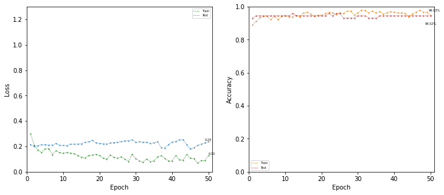
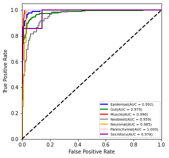
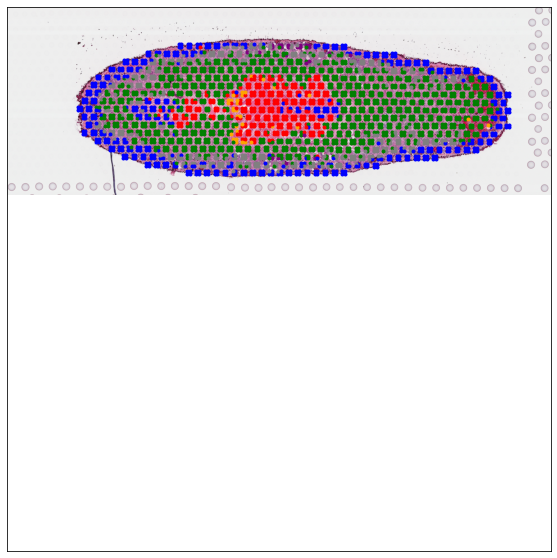

.. _Advanced analysis:

******************************
Advanced analysis
******************************

.. parsed-literal::

Here we present a tutorial of the advanced analysis of STASCAN. We 
slide6 on the human intestinal dataset (Fawkner-Corbett et al., Cell, 2021), which including 346 raw ST spots.

This tutorial demonstrates how to use STASCAN with advanced operations. We applied STASCAN on a comprehensive planarian dataset (Cui et al., Nat Commun, 2023), which employed a base model (which including 7,689 raw ST spots) followed by a section-specific model (which including 657 raw ST spots on section 25). 

The multi-section data are available at https://github.com/AbbyWY/STASCAN/tree/master/Vignettes/Cui_Planarian_Multisections, and the adjacent image are available at https://github.com/AbbyWY/STASCAN/tree/master/Vignettes/Cui_Planarian_Adjacentimages. 

For reference, we employed STASCAN on this dataset with three modules in 83 minutes. The experiment was conducted on the GPU platform (NVIDIA Tesla V100s with 32 GB memory).

.. _Preparation:

Preparation
=============================

.. code:: ipython3

    import sys
    import os
    import shutil
    import glob

.. code:: ipython3

    import STASCAN
    

.. code:: ipython3

    vignettes_path = "../../Vignettes/Cui_Planarian_Multisections/" # the path of downloaded multi-section data data.
    output_path = "./"
    adjacent_path = "../../Vignettes/Cui_Planarian_Adjacentimages/" # the path of downloaded adjacent image.
    

.. code:: ipython3

    label_list = ['Epidermal', 'Gut', 'Muscle', 'Neoblast', 'Neuronal', 'Parenchymal', 'Secretory'] # The list of cell types.
    color_list = ["blue", "green", "red", "grey", "orange", "pink", "purple"]
    dict_label = dict(zip(label_list, color_list))
    spot_label = [[x] for x in label_list]
    
    crop_size = 30 # Pixel radius of spot images.
    imagetype = "png"
    grey_level, white_threshold = 200, 0.7
    
    
.. _Pre-training followed by section specific training:

Pre-training followed by section specific training
==========================================================

.. code:: ipython3
    
    run = STASCAN.run_STASCAN.Optional()
    # You can optionally set the parameter 'epochs=2' to quickly test the pipeline, but you should set the parameter 'epochs=50' for the official run in this tutorial.
    run.SectionSpecificTraining(output_path, vignettes_path, imagetype, crop_size, epoch1=50, epoch2=50)
    

.. _Running reports:
Running reports
----------------------------

.. parsed-literal::

    The number of raw spots :  683
    The strategy of pre-labelling is: joint
    The number of prior spots :  370
    The number of raw spots :  803
    The strategy of pre-labelling is: joint
    The number of prior spots :  548
    The number of raw spots :  657
    The strategy of pre-labelling is: joint
    The number of prior spots :  366
    The number of raw spots :  625
    The strategy of pre-labelling is: joint
    The number of prior spots :  272
    The number of raw spots :  920
    The strategy of pre-labelling is: joint
    The number of prior spots :  612
    The number of raw spots :  978
    The strategy of pre-labelling is: joint
    The number of prior spots :  470
    The number of raw spots :  535
    The strategy of pre-labelling is: joint
    The number of prior spots :  209
    The number of raw spots :  756
    The strategy of pre-labelling is: joint
    The number of prior spots :  457
    The number of raw spots :  932
    The strategy of pre-labelling is: joint
    The number of prior spots :  552
    The number of raw spots :  800
    The strategy of pre-labelling is: joint
    The number of prior spots :  594
    Found 3563 images belonging to 7 classes.
    Found 887 images belonging to 7 classes.
    {'Epidermal': 0, 'Gut': 1, 'Muscle': 2, 'Neoblast': 3, 'Neuronal': 4, 'Parenchymal': 5, 'Secretory': 6}
    {'Epidermal': 0, 'Gut': 1, 'Muscle': 2, 'Neoblast': 3, 'Neuronal': 4, 'Parenchymal': 5, 'Secretory': 6}
    

.. raw:: html

   

       <pre>
	   
    
.. parsed-literal::

    Epoch 1/50
    112/112 [==============================] - 167s 1s/step - loss: 1.1223 - accuracy: 0.6941 - val_loss: 0.9450 - val_accuracy: 0.7035
    Epoch 2/50
    112/112 [==============================] - 46s 406ms/step - loss: 0.9433 - accuracy: 0.7022 - val_loss: 0.8766 - val_accuracy: 0.7046
    Epoch 3/50
    112/112 [==============================] - 45s 404ms/step - loss: 0.7750 - accuracy: 0.7457 - val_loss: 0.7478 - val_accuracy: 0.7678
    Epoch 4/50
    112/112 [==============================] - 45s 403ms/step - loss: 0.6286 - accuracy: 0.8033 - val_loss: 0.4783 - val_accuracy: 0.8512
    Epoch 5/50
    112/112 [==============================] - 46s 406ms/step - loss: 0.5309 - accuracy: 0.8274 - val_loss: 0.7367 - val_accuracy: 0.7869
    Epoch 6/50
    112/112 [==============================] - 45s 401ms/step - loss: 0.5111 - accuracy: 0.8330 - val_loss: 0.5453 - val_accuracy: 0.8320
    Epoch 7/50
    112/112 [==============================] - 45s 400ms/step - loss: 0.4781 - accuracy: 0.8409 - val_loss: 0.3811 - val_accuracy: 0.8670
    Epoch 8/50
    112/112 [==============================] - 45s 399ms/step - loss: 0.4073 - accuracy: 0.8687 - val_loss: 0.6688 - val_accuracy: 0.8388
    Epoch 9/50
    112/112 [==============================] - 45s 404ms/step - loss: 0.4228 - accuracy: 0.8585 - val_loss: 0.3358 - val_accuracy: 0.8850
    Epoch 10/50
    112/112 [==============================] - 45s 403ms/step - loss: 0.3990 - accuracy: 0.8661 - val_loss: 0.3051 - val_accuracy: 0.9008
    Epoch 11/50
    112/112 [==============================] - 45s 403ms/step - loss: 0.3849 - accuracy: 0.8751 - val_loss: 0.4098 - val_accuracy: 0.8703
    Epoch 12/50
    112/112 [==============================] - 45s 399ms/step - loss: 0.3702 - accuracy: 0.8768 - val_loss: 0.2940 - val_accuracy: 0.9064
    Epoch 13/50
    112/112 [==============================] - 45s 400ms/step - loss: 0.3576 - accuracy: 0.8849 - val_loss: 0.5126 - val_accuracy: 0.8670
    Epoch 14/50
    112/112 [==============================] - 45s 397ms/step - loss: 0.3468 - accuracy: 0.8905 - val_loss: 0.2725 - val_accuracy: 0.9076
    Epoch 15/50
    112/112 [==============================] - 45s 399ms/step - loss: 0.3289 - accuracy: 0.8956 - val_loss: 0.2594 - val_accuracy: 0.9200
    Epoch 16/50
    112/112 [==============================] - 45s 397ms/step - loss: 0.3372 - accuracy: 0.8908 - val_loss: 0.2828 - val_accuracy: 0.8985
    Epoch 17/50
    112/112 [==============================] - 45s 402ms/step - loss: 0.3319 - accuracy: 0.8880 - val_loss: 0.2652 - val_accuracy: 0.9154
    Epoch 18/50
    112/112 [==============================] - 45s 399ms/step - loss: 0.3258 - accuracy: 0.8931 - val_loss: 0.2418 - val_accuracy: 0.9211
    Epoch 19/50
    112/112 [==============================] - 45s 402ms/step - loss: 0.3288 - accuracy: 0.8948 - val_loss: 0.3031 - val_accuracy: 0.8895
    Epoch 20/50
    112/112 [==============================] - 45s 398ms/step - loss: 0.3231 - accuracy: 0.8919 - val_loss: 0.3001 - val_accuracy: 0.9008
    Epoch 21/50
    112/112 [==============================] - 45s 402ms/step - loss: 0.2967 - accuracy: 0.8953 - val_loss: 0.3391 - val_accuracy: 0.8963
    Epoch 22/50
    112/112 [==============================] - 45s 398ms/step - loss: 0.3009 - accuracy: 0.9012 - val_loss: 0.2379 - val_accuracy: 0.9188
    Epoch 23/50
    112/112 [==============================] - 45s 403ms/step - loss: 0.2777 - accuracy: 0.9116 - val_loss: 0.3404 - val_accuracy: 0.9008
    Epoch 24/50
    112/112 [==============================] - 45s 402ms/step - loss: 0.2608 - accuracy: 0.9119 - val_loss: 0.2651 - val_accuracy: 0.9143
    Epoch 25/50
    112/112 [==============================] - 45s 397ms/step - loss: 0.2697 - accuracy: 0.9077 - val_loss: 0.3457 - val_accuracy: 0.9008
    Epoch 26/50
    112/112 [==============================] - 45s 398ms/step - loss: 0.2738 - accuracy: 0.9127 - val_loss: 0.2492 - val_accuracy: 0.9233
    Epoch 27/50
    112/112 [==============================] - 45s 398ms/step - loss: 0.2564 - accuracy: 0.9161 - val_loss: 0.3345 - val_accuracy: 0.9109
    Epoch 28/50
    112/112 [==============================] - 45s 403ms/step - loss: 0.2740 - accuracy: 0.9082 - val_loss: 0.2843 - val_accuracy: 0.9030
    Epoch 29/50
    112/112 [==============================] - 45s 399ms/step - loss: 0.2428 - accuracy: 0.9200 - val_loss: 0.2345 - val_accuracy: 0.9200
    Epoch 30/50
    112/112 [==============================] - 45s 402ms/step - loss: 0.2357 - accuracy: 0.9209 - val_loss: 0.2539 - val_accuracy: 0.9222
    Epoch 31/50
    112/112 [==============================] - 45s 403ms/step - loss: 0.2572 - accuracy: 0.9180 - val_loss: 0.2527 - val_accuracy: 0.9233
    Epoch 32/50
    112/112 [==============================] - 46s 405ms/step - loss: 0.2261 - accuracy: 0.9194 - val_loss: 0.2744 - val_accuracy: 0.9154
    Epoch 33/50
    112/112 [==============================] - 45s 404ms/step - loss: 0.2382 - accuracy: 0.9192 - val_loss: 0.3402 - val_accuracy: 0.9109
    Epoch 34/50
    112/112 [==============================] - 45s 400ms/step - loss: 0.2306 - accuracy: 0.9245 - val_loss: 0.2252 - val_accuracy: 0.9278
    Epoch 35/50
    112/112 [==============================] - 46s 406ms/step - loss: 0.2338 - accuracy: 0.9234 - val_loss: 0.2442 - val_accuracy: 0.9166
    Epoch 36/50
    112/112 [==============================] - 45s 397ms/step - loss: 0.2109 - accuracy: 0.9251 - val_loss: 0.2635 - val_accuracy: 0.9154
    Epoch 37/50
    112/112 [==============================] - 45s 401ms/step - loss: 0.2405 - accuracy: 0.9175 - val_loss: 0.2030 - val_accuracy: 0.9324
    Epoch 38/50
    112/112 [==============================] - 45s 403ms/step - loss: 0.2103 - accuracy: 0.9318 - val_loss: 0.3040 - val_accuracy: 0.9019
    Epoch 39/50
    112/112 [==============================] - 45s 404ms/step - loss: 0.2089 - accuracy: 0.9315 - val_loss: 0.2473 - val_accuracy: 0.9121
    Epoch 40/50
    112/112 [==============================] - 45s 400ms/step - loss: 0.2104 - accuracy: 0.9310 - val_loss: 0.2569 - val_accuracy: 0.9087
    Epoch 41/50
    112/112 [==============================] - 45s 404ms/step - loss: 0.2064 - accuracy: 0.9307 - val_loss: 0.3204 - val_accuracy: 0.8985
    Epoch 42/50
    112/112 [==============================] - 45s 402ms/step - loss: 0.2166 - accuracy: 0.9267 - val_loss: 0.2839 - val_accuracy: 0.8985
    Epoch 43/50
    112/112 [==============================] - 45s 399ms/step - loss: 0.2147 - accuracy: 0.9279 - val_loss: 0.2536 - val_accuracy: 0.9177
    Epoch 44/50
    112/112 [==============================] - 45s 400ms/step - loss: 0.2204 - accuracy: 0.9296 - val_loss: 0.2578 - val_accuracy: 0.9087
    Epoch 45/50
    112/112 [==============================] - 46s 410ms/step - loss: 0.1829 - accuracy: 0.9369 - val_loss: 0.2621 - val_accuracy: 0.9188
    Epoch 46/50
    112/112 [==============================] - 45s 401ms/step - loss: 0.2074 - accuracy: 0.9307 - val_loss: 0.2359 - val_accuracy: 0.9267
    Epoch 47/50
    112/112 [==============================] - 45s 404ms/step - loss: 0.1979 - accuracy: 0.9310 - val_loss: 0.3590 - val_accuracy: 0.9121
    Epoch 48/50
    112/112 [==============================] - 45s 402ms/step - loss: 0.1785 - accuracy: 0.9357 - val_loss: 0.2407 - val_accuracy: 0.9278
    Epoch 49/50
    112/112 [==============================] - 46s 406ms/step - loss: 0.2017 - accuracy: 0.9332 - val_loss: 0.2541 - val_accuracy: 0.9278
    Epoch 50/50
    112/112 [==============================] - 45s 404ms/step - loss: 0.1865 - accuracy: 0.9399 - val_loss: 0.2715 - val_accuracy: 0.9290
    Found 322 images belonging to 7 classes.
    Found 81 images belonging to 7 classes.
    {'Epidermal': 0, 'Gut': 1, 'Muscle': 2, 'Neoblast': 3, 'Neuronal': 4, 'Parenchymal': 5, 'Secretory': 6}
    {'Epidermal': 0, 'Gut': 1, 'Muscle': 2, 'Neoblast': 3, 'Neuronal': 4, 'Parenchymal': 5, 'Secretory': 6}
    Epoch 1/50
    11/11 [==============================] - 25s 2s/step - loss: 0.2312 - accuracy: 0.9286 - val_loss: 0.3046 - val_accuracy: 0.8889
    Epoch 2/50
    11/11 [==============================] - 4s 384ms/step - loss: 0.2351 - accuracy: 0.9379 - val_loss: 0.2111 - val_accuracy: 0.9136
    Epoch 3/50
    11/11 [==============================] - 4s 390ms/step - loss: 0.2018 - accuracy: 0.9441 - val_loss: 0.2406 - val_accuracy: 0.8889
    Epoch 4/50
    11/11 [==============================] - 4s 393ms/step - loss: 0.2541 - accuracy: 0.9286 - val_loss: 0.2017 - val_accuracy: 0.9136
    Epoch 5/50
    11/11 [==============================] - 4s 387ms/step - loss: 0.1927 - accuracy: 0.9472 - val_loss: 0.1732 - val_accuracy: 0.9259
    Epoch 6/50
    11/11 [==============================] - 4s 388ms/step - loss: 0.1569 - accuracy: 0.9534 - val_loss: 0.1694 - val_accuracy: 0.9259
    Epoch 7/50
    11/11 [==============================] - 4s 384ms/step - loss: 0.1273 - accuracy: 0.9658 - val_loss: 0.1587 - val_accuracy: 0.9259
    Epoch 8/50
    11/11 [==============================] - 5s 397ms/step - loss: 0.1564 - accuracy: 0.9565 - val_loss: 0.1588 - val_accuracy: 0.9259
    Epoch 9/50
    11/11 [==============================] - 4s 393ms/step - loss: 0.1423 - accuracy: 0.9534 - val_loss: 0.1565 - val_accuracy: 0.9259
    Epoch 10/50
    11/11 [==============================] - 4s 387ms/step - loss: 0.1266 - accuracy: 0.9658 - val_loss: 0.1485 - val_accuracy: 0.9259
    Epoch 11/50
    11/11 [==============================] - 4s 384ms/step - loss: 0.1379 - accuracy: 0.9503 - val_loss: 0.1403 - val_accuracy: 0.9383
    Epoch 12/50
    11/11 [==============================] - 4s 381ms/step - loss: 0.1541 - accuracy: 0.9472 - val_loss: 0.1317 - val_accuracy: 0.9259
    Epoch 13/50
    11/11 [==============================] - 4s 386ms/step - loss: 0.1335 - accuracy: 0.9472 - val_loss: 0.1365 - val_accuracy: 0.9259
    Epoch 14/50
    11/11 [==============================] - 4s 393ms/step - loss: 0.1420 - accuracy: 0.9565 - val_loss: 0.1438 - val_accuracy: 0.9259
    Epoch 15/50
    11/11 [==============================] - 4s 387ms/step - loss: 0.1212 - accuracy: 0.9534 - val_loss: 0.1381 - val_accuracy: 0.9259
    Epoch 16/50
    11/11 [==============================] - 4s 387ms/step - loss: 0.1007 - accuracy: 0.9720 - val_loss: 0.1311 - val_accuracy: 0.9259
    Epoch 17/50
    11/11 [==============================] - 4s 382ms/step - loss: 0.1121 - accuracy: 0.9627 - val_loss: 0.1270 - val_accuracy: 0.9506
    Epoch 18/50
    11/11 [==============================] - 4s 385ms/step - loss: 0.1663 - accuracy: 0.9379 - val_loss: 0.4306 - val_accuracy: 0.8765
    Epoch 19/50
    11/11 [==============================] - 4s 395ms/step - loss: 0.2555 - accuracy: 0.9255 - val_loss: 0.1390 - val_accuracy: 0.9383
    Epoch 20/50
    11/11 [==============================] - 4s 385ms/step - loss: 0.1224 - accuracy: 0.9658 - val_loss: 0.1074 - val_accuracy: 0.9506
    Epoch 21/50
    11/11 [==============================] - 5s 395ms/step - loss: 0.1113 - accuracy: 0.9658 - val_loss: 0.1048 - val_accuracy: 0.9506
    Epoch 22/50
    11/11 [==============================] - 4s 388ms/step - loss: 0.1441 - accuracy: 0.9472 - val_loss: 0.1093 - val_accuracy: 0.9506
    Epoch 23/50
    11/11 [==============================] - 4s 393ms/step - loss: 0.1231 - accuracy: 0.9596 - val_loss: 0.1137 - val_accuracy: 0.9383
    Epoch 24/50
    11/11 [==============================] - 4s 385ms/step - loss: 0.1161 - accuracy: 0.9689 - val_loss: 0.1182 - val_accuracy: 0.9506
    Epoch 25/50
    11/11 [==============================] - 4s 379ms/step - loss: 0.0905 - accuracy: 0.9658 - val_loss: 0.1118 - val_accuracy: 0.9506
    Epoch 26/50
    11/11 [==============================] - 4s 418ms/step - loss: 0.0977 - accuracy: 0.9658 - val_loss: 0.1032 - val_accuracy: 0.9506
    Epoch 27/50
    11/11 [==============================] - 4s 381ms/step - loss: 0.0953 - accuracy: 0.9783 - val_loss: 0.1000 - val_accuracy: 0.9630
    Epoch 28/50
    11/11 [==============================] - 4s 387ms/step - loss: 0.1256 - accuracy: 0.9503 - val_loss: 0.0964 - val_accuracy: 0.9630
    Epoch 29/50
    11/11 [==============================] - 4s 390ms/step - loss: 0.1006 - accuracy: 0.9658 - val_loss: 0.1063 - val_accuracy: 0.9383
    Epoch 30/50
    11/11 [==============================] - 4s 371ms/step - loss: 0.1057 - accuracy: 0.9689 - val_loss: 0.1035 - val_accuracy: 0.9383
    Epoch 31/50
    11/11 [==============================] - 4s 420ms/step - loss: 0.0917 - accuracy: 0.9689 - val_loss: 0.0958 - val_accuracy: 0.9506
    Epoch 32/50
    11/11 [==============================] - 4s 383ms/step - loss: 0.0988 - accuracy: 0.9658 - val_loss: 0.0951 - val_accuracy: 0.9506
    Epoch 33/50
    11/11 [==============================] - 4s 389ms/step - loss: 0.1109 - accuracy: 0.9627 - val_loss: 0.0969 - val_accuracy: 0.9506
    Epoch 34/50
    11/11 [==============================] - 4s 387ms/step - loss: 0.0846 - accuracy: 0.9658 - val_loss: 0.0981 - val_accuracy: 0.9506
    Epoch 35/50
    11/11 [==============================] - 4s 385ms/step - loss: 0.0648 - accuracy: 0.9720 - val_loss: 0.1018 - val_accuracy: 0.9383
    Epoch 36/50
    11/11 [==============================] - 4s 386ms/step - loss: 0.0933 - accuracy: 0.9627 - val_loss: 0.1017 - val_accuracy: 0.9506
    Epoch 37/50
    11/11 [==============================] - 4s 370ms/step - loss: 0.0917 - accuracy: 0.9658 - val_loss: 0.1014 - val_accuracy: 0.9383
    Epoch 38/50
    11/11 [==============================] - 4s 396ms/step - loss: 0.0877 - accuracy: 0.9720 - val_loss: 0.0984 - val_accuracy: 0.9630
    Epoch 39/50
    11/11 [==============================] - 4s 389ms/step - loss: 0.0848 - accuracy: 0.9689 - val_loss: 0.0998 - val_accuracy: 0.9506
    Epoch 40/50
    11/11 [==============================] - 4s 384ms/step - loss: 0.0929 - accuracy: 0.9658 - val_loss: 0.1002 - val_accuracy: 0.9506
    Epoch 41/50
    11/11 [==============================] - 4s 387ms/step - loss: 0.1001 - accuracy: 0.9534 - val_loss: 0.0985 - val_accuracy: 0.9506
    Epoch 42/50
    11/11 [==============================] - 4s 375ms/step - loss: 0.1204 - accuracy: 0.9596 - val_loss: 0.0915 - val_accuracy: 0.9506
    Epoch 43/50
    11/11 [==============================] - 4s 390ms/step - loss: 0.1144 - accuracy: 0.9658 - val_loss: 0.0988 - val_accuracy: 0.9506
    Epoch 44/50
    11/11 [==============================] - 4s 384ms/step - loss: 0.1081 - accuracy: 0.9658 - val_loss: 0.1077 - val_accuracy: 0.9383
    Epoch 45/50
    11/11 [==============================] - 5s 447ms/step - loss: 0.0801 - accuracy: 0.9720 - val_loss: 0.1000 - val_accuracy: 0.9383
    Epoch 46/50
    11/11 [==============================] - 4s 383ms/step - loss: 0.0960 - accuracy: 0.9658 - val_loss: 0.0953 - val_accuracy: 0.9506
    Epoch 47/50
    11/11 [==============================] - 4s 390ms/step - loss: 0.0809 - accuracy: 0.9689 - val_loss: 0.0905 - val_accuracy: 0.9506
    Epoch 48/50
    11/11 [==============================] - 4s 442ms/step - loss: 0.0826 - accuracy: 0.9689 - val_loss: 0.0845 - val_accuracy: 0.9630
    Epoch 49/50
    11/11 [==============================] - 4s 382ms/step - loss: 0.0856 - accuracy: 0.9689 - val_loss: 0.0793 - val_accuracy: 0.9630
    Epoch 50/50
    11/11 [==============================] - 4s 374ms/step - loss: 0.0914 - accuracy: 0.9720 - val_loss: 0.0832 - val_accuracy: 0.9753
    Found 464 images belonging to 7 classes.
    Found 118 images belonging to 7 classes.
    {'Epidermal': 0, 'Gut': 1, 'Muscle': 2, 'Neoblast': 3, 'Neuronal': 4, 'Parenchymal': 5, 'Secretory': 6}
    {'Epidermal': 0, 'Gut': 1, 'Muscle': 2, 'Neoblast': 3, 'Neuronal': 4, 'Parenchymal': 5, 'Secretory': 6}
    Epoch 1/50
    15/15 [==============================] - 23s 1s/step - loss: 0.1863 - accuracy: 0.9332 - val_loss: 0.2454 - val_accuracy: 0.9237
    Epoch 2/50
    15/15 [==============================] - 6s 409ms/step - loss: 0.1817 - accuracy: 0.9418 - val_loss: 0.1881 - val_accuracy: 0.9322
    Epoch 3/50
    15/15 [==============================] - 6s 395ms/step - loss: 0.1435 - accuracy: 0.9483 - val_loss: 0.1713 - val_accuracy: 0.9407
    Epoch 4/50
    15/15 [==============================] - 6s 398ms/step - loss: 0.1481 - accuracy: 0.9569 - val_loss: 0.1696 - val_accuracy: 0.9322
    Epoch 5/50
    15/15 [==============================] - 6s 395ms/step - loss: 0.1482 - accuracy: 0.9440 - val_loss: 0.1512 - val_accuracy: 0.9492
    Epoch 6/50
    15/15 [==============================] - 6s 391ms/step - loss: 0.1233 - accuracy: 0.9634 - val_loss: 0.1400 - val_accuracy: 0.9492
    Epoch 7/50
    15/15 [==============================] - 6s 398ms/step - loss: 0.1418 - accuracy: 0.9526 - val_loss: 0.1417 - val_accuracy: 0.9492
    Epoch 8/50
    15/15 [==============================] - 6s 399ms/step - loss: 0.1266 - accuracy: 0.9526 - val_loss: 0.1432 - val_accuracy: 0.9492
    Epoch 9/50
    15/15 [==============================] - 6s 398ms/step - loss: 0.1209 - accuracy: 0.9569 - val_loss: 0.1373 - val_accuracy: 0.9492
    Epoch 10/50
    15/15 [==============================] - 6s 396ms/step - loss: 0.1044 - accuracy: 0.9655 - val_loss: 0.1309 - val_accuracy: 0.9492
    Epoch 11/50
    15/15 [==============================] - 6s 390ms/step - loss: 0.1230 - accuracy: 0.9569 - val_loss: 0.1369 - val_accuracy: 0.9407
    Epoch 12/50
    15/15 [==============================] - 6s 397ms/step - loss: 0.1079 - accuracy: 0.9634 - val_loss: 0.1284 - val_accuracy: 0.9492
    Epoch 13/50
    15/15 [==============================] - 6s 412ms/step - loss: 0.1160 - accuracy: 0.9612 - val_loss: 0.1277 - val_accuracy: 0.9492
    Epoch 14/50
    15/15 [==============================] - 6s 393ms/step - loss: 0.1057 - accuracy: 0.9612 - val_loss: 0.1266 - val_accuracy: 0.9492
    Epoch 15/50
    15/15 [==============================] - 6s 398ms/step - loss: 0.1107 - accuracy: 0.9569 - val_loss: 0.1296 - val_accuracy: 0.9492
    Epoch 16/50
    15/15 [==============================] - 6s 406ms/step - loss: 0.1118 - accuracy: 0.9547 - val_loss: 0.1311 - val_accuracy: 0.9407
    Epoch 17/50
    15/15 [==============================] - 6s 395ms/step - loss: 0.1288 - accuracy: 0.9526 - val_loss: 0.1306 - val_accuracy: 0.9492
    Epoch 18/50
    15/15 [==============================] - 6s 389ms/step - loss: 0.0895 - accuracy: 0.9720 - val_loss: 0.1265 - val_accuracy: 0.9576
    Epoch 19/50
    15/15 [==============================] - 6s 408ms/step - loss: 0.0905 - accuracy: 0.9655 - val_loss: 0.1307 - val_accuracy: 0.9576
    Epoch 20/50
    15/15 [==============================] - 6s 393ms/step - loss: 0.0948 - accuracy: 0.9677 - val_loss: 0.1375 - val_accuracy: 0.9492
    Epoch 21/50
    15/15 [==============================] - 6s 398ms/step - loss: 0.1030 - accuracy: 0.9634 - val_loss: 0.1336 - val_accuracy: 0.9492
    Epoch 22/50
    15/15 [==============================] - 6s 409ms/step - loss: 0.1199 - accuracy: 0.9591 - val_loss: 0.1240 - val_accuracy: 0.9407
    Epoch 23/50
    15/15 [==============================] - 6s 398ms/step - loss: 0.1235 - accuracy: 0.9547 - val_loss: 0.1218 - val_accuracy: 0.9576
    Epoch 24/50
    15/15 [==============================] - 6s 396ms/step - loss: 0.1094 - accuracy: 0.9612 - val_loss: 0.1206 - val_accuracy: 0.9492
    Epoch 25/50
    15/15 [==============================] - 6s 394ms/step - loss: 0.0972 - accuracy: 0.9591 - val_loss: 0.1193 - val_accuracy: 0.9492
    Epoch 26/50
    15/15 [==============================] - 6s 395ms/step - loss: 0.0955 - accuracy: 0.9591 - val_loss: 0.1228 - val_accuracy: 0.9492
    Epoch 27/50
    15/15 [==============================] - 6s 397ms/step - loss: 0.0864 - accuracy: 0.9698 - val_loss: 0.1294 - val_accuracy: 0.9576
    Epoch 28/50
    15/15 [==============================] - 6s 397ms/step - loss: 0.0870 - accuracy: 0.9655 - val_loss: 0.1323 - val_accuracy: 0.9492
    Epoch 29/50
    15/15 [==============================] - 6s 397ms/step - loss: 0.0857 - accuracy: 0.9698 - val_loss: 0.1431 - val_accuracy: 0.9407
    Epoch 30/50
    15/15 [==============================] - 6s 397ms/step - loss: 0.0952 - accuracy: 0.9612 - val_loss: 0.1308 - val_accuracy: 0.9407
    Epoch 31/50
    15/15 [==============================] - 6s 397ms/step - loss: 0.1013 - accuracy: 0.9655 - val_loss: 0.1298 - val_accuracy: 0.9576
    Epoch 32/50
    15/15 [==============================] - 6s 401ms/step - loss: 0.0824 - accuracy: 0.9677 - val_loss: 0.1265 - val_accuracy: 0.9576
    Epoch 33/50
    15/15 [==============================] - 6s 390ms/step - loss: 0.0780 - accuracy: 0.9677 - val_loss: 0.1266 - val_accuracy: 0.9492
    Epoch 34/50
    15/15 [==============================] - 6s 412ms/step - loss: 0.0852 - accuracy: 0.9634 - val_loss: 0.1331 - val_accuracy: 0.9576
    Epoch 35/50
    15/15 [==============================] - 6s 406ms/step - loss: 0.0812 - accuracy: 0.9634 - val_loss: 0.1328 - val_accuracy: 0.9492
    Epoch 36/50
    15/15 [==============================] - 6s 399ms/step - loss: 0.0869 - accuracy: 0.9698 - val_loss: 0.1177 - val_accuracy: 0.9576
    Epoch 37/50
    15/15 [==============================] - 6s 396ms/step - loss: 0.1068 - accuracy: 0.9569 - val_loss: 0.1209 - val_accuracy: 0.9492
    Epoch 38/50
    15/15 [==============================] - 6s 398ms/step - loss: 0.0788 - accuracy: 0.9784 - val_loss: 0.1166 - val_accuracy: 0.9492
    Epoch 39/50
    15/15 [==============================] - 6s 393ms/step - loss: 0.0875 - accuracy: 0.9720 - val_loss: 0.1208 - val_accuracy: 0.9492
    Epoch 40/50
    15/15 [==============================] - 6s 401ms/step - loss: 0.0793 - accuracy: 0.9763 - val_loss: 0.1295 - val_accuracy: 0.9492
    Epoch 41/50
    15/15 [==============================] - 6s 402ms/step - loss: 0.0828 - accuracy: 0.9698 - val_loss: 0.1285 - val_accuracy: 0.9492
    Epoch 42/50
    15/15 [==============================] - 6s 406ms/step - loss: 0.0855 - accuracy: 0.9720 - val_loss: 0.1202 - val_accuracy: 0.9576
    Epoch 43/50
    15/15 [==============================] - 6s 388ms/step - loss: 0.0695 - accuracy: 0.9828 - val_loss: 0.1192 - val_accuracy: 0.9492
    Epoch 44/50
    15/15 [==============================] - 6s 390ms/step - loss: 0.0881 - accuracy: 0.9634 - val_loss: 0.1248 - val_accuracy: 0.9576
    Epoch 45/50
    15/15 [==============================] - 6s 396ms/step - loss: 0.0676 - accuracy: 0.9784 - val_loss: 0.1234 - val_accuracy: 0.9576
    Epoch 46/50
    15/15 [==============================] - 6s 405ms/step - loss: 0.0794 - accuracy: 0.9720 - val_loss: 0.1283 - val_accuracy: 0.9576
    Epoch 47/50
    15/15 [==============================] - 6s 399ms/step - loss: 0.0835 - accuracy: 0.9698 - val_loss: 0.1247 - val_accuracy: 0.9576
    Epoch 48/50
    15/15 [==============================] - 6s 392ms/step - loss: 0.0775 - accuracy: 0.9698 - val_loss: 0.1260 - val_accuracy: 0.9492
    Epoch 49/50
    15/15 [==============================] - 6s 403ms/step - loss: 0.0668 - accuracy: 0.9698 - val_loss: 0.1284 - val_accuracy: 0.9576
    Epoch 50/50
    15/15 [==============================] - 6s 399ms/step - loss: 0.0700 - accuracy: 0.9741 - val_loss: 0.1330 - val_accuracy: 0.9576
    Found 296 images belonging to 7 classes.
    Found 73 images belonging to 7 classes.
    {'Epidermal': 0, 'Gut': 1, 'Muscle': 2, 'Neoblast': 3, 'Neuronal': 4, 'Parenchymal': 5, 'Secretory': 6}
    {'Epidermal': 0, 'Gut': 1, 'Muscle': 2, 'Neoblast': 3, 'Neuronal': 4, 'Parenchymal': 5, 'Secretory': 6}
    Epoch 1/50
    10/10 [==============================] - 15s 1s/step - loss: 0.3012 - accuracy: 0.8885 - val_loss: 0.2156 - val_accuracy: 0.9315
    Epoch 2/50
    10/10 [==============================] - 4s 384ms/step - loss: 0.2120 - accuracy: 0.9122 - val_loss: 0.2003 - val_accuracy: 0.9452
    Epoch 3/50
    10/10 [==============================] - 4s 383ms/step - loss: 0.1717 - accuracy: 0.9324 - val_loss: 0.2066 - val_accuracy: 0.9452
    Epoch 4/50
    10/10 [==============================] - 4s 369ms/step - loss: 0.1527 - accuracy: 0.9426 - val_loss: 0.2124 - val_accuracy: 0.9452
    Epoch 5/50
    10/10 [==============================] - 4s 380ms/step - loss: 0.1798 - accuracy: 0.9426 - val_loss: 0.2130 - val_accuracy: 0.9452
    Epoch 6/50
    10/10 [==============================] - 15s 2s/step - loss: 0.1828 - accuracy: 0.9223 - val_loss: 0.2115 - val_accuracy: 0.9452
    Epoch 7/50
    10/10 [==============================] - 4s 387ms/step - loss: 0.1352 - accuracy: 0.9426 - val_loss: 0.2115 - val_accuracy: 0.9452
    Epoch 8/50
    10/10 [==============================] - 4s 384ms/step - loss: 0.1660 - accuracy: 0.9223 - val_loss: 0.2219 - val_accuracy: 0.9452
    Epoch 9/50
    10/10 [==============================] - 4s 382ms/step - loss: 0.1504 - accuracy: 0.9426 - val_loss: 0.2106 - val_accuracy: 0.9452
    Epoch 10/50
    10/10 [==============================] - 4s 381ms/step - loss: 0.1481 - accuracy: 0.9459 - val_loss: 0.2074 - val_accuracy: 0.9452
    Epoch 11/50
    10/10 [==============================] - 4s 380ms/step - loss: 0.1523 - accuracy: 0.9392 - val_loss: 0.2072 - val_accuracy: 0.9452
    Epoch 12/50
    10/10 [==============================] - 4s 383ms/step - loss: 0.1477 - accuracy: 0.9392 - val_loss: 0.2173 - val_accuracy: 0.9589
    Epoch 13/50
    10/10 [==============================] - 4s 387ms/step - loss: 0.1429 - accuracy: 0.9493 - val_loss: 0.2184 - val_accuracy: 0.9452
    Epoch 14/50
    10/10 [==============================] - 4s 391ms/step - loss: 0.1288 - accuracy: 0.9358 - val_loss: 0.2183 - val_accuracy: 0.9452
    Epoch 15/50
    10/10 [==============================] - 4s 387ms/step - loss: 0.1159 - accuracy: 0.9628 - val_loss: 0.2210 - val_accuracy: 0.9452
    Epoch 16/50
    10/10 [==============================] - 4s 386ms/step - loss: 0.1106 - accuracy: 0.9662 - val_loss: 0.2315 - val_accuracy: 0.9452
    Epoch 17/50
    10/10 [==============================] - 4s 418ms/step - loss: 0.1292 - accuracy: 0.9561 - val_loss: 0.2361 - val_accuracy: 0.9452
    Epoch 18/50
    10/10 [==============================] - 4s 411ms/step - loss: 0.1327 - accuracy: 0.9426 - val_loss: 0.2492 - val_accuracy: 0.9452
    Epoch 19/50
    10/10 [==============================] - 4s 382ms/step - loss: 0.1359 - accuracy: 0.9493 - val_loss: 0.2306 - val_accuracy: 0.9452
    Epoch 20/50
    10/10 [==============================] - 4s 386ms/step - loss: 0.1307 - accuracy: 0.9493 - val_loss: 0.2221 - val_accuracy: 0.9452
    Epoch 21/50
    10/10 [==============================] - 4s 387ms/step - loss: 0.1072 - accuracy: 0.9595 - val_loss: 0.2216 - val_accuracy: 0.9452
    Epoch 22/50
    10/10 [==============================] - 4s 383ms/step - loss: 0.1007 - accuracy: 0.9662 - val_loss: 0.2189 - val_accuracy: 0.9589
    Epoch 23/50
    10/10 [==============================] - 4s 375ms/step - loss: 0.1332 - accuracy: 0.9628 - val_loss: 0.2266 - val_accuracy: 0.9452
    Epoch 24/50
    10/10 [==============================] - 4s 383ms/step - loss: 0.1140 - accuracy: 0.9527 - val_loss: 0.2307 - val_accuracy: 0.9589
    Epoch 25/50
    10/10 [==============================] - 4s 375ms/step - loss: 0.1075 - accuracy: 0.9628 - val_loss: 0.2329 - val_accuracy: 0.9589
    Epoch 26/50
    10/10 [==============================] - 4s 386ms/step - loss: 0.1173 - accuracy: 0.9595 - val_loss: 0.2390 - val_accuracy: 0.9315
    Epoch 27/50
    10/10 [==============================] - 4s 387ms/step - loss: 0.1014 - accuracy: 0.9730 - val_loss: 0.2442 - val_accuracy: 0.9315
    Epoch 28/50
    10/10 [==============================] - 4s 383ms/step - loss: 0.0821 - accuracy: 0.9730 - val_loss: 0.2452 - val_accuracy: 0.9315
    Epoch 29/50
    10/10 [==============================] - 4s 385ms/step - loss: 0.1378 - accuracy: 0.9493 - val_loss: 0.2523 - val_accuracy: 0.9315
    Epoch 30/50
    10/10 [==============================] - 4s 382ms/step - loss: 0.1047 - accuracy: 0.9628 - val_loss: 0.2332 - val_accuracy: 0.9452
    Epoch 31/50
    10/10 [==============================] - 4s 380ms/step - loss: 0.0852 - accuracy: 0.9797 - val_loss: 0.2363 - val_accuracy: 0.9452
    Epoch 32/50
    10/10 [==============================] - 4s 382ms/step - loss: 0.0776 - accuracy: 0.9764 - val_loss: 0.2332 - val_accuracy: 0.9452
    Epoch 33/50
    10/10 [==============================] - 4s 428ms/step - loss: 0.1016 - accuracy: 0.9628 - val_loss: 0.2330 - val_accuracy: 0.9315
    Epoch 34/50
    10/10 [==============================] - 4s 386ms/step - loss: 0.0813 - accuracy: 0.9730 - val_loss: 0.2246 - val_accuracy: 0.9315
    Epoch 35/50
    10/10 [==============================] - 4s 389ms/step - loss: 0.0875 - accuracy: 0.9628 - val_loss: 0.2276 - val_accuracy: 0.9315
    Epoch 36/50
    10/10 [==============================] - 4s 382ms/step - loss: 0.1167 - accuracy: 0.9696 - val_loss: 0.2369 - val_accuracy: 0.9452
    Epoch 37/50
    10/10 [==============================] - 4s 379ms/step - loss: 0.1273 - accuracy: 0.9561 - val_loss: 0.1887 - val_accuracy: 0.9452
    Epoch 38/50
    10/10 [==============================] - 4s 442ms/step - loss: 0.1065 - accuracy: 0.9628 - val_loss: 0.1876 - val_accuracy: 0.9452
    Epoch 39/50
    10/10 [==============================] - 4s 386ms/step - loss: 0.0856 - accuracy: 0.9696 - val_loss: 0.2151 - val_accuracy: 0.9452
    Epoch 40/50
    10/10 [==============================] - 4s 392ms/step - loss: 0.0850 - accuracy: 0.9662 - val_loss: 0.2351 - val_accuracy: 0.9452
    Epoch 41/50
    10/10 [==============================] - 4s 401ms/step - loss: 0.1294 - accuracy: 0.9628 - val_loss: 0.2393 - val_accuracy: 0.9452
    Epoch 42/50
    10/10 [==============================] - 4s 384ms/step - loss: 0.0957 - accuracy: 0.9628 - val_loss: 0.2532 - val_accuracy: 0.9452
    Epoch 43/50
    10/10 [==============================] - 4s 386ms/step - loss: 0.0906 - accuracy: 0.9595 - val_loss: 0.2540 - val_accuracy: 0.9452
    Epoch 44/50
    10/10 [==============================] - 4s 383ms/step - loss: 0.1372 - accuracy: 0.9358 - val_loss: 0.2154 - val_accuracy: 0.9452
    Epoch 45/50
    10/10 [==============================] - 4s 388ms/step - loss: 0.1091 - accuracy: 0.9561 - val_loss: 0.1797 - val_accuracy: 0.9452
    Epoch 46/50
    10/10 [==============================] - 4s 375ms/step - loss: 0.1044 - accuracy: 0.9662 - val_loss: 0.1889 - val_accuracy: 0.9452
    Epoch 47/50
    10/10 [==============================] - 4s 388ms/step - loss: 0.0699 - accuracy: 0.9797 - val_loss: 0.2081 - val_accuracy: 0.9452
    Epoch 48/50
    10/10 [==============================] - 4s 417ms/step - loss: 0.0884 - accuracy: 0.9662 - val_loss: 0.2182 - val_accuracy: 0.9452
    Epoch 49/50
    10/10 [==============================] - 4s 383ms/step - loss: 0.0878 - accuracy: 0.9662 - val_loss: 0.2268 - val_accuracy: 0.9452
    Epoch 50/50
    10/10 [==============================] - 4s 385ms/step - loss: 0.1292 - accuracy: 0.9493 - val_loss: 0.2375 - val_accuracy: 0.9452
    Found 220 images belonging to 7 classes.
    Found 55 images belonging to 7 classes.
    {'Epidermal': 0, 'Gut': 1, 'Muscle': 2, 'Neoblast': 3, 'Neuronal': 4, 'Parenchymal': 5, 'Secretory': 6}
    {'Epidermal': 0, 'Gut': 1, 'Muscle': 2, 'Neoblast': 3, 'Neuronal': 4, 'Parenchymal': 5, 'Secretory': 6}
    Epoch 1/50
    7/7 [==============================] - 15s 2s/step - loss: 0.1499 - accuracy: 0.9500 - val_loss: 0.1116 - val_accuracy: 0.9636
    Epoch 2/50
    7/7 [==============================] - 3s 414ms/step - loss: 0.1458 - accuracy: 0.9591 - val_loss: 0.0970 - val_accuracy: 0.9636
    Epoch 3/50
    7/7 [==============================] - 3s 415ms/step - loss: 0.1257 - accuracy: 0.9636 - val_loss: 0.0953 - val_accuracy: 0.9818
    Epoch 4/50
    7/7 [==============================] - 3s 425ms/step - loss: 0.0959 - accuracy: 0.9727 - val_loss: 0.0987 - val_accuracy: 0.9818
    Epoch 5/50
    7/7 [==============================] - 3s 423ms/step - loss: 0.1056 - accuracy: 0.9636 - val_loss: 0.1020 - val_accuracy: 0.9818
    Epoch 6/50
    7/7 [==============================] - 3s 416ms/step - loss: 0.0859 - accuracy: 0.9727 - val_loss: 0.1021 - val_accuracy: 0.9818
    Epoch 7/50
    7/7 [==============================] - 3s 417ms/step - loss: 0.1034 - accuracy: 0.9636 - val_loss: 0.1024 - val_accuracy: 0.9818
    Epoch 8/50
    7/7 [==============================] - 3s 424ms/step - loss: 0.0876 - accuracy: 0.9864 - val_loss: 0.1036 - val_accuracy: 0.9818
    Epoch 9/50
    7/7 [==============================] - 3s 409ms/step - loss: 0.0806 - accuracy: 0.9773 - val_loss: 0.1059 - val_accuracy: 0.9818
    Epoch 10/50
    7/7 [==============================] - 3s 418ms/step - loss: 0.0861 - accuracy: 0.9636 - val_loss: 0.1080 - val_accuracy: 0.9818
    Epoch 11/50
    7/7 [==============================] - 3s 410ms/step - loss: 0.0888 - accuracy: 0.9636 - val_loss: 0.1084 - val_accuracy: 0.9818
    Epoch 12/50
    7/7 [==============================] - 3s 404ms/step - loss: 0.0982 - accuracy: 0.9682 - val_loss: 0.1115 - val_accuracy: 0.9818
    Epoch 13/50
    7/7 [==============================] - 3s 418ms/step - loss: 0.0784 - accuracy: 0.9773 - val_loss: 0.1132 - val_accuracy: 0.9818
    Epoch 14/50
    7/7 [==============================] - 3s 409ms/step - loss: 0.0927 - accuracy: 0.9636 - val_loss: 0.1107 - val_accuracy: 0.9818
    Epoch 15/50
    7/7 [==============================] - 3s 415ms/step - loss: 0.0795 - accuracy: 0.9682 - val_loss: 0.1079 - val_accuracy: 0.9818
    Epoch 16/50
    7/7 [==============================] - 3s 418ms/step - loss: 0.0685 - accuracy: 0.9818 - val_loss: 0.1065 - val_accuracy: 0.9818
    Epoch 17/50
    7/7 [==============================] - 3s 418ms/step - loss: 0.0645 - accuracy: 0.9818 - val_loss: 0.1057 - val_accuracy: 0.9818
    Epoch 18/50
    7/7 [==============================] - 3s 405ms/step - loss: 0.0812 - accuracy: 0.9727 - val_loss: 0.1060 - val_accuracy: 0.9818
    Epoch 19/50
    7/7 [==============================] - 3s 412ms/step - loss: 0.0618 - accuracy: 0.9773 - val_loss: 0.1072 - val_accuracy: 0.9818
    Epoch 20/50
    7/7 [==============================] - 3s 408ms/step - loss: 0.0648 - accuracy: 0.9864 - val_loss: 0.1086 - val_accuracy: 0.9818
    Epoch 21/50
    7/7 [==============================] - 3s 413ms/step - loss: 0.0697 - accuracy: 0.9727 - val_loss: 0.1115 - val_accuracy: 0.9818
    Epoch 22/50
    7/7 [==============================] - 3s 409ms/step - loss: 0.0679 - accuracy: 0.9773 - val_loss: 0.1122 - val_accuracy: 0.9818
    Epoch 23/50
    7/7 [==============================] - 3s 419ms/step - loss: 0.0459 - accuracy: 0.9864 - val_loss: 0.1123 - val_accuracy: 0.9818
    Epoch 24/50
    7/7 [==============================] - 3s 414ms/step - loss: 0.0673 - accuracy: 0.9818 - val_loss: 0.1106 - val_accuracy: 0.9818
    Epoch 25/50
    7/7 [==============================] - 3s 417ms/step - loss: 0.0677 - accuracy: 0.9727 - val_loss: 0.1105 - val_accuracy: 0.9818
    Epoch 26/50
    7/7 [==============================] - 3s 417ms/step - loss: 0.0651 - accuracy: 0.9909 - val_loss: 0.1107 - val_accuracy: 0.9818
    Epoch 27/50
    7/7 [==============================] - 3s 426ms/step - loss: 0.0953 - accuracy: 0.9773 - val_loss: 0.1131 - val_accuracy: 0.9818
    Epoch 28/50
    7/7 [==============================] - 3s 412ms/step - loss: 0.1139 - accuracy: 0.9636 - val_loss: 0.1153 - val_accuracy: 0.9818
    Epoch 29/50
    7/7 [==============================] - 3s 416ms/step - loss: 0.0878 - accuracy: 0.9682 - val_loss: 0.1158 - val_accuracy: 0.9818
    Epoch 30/50
    7/7 [==============================] - 3s 410ms/step - loss: 0.0657 - accuracy: 0.9773 - val_loss: 0.1145 - val_accuracy: 0.9818
    Epoch 31/50
    7/7 [==============================] - 3s 418ms/step - loss: 0.0711 - accuracy: 0.9727 - val_loss: 0.1137 - val_accuracy: 0.9818
    Epoch 32/50
    7/7 [==============================] - 3s 425ms/step - loss: 0.0963 - accuracy: 0.9682 - val_loss: 0.1113 - val_accuracy: 0.9818
    Epoch 33/50
    7/7 [==============================] - 3s 412ms/step - loss: 0.0660 - accuracy: 0.9727 - val_loss: 0.1097 - val_accuracy: 0.9818
    Epoch 34/50
    7/7 [==============================] - 3s 407ms/step - loss: 0.0693 - accuracy: 0.9818 - val_loss: 0.1107 - val_accuracy: 0.9818
    Epoch 35/50
    7/7 [==============================] - 3s 418ms/step - loss: 0.0435 - accuracy: 0.9864 - val_loss: 0.1131 - val_accuracy: 0.9818
    Epoch 36/50
    7/7 [==============================] - 3s 411ms/step - loss: 0.0760 - accuracy: 0.9773 - val_loss: 0.1146 - val_accuracy: 0.9818
    Epoch 37/50
    7/7 [==============================] - 3s 413ms/step - loss: 0.0534 - accuracy: 0.9818 - val_loss: 0.1140 - val_accuracy: 0.9818
    Epoch 38/50
    7/7 [==============================] - 3s 420ms/step - loss: 0.0422 - accuracy: 0.9909 - val_loss: 0.1130 - val_accuracy: 0.9818
    Epoch 39/50
    7/7 [==============================] - 3s 408ms/step - loss: 0.0584 - accuracy: 0.9818 - val_loss: 0.1139 - val_accuracy: 0.9818
    Epoch 40/50
    7/7 [==============================] - 3s 417ms/step - loss: 0.0682 - accuracy: 0.9773 - val_loss: 0.1180 - val_accuracy: 0.9818
    Epoch 41/50
    7/7 [==============================] - 3s 409ms/step - loss: 0.0603 - accuracy: 0.9909 - val_loss: 0.1198 - val_accuracy: 0.9818
    Epoch 42/50
    7/7 [==============================] - 3s 415ms/step - loss: 0.0671 - accuracy: 0.9864 - val_loss: 0.1187 - val_accuracy: 0.9818
    Epoch 43/50
    7/7 [==============================] - 3s 403ms/step - loss: 0.0500 - accuracy: 0.9864 - val_loss: 0.1186 - val_accuracy: 0.9818
    Epoch 44/50
    7/7 [==============================] - 3s 409ms/step - loss: 0.0481 - accuracy: 0.9818 - val_loss: 0.1186 - val_accuracy: 0.9818
    Epoch 45/50
    7/7 [==============================] - 3s 433ms/step - loss: 0.0426 - accuracy: 0.9909 - val_loss: 0.1179 - val_accuracy: 0.9818
    Epoch 46/50
    7/7 [==============================] - 3s 414ms/step - loss: 0.0631 - accuracy: 0.9818 - val_loss: 0.1192 - val_accuracy: 0.9818
    Epoch 47/50
    7/7 [==============================] - 3s 415ms/step - loss: 0.0503 - accuracy: 0.9909 - val_loss: 0.1212 - val_accuracy: 0.9818
    Epoch 48/50
    7/7 [==============================] - 3s 429ms/step - loss: 0.0743 - accuracy: 0.9773 - val_loss: 0.1187 - val_accuracy: 0.9818
    Epoch 49/50
    7/7 [==============================] - 3s 408ms/step - loss: 0.0480 - accuracy: 0.9909 - val_loss: 0.1193 - val_accuracy: 0.9818
    Epoch 50/50
    7/7 [==============================] - 3s 411ms/step - loss: 0.0651 - accuracy: 0.9773 - val_loss: 0.1224 - val_accuracy: 0.9818
    Found 493 images belonging to 7 classes.
    Found 122 images belonging to 7 classes.
    {'Epidermal': 0, 'Gut': 1, 'Muscle': 2, 'Neoblast': 3, 'Neuronal': 4, 'Parenchymal': 5, 'Secretory': 6}
    {'Epidermal': 0, 'Gut': 1, 'Muscle': 2, 'Neoblast': 3, 'Neuronal': 4, 'Parenchymal': 5, 'Secretory': 6}
    Epoch 1/50
    16/16 [==============================] - 36s 2s/step - loss: 0.1396 - accuracy: 0.9533 - val_loss: 0.1371 - val_accuracy: 0.9672
    Epoch 2/50
    16/16 [==============================] - 6s 397ms/step - loss: 0.1350 - accuracy: 0.9493 - val_loss: 0.1422 - val_accuracy: 0.9672
    Epoch 3/50
    16/16 [==============================] - 6s 392ms/step - loss: 0.1475 - accuracy: 0.9493 - val_loss: 0.1395 - val_accuracy: 0.9672
    Epoch 4/50
    16/16 [==============================] - 6s 397ms/step - loss: 0.1284 - accuracy: 0.9574 - val_loss: 0.1339 - val_accuracy: 0.9672
    Epoch 5/50
    16/16 [==============================] - 6s 390ms/step - loss: 0.1211 - accuracy: 0.9615 - val_loss: 0.1369 - val_accuracy: 0.9672
    Epoch 6/50
    16/16 [==============================] - 7s 399ms/step - loss: 0.1291 - accuracy: 0.9615 - val_loss: 0.1365 - val_accuracy: 0.9672
    Epoch 7/50
    16/16 [==============================] - 6s 395ms/step - loss: 0.1305 - accuracy: 0.9574 - val_loss: 0.1273 - val_accuracy: 0.9672
    Epoch 8/50
    16/16 [==============================] - 6s 396ms/step - loss: 0.1136 - accuracy: 0.9675 - val_loss: 0.1279 - val_accuracy: 0.9672
    Epoch 9/50
    16/16 [==============================] - 6s 410ms/step - loss: 0.1161 - accuracy: 0.9615 - val_loss: 0.1346 - val_accuracy: 0.9672
    Epoch 10/50
    16/16 [==============================] - 7s 398ms/step - loss: 0.1335 - accuracy: 0.9493 - val_loss: 0.1363 - val_accuracy: 0.9672
    Epoch 11/50
    16/16 [==============================] - 6s 393ms/step - loss: 0.1090 - accuracy: 0.9655 - val_loss: 0.1272 - val_accuracy: 0.9590
    Epoch 12/50
    16/16 [==============================] - 6s 413ms/step - loss: 0.1136 - accuracy: 0.9675 - val_loss: 0.1352 - val_accuracy: 0.9590
    Epoch 13/50
    16/16 [==============================] - 6s 393ms/step - loss: 0.1160 - accuracy: 0.9554 - val_loss: 0.1280 - val_accuracy: 0.9672
    Epoch 14/50
    16/16 [==============================] - 6s 391ms/step - loss: 0.1192 - accuracy: 0.9554 - val_loss: 0.1275 - val_accuracy: 0.9590
    Epoch 15/50
    16/16 [==============================] - 6s 388ms/step - loss: 0.1031 - accuracy: 0.9635 - val_loss: 0.1295 - val_accuracy: 0.9672
    Epoch 16/50
    16/16 [==============================] - 6s 395ms/step - loss: 0.1075 - accuracy: 0.9594 - val_loss: 0.1292 - val_accuracy: 0.9672
    Epoch 17/50
    16/16 [==============================] - 6s 391ms/step - loss: 0.1085 - accuracy: 0.9574 - val_loss: 0.1370 - val_accuracy: 0.9672
    Epoch 18/50
    16/16 [==============================] - 7s 404ms/step - loss: 0.0906 - accuracy: 0.9675 - val_loss: 0.1298 - val_accuracy: 0.9672
    Epoch 19/50
    16/16 [==============================] - 6s 394ms/step - loss: 0.0992 - accuracy: 0.9675 - val_loss: 0.1325 - val_accuracy: 0.9672
    Epoch 20/50
    16/16 [==============================] - 6s 391ms/step - loss: 0.1162 - accuracy: 0.9554 - val_loss: 0.1238 - val_accuracy: 0.9672
    Epoch 21/50
    16/16 [==============================] - 6s 411ms/step - loss: 0.1092 - accuracy: 0.9594 - val_loss: 0.1230 - val_accuracy: 0.9672
    Epoch 22/50
    16/16 [==============================] - 6s 396ms/step - loss: 0.0977 - accuracy: 0.9615 - val_loss: 0.1308 - val_accuracy: 0.9672
    Epoch 23/50
    16/16 [==============================] - 6s 394ms/step - loss: 0.1031 - accuracy: 0.9615 - val_loss: 0.1207 - val_accuracy: 0.9672
    Epoch 24/50
    16/16 [==============================] - 6s 391ms/step - loss: 0.1010 - accuracy: 0.9696 - val_loss: 0.1229 - val_accuracy: 0.9672
    Epoch 25/50
    16/16 [==============================] - 6s 392ms/step - loss: 0.0842 - accuracy: 0.9696 - val_loss: 0.1258 - val_accuracy: 0.9672
    Epoch 26/50
    16/16 [==============================] - 6s 398ms/step - loss: 0.1099 - accuracy: 0.9574 - val_loss: 0.1250 - val_accuracy: 0.9672
    Epoch 27/50
    16/16 [==============================] - 6s 394ms/step - loss: 0.1054 - accuracy: 0.9615 - val_loss: 0.1163 - val_accuracy: 0.9672
    Epoch 28/50
    16/16 [==============================] - 7s 398ms/step - loss: 0.1071 - accuracy: 0.9533 - val_loss: 0.1089 - val_accuracy: 0.9672
    Epoch 29/50
    16/16 [==============================] - 6s 392ms/step - loss: 0.0935 - accuracy: 0.9757 - val_loss: 0.1186 - val_accuracy: 0.9672
    Epoch 30/50
    16/16 [==============================] - 7s 418ms/step - loss: 0.0812 - accuracy: 0.9696 - val_loss: 0.1173 - val_accuracy: 0.9672
    Epoch 31/50
    16/16 [==============================] - 6s 395ms/step - loss: 0.0941 - accuracy: 0.9675 - val_loss: 0.1163 - val_accuracy: 0.9672
    Epoch 32/50
    16/16 [==============================] - 7s 391ms/step - loss: 0.1027 - accuracy: 0.9655 - val_loss: 0.1081 - val_accuracy: 0.9672
    Epoch 33/50
    16/16 [==============================] - 6s 396ms/step - loss: 0.1138 - accuracy: 0.9594 - val_loss: 0.1107 - val_accuracy: 0.9672
    Epoch 34/50
    16/16 [==============================] - 6s 398ms/step - loss: 0.0807 - accuracy: 0.9736 - val_loss: 0.1173 - val_accuracy: 0.9672
    Epoch 35/50
    16/16 [==============================] - 6s 392ms/step - loss: 0.0866 - accuracy: 0.9736 - val_loss: 0.1215 - val_accuracy: 0.9672
    Epoch 36/50
    16/16 [==============================] - 6s 392ms/step - loss: 0.1039 - accuracy: 0.9696 - val_loss: 0.1148 - val_accuracy: 0.9590
    Epoch 37/50
    16/16 [==============================] - 6s 391ms/step - loss: 0.0958 - accuracy: 0.9675 - val_loss: 0.1161 - val_accuracy: 0.9672
    Epoch 38/50
    16/16 [==============================] - 6s 391ms/step - loss: 0.0942 - accuracy: 0.9635 - val_loss: 0.1147 - val_accuracy: 0.9672
    Epoch 39/50
    16/16 [==============================] - 6s 391ms/step - loss: 0.1058 - accuracy: 0.9594 - val_loss: 0.1202 - val_accuracy: 0.9672
    Epoch 40/50
    16/16 [==============================] - 6s 390ms/step - loss: 0.0893 - accuracy: 0.9675 - val_loss: 0.1153 - val_accuracy: 0.9672
    Epoch 41/50
    16/16 [==============================] - 7s 398ms/step - loss: 0.0819 - accuracy: 0.9635 - val_loss: 0.1109 - val_accuracy: 0.9672
    Epoch 42/50
    16/16 [==============================] - 6s 392ms/step - loss: 0.0843 - accuracy: 0.9716 - val_loss: 0.1091 - val_accuracy: 0.9672
    Epoch 43/50
    16/16 [==============================] - 6s 389ms/step - loss: 0.0841 - accuracy: 0.9736 - val_loss: 0.1147 - val_accuracy: 0.9672
    Epoch 44/50
    16/16 [==============================] - 7s 398ms/step - loss: 0.0894 - accuracy: 0.9675 - val_loss: 0.1327 - val_accuracy: 0.9590
    Epoch 45/50
    16/16 [==============================] - 6s 391ms/step - loss: 0.0947 - accuracy: 0.9655 - val_loss: 0.1178 - val_accuracy: 0.9590
    Epoch 46/50
    16/16 [==============================] - 6s 396ms/step - loss: 0.0842 - accuracy: 0.9716 - val_loss: 0.1096 - val_accuracy: 0.9672
    Epoch 47/50
    16/16 [==============================] - 6s 390ms/step - loss: 0.0700 - accuracy: 0.9797 - val_loss: 0.1143 - val_accuracy: 0.9672
    Epoch 48/50
    16/16 [==============================] - 6s 415ms/step - loss: 0.0908 - accuracy: 0.9655 - val_loss: 0.1179 - val_accuracy: 0.9672
    Epoch 49/50
    16/16 [==============================] - 7s 398ms/step - loss: 0.0790 - accuracy: 0.9736 - val_loss: 0.1096 - val_accuracy: 0.9672
    Epoch 50/50
    16/16 [==============================] - 6s 387ms/step - loss: 0.0869 - accuracy: 0.9655 - val_loss: 0.1067 - val_accuracy: 0.9672
    Found 435 images belonging to 7 classes.
    Found 104 images belonging to 7 classes.
    {'Epidermal': 0, 'Gut': 1, 'Muscle': 2, 'Neoblast': 3, 'Neuronal': 4, 'Parenchymal': 5, 'Secretory': 6}
    {'Epidermal': 0, 'Gut': 1, 'Muscle': 2, 'Neoblast': 3, 'Neuronal': 4, 'Parenchymal': 5, 'Secretory': 6}
    Epoch 1/50
    14/14 [==============================] - 22s 2s/step - loss: 0.4075 - accuracy: 0.8690 - val_loss: 0.3835 - val_accuracy: 0.8654
    Epoch 2/50
    14/14 [==============================] - 6s 398ms/step - loss: 0.3029 - accuracy: 0.9103 - val_loss: 0.2683 - val_accuracy: 0.8942
    Epoch 3/50
    14/14 [==============================] - 6s 392ms/step - loss: 0.2923 - accuracy: 0.9126 - val_loss: 0.2457 - val_accuracy: 0.9231
    Epoch 4/50
    14/14 [==============================] - 11s 785ms/step - loss: 0.3170 - accuracy: 0.8966 - val_loss: 0.2599 - val_accuracy: 0.8942
    Epoch 5/50
    14/14 [==============================] - 6s 395ms/step - loss: 0.2569 - accuracy: 0.9172 - val_loss: 0.2546 - val_accuracy: 0.8942
    Epoch 6/50
    14/14 [==============================] - 6s 391ms/step - loss: 0.2520 - accuracy: 0.9103 - val_loss: 0.2442 - val_accuracy: 0.9038
    Epoch 7/50
    14/14 [==============================] - 6s 399ms/step - loss: 0.2503 - accuracy: 0.9218 - val_loss: 0.2346 - val_accuracy: 0.9231
    Epoch 8/50
    14/14 [==============================] - 6s 407ms/step - loss: 0.2333 - accuracy: 0.9264 - val_loss: 0.2454 - val_accuracy: 0.9135
    Epoch 9/50
    14/14 [==============================] - 6s 394ms/step - loss: 0.2352 - accuracy: 0.9264 - val_loss: 0.2443 - val_accuracy: 0.9038
    Epoch 10/50
    14/14 [==============================] - 6s 393ms/step - loss: 0.2375 - accuracy: 0.9264 - val_loss: 0.2379 - val_accuracy: 0.9231
    Epoch 11/50
    14/14 [==============================] - 6s 401ms/step - loss: 0.2405 - accuracy: 0.9172 - val_loss: 0.2302 - val_accuracy: 0.9135
    Epoch 12/50
    14/14 [==============================] - 6s 404ms/step - loss: 0.2155 - accuracy: 0.9333 - val_loss: 0.2332 - val_accuracy: 0.9327
    Epoch 13/50
    14/14 [==============================] - 6s 397ms/step - loss: 0.2243 - accuracy: 0.9379 - val_loss: 0.2505 - val_accuracy: 0.9135
    Epoch 14/50
    14/14 [==============================] - 6s 398ms/step - loss: 0.2249 - accuracy: 0.9448 - val_loss: 0.2440 - val_accuracy: 0.9135
    Epoch 15/50
    14/14 [==============================] - 6s 398ms/step - loss: 0.2337 - accuracy: 0.9264 - val_loss: 0.2455 - val_accuracy: 0.9038
    Epoch 16/50
    14/14 [==============================] - 6s 389ms/step - loss: 0.2294 - accuracy: 0.9333 - val_loss: 0.2364 - val_accuracy: 0.9135
    Epoch 17/50
    14/14 [==============================] - 6s 401ms/step - loss: 0.2320 - accuracy: 0.9241 - val_loss: 0.2408 - val_accuracy: 0.9231
    Epoch 18/50
    14/14 [==============================] - 6s 397ms/step - loss: 0.2242 - accuracy: 0.9264 - val_loss: 0.2248 - val_accuracy: 0.9231
    Epoch 19/50
    14/14 [==============================] - 6s 400ms/step - loss: 0.2337 - accuracy: 0.9218 - val_loss: 0.2346 - val_accuracy: 0.9135
    Epoch 20/50
    14/14 [==============================] - 6s 397ms/step - loss: 0.2050 - accuracy: 0.9494 - val_loss: 0.2453 - val_accuracy: 0.9135
    Epoch 21/50
    14/14 [==============================] - 6s 396ms/step - loss: 0.2020 - accuracy: 0.9356 - val_loss: 0.2278 - val_accuracy: 0.9231
    Epoch 22/50
    14/14 [==============================] - 6s 400ms/step - loss: 0.2157 - accuracy: 0.9264 - val_loss: 0.2220 - val_accuracy: 0.9231
    Epoch 23/50
    14/14 [==============================] - 6s 428ms/step - loss: 0.2095 - accuracy: 0.9218 - val_loss: 0.2388 - val_accuracy: 0.9135
    Epoch 24/50
    14/14 [==============================] - 6s 396ms/step - loss: 0.2292 - accuracy: 0.9310 - val_loss: 0.2356 - val_accuracy: 0.9231
    Epoch 25/50
    14/14 [==============================] - 6s 395ms/step - loss: 0.1922 - accuracy: 0.9448 - val_loss: 0.2270 - val_accuracy: 0.9231
    Epoch 26/50
    14/14 [==============================] - 6s 401ms/step - loss: 0.1657 - accuracy: 0.9425 - val_loss: 0.2243 - val_accuracy: 0.9231
    Epoch 27/50
    14/14 [==============================] - 6s 396ms/step - loss: 0.2130 - accuracy: 0.9333 - val_loss: 0.2368 - val_accuracy: 0.9135
    Epoch 28/50
    14/14 [==============================] - 6s 395ms/step - loss: 0.1910 - accuracy: 0.9379 - val_loss: 0.2265 - val_accuracy: 0.9231
    Epoch 29/50
    14/14 [==============================] - 6s 400ms/step - loss: 0.1862 - accuracy: 0.9333 - val_loss: 0.2452 - val_accuracy: 0.9038
    Epoch 30/50
    14/14 [==============================] - 6s 402ms/step - loss: 0.1748 - accuracy: 0.9517 - val_loss: 0.2419 - val_accuracy: 0.9135
    Epoch 31/50
    14/14 [==============================] - 6s 400ms/step - loss: 0.1587 - accuracy: 0.9540 - val_loss: 0.2373 - val_accuracy: 0.9231
    Epoch 32/50
    14/14 [==============================] - 6s 406ms/step - loss: 0.1890 - accuracy: 0.9310 - val_loss: 0.2704 - val_accuracy: 0.9135
    Epoch 33/50
    14/14 [==============================] - 6s 392ms/step - loss: 0.1705 - accuracy: 0.9402 - val_loss: 0.2392 - val_accuracy: 0.9231
    Epoch 34/50
    14/14 [==============================] - 6s 401ms/step - loss: 0.1743 - accuracy: 0.9471 - val_loss: 0.2135 - val_accuracy: 0.9231
    Epoch 35/50
    14/14 [==============================] - 6s 394ms/step - loss: 0.1936 - accuracy: 0.9379 - val_loss: 0.2156 - val_accuracy: 0.9231
    Epoch 36/50
    14/14 [==============================] - 6s 393ms/step - loss: 0.1664 - accuracy: 0.9471 - val_loss: 0.2334 - val_accuracy: 0.9135
    Epoch 37/50
    14/14 [==============================] - 6s 395ms/step - loss: 0.1862 - accuracy: 0.9402 - val_loss: 0.2228 - val_accuracy: 0.9231
    Epoch 38/50
    14/14 [==============================] - 6s 397ms/step - loss: 0.1724 - accuracy: 0.9494 - val_loss: 0.2451 - val_accuracy: 0.9135
    Epoch 39/50
    14/14 [==============================] - 6s 400ms/step - loss: 0.1828 - accuracy: 0.9379 - val_loss: 0.2327 - val_accuracy: 0.9135
    Epoch 40/50
    14/14 [==============================] - 6s 403ms/step - loss: 0.1606 - accuracy: 0.9402 - val_loss: 0.2367 - val_accuracy: 0.9135
    Epoch 41/50
    14/14 [==============================] - 6s 401ms/step - loss: 0.1839 - accuracy: 0.9356 - val_loss: 0.2280 - val_accuracy: 0.9231
    Epoch 42/50
    14/14 [==============================] - 6s 393ms/step - loss: 0.1646 - accuracy: 0.9494 - val_loss: 0.2326 - val_accuracy: 0.9231
    Epoch 43/50
    14/14 [==============================] - 6s 394ms/step - loss: 0.1560 - accuracy: 0.9494 - val_loss: 0.2359 - val_accuracy: 0.9327
    Epoch 44/50
    14/14 [==============================] - 6s 396ms/step - loss: 0.1727 - accuracy: 0.9379 - val_loss: 0.2455 - val_accuracy: 0.9231
    Epoch 45/50
    14/14 [==============================] - 6s 396ms/step - loss: 0.1480 - accuracy: 0.9609 - val_loss: 0.2602 - val_accuracy: 0.9231
    Epoch 46/50
    14/14 [==============================] - 6s 398ms/step - loss: 0.1527 - accuracy: 0.9425 - val_loss: 0.2284 - val_accuracy: 0.9327
    Epoch 47/50
    14/14 [==============================] - 6s 397ms/step - loss: 0.1628 - accuracy: 0.9471 - val_loss: 0.2471 - val_accuracy: 0.9231
    Epoch 48/50
    14/14 [==============================] - 6s 399ms/step - loss: 0.1589 - accuracy: 0.9517 - val_loss: 0.2571 - val_accuracy: 0.9135
    Epoch 49/50
    14/14 [==============================] - 6s 396ms/step - loss: 0.1589 - accuracy: 0.9471 - val_loss: 0.2446 - val_accuracy: 0.9327
    Epoch 50/50
    14/14 [==============================] - 6s 399ms/step - loss: 0.1759 - accuracy: 0.9471 - val_loss: 0.2487 - val_accuracy: 0.9231
    Found 169 images belonging to 7 classes.
    Found 44 images belonging to 7 classes.
    {'Epidermal': 0, 'Gut': 1, 'Muscle': 2, 'Neoblast': 3, 'Neuronal': 4, 'Parenchymal': 5, 'Secretory': 6}
    {'Epidermal': 0, 'Gut': 1, 'Muscle': 2, 'Neoblast': 3, 'Neuronal': 4, 'Parenchymal': 5, 'Secretory': 6}
    Epoch 1/50
    6/6 [==============================] - 10s 2s/step - loss: 0.4352 - accuracy: 0.8580 - val_loss: 0.1337 - val_accuracy: 0.9545
    Epoch 2/50
    6/6 [==============================] - 2s 366ms/step - loss: 0.2891 - accuracy: 0.9172 - val_loss: 0.1216 - val_accuracy: 0.9773
    Epoch 3/50
    6/6 [==============================] - 2s 370ms/step - loss: 0.3721 - accuracy: 0.8876 - val_loss: 0.1159 - val_accuracy: 0.9773
    Epoch 4/50
    6/6 [==============================] - 2s 371ms/step - loss: 0.2688 - accuracy: 0.9231 - val_loss: 0.1155 - val_accuracy: 0.9773
    Epoch 5/50
    6/6 [==============================] - 2s 368ms/step - loss: 0.3116 - accuracy: 0.8994 - val_loss: 0.1153 - val_accuracy: 0.9773
    Epoch 6/50
    6/6 [==============================] - 2s 367ms/step - loss: 0.2611 - accuracy: 0.9290 - val_loss: 0.1144 - val_accuracy: 0.9773
    Epoch 7/50
    6/6 [==============================] - 2s 372ms/step - loss: 0.2915 - accuracy: 0.8994 - val_loss: 0.1143 - val_accuracy: 0.9773
    Epoch 8/50
    6/6 [==============================] - 2s 365ms/step - loss: 0.3109 - accuracy: 0.8935 - val_loss: 0.1123 - val_accuracy: 0.9773
    Epoch 9/50
    6/6 [==============================] - 10s 2s/step - loss: 0.2384 - accuracy: 0.9290 - val_loss: 0.1084 - val_accuracy: 0.9773
    Epoch 10/50
    6/6 [==============================] - 2s 439ms/step - loss: 0.2653 - accuracy: 0.9172 - val_loss: 0.1070 - val_accuracy: 0.9773
    Epoch 11/50
    6/6 [==============================] - 2s 364ms/step - loss: 0.2094 - accuracy: 0.9408 - val_loss: 0.1075 - val_accuracy: 0.9773
    Epoch 12/50
    6/6 [==============================] - 2s 370ms/step - loss: 0.2310 - accuracy: 0.9231 - val_loss: 0.1084 - val_accuracy: 0.9773
    Epoch 13/50
    6/6 [==============================] - 2s 365ms/step - loss: 0.2597 - accuracy: 0.9112 - val_loss: 0.1070 - val_accuracy: 0.9773
    Epoch 14/50
    6/6 [==============================] - 2s 432ms/step - loss: 0.2304 - accuracy: 0.9290 - val_loss: 0.1064 - val_accuracy: 0.9773
    Epoch 15/50
    6/6 [==============================] - 2s 367ms/step - loss: 0.2500 - accuracy: 0.9290 - val_loss: 0.1053 - val_accuracy: 0.9773
    Epoch 16/50
    6/6 [==============================] - 2s 354ms/step - loss: 0.2300 - accuracy: 0.9112 - val_loss: 0.1048 - val_accuracy: 0.9773
    Epoch 17/50
    6/6 [==============================] - 2s 374ms/step - loss: 0.2453 - accuracy: 0.9172 - val_loss: 0.1031 - val_accuracy: 0.9773
    Epoch 18/50
    6/6 [==============================] - 2s 375ms/step - loss: 0.1898 - accuracy: 0.9349 - val_loss: 0.1014 - val_accuracy: 0.9773
    Epoch 19/50
    6/6 [==============================] - 2s 369ms/step - loss: 0.2101 - accuracy: 0.9408 - val_loss: 0.0990 - val_accuracy: 0.9773
    Epoch 20/50
    6/6 [==============================] - 2s 372ms/step - loss: 0.1985 - accuracy: 0.9172 - val_loss: 0.0973 - val_accuracy: 0.9773
    Epoch 21/50
    6/6 [==============================] - 2s 380ms/step - loss: 0.2401 - accuracy: 0.9231 - val_loss: 0.0967 - val_accuracy: 0.9773
    Epoch 22/50
    6/6 [==============================] - 2s 370ms/step - loss: 0.2276 - accuracy: 0.8994 - val_loss: 0.0978 - val_accuracy: 0.9773
    Epoch 23/50
    6/6 [==============================] - 2s 367ms/step - loss: 0.2296 - accuracy: 0.9112 - val_loss: 0.0986 - val_accuracy: 0.9773
    Epoch 24/50
    6/6 [==============================] - 2s 367ms/step - loss: 0.2235 - accuracy: 0.9112 - val_loss: 0.1063 - val_accuracy: 0.9773
    Epoch 25/50
    6/6 [==============================] - 2s 369ms/step - loss: 0.2382 - accuracy: 0.9172 - val_loss: 0.1082 - val_accuracy: 0.9773
    Epoch 26/50
    6/6 [==============================] - 2s 366ms/step - loss: 0.2144 - accuracy: 0.9172 - val_loss: 0.1064 - val_accuracy: 0.9773
    Epoch 27/50
    6/6 [==============================] - 2s 372ms/step - loss: 0.1862 - accuracy: 0.9231 - val_loss: 0.0987 - val_accuracy: 0.9773
    Epoch 28/50
    6/6 [==============================] - 2s 369ms/step - loss: 0.1858 - accuracy: 0.9408 - val_loss: 0.0945 - val_accuracy: 0.9773
    Epoch 29/50
    6/6 [==============================] - 2s 352ms/step - loss: 0.2029 - accuracy: 0.9172 - val_loss: 0.0959 - val_accuracy: 0.9773
    Epoch 30/50
    6/6 [==============================] - 2s 455ms/step - loss: 0.1866 - accuracy: 0.9349 - val_loss: 0.0956 - val_accuracy: 0.9773
    Epoch 31/50
    6/6 [==============================] - 2s 441ms/step - loss: 0.1753 - accuracy: 0.9349 - val_loss: 0.0947 - val_accuracy: 0.9773
    Epoch 32/50
    6/6 [==============================] - 2s 372ms/step - loss: 0.1799 - accuracy: 0.9408 - val_loss: 0.0943 - val_accuracy: 0.9773
    Epoch 33/50
    6/6 [==============================] - 2s 434ms/step - loss: 0.1718 - accuracy: 0.9349 - val_loss: 0.0937 - val_accuracy: 0.9773
    Epoch 34/50
    6/6 [==============================] - 2s 438ms/step - loss: 0.1665 - accuracy: 0.9467 - val_loss: 0.0923 - val_accuracy: 0.9773
    Epoch 35/50
    6/6 [==============================] - 2s 368ms/step - loss: 0.1751 - accuracy: 0.9408 - val_loss: 0.0913 - val_accuracy: 0.9773
    Epoch 36/50
    6/6 [==============================] - 2s 353ms/step - loss: 0.1740 - accuracy: 0.9645 - val_loss: 0.0912 - val_accuracy: 0.9773
    Epoch 37/50
    6/6 [==============================] - 2s 437ms/step - loss: 0.1691 - accuracy: 0.9408 - val_loss: 0.0920 - val_accuracy: 0.9773
    Epoch 38/50
    6/6 [==============================] - 2s 375ms/step - loss: 0.1599 - accuracy: 0.9349 - val_loss: 0.0939 - val_accuracy: 0.9773
    Epoch 39/50
    6/6 [==============================] - 2s 374ms/step - loss: 0.1462 - accuracy: 0.9467 - val_loss: 0.0954 - val_accuracy: 0.9773
    Epoch 40/50
    6/6 [==============================] - 2s 436ms/step - loss: 0.1579 - accuracy: 0.9467 - val_loss: 0.0961 - val_accuracy: 0.9773
    Epoch 41/50
    6/6 [==============================] - 2s 366ms/step - loss: 0.1463 - accuracy: 0.9408 - val_loss: 0.0967 - val_accuracy: 0.9773
    Epoch 42/50
    6/6 [==============================] - 2s 438ms/step - loss: 0.1727 - accuracy: 0.9467 - val_loss: 0.0965 - val_accuracy: 0.9773
    Epoch 43/50
    6/6 [==============================] - 2s 369ms/step - loss: 0.1943 - accuracy: 0.9231 - val_loss: 0.0945 - val_accuracy: 0.9773
    Epoch 44/50
    6/6 [==============================] - 2s 435ms/step - loss: 0.1681 - accuracy: 0.9349 - val_loss: 0.0909 - val_accuracy: 0.9773
    Epoch 45/50
    6/6 [==============================] - 2s 372ms/step - loss: 0.1417 - accuracy: 0.9527 - val_loss: 0.0892 - val_accuracy: 0.9773
    Epoch 46/50
    6/6 [==============================] - 2s 375ms/step - loss: 0.1693 - accuracy: 0.9290 - val_loss: 0.0889 - val_accuracy: 0.9773
    Epoch 47/50
    6/6 [==============================] - 2s 371ms/step - loss: 0.1540 - accuracy: 0.9349 - val_loss: 0.0915 - val_accuracy: 0.9773
    Epoch 48/50
    6/6 [==============================] - 2s 363ms/step - loss: 0.1351 - accuracy: 0.9763 - val_loss: 0.0936 - val_accuracy: 0.9773
    Epoch 49/50
    6/6 [==============================] - 2s 353ms/step - loss: 0.1783 - accuracy: 0.9467 - val_loss: 0.0950 - val_accuracy: 0.9773
    Epoch 50/50
    6/6 [==============================] - 2s 383ms/step - loss: 0.2081 - accuracy: 0.9112 - val_loss: 0.0924 - val_accuracy: 0.9773
    Found 368 images belonging to 7 classes.
    Found 90 images belonging to 7 classes.
    {'Epidermal': 0, 'Gut': 1, 'Muscle': 2, 'Neoblast': 3, 'Neuronal': 4, 'Parenchymal': 5, 'Secretory': 6}
    {'Epidermal': 0, 'Gut': 1, 'Muscle': 2, 'Neoblast': 3, 'Neuronal': 4, 'Parenchymal': 5, 'Secretory': 6}
    Epoch 1/50
    12/12 [==============================] - 14s 1s/step - loss: 0.1777 - accuracy: 0.9538 - val_loss: 0.1319 - val_accuracy: 0.9556
    Epoch 2/50
    12/12 [==============================] - 5s 397ms/step - loss: 0.1562 - accuracy: 0.9647 - val_loss: 0.1276 - val_accuracy: 0.9667
    Epoch 3/50
    12/12 [==============================] - 5s 396ms/step - loss: 0.1314 - accuracy: 0.9538 - val_loss: 0.1278 - val_accuracy: 0.9667
    Epoch 4/50
    12/12 [==============================] - 5s 389ms/step - loss: 0.1282 - accuracy: 0.9620 - val_loss: 0.1249 - val_accuracy: 0.9667
    Epoch 5/50
    12/12 [==============================] - 5s 390ms/step - loss: 0.0851 - accuracy: 0.9701 - val_loss: 0.1218 - val_accuracy: 0.9667
    Epoch 6/50
    12/12 [==============================] - 5s 400ms/step - loss: 0.1146 - accuracy: 0.9565 - val_loss: 0.1215 - val_accuracy: 0.9667
    Epoch 7/50
    12/12 [==============================] - 5s 399ms/step - loss: 0.1076 - accuracy: 0.9592 - val_loss: 0.1246 - val_accuracy: 0.9667
    Epoch 8/50
    12/12 [==============================] - 5s 393ms/step - loss: 0.0923 - accuracy: 0.9647 - val_loss: 0.1242 - val_accuracy: 0.9667
    Epoch 9/50
    12/12 [==============================] - 5s 393ms/step - loss: 0.0981 - accuracy: 0.9620 - val_loss: 0.1235 - val_accuracy: 0.9667
    Epoch 10/50
    12/12 [==============================] - 5s 393ms/step - loss: 0.0881 - accuracy: 0.9810 - val_loss: 0.1195 - val_accuracy: 0.9667
    Epoch 11/50
    12/12 [==============================] - 5s 413ms/step - loss: 0.1049 - accuracy: 0.9620 - val_loss: 0.1124 - val_accuracy: 0.9667
    Epoch 12/50
    12/12 [==============================] - 5s 391ms/step - loss: 0.1090 - accuracy: 0.9565 - val_loss: 0.1104 - val_accuracy: 0.9778
    Epoch 13/50
    12/12 [==============================] - 5s 395ms/step - loss: 0.0969 - accuracy: 0.9647 - val_loss: 0.1099 - val_accuracy: 0.9778
    Epoch 14/50
    12/12 [==============================] - 5s 395ms/step - loss: 0.1046 - accuracy: 0.9647 - val_loss: 0.1112 - val_accuracy: 0.9667
    Epoch 15/50
    12/12 [==============================] - 5s 396ms/step - loss: 0.0872 - accuracy: 0.9728 - val_loss: 0.1099 - val_accuracy: 0.9778
    Epoch 16/50
    12/12 [==============================] - 5s 387ms/step - loss: 0.0788 - accuracy: 0.9701 - val_loss: 0.1098 - val_accuracy: 0.9778
    Epoch 17/50
    12/12 [==============================] - 5s 391ms/step - loss: 0.1108 - accuracy: 0.9592 - val_loss: 0.1098 - val_accuracy: 0.9778
    Epoch 18/50
    12/12 [==============================] - 5s 382ms/step - loss: 0.0866 - accuracy: 0.9620 - val_loss: 0.1084 - val_accuracy: 0.9778
    Epoch 19/50
    12/12 [==============================] - 5s 385ms/step - loss: 0.0834 - accuracy: 0.9701 - val_loss: 0.1098 - val_accuracy: 0.9778
    Epoch 20/50
    12/12 [==============================] - 5s 392ms/step - loss: 0.0969 - accuracy: 0.9592 - val_loss: 0.1077 - val_accuracy: 0.9778
    Epoch 21/50
    12/12 [==============================] - 5s 393ms/step - loss: 0.0811 - accuracy: 0.9674 - val_loss: 0.1069 - val_accuracy: 0.9778
    Epoch 22/50
    12/12 [==============================] - 5s 421ms/step - loss: 0.0725 - accuracy: 0.9783 - val_loss: 0.1085 - val_accuracy: 0.9778
    Epoch 23/50
    12/12 [==============================] - 5s 392ms/step - loss: 0.0922 - accuracy: 0.9647 - val_loss: 0.1084 - val_accuracy: 0.9667
    Epoch 24/50
    12/12 [==============================] - 5s 391ms/step - loss: 0.0871 - accuracy: 0.9674 - val_loss: 0.1067 - val_accuracy: 0.9667
    Epoch 25/50
    12/12 [==============================] - 5s 395ms/step - loss: 0.0829 - accuracy: 0.9647 - val_loss: 0.1063 - val_accuracy: 0.9778
    Epoch 26/50
    12/12 [==============================] - 5s 394ms/step - loss: 0.0750 - accuracy: 0.9674 - val_loss: 0.1063 - val_accuracy: 0.9778
    Epoch 27/50
    12/12 [==============================] - 5s 415ms/step - loss: 0.0855 - accuracy: 0.9674 - val_loss: 0.1090 - val_accuracy: 0.9778
    Epoch 28/50
    12/12 [==============================] - 5s 394ms/step - loss: 0.0852 - accuracy: 0.9674 - val_loss: 0.1085 - val_accuracy: 0.9667
    Epoch 29/50
    12/12 [==============================] - 5s 391ms/step - loss: 0.0775 - accuracy: 0.9728 - val_loss: 0.1087 - val_accuracy: 0.9778
    Epoch 30/50
    12/12 [==============================] - 5s 419ms/step - loss: 0.0720 - accuracy: 0.9783 - val_loss: 0.1104 - val_accuracy: 0.9667
    Epoch 31/50
    12/12 [==============================] - 5s 395ms/step - loss: 0.0796 - accuracy: 0.9728 - val_loss: 0.1098 - val_accuracy: 0.9667
    Epoch 32/50
    12/12 [==============================] - 5s 396ms/step - loss: 0.0706 - accuracy: 0.9783 - val_loss: 0.1112 - val_accuracy: 0.9667
    Epoch 33/50
    12/12 [==============================] - 5s 400ms/step - loss: 0.0746 - accuracy: 0.9674 - val_loss: 0.1090 - val_accuracy: 0.9667
    Epoch 34/50
    12/12 [==============================] - 5s 398ms/step - loss: 0.0822 - accuracy: 0.9674 - val_loss: 0.1065 - val_accuracy: 0.9667
    Epoch 35/50
    12/12 [==============================] - 5s 392ms/step - loss: 0.0818 - accuracy: 0.9701 - val_loss: 0.1048 - val_accuracy: 0.9778
    Epoch 36/50
    12/12 [==============================] - 5s 390ms/step - loss: 0.0645 - accuracy: 0.9755 - val_loss: 0.1052 - val_accuracy: 0.9778
    Epoch 37/50
    12/12 [==============================] - 5s 398ms/step - loss: 0.0770 - accuracy: 0.9647 - val_loss: 0.1065 - val_accuracy: 0.9778
    Epoch 38/50
    12/12 [==============================] - 5s 393ms/step - loss: 0.0733 - accuracy: 0.9674 - val_loss: 0.1119 - val_accuracy: 0.9778
    Epoch 39/50
    12/12 [==============================] - 5s 385ms/step - loss: 0.0808 - accuracy: 0.9647 - val_loss: 0.1122 - val_accuracy: 0.9778
    Epoch 40/50
    12/12 [==============================] - 5s 400ms/step - loss: 0.0712 - accuracy: 0.9783 - val_loss: 0.1117 - val_accuracy: 0.9667
    Epoch 41/50
    12/12 [==============================] - 5s 401ms/step - loss: 0.0774 - accuracy: 0.9755 - val_loss: 0.1103 - val_accuracy: 0.9667
    Epoch 42/50
    12/12 [==============================] - 5s 393ms/step - loss: 0.0674 - accuracy: 0.9728 - val_loss: 0.1094 - val_accuracy: 0.9667
    Epoch 43/50
    12/12 [==============================] - 5s 392ms/step - loss: 0.0632 - accuracy: 0.9674 - val_loss: 0.1073 - val_accuracy: 0.9667
    Epoch 44/50
    12/12 [==============================] - 5s 398ms/step - loss: 0.0677 - accuracy: 0.9728 - val_loss: 0.1077 - val_accuracy: 0.9667
    Epoch 45/50
    12/12 [==============================] - 5s 390ms/step - loss: 0.0600 - accuracy: 0.9755 - val_loss: 0.1069 - val_accuracy: 0.9667
    Epoch 46/50
    12/12 [==============================] - 5s 403ms/step - loss: 0.0812 - accuracy: 0.9728 - val_loss: 0.1080 - val_accuracy: 0.9667
    Epoch 47/50
    12/12 [==============================] - 5s 394ms/step - loss: 0.0702 - accuracy: 0.9728 - val_loss: 0.1106 - val_accuracy: 0.9667
    Epoch 48/50
    12/12 [==============================] - 5s 398ms/step - loss: 0.0662 - accuracy: 0.9783 - val_loss: 0.1113 - val_accuracy: 0.9667
    Epoch 49/50
    12/12 [==============================] - 5s 394ms/step - loss: 0.0839 - accuracy: 0.9674 - val_loss: 0.1088 - val_accuracy: 0.9778
    Epoch 50/50
    12/12 [==============================] - 5s 410ms/step - loss: 0.0833 - accuracy: 0.9620 - val_loss: 0.1095 - val_accuracy: 0.9778
    Found 446 images belonging to 7 classes.
    Found 107 images belonging to 7 classes.
    {'Epidermal': 0, 'Gut': 1, 'Muscle': 2, 'Neoblast': 3, 'Neuronal': 4, 'Parenchymal': 5, 'Secretory': 6}
    {'Epidermal': 0, 'Gut': 1, 'Muscle': 2, 'Neoblast': 3, 'Neuronal': 4, 'Parenchymal': 5, 'Secretory': 6}
    Epoch 1/50
    14/14 [==============================] - 26s 2s/step - loss: 0.2006 - accuracy: 0.9283 - val_loss: 0.2316 - val_accuracy: 0.9346
    Epoch 2/50
    14/14 [==============================] - 6s 403ms/step - loss: 0.1899 - accuracy: 0.9260 - val_loss: 0.2590 - val_accuracy: 0.9065
    Epoch 3/50
    14/14 [==============================] - 6s 408ms/step - loss: 0.1674 - accuracy: 0.9484 - val_loss: 0.2633 - val_accuracy: 0.9159
    Epoch 4/50
    14/14 [==============================] - 6s 405ms/step - loss: 0.1488 - accuracy: 0.9529 - val_loss: 0.2335 - val_accuracy: 0.9159
    Epoch 5/50
    14/14 [==============================] - 6s 407ms/step - loss: 0.1544 - accuracy: 0.9462 - val_loss: 0.2555 - val_accuracy: 0.9159
    Epoch 6/50
    14/14 [==============================] - 6s 407ms/step - loss: 0.1531 - accuracy: 0.9507 - val_loss: 0.2451 - val_accuracy: 0.9252
    Epoch 7/50
    14/14 [==============================] - 6s 410ms/step - loss: 0.1355 - accuracy: 0.9596 - val_loss: 0.2340 - val_accuracy: 0.9252
    Epoch 8/50
    14/14 [==============================] - 6s 405ms/step - loss: 0.1461 - accuracy: 0.9596 - val_loss: 0.2576 - val_accuracy: 0.9252
    Epoch 9/50
    14/14 [==============================] - 6s 406ms/step - loss: 0.1492 - accuracy: 0.9641 - val_loss: 0.2576 - val_accuracy: 0.9252
    Epoch 10/50
    14/14 [==============================] - 6s 408ms/step - loss: 0.1463 - accuracy: 0.9529 - val_loss: 0.2713 - val_accuracy: 0.9252
    Epoch 11/50
    14/14 [==============================] - 6s 407ms/step - loss: 0.1325 - accuracy: 0.9596 - val_loss: 0.2654 - val_accuracy: 0.9252
    Epoch 12/50
    14/14 [==============================] - 6s 409ms/step - loss: 0.1421 - accuracy: 0.9529 - val_loss: 0.2621 - val_accuracy: 0.9252
    Epoch 13/50
    14/14 [==============================] - 6s 413ms/step - loss: 0.1378 - accuracy: 0.9596 - val_loss: 0.2571 - val_accuracy: 0.9252
    Epoch 14/50
    14/14 [==============================] - 6s 408ms/step - loss: 0.1414 - accuracy: 0.9641 - val_loss: 0.2742 - val_accuracy: 0.9252
    Epoch 15/50
    14/14 [==============================] - 6s 406ms/step - loss: 0.1090 - accuracy: 0.9664 - val_loss: 0.3017 - val_accuracy: 0.9159
    Epoch 16/50
    14/14 [==============================] - 6s 405ms/step - loss: 0.1301 - accuracy: 0.9574 - val_loss: 0.3102 - val_accuracy: 0.9252
    Epoch 17/50
    14/14 [==============================] - 6s 409ms/step - loss: 0.1429 - accuracy: 0.9552 - val_loss: 0.2936 - val_accuracy: 0.9159
    Epoch 18/50
    14/14 [==============================] - 6s 418ms/step - loss: 0.1296 - accuracy: 0.9664 - val_loss: 0.2649 - val_accuracy: 0.9252
    Epoch 19/50
    14/14 [==============================] - 6s 407ms/step - loss: 0.1419 - accuracy: 0.9574 - val_loss: 0.2773 - val_accuracy: 0.9252
    Epoch 20/50
    14/14 [==============================] - 6s 419ms/step - loss: 0.1010 - accuracy: 0.9753 - val_loss: 0.2912 - val_accuracy: 0.9159
    Epoch 21/50
    14/14 [==============================] - 6s 406ms/step - loss: 0.1304 - accuracy: 0.9574 - val_loss: 0.2842 - val_accuracy: 0.9252
    Epoch 22/50
    14/14 [==============================] - 6s 410ms/step - loss: 0.1165 - accuracy: 0.9619 - val_loss: 0.2963 - val_accuracy: 0.9159
    Epoch 23/50
    14/14 [==============================] - 6s 407ms/step - loss: 0.1024 - accuracy: 0.9731 - val_loss: 0.3033 - val_accuracy: 0.9159
    Epoch 24/50
    14/14 [==============================] - 6s 406ms/step - loss: 0.1038 - accuracy: 0.9686 - val_loss: 0.2836 - val_accuracy: 0.9159
    Epoch 25/50
    14/14 [==============================] - 6s 404ms/step - loss: 0.0984 - accuracy: 0.9709 - val_loss: 0.2658 - val_accuracy: 0.9252
    Epoch 26/50
    14/14 [==============================] - 6s 406ms/step - loss: 0.0966 - accuracy: 0.9709 - val_loss: 0.2725 - val_accuracy: 0.9159
    Epoch 27/50
    14/14 [==============================] - 6s 411ms/step - loss: 0.0990 - accuracy: 0.9641 - val_loss: 0.2890 - val_accuracy: 0.9159
    Epoch 28/50
    14/14 [==============================] - 6s 405ms/step - loss: 0.0957 - accuracy: 0.9731 - val_loss: 0.2896 - val_accuracy: 0.9159
    Epoch 29/50
    14/14 [==============================] - 6s 405ms/step - loss: 0.0982 - accuracy: 0.9709 - val_loss: 0.2645 - val_accuracy: 0.9159
    Epoch 30/50
    14/14 [==============================] - 6s 415ms/step - loss: 0.0967 - accuracy: 0.9798 - val_loss: 0.3147 - val_accuracy: 0.9159
    Epoch 31/50
    14/14 [==============================] - 6s 408ms/step - loss: 0.1088 - accuracy: 0.9596 - val_loss: 0.3226 - val_accuracy: 0.9159
    Epoch 32/50
    14/14 [==============================] - 6s 405ms/step - loss: 0.0948 - accuracy: 0.9664 - val_loss: 0.2574 - val_accuracy: 0.9252
    Epoch 33/50
    14/14 [==============================] - 6s 409ms/step - loss: 0.1316 - accuracy: 0.9619 - val_loss: 0.2754 - val_accuracy: 0.9159
    Epoch 34/50
    14/14 [==============================] - 6s 414ms/step - loss: 0.1077 - accuracy: 0.9731 - val_loss: 0.3288 - val_accuracy: 0.9159
    Epoch 35/50
    14/14 [==============================] - 6s 407ms/step - loss: 0.1063 - accuracy: 0.9709 - val_loss: 0.2778 - val_accuracy: 0.9252
    Epoch 36/50
    14/14 [==============================] - 6s 420ms/step - loss: 0.1208 - accuracy: 0.9596 - val_loss: 0.2901 - val_accuracy: 0.9159
    Epoch 37/50
    14/14 [==============================] - 6s 410ms/step - loss: 0.1249 - accuracy: 0.9731 - val_loss: 0.3595 - val_accuracy: 0.9065
    Epoch 38/50
    14/14 [==============================] - 6s 403ms/step - loss: 0.1055 - accuracy: 0.9686 - val_loss: 0.3057 - val_accuracy: 0.9159
    Epoch 39/50
    14/14 [==============================] - 6s 406ms/step - loss: 0.0941 - accuracy: 0.9753 - val_loss: 0.3103 - val_accuracy: 0.9159
    Epoch 40/50
    14/14 [==============================] - 6s 409ms/step - loss: 0.1034 - accuracy: 0.9753 - val_loss: 0.3149 - val_accuracy: 0.9065
    Epoch 41/50
    14/14 [==============================] - 6s 438ms/step - loss: 0.0944 - accuracy: 0.9709 - val_loss: 0.3427 - val_accuracy: 0.9065
    Epoch 42/50
    14/14 [==============================] - 6s 422ms/step - loss: 0.0850 - accuracy: 0.9821 - val_loss: 0.3070 - val_accuracy: 0.9159
    Epoch 43/50
    14/14 [==============================] - 6s 411ms/step - loss: 0.1078 - accuracy: 0.9619 - val_loss: 0.2931 - val_accuracy: 0.9159
    Epoch 44/50
    14/14 [==============================] - 6s 404ms/step - loss: 0.1012 - accuracy: 0.9686 - val_loss: 0.3121 - val_accuracy: 0.9159
    Epoch 45/50
    14/14 [==============================] - 6s 407ms/step - loss: 0.0941 - accuracy: 0.9753 - val_loss: 0.3329 - val_accuracy: 0.9159
    Epoch 46/50
    14/14 [==============================] - 6s 410ms/step - loss: 0.0911 - accuracy: 0.9664 - val_loss: 0.3349 - val_accuracy: 0.9159
    Epoch 47/50
    14/14 [==============================] - 6s 404ms/step - loss: 0.1087 - accuracy: 0.9686 - val_loss: 0.2674 - val_accuracy: 0.9252
    Epoch 48/50
    14/14 [==============================] - 6s 408ms/step - loss: 0.0729 - accuracy: 0.9731 - val_loss: 0.3035 - val_accuracy: 0.9159
    Epoch 49/50
    14/14 [==============================] - 6s 405ms/step - loss: 0.0812 - accuracy: 0.9776 - val_loss: 0.3067 - val_accuracy: 0.9159
    Epoch 50/50
    14/14 [==============================] - 6s 409ms/step - loss: 0.0866 - accuracy: 0.9731 - val_loss: 0.3173 - val_accuracy: 0.9159
    Found 478 images belonging to 7 classes.
    Found 123 images belonging to 7 classes.
    {'Epidermal': 0, 'Gut': 1, 'Muscle': 2, 'Neoblast': 3, 'Neuronal': 4, 'Parenchymal': 5, 'Secretory': 6}
    {'Epidermal': 0, 'Gut': 1, 'Muscle': 2, 'Neoblast': 3, 'Neuronal': 4, 'Parenchymal': 5, 'Secretory': 6}
    Epoch 1/50
    15/15 [==============================] - 24s 1s/step - loss: 0.1265 - accuracy: 0.9603 - val_loss: 0.1472 - val_accuracy: 0.9593
    Epoch 2/50
    15/15 [==============================] - 6s 417ms/step - loss: 0.1059 - accuracy: 0.9665 - val_loss: 0.1453 - val_accuracy: 0.9512
    Epoch 3/50
    15/15 [==============================] - 6s 413ms/step - loss: 0.1137 - accuracy: 0.9644 - val_loss: 0.1353 - val_accuracy: 0.9593
    Epoch 4/50
    15/15 [==============================] - 6s 408ms/step - loss: 0.1004 - accuracy: 0.9707 - val_loss: 0.1251 - val_accuracy: 0.9512
    Epoch 5/50
    15/15 [==============================] - 6s 424ms/step - loss: 0.0809 - accuracy: 0.9728 - val_loss: 0.1126 - val_accuracy: 0.9675
    Epoch 6/50
    15/15 [==============================] - 6s 408ms/step - loss: 0.0715 - accuracy: 0.9833 - val_loss: 0.1125 - val_accuracy: 0.9593
    Epoch 7/50
    15/15 [==============================] - 6s 406ms/step - loss: 0.0820 - accuracy: 0.9749 - val_loss: 0.1119 - val_accuracy: 0.9593
    Epoch 8/50
    15/15 [==============================] - 6s 411ms/step - loss: 0.0827 - accuracy: 0.9770 - val_loss: 0.1046 - val_accuracy: 0.9593
    Epoch 9/50
    15/15 [==============================] - 6s 409ms/step - loss: 0.0879 - accuracy: 0.9686 - val_loss: 0.1061 - val_accuracy: 0.9593
    Epoch 10/50
    15/15 [==============================] - 6s 414ms/step - loss: 0.0732 - accuracy: 0.9770 - val_loss: 0.1055 - val_accuracy: 0.9593
    Epoch 11/50
    15/15 [==============================] - 6s 415ms/step - loss: 0.0713 - accuracy: 0.9791 - val_loss: 0.0944 - val_accuracy: 0.9675
    Epoch 12/50
    15/15 [==============================] - 6s 407ms/step - loss: 0.0780 - accuracy: 0.9728 - val_loss: 0.0857 - val_accuracy: 0.9756
    Epoch 13/50
    15/15 [==============================] - 6s 408ms/step - loss: 0.0574 - accuracy: 0.9812 - val_loss: 0.0840 - val_accuracy: 0.9756
    Epoch 14/50
    15/15 [==============================] - 6s 411ms/step - loss: 0.0847 - accuracy: 0.9707 - val_loss: 0.0862 - val_accuracy: 0.9675
    Epoch 15/50
    15/15 [==============================] - 6s 405ms/step - loss: 0.0768 - accuracy: 0.9770 - val_loss: 0.0874 - val_accuracy: 0.9675
    Epoch 16/50
    15/15 [==============================] - 6s 415ms/step - loss: 0.0574 - accuracy: 0.9854 - val_loss: 0.0822 - val_accuracy: 0.9756
    Epoch 17/50
    15/15 [==============================] - 6s 410ms/step - loss: 0.0647 - accuracy: 0.9707 - val_loss: 0.0839 - val_accuracy: 0.9756
    Epoch 18/50
    15/15 [==============================] - 6s 410ms/step - loss: 0.0668 - accuracy: 0.9812 - val_loss: 0.0840 - val_accuracy: 0.9756
    Epoch 19/50
    15/15 [==============================] - 6s 405ms/step - loss: 0.0664 - accuracy: 0.9728 - val_loss: 0.0834 - val_accuracy: 0.9756
    Epoch 20/50
    15/15 [==============================] - 6s 418ms/step - loss: 0.0747 - accuracy: 0.9812 - val_loss: 0.0774 - val_accuracy: 0.9756
    Epoch 21/50
    15/15 [==============================] - 6s 408ms/step - loss: 0.0652 - accuracy: 0.9770 - val_loss: 0.0762 - val_accuracy: 0.9837
    Epoch 22/50
    15/15 [==============================] - 6s 412ms/step - loss: 0.0545 - accuracy: 0.9770 - val_loss: 0.0727 - val_accuracy: 0.9837
    Epoch 23/50
    15/15 [==============================] - 6s 406ms/step - loss: 0.0745 - accuracy: 0.9686 - val_loss: 0.0728 - val_accuracy: 0.9837
    Epoch 24/50
    15/15 [==============================] - 6s 407ms/step - loss: 0.0704 - accuracy: 0.9749 - val_loss: 0.0709 - val_accuracy: 0.9837
    Epoch 25/50
    15/15 [==============================] - 6s 415ms/step - loss: 0.0491 - accuracy: 0.9874 - val_loss: 0.0704 - val_accuracy: 0.9837
    Epoch 26/50
    15/15 [==============================] - 6s 412ms/step - loss: 0.0701 - accuracy: 0.9791 - val_loss: 0.0715 - val_accuracy: 0.9756
    Epoch 27/50
    15/15 [==============================] - 6s 416ms/step - loss: 0.0612 - accuracy: 0.9749 - val_loss: 0.0713 - val_accuracy: 0.9756
    Epoch 28/50
    15/15 [==============================] - 6s 406ms/step - loss: 0.0621 - accuracy: 0.9728 - val_loss: 0.0706 - val_accuracy: 0.9837
    Epoch 29/50
    15/15 [==============================] - 6s 410ms/step - loss: 0.0509 - accuracy: 0.9854 - val_loss: 0.0683 - val_accuracy: 0.9837
    Epoch 30/50
    15/15 [==============================] - 6s 406ms/step - loss: 0.0576 - accuracy: 0.9812 - val_loss: 0.0664 - val_accuracy: 0.9837
    Epoch 31/50
    15/15 [==============================] - 6s 414ms/step - loss: 0.0531 - accuracy: 0.9874 - val_loss: 0.0663 - val_accuracy: 0.9837
    Epoch 32/50
    15/15 [==============================] - 6s 404ms/step - loss: 0.0558 - accuracy: 0.9833 - val_loss: 0.0641 - val_accuracy: 0.9837
    Epoch 33/50
    15/15 [==============================] - 6s 410ms/step - loss: 0.0675 - accuracy: 0.9854 - val_loss: 0.0624 - val_accuracy: 0.9837
    Epoch 34/50
    15/15 [==============================] - 6s 411ms/step - loss: 0.0532 - accuracy: 0.9812 - val_loss: 0.0606 - val_accuracy: 0.9837
    Epoch 35/50
    15/15 [==============================] - 6s 409ms/step - loss: 0.0434 - accuracy: 0.9895 - val_loss: 0.0596 - val_accuracy: 0.9837
    Epoch 36/50
    15/15 [==============================] - 6s 403ms/step - loss: 0.0521 - accuracy: 0.9791 - val_loss: 0.0605 - val_accuracy: 0.9837
    Epoch 37/50
    15/15 [==============================] - 6s 412ms/step - loss: 0.0635 - accuracy: 0.9749 - val_loss: 0.0595 - val_accuracy: 0.9837
    Epoch 38/50
    15/15 [==============================] - 7s 434ms/step - loss: 0.0502 - accuracy: 0.9770 - val_loss: 0.0594 - val_accuracy: 0.9837
    Epoch 39/50
    15/15 [==============================] - 6s 419ms/step - loss: 0.0452 - accuracy: 0.9895 - val_loss: 0.0604 - val_accuracy: 0.9837
    Epoch 40/50
    15/15 [==============================] - 6s 406ms/step - loss: 0.0607 - accuracy: 0.9791 - val_loss: 0.0595 - val_accuracy: 0.9837
    Epoch 41/50
    15/15 [==============================] - 7s 466ms/step - loss: 0.0536 - accuracy: 0.9791 - val_loss: 0.0570 - val_accuracy: 0.9837
    Epoch 42/50
    15/15 [==============================] - 6s 410ms/step - loss: 0.0486 - accuracy: 0.9812 - val_loss: 0.0540 - val_accuracy: 0.9919
    Epoch 43/50
    15/15 [==============================] - 6s 406ms/step - loss: 0.0459 - accuracy: 0.9874 - val_loss: 0.0538 - val_accuracy: 0.9919
    Epoch 44/50
    15/15 [==============================] - 6s 421ms/step - loss: 0.0594 - accuracy: 0.9812 - val_loss: 0.0556 - val_accuracy: 0.9837
    Epoch 45/50
    15/15 [==============================] - 6s 415ms/step - loss: 0.0584 - accuracy: 0.9791 - val_loss: 0.0570 - val_accuracy: 0.9837
    Epoch 46/50
    15/15 [==============================] - 6s 404ms/step - loss: 0.0420 - accuracy: 0.9937 - val_loss: 0.0558 - val_accuracy: 0.9837
    Epoch 47/50
    15/15 [==============================] - 6s 414ms/step - loss: 0.0558 - accuracy: 0.9833 - val_loss: 0.0523 - val_accuracy: 0.9837
    Epoch 48/50
    15/15 [==============================] - 6s 405ms/step - loss: 0.0481 - accuracy: 0.9854 - val_loss: 0.0510 - val_accuracy: 0.9919
    Epoch 49/50
    15/15 [==============================] - 6s 417ms/step - loss: 0.0500 - accuracy: 0.9791 - val_loss: 0.0505 - val_accuracy: 0.9919
    Epoch 50/50
    15/15 [==============================] - 6s 410ms/step - loss: 0.0440 - accuracy: 0.9874 - val_loss: 0.0494 - val_accuracy: 0.9919
    
       </pre>
   

.. _Module 1:

Module 1: Cell annotation for unseen spots (Section-25, Fig.3b)
=======================================================================================

.. _Preparation:
Preparation
--------------

.. code:: ipython3

    step1 = STASCAN.preparation.Generator(output_path + "/section8/", vignettes_path + "/section8/tissue_positions_list.csv", vignettes_path + "/section8/Section-25.png", crop_size)
    step1.RawSpot_generator()
    step1.ImputedSpot_generator()

.. parsed-literal::

    The number of raw spots :  657
    The number of imputed spots :  1280
    

.. _Prediction:
Prediction
--------------

.. code:: ipython3

    step2 = STASCAN.model.BuildPrediction(output_path + "/section8/Models/finetuned_model.h5", output_path + "/section8/")
    step2.prediction(spot_label, output_path + "/section8/ImputedSpot", output_path + "/section8/ImputedSpot/imputed_spot.txt", "Imputed")
    step2.prediction(spot_label, output_path + "/section8/RawSpot", output_path + "/section8/ImputedSpot/adjust_raw_spot.txt", "Raw")
    

.. raw:: html

   

       <pre>  

.. parsed-literal::

    {0: 'Epidermal', 1: 'Gut', 2: 'Muscle', 3: 'Neoblast', 4: 'Neuronal', 5: 'Parenchymal', 6: 'Secretory'}
    1/1 [==============================] - 0s 476ms/step
    1/1 [==============================] - 0s 32ms/step
    1/1 [==============================] - 0s 32ms/step
    1/1 [==============================] - 0s 32ms/step
    1/1 [==============================] - 0s 32ms/step
    1/1 [==============================] - 0s 29ms/step
    1/1 [==============================] - 0s 28ms/step
    1/1 [==============================] - 0s 28ms/step
    1/1 [==============================] - 0s 29ms/step
    1/1 [==============================] - 0s 28ms/step
    1/1 [==============================] - 0s 33ms/step
    1/1 [==============================] - 0s 32ms/step
    1/1 [==============================] - 0s 32ms/step
    1/1 [==============================] - 0s 33ms/step
    1/1 [==============================] - 0s 32ms/step
    1/1 [==============================] - 0s 32ms/step
    1/1 [==============================] - 0s 32ms/step
    1/1 [==============================] - 0s 32ms/step
    1/1 [==============================] - 0s 33ms/step
    1/1 [==============================] - 0s 29ms/step
    1/1 [==============================] - 0s 29ms/step
    1/1 [==============================] - 0s 29ms/step
    1/1 [==============================] - 0s 28ms/step
    1/1 [==============================] - 0s 28ms/step
    1/1 [==============================] - 0s 30ms/step
    1/1 [==============================] - 0s 29ms/step
    1/1 [==============================] - 0s 32ms/step
    1/1 [==============================] - 0s 35ms/step
    1/1 [==============================] - 0s 32ms/step
    1/1 [==============================] - 0s 32ms/step
    1/1 [==============================] - 0s 32ms/step
    1/1 [==============================] - 0s 32ms/step
    1/1 [==============================] - 0s 32ms/step
    1/1 [==============================] - 0s 33ms/step
    1/1 [==============================] - 0s 29ms/step
    1/1 [==============================] - 0s 32ms/step
    1/1 [==============================] - 0s 32ms/step
    1/1 [==============================] - 0s 32ms/step
    1/1 [==============================] - 0s 32ms/step
    1/1 [==============================] - 0s 32ms/step
    1/1 [==============================] - 0s 32ms/step
    1/1 [==============================] - 0s 31ms/step
    1/1 [==============================] - 0s 31ms/step
    1/1 [==============================] - 0s 31ms/step
    1/1 [==============================] - 0s 32ms/step
    1/1 [==============================] - 0s 31ms/step
    1/1 [==============================] - 0s 32ms/step
    1/1 [==============================] - 0s 32ms/step
    1/1 [==============================] - 0s 33ms/step
    1/1 [==============================] - 0s 31ms/step
    1/1 [==============================] - 0s 31ms/step
    1/1 [==============================] - 0s 36ms/step
    1/1 [==============================] - 0s 32ms/step
    1/1 [==============================] - 0s 31ms/step
    1/1 [==============================] - 0s 31ms/step
    1/1 [==============================] - 0s 32ms/step
    1/1 [==============================] - 0s 29ms/step
    1/1 [==============================] - 0s 29ms/step
    1/1 [==============================] - 0s 29ms/step
    1/1 [==============================] - 0s 29ms/step
    1/1 [==============================] - 0s 29ms/step
    1/1 [==============================] - 0s 28ms/step
    1/1 [==============================] - 0s 32ms/step
    1/1 [==============================] - 0s 33ms/step
    1/1 [==============================] - 0s 28ms/step
    1/1 [==============================] - 0s 31ms/step
    1/1 [==============================] - 0s 33ms/step
    1/1 [==============================] - 0s 32ms/step
    1/1 [==============================] - 0s 31ms/step
    1/1 [==============================] - 0s 32ms/step
    1/1 [==============================] - 0s 32ms/step
    1/1 [==============================] - 0s 33ms/step
    1/1 [==============================] - 0s 32ms/step
    1/1 [==============================] - 0s 31ms/step
    1/1 [==============================] - 0s 31ms/step
    1/1 [==============================] - 0s 31ms/step
    1/1 [==============================] - 0s 32ms/step
    1/1 [==============================] - 0s 32ms/step
    1/1 [==============================] - 0s 33ms/step
    1/1 [==============================] - 0s 32ms/step
    1/1 [==============================] - 0s 32ms/step
    1/1 [==============================] - 0s 33ms/step
    1/1 [==============================] - 0s 31ms/step
    1/1 [==============================] - 0s 32ms/step
    1/1 [==============================] - 0s 32ms/step
    1/1 [==============================] - 0s 31ms/step
    1/1 [==============================] - 0s 32ms/step
    1/1 [==============================] - 0s 31ms/step
    1/1 [==============================] - 0s 31ms/step
    1/1 [==============================] - 0s 32ms/step
    1/1 [==============================] - 0s 32ms/step
    1/1 [==============================] - 0s 32ms/step
    1/1 [==============================] - 0s 33ms/step
    1/1 [==============================] - 0s 31ms/step
    1/1 [==============================] - 0s 32ms/step
    1/1 [==============================] - 0s 31ms/step
    1/1 [==============================] - 0s 31ms/step
    1/1 [==============================] - 0s 37ms/step
    1/1 [==============================] - 0s 31ms/step
    1/1 [==============================] - 0s 29ms/step
    1/1 [==============================] - 0s 28ms/step
    1/1 [==============================] - 0s 28ms/step
    1/1 [==============================] - 0s 32ms/step
    1/1 [==============================] - 0s 34ms/step
    1/1 [==============================] - 0s 32ms/step
    1/1 [==============================] - 0s 33ms/step
    1/1 [==============================] - 0s 31ms/step
    1/1 [==============================] - 0s 34ms/step
    1/1 [==============================] - 0s 31ms/step
    1/1 [==============================] - 0s 32ms/step
    1/1 [==============================] - 0s 32ms/step
    1/1 [==============================] - 0s 33ms/step
    1/1 [==============================] - 0s 32ms/step
    1/1 [==============================] - 0s 32ms/step
    1/1 [==============================] - 0s 34ms/step
    1/1 [==============================] - 0s 31ms/step
    1/1 [==============================] - 0s 33ms/step
    1/1 [==============================] - 0s 31ms/step
    1/1 [==============================] - 0s 33ms/step
    1/1 [==============================] - 0s 29ms/step
    1/1 [==============================] - 0s 28ms/step
    1/1 [==============================] - 0s 32ms/step
    1/1 [==============================] - 0s 30ms/step
    1/1 [==============================] - 0s 32ms/step
    1/1 [==============================] - 0s 33ms/step
    1/1 [==============================] - 0s 33ms/step
    1/1 [==============================] - 0s 32ms/step
    1/1 [==============================] - 0s 32ms/step
    1/1 [==============================] - 0s 33ms/step
    1/1 [==============================] - 0s 32ms/step
    1/1 [==============================] - 0s 32ms/step
    1/1 [==============================] - 0s 29ms/step
    1/1 [==============================] - 0s 32ms/step
    1/1 [==============================] - 0s 33ms/step
    1/1 [==============================] - 0s 33ms/step
    1/1 [==============================] - 0s 32ms/step
    1/1 [==============================] - 0s 32ms/step
    1/1 [==============================] - 0s 35ms/step
    1/1 [==============================] - 0s 33ms/step
    1/1 [==============================] - 0s 34ms/step
    1/1 [==============================] - 0s 32ms/step
    1/1 [==============================] - 0s 32ms/step
    1/1 [==============================] - 0s 33ms/step
    1/1 [==============================] - 0s 32ms/step
    1/1 [==============================] - 0s 32ms/step
    1/1 [==============================] - 0s 33ms/step
    1/1 [==============================] - 0s 32ms/step
    1/1 [==============================] - 0s 32ms/step
    1/1 [==============================] - 0s 33ms/step
    1/1 [==============================] - 0s 32ms/step
    1/1 [==============================] - 0s 32ms/step
    1/1 [==============================] - 0s 32ms/step
    1/1 [==============================] - 0s 32ms/step
    1/1 [==============================] - 0s 33ms/step
    1/1 [==============================] - 0s 32ms/step
    1/1 [==============================] - 0s 33ms/step
    1/1 [==============================] - 0s 32ms/step
    1/1 [==============================] - 0s 32ms/step
    1/1 [==============================] - 0s 33ms/step
    1/1 [==============================] - 0s 33ms/step
    1/1 [==============================] - 0s 32ms/step
    1/1 [==============================] - 0s 33ms/step
    1/1 [==============================] - 0s 32ms/step
    1/1 [==============================] - 0s 36ms/step
    1/1 [==============================] - 0s 32ms/step
    1/1 [==============================] - 0s 32ms/step
    1/1 [==============================] - 0s 33ms/step
    1/1 [==============================] - 0s 32ms/step
    1/1 [==============================] - 0s 32ms/step
    1/1 [==============================] - 0s 33ms/step
    1/1 [==============================] - 0s 32ms/step
    1/1 [==============================] - 0s 35ms/step
    1/1 [==============================] - 0s 32ms/step
    1/1 [==============================] - 0s 32ms/step
    1/1 [==============================] - 0s 33ms/step
    1/1 [==============================] - 0s 32ms/step
    1/1 [==============================] - 0s 32ms/step
    1/1 [==============================] - 0s 32ms/step
    1/1 [==============================] - 0s 32ms/step
    1/1 [==============================] - 0s 33ms/step
    1/1 [==============================] - 0s 33ms/step
    1/1 [==============================] - 0s 33ms/step
    1/1 [==============================] - 0s 32ms/step
    1/1 [==============================] - 0s 33ms/step
    1/1 [==============================] - 0s 32ms/step
    1/1 [==============================] - 0s 33ms/step
    1/1 [==============================] - 0s 33ms/step
    1/1 [==============================] - 0s 32ms/step
    1/1 [==============================] - 0s 32ms/step
    1/1 [==============================] - 0s 33ms/step
    1/1 [==============================] - 0s 32ms/step
    1/1 [==============================] - 0s 32ms/step
    1/1 [==============================] - 0s 34ms/step
    1/1 [==============================] - 0s 31ms/step
    1/1 [==============================] - 0s 31ms/step
    1/1 [==============================] - 0s 29ms/step
    1/1 [==============================] - 0s 32ms/step
    1/1 [==============================] - 0s 32ms/step
    1/1 [==============================] - 0s 32ms/step
    1/1 [==============================] - 0s 29ms/step
    1/1 [==============================] - 0s 32ms/step
    1/1 [==============================] - 0s 33ms/step
    1/1 [==============================] - 0s 32ms/step
    1/1 [==============================] - 0s 32ms/step
    1/1 [==============================] - 0s 34ms/step
    1/1 [==============================] - 0s 32ms/step
    1/1 [==============================] - 0s 33ms/step
    1/1 [==============================] - 0s 32ms/step
    1/1 [==============================] - 0s 33ms/step
    1/1 [==============================] - 0s 32ms/step
    1/1 [==============================] - 0s 32ms/step
    1/1 [==============================] - 0s 33ms/step
    1/1 [==============================] - 0s 32ms/step
    1/1 [==============================] - 0s 32ms/step
    1/1 [==============================] - 0s 32ms/step
    1/1 [==============================] - 0s 32ms/step
    1/1 [==============================] - 0s 31ms/step
    1/1 [==============================] - 0s 31ms/step
    1/1 [==============================] - 0s 32ms/step
    1/1 [==============================] - 0s 32ms/step
    1/1 [==============================] - 0s 32ms/step
    1/1 [==============================] - 0s 34ms/step
    1/1 [==============================] - 0s 32ms/step
    1/1 [==============================] - 0s 29ms/step
    1/1 [==============================] - 0s 33ms/step
    1/1 [==============================] - 0s 31ms/step
    1/1 [==============================] - 0s 32ms/step
    1/1 [==============================] - 0s 31ms/step
    1/1 [==============================] - 0s 32ms/step
    1/1 [==============================] - 0s 32ms/step
    1/1 [==============================] - 0s 32ms/step
    1/1 [==============================] - 0s 38ms/step
    1/1 [==============================] - 0s 32ms/step
    1/1 [==============================] - 0s 32ms/step
    1/1 [==============================] - 0s 36ms/step
    1/1 [==============================] - 0s 32ms/step
    1/1 [==============================] - 0s 34ms/step
    1/1 [==============================] - 0s 33ms/step
    1/1 [==============================] - 0s 33ms/step
    1/1 [==============================] - 0s 35ms/step
    1/1 [==============================] - 0s 29ms/step
    1/1 [==============================] - 0s 29ms/step
    1/1 [==============================] - 0s 32ms/step
    1/1 [==============================] - 0s 39ms/step
    1/1 [==============================] - 0s 32ms/step
    1/1 [==============================] - 0s 33ms/step
    1/1 [==============================] - 0s 32ms/step
    1/1 [==============================] - 0s 33ms/step
    1/1 [==============================] - 0s 29ms/step
    1/1 [==============================] - 0s 33ms/step
    1/1 [==============================] - 0s 32ms/step
    1/1 [==============================] - 0s 31ms/step
    1/1 [==============================] - 0s 31ms/step
    1/1 [==============================] - 0s 32ms/step
    1/1 [==============================] - 0s 31ms/step
    1/1 [==============================] - 0s 32ms/step
    1/1 [==============================] - 0s 31ms/step
    1/1 [==============================] - 0s 31ms/step
    1/1 [==============================] - 0s 32ms/step
    1/1 [==============================] - 0s 31ms/step
    1/1 [==============================] - 0s 31ms/step
    1/1 [==============================] - 0s 31ms/step
    1/1 [==============================] - 0s 31ms/step
    1/1 [==============================] - 0s 33ms/step
    1/1 [==============================] - 0s 31ms/step
    1/1 [==============================] - 0s 33ms/step
    1/1 [==============================] - 0s 31ms/step
    1/1 [==============================] - 0s 32ms/step
    1/1 [==============================] - 0s 31ms/step
    1/1 [==============================] - 0s 31ms/step
    1/1 [==============================] - 0s 31ms/step
    1/1 [==============================] - 0s 31ms/step
    1/1 [==============================] - 0s 31ms/step
    1/1 [==============================] - 0s 32ms/step
    1/1 [==============================] - 0s 29ms/step
    1/1 [==============================] - 0s 32ms/step
    1/1 [==============================] - 0s 32ms/step
    1/1 [==============================] - 0s 32ms/step
    1/1 [==============================] - 0s 32ms/step
    1/1 [==============================] - 0s 33ms/step
    1/1 [==============================] - 0s 31ms/step
    1/1 [==============================] - 0s 31ms/step
    1/1 [==============================] - 0s 31ms/step
    1/1 [==============================] - 0s 32ms/step
    1/1 [==============================] - 0s 32ms/step
    1/1 [==============================] - 0s 32ms/step
    1/1 [==============================] - 0s 33ms/step
    1/1 [==============================] - 0s 32ms/step
    1/1 [==============================] - 0s 33ms/step
    1/1 [==============================] - 0s 32ms/step
    1/1 [==============================] - 0s 32ms/step
    1/1 [==============================] - 0s 32ms/step
    1/1 [==============================] - 0s 31ms/step
    1/1 [==============================] - 0s 30ms/step
    1/1 [==============================] - 0s 33ms/step
    1/1 [==============================] - 0s 33ms/step
    1/1 [==============================] - 0s 32ms/step
    1/1 [==============================] - 0s 33ms/step
    1/1 [==============================] - 0s 32ms/step
    1/1 [==============================] - 0s 33ms/step
    1/1 [==============================] - 0s 32ms/step
    1/1 [==============================] - 0s 31ms/step
    1/1 [==============================] - 0s 31ms/step
    1/1 [==============================] - 0s 34ms/step
    1/1 [==============================] - 0s 32ms/step
    1/1 [==============================] - 0s 31ms/step
    1/1 [==============================] - 0s 32ms/step
    1/1 [==============================] - 0s 32ms/step
    1/1 [==============================] - 0s 32ms/step
    1/1 [==============================] - 0s 32ms/step
    1/1 [==============================] - 0s 29ms/step
    1/1 [==============================] - 0s 32ms/step
    1/1 [==============================] - 0s 32ms/step
    1/1 [==============================] - 0s 32ms/step
    1/1 [==============================] - 0s 35ms/step
    1/1 [==============================] - 0s 32ms/step
    1/1 [==============================] - 0s 34ms/step
    1/1 [==============================] - 0s 31ms/step
    1/1 [==============================] - 0s 29ms/step
    1/1 [==============================] - 0s 33ms/step
    1/1 [==============================] - 0s 32ms/step
    1/1 [==============================] - 0s 30ms/step
    1/1 [==============================] - 0s 31ms/step
    1/1 [==============================] - 0s 32ms/step
    1/1 [==============================] - 0s 32ms/step
    1/1 [==============================] - 0s 32ms/step
    1/1 [==============================] - 0s 33ms/step
    1/1 [==============================] - 0s 32ms/step
    1/1 [==============================] - 0s 31ms/step
    1/1 [==============================] - 0s 32ms/step
    1/1 [==============================] - 0s 32ms/step
    1/1 [==============================] - 0s 32ms/step
    1/1 [==============================] - 0s 32ms/step
    1/1 [==============================] - 0s 34ms/step
    1/1 [==============================] - 0s 31ms/step
    1/1 [==============================] - 0s 33ms/step
    1/1 [==============================] - 0s 33ms/step
    1/1 [==============================] - 0s 31ms/step
    1/1 [==============================] - 0s 32ms/step
    1/1 [==============================] - 0s 32ms/step
    1/1 [==============================] - 0s 31ms/step
    1/1 [==============================] - 0s 31ms/step
    1/1 [==============================] - 0s 32ms/step
    1/1 [==============================] - 0s 31ms/step
    1/1 [==============================] - 0s 31ms/step
    1/1 [==============================] - 0s 31ms/step
    1/1 [==============================] - 0s 32ms/step
    1/1 [==============================] - 0s 32ms/step
    1/1 [==============================] - 0s 32ms/step
    1/1 [==============================] - 0s 32ms/step
    1/1 [==============================] - 0s 32ms/step
    1/1 [==============================] - 0s 33ms/step
    1/1 [==============================] - 0s 32ms/step
    1/1 [==============================] - 0s 29ms/step
    1/1 [==============================] - 0s 33ms/step
    1/1 [==============================] - 0s 32ms/step
    1/1 [==============================] - 0s 33ms/step
    1/1 [==============================] - 0s 32ms/step
    1/1 [==============================] - 0s 32ms/step
    1/1 [==============================] - 0s 32ms/step
    1/1 [==============================] - 0s 33ms/step
    1/1 [==============================] - 0s 32ms/step
    1/1 [==============================] - 0s 34ms/step
    1/1 [==============================] - 0s 32ms/step
    1/1 [==============================] - 0s 32ms/step
    1/1 [==============================] - 0s 33ms/step
    1/1 [==============================] - 0s 32ms/step
    1/1 [==============================] - 0s 32ms/step
    1/1 [==============================] - 0s 35ms/step
    1/1 [==============================] - 0s 32ms/step
    1/1 [==============================] - 0s 32ms/step
    1/1 [==============================] - 0s 32ms/step
    1/1 [==============================] - 0s 32ms/step
    1/1 [==============================] - 0s 32ms/step
    1/1 [==============================] - 0s 32ms/step
    1/1 [==============================] - 0s 32ms/step
    1/1 [==============================] - 0s 32ms/step
    1/1 [==============================] - 0s 30ms/step
    1/1 [==============================] - 0s 32ms/step
    1/1 [==============================] - 0s 32ms/step
    1/1 [==============================] - 0s 32ms/step
    1/1 [==============================] - 0s 32ms/step
    1/1 [==============================] - 0s 32ms/step
    1/1 [==============================] - 0s 32ms/step
    1/1 [==============================] - 0s 31ms/step
    1/1 [==============================] - 0s 31ms/step
    1/1 [==============================] - 0s 33ms/step
    1/1 [==============================] - 0s 36ms/step
    1/1 [==============================] - 0s 34ms/step
    1/1 [==============================] - 0s 34ms/step
    1/1 [==============================] - 0s 33ms/step
    1/1 [==============================] - 0s 33ms/step
    1/1 [==============================] - 0s 34ms/step
    1/1 [==============================] - 0s 36ms/step
    1/1 [==============================] - 0s 36ms/step
    1/1 [==============================] - 0s 34ms/step
    1/1 [==============================] - 0s 35ms/step
    1/1 [==============================] - 0s 38ms/step
    1/1 [==============================] - 0s 38ms/step
    1/1 [==============================] - 0s 37ms/step
    1/1 [==============================] - 0s 36ms/step
    1/1 [==============================] - 0s 34ms/step
    1/1 [==============================] - 0s 33ms/step
    1/1 [==============================] - 0s 33ms/step
    1/1 [==============================] - 0s 33ms/step
    1/1 [==============================] - 0s 33ms/step
    1/1 [==============================] - 0s 34ms/step
    1/1 [==============================] - 0s 38ms/step
    1/1 [==============================] - 0s 34ms/step
    1/1 [==============================] - 0s 34ms/step
    1/1 [==============================] - 0s 36ms/step
    1/1 [==============================] - 0s 35ms/step
    1/1 [==============================] - 0s 33ms/step
    1/1 [==============================] - 0s 34ms/step
    1/1 [==============================] - 0s 33ms/step
    1/1 [==============================] - 0s 33ms/step
    1/1 [==============================] - 0s 32ms/step
    1/1 [==============================] - 0s 34ms/step
    1/1 [==============================] - 0s 33ms/step
    1/1 [==============================] - 0s 32ms/step
    1/1 [==============================] - 0s 31ms/step
    1/1 [==============================] - 0s 37ms/step
    1/1 [==============================] - 0s 33ms/step
    1/1 [==============================] - 0s 33ms/step
    1/1 [==============================] - 0s 33ms/step
    1/1 [==============================] - 0s 35ms/step
    1/1 [==============================] - 0s 30ms/step
    1/1 [==============================] - 0s 34ms/step
    1/1 [==============================] - 0s 34ms/step
    1/1 [==============================] - 0s 33ms/step
    1/1 [==============================] - 0s 36ms/step
    1/1 [==============================] - 0s 33ms/step
    1/1 [==============================] - 0s 33ms/step
    1/1 [==============================] - 0s 34ms/step
    1/1 [==============================] - 0s 35ms/step
    1/1 [==============================] - 0s 34ms/step
    1/1 [==============================] - 0s 32ms/step
    1/1 [==============================] - 0s 33ms/step
    1/1 [==============================] - 0s 34ms/step
    1/1 [==============================] - 0s 33ms/step
    1/1 [==============================] - 0s 31ms/step
    1/1 [==============================] - 0s 35ms/step
    1/1 [==============================] - 0s 34ms/step
    1/1 [==============================] - 0s 33ms/step
    1/1 [==============================] - 0s 34ms/step
    1/1 [==============================] - 0s 34ms/step
    1/1 [==============================] - 0s 35ms/step
    1/1 [==============================] - 0s 34ms/step
    1/1 [==============================] - 0s 33ms/step
    1/1 [==============================] - 0s 34ms/step
    1/1 [==============================] - 0s 33ms/step
    1/1 [==============================] - 0s 32ms/step
    1/1 [==============================] - 0s 32ms/step
    1/1 [==============================] - 0s 32ms/step
    1/1 [==============================] - 0s 32ms/step
    1/1 [==============================] - 0s 32ms/step
    1/1 [==============================] - 0s 32ms/step
    1/1 [==============================] - 0s 30ms/step
    1/1 [==============================] - 0s 32ms/step
    1/1 [==============================] - 0s 36ms/step
    1/1 [==============================] - 0s 35ms/step
    1/1 [==============================] - 0s 34ms/step
    1/1 [==============================] - 0s 36ms/step
    1/1 [==============================] - 0s 35ms/step
    1/1 [==============================] - 0s 34ms/step
    1/1 [==============================] - 0s 34ms/step
    1/1 [==============================] - 0s 36ms/step
    1/1 [==============================] - 0s 35ms/step
    1/1 [==============================] - 0s 34ms/step
    1/1 [==============================] - 0s 33ms/step
    1/1 [==============================] - 0s 34ms/step
    1/1 [==============================] - 0s 33ms/step
    1/1 [==============================] - 0s 35ms/step
    1/1 [==============================] - 0s 34ms/step
    1/1 [==============================] - 0s 33ms/step
    1/1 [==============================] - 0s 37ms/step
    1/1 [==============================] - 0s 33ms/step
    1/1 [==============================] - 0s 33ms/step
    1/1 [==============================] - 0s 33ms/step
    1/1 [==============================] - 0s 35ms/step
    1/1 [==============================] - 0s 34ms/step
    1/1 [==============================] - 0s 34ms/step
    1/1 [==============================] - 0s 34ms/step
    1/1 [==============================] - 0s 34ms/step
    1/1 [==============================] - 0s 32ms/step
    1/1 [==============================] - 0s 33ms/step
    1/1 [==============================] - 0s 32ms/step
    1/1 [==============================] - 0s 34ms/step
    1/1 [==============================] - 0s 32ms/step
    1/1 [==============================] - 0s 35ms/step
    1/1 [==============================] - 0s 35ms/step
    1/1 [==============================] - 0s 33ms/step
    1/1 [==============================] - 0s 36ms/step
    1/1 [==============================] - 0s 33ms/step
    1/1 [==============================] - 0s 32ms/step
    1/1 [==============================] - 0s 37ms/step
    1/1 [==============================] - 0s 33ms/step
    1/1 [==============================] - 0s 30ms/step
    1/1 [==============================] - 0s 33ms/step
    1/1 [==============================] - 0s 35ms/step
    1/1 [==============================] - 0s 34ms/step
    1/1 [==============================] - 0s 33ms/step
    1/1 [==============================] - 0s 33ms/step
    1/1 [==============================] - 0s 33ms/step
    1/1 [==============================] - 0s 33ms/step
    1/1 [==============================] - 0s 33ms/step
    1/1 [==============================] - 0s 32ms/step
    1/1 [==============================] - 0s 34ms/step
    1/1 [==============================] - 0s 32ms/step
    1/1 [==============================] - 0s 33ms/step
    1/1 [==============================] - 0s 32ms/step
    1/1 [==============================] - 0s 32ms/step
    1/1 [==============================] - 0s 32ms/step
    1/1 [==============================] - 0s 32ms/step
    1/1 [==============================] - 0s 33ms/step
    1/1 [==============================] - 0s 32ms/step
    1/1 [==============================] - 0s 31ms/step
    1/1 [==============================] - 0s 33ms/step
    1/1 [==============================] - 0s 33ms/step
    1/1 [==============================] - 0s 34ms/step
    1/1 [==============================] - 0s 32ms/step
    1/1 [==============================] - 0s 32ms/step
    1/1 [==============================] - 0s 33ms/step
    1/1 [==============================] - 0s 35ms/step
    1/1 [==============================] - 0s 34ms/step
    1/1 [==============================] - 0s 32ms/step
    1/1 [==============================] - 0s 32ms/step
    1/1 [==============================] - 0s 30ms/step
    1/1 [==============================] - 0s 34ms/step
    1/1 [==============================] - 0s 33ms/step
    1/1 [==============================] - 0s 34ms/step
    1/1 [==============================] - 0s 33ms/step
    1/1 [==============================] - 0s 33ms/step
    1/1 [==============================] - 0s 32ms/step
    1/1 [==============================] - 0s 34ms/step
    1/1 [==============================] - 0s 33ms/step
    1/1 [==============================] - 0s 33ms/step
    1/1 [==============================] - 0s 32ms/step
    1/1 [==============================] - 0s 33ms/step
    1/1 [==============================] - 0s 32ms/step
    1/1 [==============================] - 0s 33ms/step
    1/1 [==============================] - 0s 30ms/step
    1/1 [==============================] - 0s 32ms/step
    1/1 [==============================] - 0s 32ms/step
    1/1 [==============================] - 0s 35ms/step
    1/1 [==============================] - 0s 33ms/step
    1/1 [==============================] - 0s 31ms/step
    1/1 [==============================] - 0s 33ms/step
    1/1 [==============================] - 0s 30ms/step
    1/1 [==============================] - 0s 33ms/step
    1/1 [==============================] - 0s 33ms/step
    1/1 [==============================] - 0s 33ms/step
    1/1 [==============================] - 0s 32ms/step
    1/1 [==============================] - 0s 33ms/step
    1/1 [==============================] - 0s 35ms/step
    1/1 [==============================] - 0s 33ms/step
    1/1 [==============================] - 0s 32ms/step
    1/1 [==============================] - 0s 32ms/step
    1/1 [==============================] - 0s 32ms/step
    1/1 [==============================] - 0s 32ms/step
    1/1 [==============================] - 0s 32ms/step
    1/1 [==============================] - 0s 35ms/step
    1/1 [==============================] - 0s 33ms/step
    1/1 [==============================] - 0s 32ms/step
    1/1 [==============================] - 0s 32ms/step
    1/1 [==============================] - 0s 30ms/step
    1/1 [==============================] - 0s 34ms/step
    1/1 [==============================] - 0s 32ms/step
    1/1 [==============================] - 0s 32ms/step
    1/1 [==============================] - 0s 32ms/step
    1/1 [==============================] - 0s 32ms/step
    1/1 [==============================] - 0s 38ms/step
    1/1 [==============================] - 0s 33ms/step
    1/1 [==============================] - 0s 32ms/step
    1/1 [==============================] - 0s 32ms/step
    1/1 [==============================] - 0s 34ms/step
    1/1 [==============================] - 0s 30ms/step
    1/1 [==============================] - 0s 37ms/step
    1/1 [==============================] - 0s 32ms/step
    1/1 [==============================] - 0s 33ms/step
    1/1 [==============================] - 0s 32ms/step
    1/1 [==============================] - 0s 32ms/step
    1/1 [==============================] - 0s 32ms/step
    1/1 [==============================] - 0s 32ms/step
    1/1 [==============================] - 0s 32ms/step
    1/1 [==============================] - 0s 32ms/step
    1/1 [==============================] - 0s 32ms/step
    1/1 [==============================] - 0s 32ms/step
    1/1 [==============================] - 0s 35ms/step
    1/1 [==============================] - 0s 34ms/step
    1/1 [==============================] - 0s 33ms/step
    1/1 [==============================] - 0s 32ms/step
    1/1 [==============================] - 0s 32ms/step
    1/1 [==============================] - 0s 30ms/step
    1/1 [==============================] - 0s 34ms/step
    1/1 [==============================] - 0s 33ms/step
    1/1 [==============================] - 0s 32ms/step
    1/1 [==============================] - 0s 32ms/step
    1/1 [==============================] - 0s 33ms/step
    1/1 [==============================] - 0s 33ms/step
    1/1 [==============================] - 0s 33ms/step
    1/1 [==============================] - 0s 33ms/step
    1/1 [==============================] - 0s 35ms/step
    1/1 [==============================] - 0s 34ms/step
    1/1 [==============================] - 0s 39ms/step
    1/1 [==============================] - 0s 29ms/step
    1/1 [==============================] - 0s 34ms/step
    1/1 [==============================] - 0s 33ms/step
    1/1 [==============================] - 0s 33ms/step
    1/1 [==============================] - 0s 34ms/step
    1/1 [==============================] - 0s 29ms/step
    1/1 [==============================] - 0s 33ms/step
    1/1 [==============================] - 0s 33ms/step
    1/1 [==============================] - 0s 32ms/step
    1/1 [==============================] - 0s 32ms/step
    1/1 [==============================] - 0s 33ms/step
    1/1 [==============================] - 0s 29ms/step
    1/1 [==============================] - 0s 33ms/step
    1/1 [==============================] - 0s 33ms/step
    1/1 [==============================] - 0s 32ms/step
    1/1 [==============================] - 0s 33ms/step
    1/1 [==============================] - 0s 31ms/step
    1/1 [==============================] - 0s 32ms/step
    1/1 [==============================] - 0s 32ms/step
    1/1 [==============================] - 0s 34ms/step
    1/1 [==============================] - 0s 32ms/step
    1/1 [==============================] - 0s 33ms/step
    1/1 [==============================] - 0s 32ms/step
    1/1 [==============================] - 0s 33ms/step
    1/1 [==============================] - 0s 33ms/step
    1/1 [==============================] - 0s 32ms/step
    1/1 [==============================] - 0s 33ms/step
    1/1 [==============================] - 0s 32ms/step
    1/1 [==============================] - 0s 33ms/step
    1/1 [==============================] - 0s 32ms/step
    1/1 [==============================] - 0s 33ms/step
    1/1 [==============================] - 0s 32ms/step
    1/1 [==============================] - 0s 33ms/step
    1/1 [==============================] - 0s 32ms/step
    1/1 [==============================] - 0s 35ms/step
    1/1 [==============================] - 0s 29ms/step
    1/1 [==============================] - 0s 33ms/step
    1/1 [==============================] - 0s 32ms/step
    1/1 [==============================] - 0s 34ms/step
    1/1 [==============================] - 0s 33ms/step
    1/1 [==============================] - 0s 33ms/step
    1/1 [==============================] - 0s 32ms/step
    1/1 [==============================] - 0s 33ms/step
    1/1 [==============================] - 0s 32ms/step
    1/1 [==============================] - 0s 30ms/step
    1/1 [==============================] - 0s 32ms/step
    1/1 [==============================] - 0s 33ms/step
    1/1 [==============================] - 0s 33ms/step
    1/1 [==============================] - 0s 31ms/step
    1/1 [==============================] - 0s 33ms/step
    1/1 [==============================] - 0s 29ms/step
    1/1 [==============================] - 0s 34ms/step
    1/1 [==============================] - 0s 32ms/step
    1/1 [==============================] - 0s 32ms/step
    1/1 [==============================] - 0s 34ms/step
    1/1 [==============================] - 0s 32ms/step
    1/1 [==============================] - 0s 33ms/step
    1/1 [==============================] - 0s 30ms/step
    1/1 [==============================] - 0s 33ms/step
    1/1 [==============================] - 0s 33ms/step
    1/1 [==============================] - 0s 35ms/step
    1/1 [==============================] - 0s 32ms/step
    1/1 [==============================] - 0s 32ms/step
    1/1 [==============================] - 0s 32ms/step
    1/1 [==============================] - 0s 32ms/step
    1/1 [==============================] - 0s 33ms/step
    1/1 [==============================] - 0s 34ms/step
    1/1 [==============================] - 0s 33ms/step
    1/1 [==============================] - 0s 33ms/step
    1/1 [==============================] - 0s 33ms/step
    1/1 [==============================] - 0s 32ms/step
    1/1 [==============================] - 0s 32ms/step
    1/1 [==============================] - 0s 32ms/step
    1/1 [==============================] - 0s 29ms/step
    1/1 [==============================] - 0s 34ms/step
    1/1 [==============================] - 0s 33ms/step
    1/1 [==============================] - 0s 33ms/step
    1/1 [==============================] - 0s 35ms/step
    1/1 [==============================] - 0s 29ms/step
    1/1 [==============================] - 0s 32ms/step
    1/1 [==============================] - 0s 33ms/step
    1/1 [==============================] - 0s 31ms/step
    1/1 [==============================] - 0s 31ms/step
    1/1 [==============================] - 0s 32ms/step
    1/1 [==============================] - 0s 31ms/step
    1/1 [==============================] - 0s 31ms/step
    1/1 [==============================] - 0s 32ms/step
    1/1 [==============================] - 0s 31ms/step
    1/1 [==============================] - 0s 32ms/step
    1/1 [==============================] - 0s 31ms/step
    1/1 [==============================] - 0s 32ms/step
    1/1 [==============================] - 0s 32ms/step
    1/1 [==============================] - 0s 32ms/step
    1/1 [==============================] - 0s 36ms/step
    1/1 [==============================] - 0s 32ms/step
    1/1 [==============================] - 0s 32ms/step
    1/1 [==============================] - 0s 33ms/step
    1/1 [==============================] - 0s 32ms/step
    1/1 [==============================] - 0s 32ms/step
    1/1 [==============================] - 0s 34ms/step
    1/1 [==============================] - 0s 32ms/step
    1/1 [==============================] - 0s 32ms/step
    1/1 [==============================] - 0s 33ms/step
    1/1 [==============================] - 0s 31ms/step
    1/1 [==============================] - 0s 32ms/step
    1/1 [==============================] - 0s 31ms/step
    1/1 [==============================] - 0s 31ms/step
    1/1 [==============================] - 0s 31ms/step
    1/1 [==============================] - 0s 31ms/step
    1/1 [==============================] - 0s 33ms/step
    1/1 [==============================] - 0s 33ms/step
    1/1 [==============================] - 0s 32ms/step
    1/1 [==============================] - 0s 32ms/step
    1/1 [==============================] - 0s 32ms/step
    1/1 [==============================] - 0s 32ms/step
    1/1 [==============================] - 0s 33ms/step
    1/1 [==============================] - 0s 32ms/step
    1/1 [==============================] - 0s 31ms/step
    1/1 [==============================] - 0s 32ms/step
    1/1 [==============================] - 0s 33ms/step
    1/1 [==============================] - 0s 33ms/step
    1/1 [==============================] - 0s 32ms/step
    1/1 [==============================] - 0s 32ms/step
    1/1 [==============================] - 0s 33ms/step
    1/1 [==============================] - 0s 33ms/step
    1/1 [==============================] - 0s 34ms/step
    1/1 [==============================] - 0s 33ms/step
    1/1 [==============================] - 0s 33ms/step
    1/1 [==============================] - 0s 32ms/step
    1/1 [==============================] - 0s 33ms/step
    1/1 [==============================] - 0s 34ms/step
    1/1 [==============================] - 0s 33ms/step
    1/1 [==============================] - 0s 32ms/step
    1/1 [==============================] - 0s 32ms/step
    1/1 [==============================] - 0s 32ms/step
    1/1 [==============================] - 0s 32ms/step
    1/1 [==============================] - 0s 31ms/step
    1/1 [==============================] - 0s 29ms/step
    1/1 [==============================] - 0s 33ms/step
    1/1 [==============================] - 0s 32ms/step
    1/1 [==============================] - 0s 29ms/step
    1/1 [==============================] - 0s 33ms/step
    1/1 [==============================] - 0s 32ms/step
    1/1 [==============================] - 0s 32ms/step
    1/1 [==============================] - 0s 32ms/step
    1/1 [==============================] - 0s 32ms/step
    1/1 [==============================] - 0s 30ms/step
    1/1 [==============================] - 0s 32ms/step
    1/1 [==============================] - 0s 33ms/step
    1/1 [==============================] - 0s 33ms/step
    1/1 [==============================] - 0s 33ms/step
    1/1 [==============================] - 0s 32ms/step
    1/1 [==============================] - 0s 32ms/step
    1/1 [==============================] - 0s 33ms/step
    1/1 [==============================] - 0s 34ms/step
    1/1 [==============================] - 0s 33ms/step
    1/1 [==============================] - 0s 29ms/step
    1/1 [==============================] - 0s 31ms/step
    1/1 [==============================] - 0s 33ms/step
    1/1 [==============================] - 0s 32ms/step
    1/1 [==============================] - 0s 33ms/step
    1/1 [==============================] - 0s 38ms/step
    1/1 [==============================] - 0s 33ms/step
    1/1 [==============================] - 0s 34ms/step
    1/1 [==============================] - 0s 29ms/step
    1/1 [==============================] - 0s 33ms/step
    1/1 [==============================] - 0s 33ms/step
    1/1 [==============================] - 0s 32ms/step
    1/1 [==============================] - 0s 32ms/step
    1/1 [==============================] - 0s 32ms/step
    1/1 [==============================] - 0s 33ms/step
    1/1 [==============================] - 0s 32ms/step
    1/1 [==============================] - 0s 32ms/step
    1/1 [==============================] - 0s 32ms/step
    1/1 [==============================] - 0s 33ms/step
    1/1 [==============================] - 0s 32ms/step
    1/1 [==============================] - 0s 35ms/step
    1/1 [==============================] - 0s 32ms/step
    1/1 [==============================] - 0s 32ms/step
    1/1 [==============================] - 0s 33ms/step
    1/1 [==============================] - 0s 33ms/step
    1/1 [==============================] - 0s 32ms/step
    1/1 [==============================] - 0s 34ms/step
    1/1 [==============================] - 0s 33ms/step
    1/1 [==============================] - 0s 32ms/step
    1/1 [==============================] - 0s 33ms/step
    1/1 [==============================] - 0s 32ms/step
    1/1 [==============================] - 0s 29ms/step
    1/1 [==============================] - 0s 33ms/step
    1/1 [==============================] - 0s 32ms/step
    1/1 [==============================] - 0s 32ms/step
    1/1 [==============================] - 0s 32ms/step
    1/1 [==============================] - 0s 32ms/step
    1/1 [==============================] - 0s 32ms/step
    1/1 [==============================] - 0s 34ms/step
    1/1 [==============================] - 0s 32ms/step
    1/1 [==============================] - 0s 32ms/step
    1/1 [==============================] - 0s 33ms/step
    1/1 [==============================] - 0s 32ms/step
    1/1 [==============================] - 0s 32ms/step
    1/1 [==============================] - 0s 34ms/step
    1/1 [==============================] - 0s 33ms/step
    1/1 [==============================] - 0s 32ms/step
    1/1 [==============================] - 0s 32ms/step
    1/1 [==============================] - 0s 32ms/step
    1/1 [==============================] - 0s 33ms/step
    1/1 [==============================] - 0s 32ms/step
    1/1 [==============================] - 0s 34ms/step
    1/1 [==============================] - 0s 32ms/step
    1/1 [==============================] - 0s 32ms/step
    1/1 [==============================] - 0s 32ms/step
    1/1 [==============================] - 0s 32ms/step
    1/1 [==============================] - 0s 32ms/step
    1/1 [==============================] - 0s 34ms/step
    1/1 [==============================] - 0s 29ms/step
    1/1 [==============================] - 0s 29ms/step
    1/1 [==============================] - 0s 32ms/step
    1/1 [==============================] - 0s 33ms/step
    1/1 [==============================] - 0s 33ms/step
    1/1 [==============================] - 0s 32ms/step
    1/1 [==============================] - 0s 29ms/step
    1/1 [==============================] - 0s 32ms/step
    1/1 [==============================] - 0s 34ms/step
    1/1 [==============================] - 0s 33ms/step
    1/1 [==============================] - 0s 32ms/step
    1/1 [==============================] - 0s 33ms/step
    1/1 [==============================] - 0s 32ms/step
    1/1 [==============================] - 0s 31ms/step
    1/1 [==============================] - 0s 32ms/step
    1/1 [==============================] - 0s 32ms/step
    1/1 [==============================] - 0s 29ms/step
    1/1 [==============================] - 0s 33ms/step
    1/1 [==============================] - 0s 32ms/step
    1/1 [==============================] - 0s 32ms/step
    1/1 [==============================] - 0s 28ms/step
    1/1 [==============================] - 0s 33ms/step
    1/1 [==============================] - 0s 33ms/step
    1/1 [==============================] - 0s 32ms/step
    1/1 [==============================] - 0s 32ms/step
    1/1 [==============================] - 0s 32ms/step
    1/1 [==============================] - 0s 33ms/step
    1/1 [==============================] - 0s 32ms/step
    1/1 [==============================] - 0s 29ms/step
    1/1 [==============================] - 0s 29ms/step
    1/1 [==============================] - 0s 33ms/step
    1/1 [==============================] - 0s 32ms/step
    1/1 [==============================] - 0s 33ms/step
    1/1 [==============================] - 0s 29ms/step
    1/1 [==============================] - 0s 33ms/step
    1/1 [==============================] - 0s 30ms/step
    1/1 [==============================] - 0s 32ms/step
    1/1 [==============================] - 0s 32ms/step
    1/1 [==============================] - 0s 32ms/step
    1/1 [==============================] - 0s 33ms/step
    1/1 [==============================] - 0s 33ms/step
    1/1 [==============================] - 0s 33ms/step
    1/1 [==============================] - 0s 33ms/step
    1/1 [==============================] - 0s 33ms/step
    1/1 [==============================] - 0s 29ms/step
    1/1 [==============================] - 0s 32ms/step
    1/1 [==============================] - 0s 32ms/step
    1/1 [==============================] - 0s 32ms/step
    1/1 [==============================] - 0s 32ms/step
    1/1 [==============================] - 0s 34ms/step
    1/1 [==============================] - 0s 33ms/step
    1/1 [==============================] - 0s 29ms/step
    1/1 [==============================] - 0s 33ms/step
    1/1 [==============================] - 0s 33ms/step
    1/1 [==============================] - 0s 33ms/step
    1/1 [==============================] - 0s 37ms/step
    1/1 [==============================] - 0s 33ms/step
    1/1 [==============================] - 0s 28ms/step
    1/1 [==============================] - 0s 29ms/step
    1/1 [==============================] - 0s 32ms/step
    1/1 [==============================] - 0s 33ms/step
    1/1 [==============================] - 0s 32ms/step
    1/1 [==============================] - 0s 32ms/step
    1/1 [==============================] - 0s 33ms/step
    1/1 [==============================] - 0s 32ms/step
    1/1 [==============================] - 0s 32ms/step
    1/1 [==============================] - 0s 32ms/step
    1/1 [==============================] - 0s 32ms/step
    1/1 [==============================] - 0s 31ms/step
    1/1 [==============================] - 0s 31ms/step
    1/1 [==============================] - 0s 33ms/step
    1/1 [==============================] - 0s 32ms/step
    1/1 [==============================] - 0s 29ms/step
    1/1 [==============================] - 0s 35ms/step
    1/1 [==============================] - 0s 32ms/step
    1/1 [==============================] - 0s 32ms/step
    1/1 [==============================] - 0s 32ms/step
    1/1 [==============================] - 0s 32ms/step
    1/1 [==============================] - 0s 32ms/step
    1/1 [==============================] - 0s 33ms/step
    1/1 [==============================] - 0s 33ms/step
    1/1 [==============================] - 0s 32ms/step
    1/1 [==============================] - 0s 32ms/step
    1/1 [==============================] - 0s 30ms/step
    1/1 [==============================] - 0s 32ms/step
    1/1 [==============================] - 0s 31ms/step
    1/1 [==============================] - 0s 32ms/step
    1/1 [==============================] - 0s 31ms/step
    1/1 [==============================] - 0s 31ms/step
    1/1 [==============================] - 0s 32ms/step
    1/1 [==============================] - 0s 33ms/step
    1/1 [==============================] - 0s 33ms/step
    1/1 [==============================] - 0s 32ms/step
    1/1 [==============================] - 0s 32ms/step
    1/1 [==============================] - 0s 32ms/step
    1/1 [==============================] - 0s 29ms/step
    1/1 [==============================] - 0s 33ms/step
    1/1 [==============================] - 0s 32ms/step
    1/1 [==============================] - 0s 32ms/step
    1/1 [==============================] - 0s 35ms/step
    1/1 [==============================] - 0s 33ms/step
    1/1 [==============================] - 0s 32ms/step
    1/1 [==============================] - 0s 33ms/step
    1/1 [==============================] - 0s 33ms/step
    1/1 [==============================] - 0s 32ms/step
    1/1 [==============================] - 0s 33ms/step
    1/1 [==============================] - 0s 29ms/step
    1/1 [==============================] - 0s 32ms/step
    1/1 [==============================] - 0s 31ms/step
    1/1 [==============================] - 0s 31ms/step
    1/1 [==============================] - 0s 32ms/step
    1/1 [==============================] - 0s 32ms/step
    1/1 [==============================] - 0s 32ms/step
    1/1 [==============================] - 0s 32ms/step
    1/1 [==============================] - 0s 32ms/step
    1/1 [==============================] - 0s 31ms/step
    1/1 [==============================] - 0s 32ms/step
    1/1 [==============================] - 0s 31ms/step
    1/1 [==============================] - 0s 32ms/step
    1/1 [==============================] - 0s 33ms/step
    1/1 [==============================] - 0s 29ms/step
    1/1 [==============================] - 0s 32ms/step
    1/1 [==============================] - 0s 33ms/step
    1/1 [==============================] - 0s 29ms/step
    1/1 [==============================] - 0s 32ms/step
    1/1 [==============================] - 0s 31ms/step
    1/1 [==============================] - 0s 32ms/step
    1/1 [==============================] - 0s 32ms/step
    1/1 [==============================] - 0s 31ms/step
    1/1 [==============================] - 0s 33ms/step
    1/1 [==============================] - 0s 31ms/step
    1/1 [==============================] - 0s 32ms/step
    1/1 [==============================] - 0s 31ms/step
    1/1 [==============================] - 0s 33ms/step
    1/1 [==============================] - 0s 32ms/step
    1/1 [==============================] - 0s 31ms/step
    1/1 [==============================] - 0s 33ms/step
    1/1 [==============================] - 0s 32ms/step
    1/1 [==============================] - 0s 31ms/step
    1/1 [==============================] - 0s 33ms/step
    1/1 [==============================] - 0s 31ms/step
    1/1 [==============================] - 0s 31ms/step
    1/1 [==============================] - 0s 32ms/step
    1/1 [==============================] - 0s 31ms/step
    1/1 [==============================] - 0s 32ms/step
    1/1 [==============================] - 0s 31ms/step
    1/1 [==============================] - 0s 32ms/step
    1/1 [==============================] - 0s 29ms/step
    1/1 [==============================] - 0s 33ms/step
    1/1 [==============================] - 0s 32ms/step
    1/1 [==============================] - 0s 29ms/step
    1/1 [==============================] - 0s 31ms/step
    1/1 [==============================] - 0s 32ms/step
    1/1 [==============================] - 0s 32ms/step
    1/1 [==============================] - 0s 31ms/step
    1/1 [==============================] - 0s 33ms/step
    1/1 [==============================] - 0s 32ms/step
    1/1 [==============================] - 0s 32ms/step
    1/1 [==============================] - 0s 32ms/step
    1/1 [==============================] - 0s 33ms/step
    1/1 [==============================] - 0s 29ms/step
    1/1 [==============================] - 0s 33ms/step
    1/1 [==============================] - 0s 33ms/step
    1/1 [==============================] - 0s 32ms/step
    1/1 [==============================] - 0s 32ms/step
    1/1 [==============================] - 0s 32ms/step
    1/1 [==============================] - 0s 29ms/step
    1/1 [==============================] - 0s 33ms/step
    1/1 [==============================] - 0s 33ms/step
    1/1 [==============================] - 0s 32ms/step
    1/1 [==============================] - 0s 32ms/step
    1/1 [==============================] - 0s 34ms/step
    1/1 [==============================] - 0s 31ms/step
    1/1 [==============================] - 0s 33ms/step
    1/1 [==============================] - 0s 33ms/step
    1/1 [==============================] - 0s 30ms/step
    1/1 [==============================] - 0s 33ms/step
    1/1 [==============================] - 0s 32ms/step
    1/1 [==============================] - 0s 32ms/step
    1/1 [==============================] - 0s 33ms/step
    1/1 [==============================] - 0s 32ms/step
    1/1 [==============================] - 0s 31ms/step
    1/1 [==============================] - 0s 32ms/step
    1/1 [==============================] - 0s 34ms/step
    1/1 [==============================] - 0s 32ms/step
    1/1 [==============================] - 0s 33ms/step
    1/1 [==============================] - 0s 29ms/step
    1/1 [==============================] - 0s 29ms/step
    1/1 [==============================] - 0s 29ms/step
    1/1 [==============================] - 0s 32ms/step
    1/1 [==============================] - 0s 32ms/step
    1/1 [==============================] - 0s 33ms/step
    1/1 [==============================] - 0s 32ms/step
    1/1 [==============================] - 0s 31ms/step
    1/1 [==============================] - 0s 32ms/step
    1/1 [==============================] - 0s 31ms/step
    1/1 [==============================] - 0s 34ms/step
    1/1 [==============================] - 0s 32ms/step
    1/1 [==============================] - 0s 32ms/step
    1/1 [==============================] - 0s 32ms/step
    1/1 [==============================] - 0s 32ms/step
    1/1 [==============================] - 0s 32ms/step
    1/1 [==============================] - 0s 32ms/step
    1/1 [==============================] - 0s 32ms/step
    1/1 [==============================] - 0s 32ms/step
    1/1 [==============================] - 0s 33ms/step
    1/1 [==============================] - 0s 29ms/step
    1/1 [==============================] - 0s 32ms/step
    1/1 [==============================] - 0s 32ms/step
    1/1 [==============================] - 0s 35ms/step
    1/1 [==============================] - 0s 33ms/step
    1/1 [==============================] - 0s 29ms/step
    1/1 [==============================] - 0s 32ms/step
    1/1 [==============================] - 0s 31ms/step
    1/1 [==============================] - 0s 34ms/step
    1/1 [==============================] - 0s 32ms/step
    1/1 [==============================] - 0s 32ms/step
    1/1 [==============================] - 0s 32ms/step
    1/1 [==============================] - 0s 34ms/step
    1/1 [==============================] - 0s 31ms/step
    1/1 [==============================] - 0s 32ms/step
    1/1 [==============================] - 0s 32ms/step
    1/1 [==============================] - 0s 33ms/step
    1/1 [==============================] - 0s 32ms/step
    1/1 [==============================] - 0s 32ms/step
    1/1 [==============================] - 0s 31ms/step
    1/1 [==============================] - 0s 32ms/step
    1/1 [==============================] - 0s 32ms/step
    1/1 [==============================] - 0s 33ms/step
    1/1 [==============================] - 0s 31ms/step
    1/1 [==============================] - 0s 32ms/step
    1/1 [==============================] - 0s 32ms/step
    1/1 [==============================] - 0s 32ms/step
    1/1 [==============================] - 0s 32ms/step
    1/1 [==============================] - 0s 32ms/step
    1/1 [==============================] - 0s 33ms/step
    1/1 [==============================] - 0s 32ms/step
    1/1 [==============================] - 0s 31ms/step
    1/1 [==============================] - 0s 32ms/step
    1/1 [==============================] - 0s 33ms/step
    1/1 [==============================] - 0s 32ms/step
    1/1 [==============================] - 0s 32ms/step
    1/1 [==============================] - 0s 32ms/step
    1/1 [==============================] - 0s 33ms/step
    1/1 [==============================] - 0s 33ms/step
    1/1 [==============================] - 0s 29ms/step
    1/1 [==============================] - 0s 29ms/step
    1/1 [==============================] - 0s 34ms/step
    1/1 [==============================] - 0s 32ms/step
    1/1 [==============================] - 0s 32ms/step
    1/1 [==============================] - 0s 32ms/step
    1/1 [==============================] - 0s 32ms/step
    1/1 [==============================] - 0s 32ms/step
    1/1 [==============================] - 0s 32ms/step
    1/1 [==============================] - 0s 32ms/step
    1/1 [==============================] - 0s 29ms/step
    1/1 [==============================] - 0s 32ms/step
    1/1 [==============================] - 0s 31ms/step
    1/1 [==============================] - 0s 32ms/step
    1/1 [==============================] - 0s 31ms/step
    1/1 [==============================] - 0s 29ms/step
    1/1 [==============================] - 0s 32ms/step
    1/1 [==============================] - 0s 32ms/step
    1/1 [==============================] - 0s 32ms/step
    1/1 [==============================] - 0s 32ms/step
    1/1 [==============================] - 0s 32ms/step
    1/1 [==============================] - 0s 32ms/step
    1/1 [==============================] - 0s 32ms/step
    1/1 [==============================] - 0s 32ms/step
    1/1 [==============================] - 0s 33ms/step
    1/1 [==============================] - 0s 30ms/step
    1/1 [==============================] - 0s 32ms/step
    1/1 [==============================] - 0s 32ms/step
    1/1 [==============================] - 0s 32ms/step
    1/1 [==============================] - 0s 30ms/step
    1/1 [==============================] - 0s 32ms/step
    1/1 [==============================] - 0s 32ms/step
    1/1 [==============================] - 0s 32ms/step
    1/1 [==============================] - 0s 32ms/step
    1/1 [==============================] - 0s 32ms/step
    1/1 [==============================] - 0s 32ms/step
    1/1 [==============================] - 0s 33ms/step
    1/1 [==============================] - 0s 32ms/step
    1/1 [==============================] - 0s 32ms/step
    1/1 [==============================] - 0s 32ms/step
    1/1 [==============================] - 0s 32ms/step
    1/1 [==============================] - 0s 33ms/step
    1/1 [==============================] - 0s 32ms/step
    1/1 [==============================] - 0s 33ms/step
    1/1 [==============================] - 0s 29ms/step
    1/1 [==============================] - 0s 32ms/step
    1/1 [==============================] - 0s 32ms/step
    1/1 [==============================] - 0s 32ms/step
    1/1 [==============================] - 0s 32ms/step
    1/1 [==============================] - 0s 32ms/step
    1/1 [==============================] - 0s 32ms/step
    1/1 [==============================] - 0s 32ms/step
    1/1 [==============================] - 0s 31ms/step
    1/1 [==============================] - 0s 32ms/step
    1/1 [==============================] - 0s 32ms/step
    1/1 [==============================] - 0s 32ms/step
    1/1 [==============================] - 0s 31ms/step
    1/1 [==============================] - 0s 31ms/step
    1/1 [==============================] - 0s 32ms/step
    1/1 [==============================] - 0s 32ms/step
    1/1 [==============================] - 0s 32ms/step
    1/1 [==============================] - 0s 32ms/step
    1/1 [==============================] - 0s 32ms/step
    1/1 [==============================] - 0s 29ms/step
    1/1 [==============================] - 0s 32ms/step
    1/1 [==============================] - 0s 32ms/step
    1/1 [==============================] - 0s 33ms/step
    1/1 [==============================] - 0s 32ms/step
    1/1 [==============================] - 0s 32ms/step
    1/1 [==============================] - 0s 32ms/step
    1/1 [==============================] - 0s 32ms/step
    1/1 [==============================] - 0s 33ms/step
    1/1 [==============================] - 0s 34ms/step
    1/1 [==============================] - 0s 32ms/step
    1/1 [==============================] - 0s 32ms/step
    1/1 [==============================] - 0s 32ms/step
    1/1 [==============================] - 0s 33ms/step
    1/1 [==============================] - 0s 31ms/step
    1/1 [==============================] - 0s 33ms/step
    1/1 [==============================] - 0s 32ms/step
    1/1 [==============================] - 0s 32ms/step
    1/1 [==============================] - 0s 32ms/step
    1/1 [==============================] - 0s 33ms/step
    1/1 [==============================] - 0s 32ms/step
    1/1 [==============================] - 0s 34ms/step
    1/1 [==============================] - 0s 32ms/step
    1/1 [==============================] - 0s 34ms/step
    1/1 [==============================] - 0s 29ms/step
    1/1 [==============================] - 0s 32ms/step
    1/1 [==============================] - 0s 32ms/step
    1/1 [==============================] - 0s 33ms/step
    1/1 [==============================] - 0s 33ms/step
    1/1 [==============================] - 0s 33ms/step
    1/1 [==============================] - 0s 32ms/step
    1/1 [==============================] - 0s 33ms/step
    1/1 [==============================] - 0s 32ms/step
    1/1 [==============================] - 0s 31ms/step
    1/1 [==============================] - 0s 31ms/step
    1/1 [==============================] - 0s 32ms/step
    1/1 [==============================] - 0s 32ms/step
    1/1 [==============================] - 0s 32ms/step
    1/1 [==============================] - 0s 32ms/step
    1/1 [==============================] - 0s 37ms/step
    1/1 [==============================] - 0s 29ms/step
    1/1 [==============================] - 0s 32ms/step
    1/1 [==============================] - 0s 32ms/step
    1/1 [==============================] - 0s 33ms/step
    1/1 [==============================] - 0s 33ms/step
    1/1 [==============================] - 0s 32ms/step
    1/1 [==============================] - 0s 32ms/step
    1/1 [==============================] - 0s 31ms/step
    1/1 [==============================] - 0s 33ms/step
    1/1 [==============================] - 0s 32ms/step
    1/1 [==============================] - 0s 29ms/step
    1/1 [==============================] - 0s 32ms/step
    1/1 [==============================] - 0s 34ms/step
    1/1 [==============================] - 0s 32ms/step
    1/1 [==============================] - 0s 32ms/step
    1/1 [==============================] - 0s 32ms/step
    1/1 [==============================] - 0s 32ms/step
    1/1 [==============================] - 0s 32ms/step
    1/1 [==============================] - 0s 32ms/step
    1/1 [==============================] - 0s 31ms/step
    1/1 [==============================] - 0s 32ms/step
    1/1 [==============================] - 0s 31ms/step
    1/1 [==============================] - 0s 29ms/step
    1/1 [==============================] - 0s 32ms/step
    1/1 [==============================] - 0s 32ms/step
    1/1 [==============================] - 0s 29ms/step
    1/1 [==============================] - 0s 32ms/step
    1/1 [==============================] - 0s 32ms/step
    1/1 [==============================] - 0s 32ms/step
    1/1 [==============================] - 0s 31ms/step
    1/1 [==============================] - 0s 32ms/step
    1/1 [==============================] - 0s 32ms/step
    1/1 [==============================] - 0s 32ms/step
    1/1 [==============================] - 0s 31ms/step
    1/1 [==============================] - 0s 29ms/step
    1/1 [==============================] - 0s 32ms/step
    1/1 [==============================] - 0s 32ms/step
    1/1 [==============================] - 0s 32ms/step
    1/1 [==============================] - 0s 32ms/step
    1/1 [==============================] - 0s 32ms/step
    1/1 [==============================] - 0s 30ms/step
    1/1 [==============================] - 0s 29ms/step
    1/1 [==============================] - 0s 32ms/step
    1/1 [==============================] - 0s 31ms/step
    1/1 [==============================] - 0s 32ms/step
    1/1 [==============================] - 0s 32ms/step
    1/1 [==============================] - 0s 32ms/step
    1/1 [==============================] - 0s 32ms/step
    1/1 [==============================] - 0s 32ms/step
    1/1 [==============================] - 0s 29ms/step
    1/1 [==============================] - 0s 32ms/step
    1/1 [==============================] - 0s 32ms/step
    1/1 [==============================] - 0s 29ms/step
    1/1 [==============================] - 0s 31ms/step
    1/1 [==============================] - 0s 32ms/step
    1/1 [==============================] - 0s 32ms/step
    1/1 [==============================] - 0s 32ms/step
    1/1 [==============================] - 0s 31ms/step
    1/1 [==============================] - 0s 32ms/step
    1/1 [==============================] - 0s 31ms/step
    1/1 [==============================] - 0s 32ms/step
    1/1 [==============================] - 0s 32ms/step
    1/1 [==============================] - 0s 32ms/step
    1/1 [==============================] - 0s 32ms/step
    1/1 [==============================] - 0s 32ms/step
    1/1 [==============================] - 0s 31ms/step
    1/1 [==============================] - 0s 32ms/step
    1/1 [==============================] - 0s 33ms/step
    1/1 [==============================] - 0s 32ms/step
    1/1 [==============================] - 0s 32ms/step
    1/1 [==============================] - 0s 32ms/step
    1/1 [==============================] - 0s 31ms/step
    1/1 [==============================] - 0s 33ms/step
    1/1 [==============================] - 0s 32ms/step
    1/1 [==============================] - 0s 32ms/step
    1/1 [==============================] - 0s 31ms/step
    1/1 [==============================] - 0s 32ms/step
    1/1 [==============================] - 0s 32ms/step
    1/1 [==============================] - 0s 33ms/step
    1/1 [==============================] - 0s 32ms/step
    1/1 [==============================] - 0s 32ms/step
    1/1 [==============================] - 0s 32ms/step
    1/1 [==============================] - 0s 33ms/step
    1/1 [==============================] - 0s 32ms/step
    1/1 [==============================] - 0s 32ms/step
    1/1 [==============================] - 0s 32ms/step
    1/1 [==============================] - 0s 32ms/step
    1/1 [==============================] - 0s 33ms/step
    1/1 [==============================] - 0s 32ms/step
    1/1 [==============================] - 0s 32ms/step
    1/1 [==============================] - 0s 33ms/step
    1/1 [==============================] - 0s 33ms/step
    1/1 [==============================] - 0s 32ms/step
    1/1 [==============================] - 0s 32ms/step
    1/1 [==============================] - 0s 32ms/step
    1/1 [==============================] - 0s 31ms/step
    1/1 [==============================] - 0s 32ms/step
    1/1 [==============================] - 0s 32ms/step
    1/1 [==============================] - 0s 32ms/step
    1/1 [==============================] - 0s 32ms/step
    1/1 [==============================] - 0s 32ms/step
    1/1 [==============================] - 0s 31ms/step
    1/1 [==============================] - 0s 33ms/step
    1/1 [==============================] - 0s 32ms/step
    1/1 [==============================] - 0s 34ms/step
    1/1 [==============================] - 0s 32ms/step
    1/1 [==============================] - 0s 32ms/step
    1/1 [==============================] - 0s 35ms/step
    1/1 [==============================] - 0s 33ms/step
    1/1 [==============================] - 0s 32ms/step
    1/1 [==============================] - 0s 32ms/step
    1/1 [==============================] - 0s 31ms/step
    1/1 [==============================] - 0s 32ms/step
    {0: 'Epidermal', 1: 'Gut', 2: 'Muscle', 3: 'Neoblast', 4: 'Neuronal', 5: 'Parenchymal', 6: 'Secretory'}
    1/1 [==============================] - 0s 31ms/step
    1/1 [==============================] - 0s 29ms/step
    1/1 [==============================] - 0s 32ms/step
    1/1 [==============================] - 0s 31ms/step
    1/1 [==============================] - 0s 32ms/step
    1/1 [==============================] - 0s 32ms/step
    1/1 [==============================] - 0s 32ms/step
    1/1 [==============================] - 0s 32ms/step
    1/1 [==============================] - 0s 33ms/step
    1/1 [==============================] - 0s 31ms/step
    1/1 [==============================] - 0s 31ms/step
    1/1 [==============================] - 0s 31ms/step
    1/1 [==============================] - 0s 32ms/step
    1/1 [==============================] - 0s 32ms/step
    1/1 [==============================] - 0s 29ms/step
    1/1 [==============================] - 0s 29ms/step
    1/1 [==============================] - 0s 31ms/step
    1/1 [==============================] - 0s 29ms/step
    1/1 [==============================] - 0s 31ms/step
    1/1 [==============================] - 0s 32ms/step
    1/1 [==============================] - 0s 31ms/step
    1/1 [==============================] - 0s 31ms/step
    1/1 [==============================] - 0s 32ms/step
    1/1 [==============================] - 0s 34ms/step
    1/1 [==============================] - 0s 32ms/step
    1/1 [==============================] - 0s 32ms/step
    1/1 [==============================] - 0s 32ms/step
    1/1 [==============================] - 0s 33ms/step
    1/1 [==============================] - 0s 32ms/step
    1/1 [==============================] - 0s 32ms/step
    1/1 [==============================] - 0s 31ms/step
    1/1 [==============================] - 0s 32ms/step
    1/1 [==============================] - 0s 32ms/step
    1/1 [==============================] - 0s 32ms/step
    1/1 [==============================] - 0s 32ms/step
    1/1 [==============================] - 0s 32ms/step
    1/1 [==============================] - 0s 32ms/step
    1/1 [==============================] - 0s 30ms/step
    1/1 [==============================] - 0s 30ms/step
    1/1 [==============================] - 0s 32ms/step
    1/1 [==============================] - 0s 29ms/step
    1/1 [==============================] - 0s 32ms/step
    1/1 [==============================] - 0s 32ms/step
    1/1 [==============================] - 0s 32ms/step
    1/1 [==============================] - 0s 29ms/step
    1/1 [==============================] - 0s 32ms/step
    1/1 [==============================] - 0s 35ms/step
    1/1 [==============================] - 0s 34ms/step
    1/1 [==============================] - 0s 34ms/step
    1/1 [==============================] - 0s 34ms/step
    1/1 [==============================] - 0s 34ms/step
    1/1 [==============================] - 0s 34ms/step
    1/1 [==============================] - 0s 33ms/step
    1/1 [==============================] - 0s 35ms/step
    1/1 [==============================] - 0s 33ms/step
    1/1 [==============================] - 0s 33ms/step
    1/1 [==============================] - 0s 44ms/step
    1/1 [==============================] - 0s 35ms/step
    1/1 [==============================] - 0s 34ms/step
    1/1 [==============================] - 0s 33ms/step
    1/1 [==============================] - 0s 33ms/step
    1/1 [==============================] - 0s 34ms/step
    1/1 [==============================] - 0s 30ms/step
    1/1 [==============================] - 0s 34ms/step
    1/1 [==============================] - 0s 30ms/step
    1/1 [==============================] - 0s 33ms/step
    1/1 [==============================] - 0s 32ms/step
    1/1 [==============================] - 0s 37ms/step
    1/1 [==============================] - 0s 35ms/step
    1/1 [==============================] - 0s 31ms/step
    1/1 [==============================] - 0s 35ms/step
    1/1 [==============================] - 0s 34ms/step
    1/1 [==============================] - 0s 35ms/step
    1/1 [==============================] - 0s 36ms/step
    1/1 [==============================] - 0s 33ms/step
    1/1 [==============================] - 0s 33ms/step
    1/1 [==============================] - 0s 35ms/step
    1/1 [==============================] - 0s 35ms/step
    1/1 [==============================] - 0s 34ms/step
    1/1 [==============================] - 0s 32ms/step
    1/1 [==============================] - 0s 34ms/step
    1/1 [==============================] - 0s 33ms/step
    1/1 [==============================] - 0s 34ms/step
    1/1 [==============================] - 0s 33ms/step
    1/1 [==============================] - 0s 35ms/step
    1/1 [==============================] - 0s 33ms/step
    1/1 [==============================] - 0s 36ms/step
    1/1 [==============================] - 0s 37ms/step
    1/1 [==============================] - 0s 33ms/step
    1/1 [==============================] - 0s 34ms/step
    1/1 [==============================] - 0s 34ms/step
    1/1 [==============================] - 0s 33ms/step
    1/1 [==============================] - 0s 32ms/step
    1/1 [==============================] - 0s 37ms/step
    1/1 [==============================] - 0s 34ms/step
    1/1 [==============================] - 0s 33ms/step
    1/1 [==============================] - 0s 35ms/step
    1/1 [==============================] - 0s 34ms/step
    1/1 [==============================] - 0s 35ms/step
    1/1 [==============================] - 0s 33ms/step
    1/1 [==============================] - 0s 35ms/step
    1/1 [==============================] - 0s 35ms/step
    1/1 [==============================] - 0s 33ms/step
    1/1 [==============================] - 0s 33ms/step
    1/1 [==============================] - 0s 33ms/step
    1/1 [==============================] - 0s 33ms/step
    1/1 [==============================] - 0s 33ms/step
    1/1 [==============================] - 0s 35ms/step
    1/1 [==============================] - 0s 33ms/step
    1/1 [==============================] - 0s 34ms/step
    1/1 [==============================] - 0s 33ms/step
    1/1 [==============================] - 0s 34ms/step
    1/1 [==============================] - 0s 34ms/step
    1/1 [==============================] - 0s 33ms/step
    1/1 [==============================] - 0s 33ms/step
    1/1 [==============================] - 0s 33ms/step
    1/1 [==============================] - 0s 36ms/step
    1/1 [==============================] - 0s 36ms/step
    1/1 [==============================] - 0s 35ms/step
    1/1 [==============================] - 0s 35ms/step
    1/1 [==============================] - 0s 33ms/step
    1/1 [==============================] - 0s 34ms/step
    1/1 [==============================] - 0s 33ms/step
    1/1 [==============================] - 0s 33ms/step
    1/1 [==============================] - 0s 34ms/step
    1/1 [==============================] - 0s 33ms/step
    1/1 [==============================] - 0s 34ms/step
    1/1 [==============================] - 0s 33ms/step
    1/1 [==============================] - 0s 34ms/step
    1/1 [==============================] - 0s 37ms/step
    1/1 [==============================] - 0s 33ms/step
    1/1 [==============================] - 0s 33ms/step
    1/1 [==============================] - 0s 34ms/step
    1/1 [==============================] - 0s 33ms/step
    1/1 [==============================] - 0s 42ms/step
    1/1 [==============================] - 0s 35ms/step
    1/1 [==============================] - 0s 30ms/step
    1/1 [==============================] - 0s 36ms/step
    1/1 [==============================] - 0s 31ms/step
    1/1 [==============================] - 0s 30ms/step
    1/1 [==============================] - 0s 32ms/step
    1/1 [==============================] - 0s 35ms/step
    1/1 [==============================] - 0s 32ms/step
    1/1 [==============================] - 0s 33ms/step
    1/1 [==============================] - 0s 32ms/step
    1/1 [==============================] - 0s 35ms/step
    1/1 [==============================] - 0s 34ms/step
    1/1 [==============================] - 0s 37ms/step
    1/1 [==============================] - 0s 30ms/step
    1/1 [==============================] - 0s 35ms/step
    1/1 [==============================] - 0s 34ms/step
    1/1 [==============================] - 0s 34ms/step
    1/1 [==============================] - 0s 37ms/step
    1/1 [==============================] - 0s 33ms/step
    1/1 [==============================] - 0s 33ms/step
    1/1 [==============================] - 0s 33ms/step
    1/1 [==============================] - 0s 32ms/step
    1/1 [==============================] - 0s 32ms/step
    1/1 [==============================] - 0s 36ms/step
    1/1 [==============================] - 0s 35ms/step
    1/1 [==============================] - 0s 32ms/step
    1/1 [==============================] - 0s 35ms/step
    1/1 [==============================] - 0s 34ms/step
    1/1 [==============================] - 0s 34ms/step
    1/1 [==============================] - 0s 30ms/step
    1/1 [==============================] - 0s 35ms/step
    1/1 [==============================] - 0s 33ms/step
    1/1 [==============================] - 0s 33ms/step
    1/1 [==============================] - 0s 31ms/step
    1/1 [==============================] - 0s 32ms/step
    1/1 [==============================] - 0s 35ms/step
    1/1 [==============================] - 0s 31ms/step
    1/1 [==============================] - 0s 33ms/step
    1/1 [==============================] - 0s 32ms/step
    1/1 [==============================] - 0s 32ms/step
    1/1 [==============================] - 0s 32ms/step
    1/1 [==============================] - 0s 33ms/step
    1/1 [==============================] - 0s 32ms/step
    1/1 [==============================] - 0s 32ms/step
    1/1 [==============================] - 0s 35ms/step
    1/1 [==============================] - 0s 31ms/step
    1/1 [==============================] - 0s 34ms/step
    1/1 [==============================] - 0s 32ms/step
    1/1 [==============================] - 0s 32ms/step
    1/1 [==============================] - 0s 34ms/step
    1/1 [==============================] - 0s 33ms/step
    1/1 [==============================] - 0s 33ms/step
    1/1 [==============================] - 0s 34ms/step
    1/1 [==============================] - 0s 30ms/step
    1/1 [==============================] - 0s 34ms/step
    1/1 [==============================] - 0s 34ms/step
    1/1 [==============================] - 0s 34ms/step
    1/1 [==============================] - 0s 32ms/step
    1/1 [==============================] - 0s 32ms/step
    1/1 [==============================] - 0s 33ms/step
    1/1 [==============================] - 0s 32ms/step
    1/1 [==============================] - 0s 32ms/step
    1/1 [==============================] - 0s 32ms/step
    1/1 [==============================] - 0s 32ms/step
    1/1 [==============================] - 0s 33ms/step
    1/1 [==============================] - 0s 35ms/step
    1/1 [==============================] - 0s 32ms/step
    1/1 [==============================] - 0s 32ms/step
    1/1 [==============================] - 0s 32ms/step
    1/1 [==============================] - 0s 32ms/step
    1/1 [==============================] - 0s 36ms/step
    1/1 [==============================] - 0s 32ms/step
    1/1 [==============================] - 0s 32ms/step
    1/1 [==============================] - 0s 32ms/step
    1/1 [==============================] - 0s 32ms/step
    1/1 [==============================] - 0s 33ms/step
    1/1 [==============================] - 0s 34ms/step
    1/1 [==============================] - 0s 33ms/step
    1/1 [==============================] - 0s 34ms/step
    1/1 [==============================] - 0s 31ms/step
    1/1 [==============================] - 0s 33ms/step
    1/1 [==============================] - 0s 32ms/step
    1/1 [==============================] - 0s 32ms/step
    1/1 [==============================] - 0s 33ms/step
    1/1 [==============================] - 0s 34ms/step
    1/1 [==============================] - 0s 30ms/step
    1/1 [==============================] - 0s 34ms/step
    1/1 [==============================] - 0s 35ms/step
    1/1 [==============================] - 0s 33ms/step
    1/1 [==============================] - 0s 30ms/step
    1/1 [==============================] - 0s 32ms/step
    1/1 [==============================] - 0s 32ms/step
    1/1 [==============================] - 0s 32ms/step
    1/1 [==============================] - 0s 32ms/step
    1/1 [==============================] - 0s 32ms/step
    1/1 [==============================] - 0s 30ms/step
    1/1 [==============================] - 0s 37ms/step
    1/1 [==============================] - 0s 34ms/step
    1/1 [==============================] - 0s 37ms/step
    1/1 [==============================] - 0s 35ms/step
    1/1 [==============================] - 0s 34ms/step
    1/1 [==============================] - 0s 30ms/step
    1/1 [==============================] - 0s 34ms/step
    1/1 [==============================] - 0s 33ms/step
    1/1 [==============================] - 0s 33ms/step
    1/1 [==============================] - 0s 31ms/step
    1/1 [==============================] - 0s 34ms/step
    1/1 [==============================] - 0s 36ms/step
    1/1 [==============================] - 0s 34ms/step
    1/1 [==============================] - 0s 34ms/step
    1/1 [==============================] - 0s 33ms/step
    1/1 [==============================] - 0s 32ms/step
    1/1 [==============================] - 0s 33ms/step
    1/1 [==============================] - 0s 32ms/step
    1/1 [==============================] - 0s 33ms/step
    1/1 [==============================] - 0s 34ms/step
    1/1 [==============================] - 0s 33ms/step
    1/1 [==============================] - 0s 32ms/step
    1/1 [==============================] - 0s 36ms/step
    1/1 [==============================] - 0s 34ms/step
    1/1 [==============================] - 0s 32ms/step
    1/1 [==============================] - 0s 32ms/step
    1/1 [==============================] - 0s 32ms/step
    1/1 [==============================] - 0s 33ms/step
    1/1 [==============================] - 0s 32ms/step
    1/1 [==============================] - 0s 32ms/step
    1/1 [==============================] - 0s 32ms/step
    1/1 [==============================] - 0s 32ms/step
    1/1 [==============================] - 0s 35ms/step
    1/1 [==============================] - 0s 30ms/step
    1/1 [==============================] - 0s 32ms/step
    1/1 [==============================] - 0s 31ms/step
    1/1 [==============================] - 0s 32ms/step
    1/1 [==============================] - 0s 31ms/step
    1/1 [==============================] - 0s 33ms/step
    1/1 [==============================] - 0s 30ms/step
    1/1 [==============================] - 0s 31ms/step
    1/1 [==============================] - 0s 34ms/step
    1/1 [==============================] - 0s 33ms/step
    1/1 [==============================] - 0s 32ms/step
    1/1 [==============================] - 0s 34ms/step
    1/1 [==============================] - 0s 31ms/step
    1/1 [==============================] - 0s 32ms/step
    1/1 [==============================] - 0s 31ms/step
    1/1 [==============================] - 0s 33ms/step
    1/1 [==============================] - 0s 32ms/step
    1/1 [==============================] - 0s 32ms/step
    1/1 [==============================] - 0s 33ms/step
    1/1 [==============================] - 0s 32ms/step
    1/1 [==============================] - 0s 33ms/step
    1/1 [==============================] - 0s 32ms/step
    1/1 [==============================] - 0s 33ms/step
    1/1 [==============================] - 0s 32ms/step
    1/1 [==============================] - 0s 31ms/step
    1/1 [==============================] - 0s 32ms/step
    1/1 [==============================] - 0s 32ms/step
    1/1 [==============================] - 0s 32ms/step
    1/1 [==============================] - 0s 32ms/step
    1/1 [==============================] - 0s 32ms/step
    1/1 [==============================] - 0s 32ms/step
    1/1 [==============================] - 0s 34ms/step
    1/1 [==============================] - 0s 32ms/step
    1/1 [==============================] - 0s 32ms/step
    1/1 [==============================] - 0s 32ms/step
    1/1 [==============================] - 0s 29ms/step
    1/1 [==============================] - 0s 33ms/step
    1/1 [==============================] - 0s 33ms/step
    1/1 [==============================] - 0s 34ms/step
    1/1 [==============================] - 0s 33ms/step
    1/1 [==============================] - 0s 35ms/step
    1/1 [==============================] - 0s 32ms/step
    1/1 [==============================] - 0s 32ms/step
    1/1 [==============================] - 0s 32ms/step
    1/1 [==============================] - 0s 31ms/step
    1/1 [==============================] - 0s 35ms/step
    1/1 [==============================] - 0s 32ms/step
    1/1 [==============================] - 0s 32ms/step
    1/1 [==============================] - 0s 33ms/step
    1/1 [==============================] - 0s 33ms/step
    1/1 [==============================] - 0s 34ms/step
    1/1 [==============================] - 0s 34ms/step
    1/1 [==============================] - 0s 30ms/step
    1/1 [==============================] - 0s 30ms/step
    1/1 [==============================] - 0s 30ms/step
    1/1 [==============================] - 0s 33ms/step
    1/1 [==============================] - 0s 35ms/step
    1/1 [==============================] - 0s 33ms/step
    1/1 [==============================] - 0s 33ms/step
    1/1 [==============================] - 0s 32ms/step
    1/1 [==============================] - 0s 32ms/step
    1/1 [==============================] - 0s 32ms/step
    1/1 [==============================] - 0s 32ms/step
    1/1 [==============================] - 0s 32ms/step
    1/1 [==============================] - 0s 33ms/step
    1/1 [==============================] - 0s 32ms/step
    1/1 [==============================] - 0s 32ms/step
    1/1 [==============================] - 0s 32ms/step
    1/1 [==============================] - 0s 32ms/step
    1/1 [==============================] - 0s 34ms/step
    1/1 [==============================] - 0s 32ms/step
    1/1 [==============================] - 0s 32ms/step
    1/1 [==============================] - 0s 31ms/step
    1/1 [==============================] - 0s 32ms/step
    1/1 [==============================] - 0s 29ms/step
    1/1 [==============================] - 0s 32ms/step
    1/1 [==============================] - 0s 31ms/step
    1/1 [==============================] - 0s 32ms/step
    1/1 [==============================] - 0s 31ms/step
    1/1 [==============================] - 0s 32ms/step
    1/1 [==============================] - 0s 33ms/step
    1/1 [==============================] - 0s 33ms/step
    1/1 [==============================] - 0s 32ms/step
    1/1 [==============================] - 0s 32ms/step
    1/1 [==============================] - 0s 33ms/step
    1/1 [==============================] - 0s 33ms/step
    1/1 [==============================] - 0s 32ms/step
    1/1 [==============================] - 0s 31ms/step
    1/1 [==============================] - 0s 31ms/step
    1/1 [==============================] - 0s 31ms/step
    1/1 [==============================] - 0s 32ms/step
    1/1 [==============================] - 0s 33ms/step
    1/1 [==============================] - 0s 32ms/step
    1/1 [==============================] - 0s 32ms/step
    1/1 [==============================] - 0s 31ms/step
    1/1 [==============================] - 0s 31ms/step
    1/1 [==============================] - 0s 32ms/step
    1/1 [==============================] - 0s 32ms/step
    1/1 [==============================] - 0s 32ms/step
    1/1 [==============================] - 0s 31ms/step
    1/1 [==============================] - 0s 30ms/step
    1/1 [==============================] - 0s 32ms/step
    1/1 [==============================] - 0s 31ms/step
    1/1 [==============================] - 0s 34ms/step
    1/1 [==============================] - 0s 32ms/step
    1/1 [==============================] - 0s 33ms/step
    1/1 [==============================] - 0s 33ms/step
    1/1 [==============================] - 0s 33ms/step
    1/1 [==============================] - 0s 33ms/step
    1/1 [==============================] - 0s 38ms/step
    1/1 [==============================] - 0s 31ms/step
    1/1 [==============================] - 0s 32ms/step
    1/1 [==============================] - 0s 32ms/step
    1/1 [==============================] - 0s 29ms/step
    1/1 [==============================] - 0s 31ms/step
    1/1 [==============================] - 0s 31ms/step
    1/1 [==============================] - 0s 31ms/step
    1/1 [==============================] - 0s 32ms/step
    1/1 [==============================] - 0s 31ms/step
    1/1 [==============================] - 0s 31ms/step
    1/1 [==============================] - 0s 32ms/step
    1/1 [==============================] - 0s 32ms/step
    1/1 [==============================] - 0s 32ms/step
    1/1 [==============================] - 0s 32ms/step
    1/1 [==============================] - 0s 32ms/step
    1/1 [==============================] - 0s 35ms/step
    1/1 [==============================] - 0s 31ms/step
    1/1 [==============================] - 0s 31ms/step
    1/1 [==============================] - 0s 33ms/step
    1/1 [==============================] - 0s 31ms/step
    1/1 [==============================] - 0s 32ms/step
    1/1 [==============================] - 0s 32ms/step
    1/1 [==============================] - 0s 33ms/step
    1/1 [==============================] - 0s 32ms/step
    1/1 [==============================] - 0s 34ms/step
    1/1 [==============================] - 0s 32ms/step
    1/1 [==============================] - 0s 32ms/step
    1/1 [==============================] - 0s 33ms/step
    1/1 [==============================] - 0s 32ms/step
    1/1 [==============================] - 0s 33ms/step
    1/1 [==============================] - 0s 33ms/step
    1/1 [==============================] - 0s 33ms/step
    1/1 [==============================] - 0s 33ms/step
    1/1 [==============================] - 0s 32ms/step
    1/1 [==============================] - 0s 32ms/step
    1/1 [==============================] - 0s 32ms/step
    1/1 [==============================] - 0s 33ms/step
    1/1 [==============================] - 0s 33ms/step
    1/1 [==============================] - 0s 32ms/step
    1/1 [==============================] - 0s 33ms/step
    1/1 [==============================] - 0s 29ms/step
    1/1 [==============================] - 0s 33ms/step
    1/1 [==============================] - 0s 33ms/step
    1/1 [==============================] - 0s 33ms/step
    1/1 [==============================] - 0s 32ms/step
    1/1 [==============================] - 0s 33ms/step
    1/1 [==============================] - 0s 35ms/step
    1/1 [==============================] - 0s 33ms/step
    1/1 [==============================] - 0s 29ms/step
    1/1 [==============================] - 0s 31ms/step
    1/1 [==============================] - 0s 31ms/step
    1/1 [==============================] - 0s 35ms/step
    1/1 [==============================] - 0s 32ms/step
    1/1 [==============================] - 0s 31ms/step
    1/1 [==============================] - 0s 32ms/step
    1/1 [==============================] - 0s 31ms/step
    1/1 [==============================] - 0s 32ms/step
    1/1 [==============================] - 0s 32ms/step
    1/1 [==============================] - 0s 31ms/step
    1/1 [==============================] - 0s 32ms/step
    1/1 [==============================] - 0s 31ms/step
    1/1 [==============================] - 0s 32ms/step
    1/1 [==============================] - 0s 32ms/step
    1/1 [==============================] - 0s 31ms/step
    1/1 [==============================] - 0s 33ms/step
    1/1 [==============================] - 0s 32ms/step
    1/1 [==============================] - 0s 32ms/step
    1/1 [==============================] - 0s 32ms/step
    1/1 [==============================] - 0s 31ms/step
    1/1 [==============================] - 0s 32ms/step
    1/1 [==============================] - 0s 31ms/step
    1/1 [==============================] - 0s 33ms/step
    1/1 [==============================] - 0s 31ms/step
    1/1 [==============================] - 0s 33ms/step
    1/1 [==============================] - 0s 32ms/step
    1/1 [==============================] - 0s 30ms/step
    1/1 [==============================] - 0s 33ms/step
    1/1 [==============================] - 0s 31ms/step
    1/1 [==============================] - 0s 29ms/step
    1/1 [==============================] - 0s 33ms/step
    1/1 [==============================] - 0s 31ms/step
    1/1 [==============================] - 0s 32ms/step
    1/1 [==============================] - 0s 29ms/step
    1/1 [==============================] - 0s 33ms/step
    1/1 [==============================] - 0s 33ms/step
    1/1 [==============================] - 0s 33ms/step
    1/1 [==============================] - 0s 32ms/step
    1/1 [==============================] - 0s 31ms/step
    1/1 [==============================] - 0s 31ms/step
    1/1 [==============================] - 0s 31ms/step
    1/1 [==============================] - 0s 33ms/step
    1/1 [==============================] - 0s 32ms/step
    1/1 [==============================] - 0s 32ms/step
    1/1 [==============================] - 0s 31ms/step
    1/1 [==============================] - 0s 32ms/step
    1/1 [==============================] - 0s 33ms/step
    1/1 [==============================] - 0s 29ms/step
    1/1 [==============================] - 0s 29ms/step
    1/1 [==============================] - 0s 28ms/step
    1/1 [==============================] - 0s 31ms/step
    1/1 [==============================] - 0s 32ms/step
    1/1 [==============================] - 0s 31ms/step
    1/1 [==============================] - 0s 31ms/step
    1/1 [==============================] - 0s 32ms/step
    1/1 [==============================] - 0s 31ms/step
    1/1 [==============================] - 0s 32ms/step
    1/1 [==============================] - 0s 36ms/step
    1/1 [==============================] - 0s 32ms/step
    1/1 [==============================] - 0s 32ms/step
    1/1 [==============================] - 0s 33ms/step
    1/1 [==============================] - 0s 30ms/step
    1/1 [==============================] - 0s 33ms/step
    1/1 [==============================] - 0s 29ms/step
    1/1 [==============================] - 0s 33ms/step
    1/1 [==============================] - 0s 34ms/step
    1/1 [==============================] - 0s 33ms/step
    1/1 [==============================] - 0s 33ms/step
    1/1 [==============================] - 0s 32ms/step
    1/1 [==============================] - 0s 32ms/step
    1/1 [==============================] - 0s 31ms/step
    1/1 [==============================] - 0s 32ms/step
    1/1 [==============================] - 0s 32ms/step
    1/1 [==============================] - 0s 31ms/step
    1/1 [==============================] - 0s 31ms/step
    1/1 [==============================] - 0s 33ms/step
    1/1 [==============================] - 0s 32ms/step
    1/1 [==============================] - 0s 34ms/step
    1/1 [==============================] - 0s 34ms/step
    1/1 [==============================] - 0s 32ms/step
    1/1 [==============================] - 0s 32ms/step
    1/1 [==============================] - 0s 33ms/step
    1/1 [==============================] - 0s 31ms/step
    1/1 [==============================] - 0s 31ms/step
    1/1 [==============================] - 0s 30ms/step
    1/1 [==============================] - 0s 33ms/step
    1/1 [==============================] - 0s 33ms/step
    1/1 [==============================] - 0s 33ms/step
    1/1 [==============================] - 0s 32ms/step
    1/1 [==============================] - 0s 31ms/step
    1/1 [==============================] - 0s 31ms/step
    1/1 [==============================] - 0s 30ms/step
    1/1 [==============================] - 0s 32ms/step
    1/1 [==============================] - 0s 32ms/step
    1/1 [==============================] - 0s 32ms/step
    1/1 [==============================] - 0s 31ms/step
    1/1 [==============================] - 0s 31ms/step
    1/1 [==============================] - 0s 33ms/step
    1/1 [==============================] - 0s 31ms/step
    1/1 [==============================] - 0s 31ms/step
    1/1 [==============================] - 0s 33ms/step
    1/1 [==============================] - 0s 33ms/step
    1/1 [==============================] - 0s 33ms/step
    1/1 [==============================] - 0s 32ms/step
    1/1 [==============================] - 0s 31ms/step
    1/1 [==============================] - 0s 31ms/step
    1/1 [==============================] - 0s 31ms/step
    1/1 [==============================] - 0s 31ms/step
    1/1 [==============================] - 0s 32ms/step
    1/1 [==============================] - 0s 32ms/step
    1/1 [==============================] - 0s 32ms/step
    1/1 [==============================] - 0s 31ms/step
    1/1 [==============================] - 0s 31ms/step
    1/1 [==============================] - 0s 32ms/step
    1/1 [==============================] - 0s 31ms/step
    1/1 [==============================] - 0s 31ms/step
    1/1 [==============================] - 0s 29ms/step
    1/1 [==============================] - 0s 33ms/step
    1/1 [==============================] - 0s 33ms/step
    1/1 [==============================] - 0s 31ms/step
    1/1 [==============================] - 0s 33ms/step
    1/1 [==============================] - 0s 29ms/step
    1/1 [==============================] - 0s 31ms/step
    1/1 [==============================] - 0s 32ms/step
    1/1 [==============================] - 0s 32ms/step
    1/1 [==============================] - 0s 31ms/step
    1/1 [==============================] - 0s 32ms/step
    1/1 [==============================] - 0s 29ms/step
    1/1 [==============================] - 0s 33ms/step
    1/1 [==============================] - 0s 34ms/step
    1/1 [==============================] - 0s 33ms/step
    1/1 [==============================] - 0s 33ms/step
    1/1 [==============================] - 0s 30ms/step
    1/1 [==============================] - 0s 31ms/step
    1/1 [==============================] - 0s 31ms/step
    1/1 [==============================] - 0s 33ms/step
    1/1 [==============================] - 0s 31ms/step
    1/1 [==============================] - 0s 31ms/step
    1/1 [==============================] - 0s 33ms/step
    1/1 [==============================] - 0s 31ms/step
    1/1 [==============================] - 0s 32ms/step
    1/1 [==============================] - 0s 32ms/step
    1/1 [==============================] - 0s 31ms/step
    1/1 [==============================] - 0s 31ms/step
    1/1 [==============================] - 0s 32ms/step
    1/1 [==============================] - 0s 32ms/step
    1/1 [==============================] - 0s 31ms/step
    1/1 [==============================] - 0s 31ms/step
    1/1 [==============================] - 0s 32ms/step
    1/1 [==============================] - 0s 31ms/step
    1/1 [==============================] - 0s 31ms/step
    1/1 [==============================] - 0s 32ms/step
    1/1 [==============================] - 0s 33ms/step
    1/1 [==============================] - 0s 32ms/step
    1/1 [==============================] - 0s 32ms/step
    1/1 [==============================] - 0s 33ms/step
    1/1 [==============================] - 0s 31ms/step
    1/1 [==============================] - 0s 32ms/step
    1/1 [==============================] - 0s 32ms/step
    1/1 [==============================] - 0s 33ms/step
    1/1 [==============================] - 0s 33ms/step
    1/1 [==============================] - 0s 31ms/step
    1/1 [==============================] - 0s 32ms/step
    1/1 [==============================] - 0s 33ms/step
    1/1 [==============================] - 0s 31ms/step
    1/1 [==============================] - 0s 32ms/step
    1/1 [==============================] - 0s 34ms/step
    1/1 [==============================] - 0s 33ms/step
    1/1 [==============================] - 0s 33ms/step
    1/1 [==============================] - 0s 33ms/step
    1/1 [==============================] - 0s 32ms/step
    1/1 [==============================] - 0s 33ms/step
    1/1 [==============================] - 0s 32ms/step
    1/1 [==============================] - 0s 32ms/step
    1/1 [==============================] - 0s 31ms/step
    1/1 [==============================] - 0s 31ms/step
    1/1 [==============================] - 0s 37ms/step
    1/1 [==============================] - 0s 29ms/step
    1/1 [==============================] - 0s 32ms/step
    1/1 [==============================] - 0s 32ms/step
    1/1 [==============================] - 0s 32ms/step
    1/1 [==============================] - 0s 32ms/step
    1/1 [==============================] - 0s 31ms/step
    1/1 [==============================] - 0s 31ms/step
    1/1 [==============================] - 0s 31ms/step
    1/1 [==============================] - 0s 31ms/step
    1/1 [==============================] - 0s 31ms/step
    1/1 [==============================] - 0s 31ms/step
    1/1 [==============================] - 0s 31ms/step
    1/1 [==============================] - 0s 33ms/step
    1/1 [==============================] - 0s 32ms/step
    1/1 [==============================] - 0s 32ms/step
    1/1 [==============================] - 0s 31ms/step
    1/1 [==============================] - 0s 32ms/step
    1/1 [==============================] - 0s 33ms/step
    1/1 [==============================] - 0s 31ms/step
    1/1 [==============================] - 0s 35ms/step
    1/1 [==============================] - 0s 31ms/step
    1/1 [==============================] - 0s 32ms/step
    1/1 [==============================] - 0s 31ms/step
    1/1 [==============================] - 0s 31ms/step
    1/1 [==============================] - 0s 31ms/step
    1/1 [==============================] - 0s 32ms/step
    1/1 [==============================] - 0s 31ms/step
    1/1 [==============================] - 0s 33ms/step
    1/1 [==============================] - 0s 29ms/step
    1/1 [==============================] - 0s 32ms/step
    1/1 [==============================] - 0s 31ms/step
    1/1 [==============================] - 0s 31ms/step
    1/1 [==============================] - 0s 32ms/step
    1/1 [==============================] - 0s 31ms/step
    1/1 [==============================] - 0s 32ms/step
    1/1 [==============================] - 0s 31ms/step
    1/1 [==============================] - 0s 31ms/step
    1/1 [==============================] - 0s 31ms/step
    1/1 [==============================] - 0s 33ms/step
    1/1 [==============================] - 0s 29ms/step
    1/1 [==============================] - 0s 33ms/step
    1/1 [==============================] - 0s 33ms/step
    1/1 [==============================] - 0s 32ms/step
    1/1 [==============================] - 0s 33ms/step
    1/1 [==============================] - 0s 32ms/step
    1/1 [==============================] - 0s 31ms/step
    1/1 [==============================] - 0s 31ms/step
    1/1 [==============================] - 0s 33ms/step
    1/1 [==============================] - 0s 32ms/step
    1/1 [==============================] - 0s 31ms/step
    1/1 [==============================] - 0s 31ms/step
    1/1 [==============================] - 0s 31ms/step
    1/1 [==============================] - 0s 33ms/step
    1/1 [==============================] - 0s 32ms/step
    1/1 [==============================] - 0s 31ms/step
    1/1 [==============================] - 0s 31ms/step
    1/1 [==============================] - 0s 31ms/step
    
       </pre>
   

 

.. _Model evaluation:
Model evaluation
----------------------------

 
.. code:: ipython3

    # Metrics
    fig = STASCAN.StatPlot.Metric()
    fig.ROC_Curve(output_path + "/section8/PriorSpot/test/", output_path + "/section8/Predict/Rawpredict_detail.txt", label_list, color_list, output_path + "/section8/Models/ROC.pdf")
    fig.Loss_Accuracy_Curve(output_path + "/section8/Models/Log_FinetunedModel.txt", output_path + "/section8/Models/")
    

   

.. code:: ipython3

    # Check
    fig = STASCAN.StatPlot.Check()
    fig.Check_PriorSpot(output_path + "/section8/ImputedSpot/adjust_raw_spot.txt", output_path + "/section8/PriorSpot/prior_spot.txt", vignettes_path + "/section8/Section-25.png", dict_label, output_path + "/section8/")
    fig.Check_ImputedSpot(output_path + "/section8/ImputedSpot/adjust_raw_spot.txt", output_path + "/section8/ImputedSpot/imputed_spot.txt", vignettes_path + "/section8/Section-25.png", output_path + "/section8/")

.. image:: output_8_0.png
   :scale: 40 %

.. image:: output_8_1.png
   :scale: 40 %
   

.. _Visualization:
Visualization
----------------------------

.. code:: ipython3

    # Visualization
    fig = STASCAN.run_STASCAN.Visualization()
    fig.EnhancedPlot(output_path + "/section8/Predict/Raw_predict.txt", output_path + "/section8/PriorSpot/prior_spot.txt", output_path + "/section8/Predict/Imputed_predict.txt", vignettes_path + "/section8/Section-25.png", dict_label, output_path + "/section8/", pointsize=18)
    

   

.. _Module 2:

Module 2: Cell annotation for subdivided spots (Section-25, Fig.3c)
=======================================================================================

.. _Pseudo-labeling (optional):
Pseudo-labeling (optional)
----------------------------

.. code:: ipython3
    
    if not os.path.exists(output_path + "/section8/SubModule/"):
    	os.makedirs(output_path + "/section8/SubModule/")
    
    # Optional
    pseudo_spot = run.PseudoLabelling(output_path + "/section8/SubModule/", output_path + "/section8/RawSpot", output_path + "/section8/Predict/Rawpredict_detail.txt", label_list)
    
    for each in label_list:
    	if each not in list(set([x[-1] for x in pseudo_spot])):
    		imgsLib = []
    		imgsLib.extend(glob.glob(os.path.join(output_path + "/section8/PriorSpot/test/" + each + "/", "*.png")))
    		for n in imgsLib:
    			shutil.copy(n, output_path + "/section8/SubModule/PseudoSpot/")
    
    shutil.copytree(output_path + "/section8/SubModule/PseudoSpot/", output_path + "/section8/SubModule/PriorSpot/")
    shutil.copytree(output_path + "/section8/RawSpot/", output_path + "/section8/SubModule/RawSpot/")
    shutil.move(output_path + "/section8/SubModule/PriorSpot/pseudo_spot.txt",output_path + "/section8/SubModule/PriorSpot/prior_spot.txt")
    

.. parsed-literal::

    The number of pseudo spots :  522
    './/section8/SubModule/PriorSpot/prior_spot.txt'

.. _Preparation:
Preparation
--------------

.. code:: ipython3

    # Preparation
    step3 = STASCAN.preparation.Generator(output_path + "/section8/SubModule/", vignettes_path + "/section8/tissue_positions_list.csv", vignettes_path + "/section8/Section-25.png", crop_size)
    step3.SubSpot_generator()
    
    step4 = STASCAN.preparation.Shuffler(output_path + "/section8/SubModule/SubSpot/prior_divided/")
    step4.Dataset_divider(spot_label)
    
    for each in label_list:
    	if not os.listdir(output_path + "/section8/SubModule/SubSpot/prior_divided/test/" + each):
    		imgsLib = []
    		imgsLib.extend(glob.glob(os.path.join(output_path + "/section8/SubModule/SubSpot/prior_divided/train/" + each + "/", "*.png")))
    		shutil.move(imgsLib[0], output_path + "/section8/SubModule/SubSpot/prior_divided/test/" + each + "/")
    		

.. parsed-literal::

    The number of raw spots :  657
    
	
.. _Model Training:
Model re-training
----------------------------

.. code:: ipython3

    step5 = STASCAN.model.BuildModel()
    traindata_path, testdata_path = output_path + "/section8/SubModule/SubSpot/prior_divided/train/", output_path + "/section8/SubModule/SubSpot/prior_divided/test/"
    step5.finetuned_model(output_path + "/section8/Models/finetuned_model.h5", traindata_path, testdata_path, output_path + "/section8/SubModule/SubSpot/")
    

.. parsed-literal::

    Found 1675 images belonging to 7 classes.
    Found 417 images belonging to 7 classes.
    {'Epidermal': 0, 'Gut': 1, 'Muscle': 2, 'Neoblast': 3, 'Neuronal': 4, 'Parenchymal': 5, 'Secretory': 6}
    {'Epidermal': 0, 'Gut': 1, 'Muscle': 2, 'Neoblast': 3, 'Neuronal': 4, 'Parenchymal': 5, 'Secretory': 6}
    

.. _Re-training reports:
Re-training reports
----------------------------

.. raw:: html

   

       <pre>  

.. parsed-literal::

    Epoch 1/50
    53/53 [==============================] - 49s 904ms/step - loss: 0.6751 - accuracy: 0.7713 - val_loss: 0.4169 - val_accuracy: 0.8465
    Epoch 2/50
    53/53 [==============================] - 22s 405ms/step - loss: 0.5347 - accuracy: 0.8161 - val_loss: 0.3902 - val_accuracy: 0.8489
    Epoch 3/50
    53/53 [==============================] - 21s 394ms/step - loss: 0.4814 - accuracy: 0.8251 - val_loss: 0.3701 - val_accuracy: 0.8657
    Epoch 4/50
    53/53 [==============================] - 22s 404ms/step - loss: 0.4752 - accuracy: 0.8322 - val_loss: 0.3720 - val_accuracy: 0.8513
    Epoch 5/50
    53/53 [==============================] - 21s 399ms/step - loss: 0.4452 - accuracy: 0.8388 - val_loss: 0.3560 - val_accuracy: 0.8705
    Epoch 6/50
    53/53 [==============================] - 21s 398ms/step - loss: 0.4346 - accuracy: 0.8501 - val_loss: 0.3630 - val_accuracy: 0.8681
    Epoch 7/50
    53/53 [==============================] - 21s 398ms/step - loss: 0.4269 - accuracy: 0.8543 - val_loss: 0.3568 - val_accuracy: 0.8753
    Epoch 8/50
    53/53 [==============================] - 21s 398ms/step - loss: 0.4425 - accuracy: 0.8448 - val_loss: 0.3519 - val_accuracy: 0.8729
    Epoch 9/50
    53/53 [==============================] - 21s 400ms/step - loss: 0.4327 - accuracy: 0.8388 - val_loss: 0.3735 - val_accuracy: 0.8609
    Epoch 10/50
    53/53 [==============================] - 21s 396ms/step - loss: 0.4215 - accuracy: 0.8561 - val_loss: 0.3607 - val_accuracy: 0.8705
    Epoch 11/50
    53/53 [==============================] - 21s 396ms/step - loss: 0.4057 - accuracy: 0.8490 - val_loss: 0.3805 - val_accuracy: 0.8513
    Epoch 12/50
    53/53 [==============================] - 21s 402ms/step - loss: 0.4344 - accuracy: 0.8448 - val_loss: 0.3538 - val_accuracy: 0.8657
    Epoch 13/50
    53/53 [==============================] - 21s 396ms/step - loss: 0.4123 - accuracy: 0.8561 - val_loss: 0.3446 - val_accuracy: 0.8705
    Epoch 14/50
    53/53 [==============================] - 21s 399ms/step - loss: 0.3992 - accuracy: 0.8555 - val_loss: 0.3500 - val_accuracy: 0.8681
    Epoch 15/50
    53/53 [==============================] - 21s 394ms/step - loss: 0.4235 - accuracy: 0.8561 - val_loss: 0.3539 - val_accuracy: 0.8825
    Epoch 16/50
    53/53 [==============================] - 21s 402ms/step - loss: 0.3942 - accuracy: 0.8513 - val_loss: 0.3435 - val_accuracy: 0.8705
    Epoch 17/50
    53/53 [==============================] - 21s 399ms/step - loss: 0.4020 - accuracy: 0.8609 - val_loss: 0.3576 - val_accuracy: 0.8681
    Epoch 18/50
    53/53 [==============================] - 22s 404ms/step - loss: 0.3870 - accuracy: 0.8543 - val_loss: 0.3687 - val_accuracy: 0.8753
    Epoch 19/50
    53/53 [==============================] - 21s 397ms/step - loss: 0.3867 - accuracy: 0.8567 - val_loss: 0.3615 - val_accuracy: 0.8681
    Epoch 20/50
    53/53 [==============================] - 21s 394ms/step - loss: 0.4004 - accuracy: 0.8555 - val_loss: 0.3308 - val_accuracy: 0.8801
    Epoch 21/50
    53/53 [==============================] - 21s 394ms/step - loss: 0.3879 - accuracy: 0.8633 - val_loss: 0.3403 - val_accuracy: 0.8753
    Epoch 22/50
    53/53 [==============================] - 21s 393ms/step - loss: 0.3641 - accuracy: 0.8621 - val_loss: 0.3460 - val_accuracy: 0.8825
    Epoch 23/50
    53/53 [==============================] - 21s 398ms/step - loss: 0.3746 - accuracy: 0.8585 - val_loss: 0.3194 - val_accuracy: 0.8849
    Epoch 24/50
    53/53 [==============================] - 21s 398ms/step - loss: 0.3670 - accuracy: 0.8716 - val_loss: 0.3209 - val_accuracy: 0.8801
    Epoch 25/50
    53/53 [==============================] - 21s 401ms/step - loss: 0.3758 - accuracy: 0.8657 - val_loss: 0.3568 - val_accuracy: 0.8729
    Epoch 26/50
    53/53 [==============================] - 21s 396ms/step - loss: 0.3774 - accuracy: 0.8716 - val_loss: 0.3241 - val_accuracy: 0.8777
    Epoch 27/50
    53/53 [==============================] - 21s 398ms/step - loss: 0.3678 - accuracy: 0.8609 - val_loss: 0.3308 - val_accuracy: 0.8897
    Epoch 28/50
    53/53 [==============================] - 21s 394ms/step - loss: 0.3590 - accuracy: 0.8675 - val_loss: 0.3275 - val_accuracy: 0.8753
    Epoch 29/50
    53/53 [==============================] - 21s 397ms/step - loss: 0.3716 - accuracy: 0.8639 - val_loss: 0.3798 - val_accuracy: 0.8657
    Epoch 30/50
    53/53 [==============================] - 21s 401ms/step - loss: 0.3640 - accuracy: 0.8734 - val_loss: 0.3415 - val_accuracy: 0.8705
    Epoch 31/50
    53/53 [==============================] - 21s 398ms/step - loss: 0.3661 - accuracy: 0.8734 - val_loss: 0.3605 - val_accuracy: 0.8801
    Epoch 32/50
    53/53 [==============================] - 21s 394ms/step - loss: 0.3704 - accuracy: 0.8621 - val_loss: 0.3241 - val_accuracy: 0.8801
    Epoch 33/50
    53/53 [==============================] - 21s 392ms/step - loss: 0.3561 - accuracy: 0.8693 - val_loss: 0.3247 - val_accuracy: 0.8753
    Epoch 34/50
    53/53 [==============================] - 21s 395ms/step - loss: 0.3478 - accuracy: 0.8693 - val_loss: 0.3420 - val_accuracy: 0.8801
    Epoch 35/50
    53/53 [==============================] - 21s 396ms/step - loss: 0.3521 - accuracy: 0.8782 - val_loss: 0.3302 - val_accuracy: 0.8777
    Epoch 36/50
    53/53 [==============================] - 21s 397ms/step - loss: 0.3491 - accuracy: 0.8746 - val_loss: 0.3537 - val_accuracy: 0.8729
    Epoch 37/50
    53/53 [==============================] - 21s 398ms/step - loss: 0.3426 - accuracy: 0.8740 - val_loss: 0.3313 - val_accuracy: 0.8873
    Epoch 38/50
    53/53 [==============================] - 21s 398ms/step - loss: 0.3485 - accuracy: 0.8722 - val_loss: 0.3683 - val_accuracy: 0.8729
    Epoch 39/50
    53/53 [==============================] - 22s 404ms/step - loss: 0.3286 - accuracy: 0.8752 - val_loss: 0.3300 - val_accuracy: 0.8777
    Epoch 40/50
    53/53 [==============================] - 21s 399ms/step - loss: 0.3476 - accuracy: 0.8728 - val_loss: 0.3226 - val_accuracy: 0.8801
    Epoch 41/50
    53/53 [==============================] - 21s 397ms/step - loss: 0.3452 - accuracy: 0.8854 - val_loss: 0.3191 - val_accuracy: 0.8801
    Epoch 42/50
    53/53 [==============================] - 21s 397ms/step - loss: 0.3330 - accuracy: 0.8764 - val_loss: 0.3600 - val_accuracy: 0.8777
    Epoch 43/50
    53/53 [==============================] - 21s 395ms/step - loss: 0.3377 - accuracy: 0.8782 - val_loss: 0.3081 - val_accuracy: 0.8873
    Epoch 44/50
    53/53 [==============================] - 21s 399ms/step - loss: 0.3453 - accuracy: 0.8788 - val_loss: 0.3214 - val_accuracy: 0.8897
    Epoch 45/50
    53/53 [==============================] - 21s 395ms/step - loss: 0.3347 - accuracy: 0.8788 - val_loss: 0.3388 - val_accuracy: 0.8825
    Epoch 46/50
    53/53 [==============================] - 21s 399ms/step - loss: 0.3299 - accuracy: 0.8722 - val_loss: 0.3325 - val_accuracy: 0.8705
    Epoch 47/50
    53/53 [==============================] - 21s 396ms/step - loss: 0.3250 - accuracy: 0.8812 - val_loss: 0.3663 - val_accuracy: 0.8705
    Epoch 48/50
    53/53 [==============================] - 21s 396ms/step - loss: 0.3359 - accuracy: 0.8788 - val_loss: 0.3495 - val_accuracy: 0.8777
    Epoch 49/50
    53/53 [==============================] - 21s 396ms/step - loss: 0.3237 - accuracy: 0.8878 - val_loss: 0.3270 - val_accuracy: 0.8825
    Epoch 50/50
    53/53 [==============================] - 21s 394ms/step - loss: 0.3235 - accuracy: 0.8788 - val_loss: 0.3194 - val_accuracy: 0.8897
    
       </pre>
   

  

.. _Predictionn:
Prediction
--------------

  
.. code:: ipython3

    step6 = STASCAN.model.BuildPrediction(output_path + "/section8/SubModule/SubSpot/Models/finetuned_model.h5", output_path + "/section8/SubModule/SubSpot/")
    step6.prediction(spot_label, output_path + "/section8/SubModule/SubSpot/raw_divided/", output_path + "/section8/SubModule/SubSpot/raw_divided/subloc.txt", "Subdivided")
    

.. raw:: html

   

       <pre> 
	   
	   
.. parsed-literal::

    {0: 'Epidermal', 1: 'Gut', 2: 'Muscle', 3: 'Neoblast', 4: 'Neuronal', 5: 'Parenchymal', 6: 'Secretory'}
    1/1 [==============================] - 0s 192ms/step
    1/1 [==============================] - 0s 32ms/step
    1/1 [==============================] - 0s 31ms/step
    1/1 [==============================] - 0s 30ms/step
    1/1 [==============================] - 0s 33ms/step
    1/1 [==============================] - 0s 31ms/step
    1/1 [==============================] - 0s 31ms/step
    1/1 [==============================] - 0s 31ms/step
    1/1 [==============================] - 0s 30ms/step
    1/1 [==============================] - 0s 31ms/step
    1/1 [==============================] - 0s 31ms/step
    1/1 [==============================] - 0s 31ms/step
    1/1 [==============================] - 0s 30ms/step
    1/1 [==============================] - 0s 31ms/step
    1/1 [==============================] - 0s 32ms/step
    1/1 [==============================] - 0s 32ms/step
    1/1 [==============================] - 0s 31ms/step
    1/1 [==============================] - 0s 31ms/step
    1/1 [==============================] - 0s 31ms/step
    1/1 [==============================] - 0s 32ms/step
    1/1 [==============================] - 0s 32ms/step
    1/1 [==============================] - 0s 31ms/step
    1/1 [==============================] - 0s 31ms/step
    1/1 [==============================] - 0s 31ms/step
    1/1 [==============================] - 0s 32ms/step
    1/1 [==============================] - 0s 34ms/step
    1/1 [==============================] - 0s 31ms/step
    1/1 [==============================] - 0s 31ms/step
    1/1 [==============================] - 0s 31ms/step
    1/1 [==============================] - 0s 31ms/step
    1/1 [==============================] - 0s 31ms/step
    1/1 [==============================] - 0s 31ms/step
    1/1 [==============================] - 0s 31ms/step
    1/1 [==============================] - 0s 31ms/step
    1/1 [==============================] - 0s 31ms/step
    1/1 [==============================] - 0s 31ms/step
    1/1 [==============================] - 0s 31ms/step
    1/1 [==============================] - 0s 31ms/step
    1/1 [==============================] - 0s 30ms/step
    1/1 [==============================] - 0s 31ms/step
    1/1 [==============================] - 0s 31ms/step
    1/1 [==============================] - 0s 31ms/step
    1/1 [==============================] - 0s 32ms/step
    1/1 [==============================] - 0s 31ms/step
    1/1 [==============================] - 0s 31ms/step
    1/1 [==============================] - 0s 32ms/step
    1/1 [==============================] - 0s 32ms/step
    1/1 [==============================] - 0s 31ms/step
    1/1 [==============================] - 0s 31ms/step
    1/1 [==============================] - 0s 31ms/step
    1/1 [==============================] - 0s 31ms/step
    1/1 [==============================] - 0s 31ms/step
    1/1 [==============================] - 0s 30ms/step
    1/1 [==============================] - 0s 31ms/step
    1/1 [==============================] - 0s 30ms/step
    1/1 [==============================] - 0s 31ms/step
    1/1 [==============================] - 0s 31ms/step
    1/1 [==============================] - 0s 31ms/step
    1/1 [==============================] - 0s 31ms/step
    1/1 [==============================] - 0s 31ms/step
    1/1 [==============================] - 0s 31ms/step
    1/1 [==============================] - 0s 31ms/step
    1/1 [==============================] - 0s 30ms/step
    1/1 [==============================] - 0s 31ms/step
    1/1 [==============================] - 0s 31ms/step
    1/1 [==============================] - 0s 31ms/step
    1/1 [==============================] - 0s 31ms/step
    1/1 [==============================] - 0s 30ms/step
    1/1 [==============================] - 0s 31ms/step
    1/1 [==============================] - 0s 31ms/step
    1/1 [==============================] - 0s 31ms/step
    1/1 [==============================] - 0s 31ms/step
    1/1 [==============================] - 0s 31ms/step
    1/1 [==============================] - 0s 31ms/step
    1/1 [==============================] - 0s 31ms/step
    1/1 [==============================] - 0s 31ms/step
    1/1 [==============================] - 0s 30ms/step
    1/1 [==============================] - 0s 31ms/step
    1/1 [==============================] - 0s 30ms/step
    1/1 [==============================] - 0s 31ms/step
    1/1 [==============================] - 0s 31ms/step
    1/1 [==============================] - 0s 32ms/step
    1/1 [==============================] - 0s 31ms/step
    1/1 [==============================] - 0s 31ms/step
    1/1 [==============================] - 0s 31ms/step
    1/1 [==============================] - 0s 31ms/step
    1/1 [==============================] - 0s 31ms/step
    1/1 [==============================] - 0s 31ms/step
    1/1 [==============================] - 0s 31ms/step
    1/1 [==============================] - 0s 32ms/step
    1/1 [==============================] - 0s 31ms/step
    1/1 [==============================] - 0s 31ms/step
    1/1 [==============================] - 0s 31ms/step
    1/1 [==============================] - 0s 31ms/step
    1/1 [==============================] - 0s 31ms/step
    1/1 [==============================] - 0s 31ms/step
    1/1 [==============================] - 0s 31ms/step
    1/1 [==============================] - 0s 31ms/step
    1/1 [==============================] - 0s 31ms/step
    1/1 [==============================] - 0s 32ms/step
    1/1 [==============================] - 0s 31ms/step
    1/1 [==============================] - 0s 32ms/step
    1/1 [==============================] - 0s 31ms/step
    1/1 [==============================] - 0s 31ms/step
    1/1 [==============================] - 0s 31ms/step
    1/1 [==============================] - 0s 31ms/step
    1/1 [==============================] - 0s 31ms/step
    1/1 [==============================] - 0s 32ms/step
    1/1 [==============================] - 0s 31ms/step
    1/1 [==============================] - 0s 32ms/step
    1/1 [==============================] - 0s 31ms/step
    1/1 [==============================] - 0s 32ms/step
    1/1 [==============================] - 0s 32ms/step
    1/1 [==============================] - 0s 32ms/step
    1/1 [==============================] - 0s 32ms/step
    1/1 [==============================] - 0s 32ms/step
    1/1 [==============================] - 0s 31ms/step
    1/1 [==============================] - 0s 31ms/step
    1/1 [==============================] - 0s 31ms/step
    1/1 [==============================] - 0s 31ms/step
    1/1 [==============================] - 0s 31ms/step
    1/1 [==============================] - 0s 31ms/step
    1/1 [==============================] - 0s 33ms/step
    1/1 [==============================] - 0s 31ms/step
    1/1 [==============================] - 0s 31ms/step
    1/1 [==============================] - 0s 31ms/step
    1/1 [==============================] - 0s 31ms/step
    1/1 [==============================] - 0s 31ms/step
    1/1 [==============================] - 0s 31ms/step
    1/1 [==============================] - 0s 31ms/step
    1/1 [==============================] - 0s 31ms/step
    1/1 [==============================] - 0s 31ms/step
    1/1 [==============================] - 0s 30ms/step
    1/1 [==============================] - 0s 31ms/step
    1/1 [==============================] - 0s 32ms/step
    1/1 [==============================] - 0s 32ms/step
    1/1 [==============================] - 0s 31ms/step
    1/1 [==============================] - 0s 32ms/step
    1/1 [==============================] - 0s 31ms/step
    1/1 [==============================] - 0s 31ms/step
    1/1 [==============================] - 0s 31ms/step
    1/1 [==============================] - 0s 32ms/step
    1/1 [==============================] - 0s 31ms/step
    1/1 [==============================] - 0s 29ms/step
    1/1 [==============================] - 0s 31ms/step
    1/1 [==============================] - 0s 31ms/step
    1/1 [==============================] - 0s 31ms/step
    1/1 [==============================] - 0s 32ms/step
    1/1 [==============================] - 0s 31ms/step
    1/1 [==============================] - 0s 31ms/step
    1/1 [==============================] - 0s 31ms/step
    1/1 [==============================] - 0s 32ms/step
    1/1 [==============================] - 0s 31ms/step
    1/1 [==============================] - 0s 31ms/step
    1/1 [==============================] - 0s 31ms/step
    1/1 [==============================] - 0s 32ms/step
    1/1 [==============================] - 0s 31ms/step
    1/1 [==============================] - 0s 32ms/step
    1/1 [==============================] - 0s 32ms/step
    1/1 [==============================] - 0s 32ms/step
    1/1 [==============================] - 0s 31ms/step
    1/1 [==============================] - 0s 32ms/step
    1/1 [==============================] - 0s 31ms/step
    1/1 [==============================] - 0s 32ms/step
    1/1 [==============================] - 0s 31ms/step
    1/1 [==============================] - 0s 32ms/step
    1/1 [==============================] - 0s 31ms/step
    1/1 [==============================] - 0s 32ms/step
    1/1 [==============================] - 0s 31ms/step
    1/1 [==============================] - 0s 32ms/step
    1/1 [==============================] - 0s 31ms/step
    1/1 [==============================] - 0s 32ms/step
    1/1 [==============================] - 0s 31ms/step
    1/1 [==============================] - 0s 32ms/step
    1/1 [==============================] - 0s 31ms/step
    1/1 [==============================] - 0s 31ms/step
    1/1 [==============================] - 0s 31ms/step
    1/1 [==============================] - 0s 32ms/step
    1/1 [==============================] - 0s 31ms/step
    1/1 [==============================] - 0s 31ms/step
    1/1 [==============================] - 0s 31ms/step
    1/1 [==============================] - 0s 32ms/step
    1/1 [==============================] - 0s 31ms/step
    1/1 [==============================] - 0s 31ms/step
    1/1 [==============================] - 0s 30ms/step
    1/1 [==============================] - 0s 31ms/step
    1/1 [==============================] - 0s 31ms/step
    1/1 [==============================] - 0s 31ms/step
    1/1 [==============================] - 0s 31ms/step
    1/1 [==============================] - 0s 31ms/step
    1/1 [==============================] - 0s 31ms/step
    1/1 [==============================] - 0s 31ms/step
    1/1 [==============================] - 0s 30ms/step
    1/1 [==============================] - 0s 31ms/step
    1/1 [==============================] - 0s 31ms/step
    1/1 [==============================] - 0s 31ms/step
    1/1 [==============================] - 0s 31ms/step
    1/1 [==============================] - 0s 31ms/step
    1/1 [==============================] - 0s 30ms/step
    1/1 [==============================] - 0s 30ms/step
    1/1 [==============================] - 0s 30ms/step
    1/1 [==============================] - 0s 31ms/step
    1/1 [==============================] - 0s 31ms/step
    1/1 [==============================] - 0s 31ms/step
    1/1 [==============================] - 0s 31ms/step
    1/1 [==============================] - 0s 32ms/step
    1/1 [==============================] - 0s 31ms/step
    1/1 [==============================] - 0s 32ms/step
    1/1 [==============================] - 0s 31ms/step
    1/1 [==============================] - 0s 32ms/step
    1/1 [==============================] - 0s 31ms/step
    1/1 [==============================] - 0s 32ms/step
    1/1 [==============================] - 0s 31ms/step
    1/1 [==============================] - 0s 32ms/step
    1/1 [==============================] - 0s 31ms/step
    1/1 [==============================] - 0s 31ms/step
    1/1 [==============================] - 0s 31ms/step
    1/1 [==============================] - 0s 31ms/step
    1/1 [==============================] - 0s 31ms/step
    1/1 [==============================] - 0s 32ms/step
    1/1 [==============================] - 0s 31ms/step
    1/1 [==============================] - 0s 31ms/step
    1/1 [==============================] - 0s 31ms/step
    1/1 [==============================] - 0s 31ms/step
    1/1 [==============================] - 0s 31ms/step
    1/1 [==============================] - 0s 31ms/step
    1/1 [==============================] - 0s 30ms/step
    1/1 [==============================] - 0s 31ms/step
    1/1 [==============================] - 0s 29ms/step
    1/1 [==============================] - 0s 29ms/step
    1/1 [==============================] - 0s 32ms/step
    1/1 [==============================] - 0s 31ms/step
    1/1 [==============================] - 0s 29ms/step
    1/1 [==============================] - 0s 31ms/step
    1/1 [==============================] - 0s 31ms/step
    1/1 [==============================] - 0s 31ms/step
    1/1 [==============================] - 0s 31ms/step
    1/1 [==============================] - 0s 32ms/step
    1/1 [==============================] - 0s 31ms/step
    1/1 [==============================] - 0s 32ms/step
    1/1 [==============================] - 0s 31ms/step
    1/1 [==============================] - 0s 31ms/step
    1/1 [==============================] - 0s 31ms/step
    1/1 [==============================] - 0s 31ms/step
    1/1 [==============================] - 0s 31ms/step
    1/1 [==============================] - 0s 31ms/step
    1/1 [==============================] - 0s 31ms/step
    1/1 [==============================] - 0s 29ms/step
    1/1 [==============================] - 0s 29ms/step
    1/1 [==============================] - 0s 29ms/step
    1/1 [==============================] - 0s 32ms/step
    1/1 [==============================] - 0s 31ms/step
    1/1 [==============================] - 0s 31ms/step
    1/1 [==============================] - 0s 31ms/step
    1/1 [==============================] - 0s 31ms/step
    1/1 [==============================] - 0s 31ms/step
    1/1 [==============================] - 0s 31ms/step
    1/1 [==============================] - 0s 31ms/step
    1/1 [==============================] - 0s 31ms/step
    1/1 [==============================] - 0s 31ms/step
    1/1 [==============================] - 0s 31ms/step
    1/1 [==============================] - 0s 31ms/step
    1/1 [==============================] - 0s 31ms/step
    1/1 [==============================] - 0s 32ms/step
    1/1 [==============================] - 0s 31ms/step
    1/1 [==============================] - 0s 31ms/step
    1/1 [==============================] - 0s 32ms/step
    1/1 [==============================] - 0s 31ms/step
    1/1 [==============================] - 0s 30ms/step
    1/1 [==============================] - 0s 30ms/step
    1/1 [==============================] - 0s 31ms/step
    1/1 [==============================] - 0s 31ms/step
    1/1 [==============================] - 0s 30ms/step
    1/1 [==============================] - 0s 29ms/step
    1/1 [==============================] - 0s 28ms/step
    1/1 [==============================] - 0s 28ms/step
    1/1 [==============================] - 0s 28ms/step
    1/1 [==============================] - 0s 28ms/step
    1/1 [==============================] - 0s 29ms/step
    1/1 [==============================] - 0s 29ms/step
    1/1 [==============================] - 0s 28ms/step
    1/1 [==============================] - 0s 29ms/step
    1/1 [==============================] - 0s 29ms/step
    1/1 [==============================] - 0s 28ms/step
    1/1 [==============================] - 0s 29ms/step
    1/1 [==============================] - 0s 28ms/step
    1/1 [==============================] - 0s 31ms/step
    1/1 [==============================] - 0s 31ms/step
    1/1 [==============================] - 0s 32ms/step
    1/1 [==============================] - 0s 31ms/step
    1/1 [==============================] - 0s 31ms/step
    1/1 [==============================] - 0s 31ms/step
    1/1 [==============================] - 0s 31ms/step
    1/1 [==============================] - 0s 31ms/step
    1/1 [==============================] - 0s 31ms/step
    1/1 [==============================] - 0s 31ms/step
    1/1 [==============================] - 0s 31ms/step
    1/1 [==============================] - 0s 31ms/step
    1/1 [==============================] - 0s 32ms/step
    1/1 [==============================] - 0s 31ms/step
    1/1 [==============================] - 0s 31ms/step
    1/1 [==============================] - 0s 31ms/step
    1/1 [==============================] - 0s 30ms/step
    1/1 [==============================] - 0s 31ms/step
    1/1 [==============================] - 0s 31ms/step
    1/1 [==============================] - 0s 31ms/step
    1/1 [==============================] - 0s 31ms/step
    1/1 [==============================] - 0s 31ms/step
    1/1 [==============================] - 0s 31ms/step
    1/1 [==============================] - 0s 31ms/step
    1/1 [==============================] - 0s 31ms/step
    1/1 [==============================] - 0s 31ms/step
    1/1 [==============================] - 0s 30ms/step
    1/1 [==============================] - 0s 30ms/step
    1/1 [==============================] - 0s 30ms/step
    1/1 [==============================] - 0s 30ms/step
    1/1 [==============================] - 0s 31ms/step
    1/1 [==============================] - 0s 30ms/step
    1/1 [==============================] - 0s 30ms/step
    1/1 [==============================] - 0s 29ms/step
    1/1 [==============================] - 0s 29ms/step
    1/1 [==============================] - 0s 31ms/step
    1/1 [==============================] - 0s 31ms/step
    1/1 [==============================] - 0s 32ms/step
    1/1 [==============================] - 0s 31ms/step
    1/1 [==============================] - 0s 29ms/step
    1/1 [==============================] - 0s 29ms/step
    1/1 [==============================] - 0s 29ms/step
    1/1 [==============================] - 0s 31ms/step
    1/1 [==============================] - 0s 31ms/step
    1/1 [==============================] - 0s 32ms/step
    1/1 [==============================] - 0s 32ms/step
    1/1 [==============================] - 0s 31ms/step
    1/1 [==============================] - 0s 32ms/step
    1/1 [==============================] - 0s 31ms/step
    1/1 [==============================] - 0s 32ms/step
    1/1 [==============================] - 0s 31ms/step
    1/1 [==============================] - 0s 31ms/step
    1/1 [==============================] - 0s 31ms/step
    1/1 [==============================] - 0s 31ms/step
    1/1 [==============================] - 0s 32ms/step
    1/1 [==============================] - 0s 31ms/step
    1/1 [==============================] - 0s 31ms/step
    1/1 [==============================] - 0s 31ms/step
    1/1 [==============================] - 0s 31ms/step
    1/1 [==============================] - 0s 31ms/step
    1/1 [==============================] - 0s 31ms/step
    1/1 [==============================] - 0s 30ms/step
    1/1 [==============================] - 0s 30ms/step
    1/1 [==============================] - 0s 31ms/step
    1/1 [==============================] - 0s 31ms/step
    1/1 [==============================] - 0s 31ms/step
    1/1 [==============================] - 0s 31ms/step
    1/1 [==============================] - 0s 31ms/step
    1/1 [==============================] - 0s 31ms/step
    1/1 [==============================] - 0s 31ms/step
    1/1 [==============================] - 0s 31ms/step
    1/1 [==============================] - 0s 31ms/step
    1/1 [==============================] - 0s 31ms/step
    1/1 [==============================] - 0s 30ms/step
    1/1 [==============================] - 0s 31ms/step
    1/1 [==============================] - 0s 31ms/step
    1/1 [==============================] - 0s 32ms/step
    1/1 [==============================] - 0s 30ms/step
    1/1 [==============================] - 0s 30ms/step
    1/1 [==============================] - 0s 31ms/step
    1/1 [==============================] - 0s 31ms/step
    1/1 [==============================] - 0s 30ms/step
    1/1 [==============================] - 0s 29ms/step
    1/1 [==============================] - 0s 31ms/step
    1/1 [==============================] - 0s 31ms/step
    1/1 [==============================] - 0s 32ms/step
    1/1 [==============================] - 0s 32ms/step
    1/1 [==============================] - 0s 31ms/step
    1/1 [==============================] - 0s 31ms/step
    1/1 [==============================] - 0s 32ms/step
    1/1 [==============================] - 0s 31ms/step
    1/1 [==============================] - 0s 32ms/step
    1/1 [==============================] - 0s 31ms/step
    1/1 [==============================] - 0s 31ms/step
    1/1 [==============================] - 0s 31ms/step
    1/1 [==============================] - 0s 31ms/step
    1/1 [==============================] - 0s 30ms/step
    1/1 [==============================] - 0s 31ms/step
    1/1 [==============================] - 0s 30ms/step
    1/1 [==============================] - 0s 31ms/step
    1/1 [==============================] - 0s 31ms/step
    1/1 [==============================] - 0s 31ms/step
    1/1 [==============================] - 0s 31ms/step
    1/1 [==============================] - 0s 30ms/step
    1/1 [==============================] - 0s 31ms/step
    1/1 [==============================] - 0s 31ms/step
    1/1 [==============================] - 0s 30ms/step
    1/1 [==============================] - 0s 29ms/step
    1/1 [==============================] - 0s 31ms/step
    1/1 [==============================] - 0s 31ms/step
    1/1 [==============================] - 0s 31ms/step
    1/1 [==============================] - 0s 29ms/step
    1/1 [==============================] - 0s 32ms/step
    1/1 [==============================] - 0s 31ms/step
    1/1 [==============================] - 0s 31ms/step
    1/1 [==============================] - 0s 31ms/step
    1/1 [==============================] - 0s 31ms/step
    1/1 [==============================] - 0s 31ms/step
    1/1 [==============================] - 0s 31ms/step
    1/1 [==============================] - 0s 31ms/step
    1/1 [==============================] - 0s 31ms/step
    1/1 [==============================] - 0s 30ms/step
    1/1 [==============================] - 0s 30ms/step
    1/1 [==============================] - 0s 31ms/step
    1/1 [==============================] - 0s 31ms/step
    1/1 [==============================] - 0s 31ms/step
    1/1 [==============================] - 0s 29ms/step
    1/1 [==============================] - 0s 28ms/step
    1/1 [==============================] - 0s 31ms/step
    1/1 [==============================] - 0s 31ms/step
    1/1 [==============================] - 0s 31ms/step
    1/1 [==============================] - 0s 31ms/step
    1/1 [==============================] - 0s 31ms/step
    1/1 [==============================] - 0s 31ms/step
    1/1 [==============================] - 0s 30ms/step
    1/1 [==============================] - 0s 30ms/step
    1/1 [==============================] - 0s 31ms/step
    1/1 [==============================] - 0s 31ms/step
    1/1 [==============================] - 0s 31ms/step
    1/1 [==============================] - 0s 31ms/step
    1/1 [==============================] - 0s 33ms/step
    1/1 [==============================] - 0s 31ms/step
    1/1 [==============================] - 0s 30ms/step
    1/1 [==============================] - 0s 30ms/step
    1/1 [==============================] - 0s 30ms/step
    1/1 [==============================] - 0s 28ms/step
    1/1 [==============================] - 0s 28ms/step
    1/1 [==============================] - 0s 29ms/step
    1/1 [==============================] - 0s 29ms/step
    1/1 [==============================] - 0s 29ms/step
    1/1 [==============================] - 0s 29ms/step
    1/1 [==============================] - 0s 29ms/step
    1/1 [==============================] - 0s 28ms/step
    1/1 [==============================] - 0s 29ms/step
    1/1 [==============================] - 0s 28ms/step
    1/1 [==============================] - 0s 29ms/step
    1/1 [==============================] - 0s 31ms/step
    1/1 [==============================] - 0s 29ms/step
    1/1 [==============================] - 0s 29ms/step
    1/1 [==============================] - 0s 29ms/step
    1/1 [==============================] - 0s 31ms/step
    1/1 [==============================] - 0s 31ms/step
    1/1 [==============================] - 0s 31ms/step
    1/1 [==============================] - 0s 31ms/step
    1/1 [==============================] - 0s 31ms/step
    1/1 [==============================] - 0s 31ms/step
    1/1 [==============================] - 0s 31ms/step
    1/1 [==============================] - 0s 32ms/step
    1/1 [==============================] - 0s 31ms/step
    1/1 [==============================] - 0s 32ms/step
    1/1 [==============================] - 0s 31ms/step
    1/1 [==============================] - 0s 31ms/step
    1/1 [==============================] - 0s 31ms/step
    1/1 [==============================] - 0s 30ms/step
    1/1 [==============================] - 0s 30ms/step
    1/1 [==============================] - 0s 32ms/step
    1/1 [==============================] - 0s 28ms/step
    1/1 [==============================] - 0s 31ms/step
    1/1 [==============================] - 0s 31ms/step
    1/1 [==============================] - 0s 31ms/step
    1/1 [==============================] - 0s 31ms/step
    1/1 [==============================] - 0s 31ms/step
    1/1 [==============================] - 0s 31ms/step
    1/1 [==============================] - 0s 31ms/step
    1/1 [==============================] - 0s 31ms/step
    1/1 [==============================] - 0s 31ms/step
    1/1 [==============================] - 0s 31ms/step
    1/1 [==============================] - 0s 31ms/step
    1/1 [==============================] - 0s 30ms/step
    1/1 [==============================] - 0s 29ms/step
    1/1 [==============================] - 0s 31ms/step
    1/1 [==============================] - 0s 32ms/step
    1/1 [==============================] - 0s 31ms/step
    1/1 [==============================] - 0s 29ms/step
    1/1 [==============================] - 0s 28ms/step
    1/1 [==============================] - 0s 29ms/step
    1/1 [==============================] - 0s 28ms/step
    1/1 [==============================] - 0s 31ms/step
    1/1 [==============================] - 0s 29ms/step
    1/1 [==============================] - 0s 29ms/step
    1/1 [==============================] - 0s 29ms/step
    1/1 [==============================] - 0s 29ms/step
    1/1 [==============================] - 0s 28ms/step
    1/1 [==============================] - 0s 29ms/step
    1/1 [==============================] - 0s 29ms/step
    1/1 [==============================] - 0s 30ms/step
    1/1 [==============================] - 0s 28ms/step
    1/1 [==============================] - 0s 28ms/step
    1/1 [==============================] - 0s 28ms/step
    1/1 [==============================] - 0s 29ms/step
    1/1 [==============================] - 0s 29ms/step
    1/1 [==============================] - 0s 29ms/step
    1/1 [==============================] - 0s 31ms/step
    1/1 [==============================] - 0s 29ms/step
    1/1 [==============================] - 0s 29ms/step
    1/1 [==============================] - 0s 31ms/step
    1/1 [==============================] - 0s 31ms/step
    1/1 [==============================] - 0s 31ms/step
    1/1 [==============================] - 0s 31ms/step
    1/1 [==============================] - 0s 32ms/step
    1/1 [==============================] - 0s 32ms/step
    1/1 [==============================] - 0s 32ms/step
    1/1 [==============================] - 0s 31ms/step
    1/1 [==============================] - 0s 31ms/step
    1/1 [==============================] - 0s 31ms/step
    1/1 [==============================] - 0s 31ms/step
    1/1 [==============================] - 0s 31ms/step
    1/1 [==============================] - 0s 31ms/step
    1/1 [==============================] - 0s 30ms/step
    1/1 [==============================] - 0s 31ms/step
    1/1 [==============================] - 0s 31ms/step
    1/1 [==============================] - 0s 31ms/step
    1/1 [==============================] - 0s 31ms/step
    1/1 [==============================] - 0s 32ms/step
    1/1 [==============================] - 0s 31ms/step
    1/1 [==============================] - 0s 31ms/step
    1/1 [==============================] - 0s 31ms/step
    1/1 [==============================] - 0s 32ms/step
    1/1 [==============================] - 0s 31ms/step
    1/1 [==============================] - 0s 31ms/step
    1/1 [==============================] - 0s 31ms/step
    1/1 [==============================] - 0s 32ms/step
    1/1 [==============================] - 0s 31ms/step
    1/1 [==============================] - 0s 32ms/step
    1/1 [==============================] - 0s 31ms/step
    1/1 [==============================] - 0s 31ms/step
    1/1 [==============================] - 0s 32ms/step
    1/1 [==============================] - 0s 31ms/step
    1/1 [==============================] - 0s 31ms/step
    1/1 [==============================] - 0s 31ms/step
    1/1 [==============================] - 0s 31ms/step
    1/1 [==============================] - 0s 31ms/step
    1/1 [==============================] - 0s 31ms/step
    1/1 [==============================] - 0s 32ms/step
    1/1 [==============================] - 0s 31ms/step
    1/1 [==============================] - 0s 31ms/step
    1/1 [==============================] - 0s 32ms/step
    1/1 [==============================] - 0s 32ms/step
    1/1 [==============================] - 0s 31ms/step
    1/1 [==============================] - 0s 31ms/step
    1/1 [==============================] - 0s 31ms/step
    1/1 [==============================] - 0s 31ms/step
    1/1 [==============================] - 0s 31ms/step
    1/1 [==============================] - 0s 32ms/step
    1/1 [==============================] - 0s 30ms/step
    1/1 [==============================] - 0s 31ms/step
    1/1 [==============================] - 0s 30ms/step
    1/1 [==============================] - 0s 31ms/step
    1/1 [==============================] - 0s 31ms/step
    1/1 [==============================] - 0s 31ms/step
    1/1 [==============================] - 0s 30ms/step
    1/1 [==============================] - 0s 31ms/step
    1/1 [==============================] - 0s 30ms/step
    1/1 [==============================] - 0s 31ms/step
    1/1 [==============================] - 0s 31ms/step
    1/1 [==============================] - 0s 29ms/step
    1/1 [==============================] - 0s 31ms/step
    1/1 [==============================] - 0s 32ms/step
    1/1 [==============================] - 0s 31ms/step
    1/1 [==============================] - 0s 31ms/step
    1/1 [==============================] - 0s 31ms/step
    1/1 [==============================] - 0s 31ms/step
    1/1 [==============================] - 0s 31ms/step
    1/1 [==============================] - 0s 31ms/step
    1/1 [==============================] - 0s 31ms/step
    1/1 [==============================] - 0s 35ms/step
    1/1 [==============================] - 0s 30ms/step
    1/1 [==============================] - 0s 31ms/step
    1/1 [==============================] - 0s 31ms/step
    1/1 [==============================] - 0s 31ms/step
    1/1 [==============================] - 0s 31ms/step
    1/1 [==============================] - 0s 31ms/step
    1/1 [==============================] - 0s 31ms/step
    1/1 [==============================] - 0s 31ms/step
    1/1 [==============================] - 0s 31ms/step
    1/1 [==============================] - 0s 32ms/step
    1/1 [==============================] - 0s 31ms/step
    1/1 [==============================] - 0s 31ms/step
    1/1 [==============================] - 0s 31ms/step
    1/1 [==============================] - 0s 31ms/step
    1/1 [==============================] - 0s 30ms/step
    1/1 [==============================] - 0s 30ms/step
    1/1 [==============================] - 0s 32ms/step
    1/1 [==============================] - 0s 31ms/step
    1/1 [==============================] - 0s 31ms/step
    1/1 [==============================] - 0s 31ms/step
    1/1 [==============================] - 0s 31ms/step
    1/1 [==============================] - 0s 31ms/step
    1/1 [==============================] - 0s 31ms/step
    1/1 [==============================] - 0s 31ms/step
    1/1 [==============================] - 0s 31ms/step
    1/1 [==============================] - 0s 28ms/step
    1/1 [==============================] - 0s 31ms/step
    1/1 [==============================] - 0s 29ms/step
    1/1 [==============================] - 0s 31ms/step
    1/1 [==============================] - 0s 31ms/step
    1/1 [==============================] - 0s 29ms/step
    1/1 [==============================] - 0s 31ms/step
    1/1 [==============================] - 0s 31ms/step
    1/1 [==============================] - 0s 31ms/step
    1/1 [==============================] - 0s 31ms/step
    1/1 [==============================] - 0s 31ms/step
    1/1 [==============================] - 0s 31ms/step
    1/1 [==============================] - 0s 32ms/step
    1/1 [==============================] - 0s 31ms/step
    1/1 [==============================] - 0s 31ms/step
    1/1 [==============================] - 0s 31ms/step
    1/1 [==============================] - 0s 31ms/step
    1/1 [==============================] - 0s 30ms/step
    1/1 [==============================] - 0s 31ms/step
    1/1 [==============================] - 0s 29ms/step
    1/1 [==============================] - 0s 32ms/step
    1/1 [==============================] - 0s 31ms/step
    1/1 [==============================] - 0s 32ms/step
    1/1 [==============================] - 0s 31ms/step
    1/1 [==============================] - 0s 32ms/step
    1/1 [==============================] - 0s 32ms/step
    1/1 [==============================] - 0s 31ms/step
    1/1 [==============================] - 0s 29ms/step
    1/1 [==============================] - 0s 29ms/step
    1/1 [==============================] - 0s 29ms/step
    1/1 [==============================] - 0s 29ms/step
    1/1 [==============================] - 0s 29ms/step
    1/1 [==============================] - 0s 29ms/step
    1/1 [==============================] - 0s 29ms/step
    1/1 [==============================] - 0s 29ms/step
    1/1 [==============================] - 0s 31ms/step
    1/1 [==============================] - 0s 31ms/step
    1/1 [==============================] - 0s 30ms/step
    1/1 [==============================] - 0s 31ms/step
    1/1 [==============================] - 0s 30ms/step
    1/1 [==============================] - 0s 31ms/step
    1/1 [==============================] - 0s 32ms/step
    1/1 [==============================] - 0s 31ms/step
    1/1 [==============================] - 0s 31ms/step
    1/1 [==============================] - 0s 32ms/step
    1/1 [==============================] - 0s 31ms/step
    1/1 [==============================] - 0s 31ms/step
    1/1 [==============================] - 0s 31ms/step
    1/1 [==============================] - 0s 31ms/step
    1/1 [==============================] - 0s 31ms/step
    1/1 [==============================] - 0s 31ms/step
    1/1 [==============================] - 0s 31ms/step
    1/1 [==============================] - 0s 31ms/step
    1/1 [==============================] - 0s 31ms/step
    1/1 [==============================] - 0s 31ms/step
    1/1 [==============================] - 0s 31ms/step
    1/1 [==============================] - 0s 31ms/step
    1/1 [==============================] - 0s 31ms/step
    1/1 [==============================] - 0s 33ms/step
    1/1 [==============================] - 0s 32ms/step
    1/1 [==============================] - 0s 32ms/step
    1/1 [==============================] - 0s 32ms/step
    1/1 [==============================] - 0s 31ms/step
    1/1 [==============================] - 0s 32ms/step
    1/1 [==============================] - 0s 32ms/step
    1/1 [==============================] - 0s 31ms/step
    1/1 [==============================] - 0s 32ms/step
    1/1 [==============================] - 0s 32ms/step
    1/1 [==============================] - 0s 31ms/step
    1/1 [==============================] - 0s 32ms/step
    1/1 [==============================] - 0s 31ms/step
    1/1 [==============================] - 0s 31ms/step
    1/1 [==============================] - 0s 31ms/step
    1/1 [==============================] - 0s 32ms/step
    1/1 [==============================] - 0s 32ms/step
    1/1 [==============================] - 0s 31ms/step
    1/1 [==============================] - 0s 32ms/step
    1/1 [==============================] - 0s 32ms/step
    1/1 [==============================] - 0s 32ms/step
    1/1 [==============================] - 0s 30ms/step
    1/1 [==============================] - 0s 31ms/step
    1/1 [==============================] - 0s 31ms/step
    1/1 [==============================] - 0s 31ms/step
    1/1 [==============================] - 0s 31ms/step
    1/1 [==============================] - 0s 32ms/step
    1/1 [==============================] - 0s 32ms/step
    1/1 [==============================] - 0s 32ms/step
    1/1 [==============================] - 0s 31ms/step
    1/1 [==============================] - 0s 32ms/step
    1/1 [==============================] - 0s 31ms/step
    1/1 [==============================] - 0s 31ms/step
    1/1 [==============================] - 0s 31ms/step
    1/1 [==============================] - 0s 32ms/step
    1/1 [==============================] - 0s 30ms/step
    1/1 [==============================] - 0s 30ms/step
    1/1 [==============================] - 0s 29ms/step
    1/1 [==============================] - 0s 31ms/step
    1/1 [==============================] - 0s 31ms/step
    1/1 [==============================] - 0s 32ms/step
    1/1 [==============================] - 0s 32ms/step
    1/1 [==============================] - 0s 31ms/step
    1/1 [==============================] - 0s 31ms/step
    1/1 [==============================] - 0s 31ms/step
    1/1 [==============================] - 0s 31ms/step
    1/1 [==============================] - 0s 32ms/step
    1/1 [==============================] - 0s 31ms/step
    1/1 [==============================] - 0s 32ms/step
    1/1 [==============================] - 0s 31ms/step
    1/1 [==============================] - 0s 31ms/step
    1/1 [==============================] - 0s 31ms/step
    1/1 [==============================] - 0s 31ms/step
    1/1 [==============================] - 0s 31ms/step
    1/1 [==============================] - 0s 31ms/step
    1/1 [==============================] - 0s 31ms/step
    1/1 [==============================] - 0s 31ms/step
    1/1 [==============================] - 0s 31ms/step
    1/1 [==============================] - 0s 32ms/step
    1/1 [==============================] - 0s 31ms/step
    1/1 [==============================] - 0s 30ms/step
    1/1 [==============================] - 0s 29ms/step
    1/1 [==============================] - 0s 29ms/step
    1/1 [==============================] - 0s 30ms/step
    1/1 [==============================] - 0s 31ms/step
    1/1 [==============================] - 0s 31ms/step
    1/1 [==============================] - 0s 31ms/step
    1/1 [==============================] - 0s 31ms/step
    1/1 [==============================] - 0s 31ms/step
    1/1 [==============================] - 0s 32ms/step
    1/1 [==============================] - 0s 31ms/step
    1/1 [==============================] - 0s 31ms/step
    1/1 [==============================] - 0s 32ms/step
    1/1 [==============================] - 0s 29ms/step
    1/1 [==============================] - 0s 32ms/step
    1/1 [==============================] - 0s 29ms/step
    1/1 [==============================] - 0s 29ms/step
    1/1 [==============================] - 0s 29ms/step
    1/1 [==============================] - 0s 29ms/step
    1/1 [==============================] - 0s 30ms/step
    1/1 [==============================] - 0s 32ms/step
    1/1 [==============================] - 0s 31ms/step
    1/1 [==============================] - 0s 32ms/step
    1/1 [==============================] - 0s 31ms/step
    1/1 [==============================] - 0s 32ms/step
    1/1 [==============================] - 0s 31ms/step
    1/1 [==============================] - 0s 31ms/step
    1/1 [==============================] - 0s 31ms/step
    1/1 [==============================] - 0s 32ms/step
    1/1 [==============================] - 0s 31ms/step
    1/1 [==============================] - 0s 31ms/step
    1/1 [==============================] - 0s 31ms/step
    1/1 [==============================] - 0s 31ms/step
    1/1 [==============================] - 0s 31ms/step
    1/1 [==============================] - 0s 31ms/step
    1/1 [==============================] - 0s 31ms/step
    1/1 [==============================] - 0s 29ms/step
    1/1 [==============================] - 0s 31ms/step
    1/1 [==============================] - 0s 31ms/step
    1/1 [==============================] - 0s 31ms/step
    1/1 [==============================] - 0s 32ms/step
    1/1 [==============================] - 0s 29ms/step
    1/1 [==============================] - 0s 29ms/step
    1/1 [==============================] - 0s 29ms/step
    1/1 [==============================] - 0s 29ms/step
    1/1 [==============================] - 0s 29ms/step
    1/1 [==============================] - 0s 29ms/step
    1/1 [==============================] - 0s 29ms/step
    1/1 [==============================] - 0s 29ms/step
    1/1 [==============================] - 0s 29ms/step
    1/1 [==============================] - 0s 28ms/step
    1/1 [==============================] - 0s 30ms/step
    1/1 [==============================] - 0s 29ms/step
    1/1 [==============================] - 0s 29ms/step
    1/1 [==============================] - 0s 29ms/step
    1/1 [==============================] - 0s 28ms/step
    1/1 [==============================] - 0s 29ms/step
    1/1 [==============================] - 0s 28ms/step
    1/1 [==============================] - 0s 29ms/step
    1/1 [==============================] - 0s 29ms/step
    1/1 [==============================] - 0s 29ms/step
    1/1 [==============================] - 0s 29ms/step
    1/1 [==============================] - 0s 29ms/step
    1/1 [==============================] - 0s 29ms/step
    1/1 [==============================] - 0s 29ms/step
    1/1 [==============================] - 0s 29ms/step
    1/1 [==============================] - 0s 28ms/step
    1/1 [==============================] - 0s 28ms/step
    1/1 [==============================] - 0s 28ms/step
    1/1 [==============================] - 0s 31ms/step
    1/1 [==============================] - 0s 31ms/step
    1/1 [==============================] - 0s 31ms/step
    1/1 [==============================] - 0s 31ms/step
    1/1 [==============================] - 0s 31ms/step
    1/1 [==============================] - 0s 31ms/step
    1/1 [==============================] - 0s 31ms/step
    1/1 [==============================] - 0s 31ms/step
    1/1 [==============================] - 0s 31ms/step
    1/1 [==============================] - 0s 31ms/step
    1/1 [==============================] - 0s 31ms/step
    1/1 [==============================] - 0s 31ms/step
    1/1 [==============================] - 0s 31ms/step
    1/1 [==============================] - 0s 31ms/step
    1/1 [==============================] - 0s 32ms/step
    1/1 [==============================] - 0s 31ms/step
    1/1 [==============================] - 0s 32ms/step
    1/1 [==============================] - 0s 32ms/step
    1/1 [==============================] - 0s 31ms/step
    1/1 [==============================] - 0s 30ms/step
    1/1 [==============================] - 0s 31ms/step
    1/1 [==============================] - 0s 31ms/step
    1/1 [==============================] - 0s 31ms/step
    1/1 [==============================] - 0s 31ms/step
    1/1 [==============================] - 0s 31ms/step
    1/1 [==============================] - 0s 31ms/step
    1/1 [==============================] - 0s 31ms/step
    1/1 [==============================] - 0s 31ms/step
    1/1 [==============================] - 0s 30ms/step
    1/1 [==============================] - 0s 31ms/step
    1/1 [==============================] - 0s 32ms/step
    1/1 [==============================] - 0s 31ms/step
    1/1 [==============================] - 0s 31ms/step
    1/1 [==============================] - 0s 32ms/step
    1/1 [==============================] - 0s 31ms/step
    1/1 [==============================] - 0s 31ms/step
    1/1 [==============================] - 0s 30ms/step
    1/1 [==============================] - 0s 30ms/step
    1/1 [==============================] - 0s 28ms/step
    1/1 [==============================] - 0s 29ms/step
    1/1 [==============================] - 0s 28ms/step
    1/1 [==============================] - 0s 28ms/step
    1/1 [==============================] - 0s 29ms/step
    1/1 [==============================] - 0s 28ms/step
    1/1 [==============================] - 0s 29ms/step
    1/1 [==============================] - 0s 31ms/step
    1/1 [==============================] - 0s 30ms/step
    1/1 [==============================] - 0s 31ms/step
    1/1 [==============================] - 0s 31ms/step
    1/1 [==============================] - 0s 31ms/step
    1/1 [==============================] - 0s 31ms/step
    1/1 [==============================] - 0s 31ms/step
    1/1 [==============================] - 0s 31ms/step
    1/1 [==============================] - 0s 31ms/step
    1/1 [==============================] - 0s 32ms/step
    1/1 [==============================] - 0s 31ms/step
    1/1 [==============================] - 0s 31ms/step
    1/1 [==============================] - 0s 31ms/step
    1/1 [==============================] - 0s 29ms/step
    1/1 [==============================] - 0s 29ms/step
    1/1 [==============================] - 0s 28ms/step
    1/1 [==============================] - 0s 29ms/step
    1/1 [==============================] - 0s 29ms/step
    1/1 [==============================] - 0s 29ms/step
    1/1 [==============================] - 0s 29ms/step
    1/1 [==============================] - 0s 32ms/step
    1/1 [==============================] - 0s 29ms/step
    1/1 [==============================] - 0s 29ms/step
    1/1 [==============================] - 0s 29ms/step
    1/1 [==============================] - 0s 29ms/step
    1/1 [==============================] - 0s 31ms/step
    1/1 [==============================] - 0s 31ms/step
    1/1 [==============================] - 0s 31ms/step
    1/1 [==============================] - 0s 32ms/step
    1/1 [==============================] - 0s 31ms/step
    1/1 [==============================] - 0s 31ms/step
    1/1 [==============================] - 0s 31ms/step
    1/1 [==============================] - 0s 31ms/step
    1/1 [==============================] - 0s 32ms/step
    1/1 [==============================] - 0s 31ms/step
    1/1 [==============================] - 0s 31ms/step
    1/1 [==============================] - 0s 31ms/step
    1/1 [==============================] - 0s 31ms/step
    1/1 [==============================] - 0s 31ms/step
    1/1 [==============================] - 0s 31ms/step
    1/1 [==============================] - 0s 32ms/step
    1/1 [==============================] - 0s 31ms/step
    1/1 [==============================] - 0s 31ms/step
    1/1 [==============================] - 0s 31ms/step
    1/1 [==============================] - 0s 31ms/step
    1/1 [==============================] - 0s 31ms/step
    1/1 [==============================] - 0s 31ms/step
    1/1 [==============================] - 0s 31ms/step
    1/1 [==============================] - 0s 31ms/step
    1/1 [==============================] - 0s 31ms/step
    1/1 [==============================] - 0s 31ms/step
    1/1 [==============================] - 0s 32ms/step
    1/1 [==============================] - 0s 30ms/step
    1/1 [==============================] - 0s 29ms/step
    1/1 [==============================] - 0s 31ms/step
    1/1 [==============================] - 0s 31ms/step
    1/1 [==============================] - 0s 31ms/step
    1/1 [==============================] - 0s 31ms/step
    1/1 [==============================] - 0s 31ms/step
    1/1 [==============================] - 0s 31ms/step
    1/1 [==============================] - 0s 32ms/step
    1/1 [==============================] - 0s 31ms/step
    1/1 [==============================] - 0s 31ms/step
    1/1 [==============================] - 0s 31ms/step
    1/1 [==============================] - 0s 31ms/step
    1/1 [==============================] - 0s 31ms/step
    1/1 [==============================] - 0s 31ms/step
    1/1 [==============================] - 0s 31ms/step
    1/1 [==============================] - 0s 31ms/step
    1/1 [==============================] - 0s 32ms/step
    1/1 [==============================] - 0s 31ms/step
    1/1 [==============================] - 0s 31ms/step
    1/1 [==============================] - 0s 31ms/step
    1/1 [==============================] - 0s 32ms/step
    1/1 [==============================] - 0s 31ms/step
    1/1 [==============================] - 0s 31ms/step
    1/1 [==============================] - 0s 31ms/step
    1/1 [==============================] - 0s 31ms/step
    1/1 [==============================] - 0s 29ms/step
    1/1 [==============================] - 0s 31ms/step
    1/1 [==============================] - 0s 32ms/step
    1/1 [==============================] - 0s 31ms/step
    1/1 [==============================] - 0s 31ms/step
    1/1 [==============================] - 0s 32ms/step
    1/1 [==============================] - 0s 31ms/step
    1/1 [==============================] - 0s 31ms/step
    1/1 [==============================] - 0s 32ms/step
    1/1 [==============================] - 0s 31ms/step
    1/1 [==============================] - 0s 31ms/step
    1/1 [==============================] - 0s 32ms/step
    1/1 [==============================] - 0s 31ms/step
    1/1 [==============================] - 0s 32ms/step
    1/1 [==============================] - 0s 30ms/step
    1/1 [==============================] - 0s 31ms/step
    1/1 [==============================] - 0s 30ms/step
    1/1 [==============================] - 0s 29ms/step
    1/1 [==============================] - 0s 30ms/step
    1/1 [==============================] - 0s 28ms/step
    1/1 [==============================] - 0s 28ms/step
    1/1 [==============================] - 0s 29ms/step
    1/1 [==============================] - 0s 29ms/step
    1/1 [==============================] - 0s 29ms/step
    1/1 [==============================] - 0s 29ms/step
    1/1 [==============================] - 0s 29ms/step
    1/1 [==============================] - 0s 30ms/step
    1/1 [==============================] - 0s 29ms/step
    1/1 [==============================] - 0s 30ms/step
    1/1 [==============================] - 0s 29ms/step
    1/1 [==============================] - 0s 29ms/step
    1/1 [==============================] - 0s 32ms/step
    1/1 [==============================] - 0s 32ms/step
    1/1 [==============================] - 0s 31ms/step
    1/1 [==============================] - 0s 33ms/step
    1/1 [==============================] - 0s 31ms/step
    1/1 [==============================] - 0s 32ms/step
    1/1 [==============================] - 0s 32ms/step
    1/1 [==============================] - 0s 32ms/step
    1/1 [==============================] - 0s 32ms/step
    1/1 [==============================] - 0s 31ms/step
    1/1 [==============================] - 0s 31ms/step
    1/1 [==============================] - 0s 32ms/step
    1/1 [==============================] - 0s 31ms/step
    1/1 [==============================] - 0s 31ms/step
    1/1 [==============================] - 0s 31ms/step
    1/1 [==============================] - 0s 31ms/step
    1/1 [==============================] - 0s 31ms/step
    1/1 [==============================] - 0s 31ms/step
    1/1 [==============================] - 0s 31ms/step
    1/1 [==============================] - 0s 31ms/step
    1/1 [==============================] - 0s 31ms/step
    1/1 [==============================] - 0s 31ms/step
    1/1 [==============================] - 0s 32ms/step
    1/1 [==============================] - 0s 39ms/step
    1/1 [==============================] - 0s 31ms/step
    1/1 [==============================] - 0s 31ms/step
    1/1 [==============================] - 0s 34ms/step
    1/1 [==============================] - 0s 31ms/step
    1/1 [==============================] - 0s 30ms/step
    1/1 [==============================] - 0s 31ms/step
    1/1 [==============================] - 0s 31ms/step
    1/1 [==============================] - 0s 31ms/step
    1/1 [==============================] - 0s 31ms/step
    1/1 [==============================] - 0s 32ms/step
    1/1 [==============================] - 0s 33ms/step
    1/1 [==============================] - 0s 32ms/step
    1/1 [==============================] - 0s 31ms/step
    1/1 [==============================] - 0s 31ms/step
    1/1 [==============================] - 0s 31ms/step
    1/1 [==============================] - 0s 31ms/step
    1/1 [==============================] - 0s 31ms/step
    1/1 [==============================] - 0s 31ms/step
    1/1 [==============================] - 0s 31ms/step
    1/1 [==============================] - 0s 31ms/step
    1/1 [==============================] - 0s 31ms/step
    1/1 [==============================] - 0s 31ms/step
    1/1 [==============================] - 0s 32ms/step
    1/1 [==============================] - 0s 30ms/step
    1/1 [==============================] - 0s 31ms/step
    1/1 [==============================] - 0s 31ms/step
    1/1 [==============================] - 0s 30ms/step
    1/1 [==============================] - 0s 31ms/step
    1/1 [==============================] - 0s 31ms/step
    1/1 [==============================] - 0s 31ms/step
    1/1 [==============================] - 0s 29ms/step
    1/1 [==============================] - 0s 31ms/step
    1/1 [==============================] - 0s 31ms/step
    1/1 [==============================] - 0s 32ms/step
    1/1 [==============================] - 0s 31ms/step
    1/1 [==============================] - 0s 31ms/step
    1/1 [==============================] - 0s 31ms/step
    1/1 [==============================] - 0s 32ms/step
    1/1 [==============================] - 0s 31ms/step
    1/1 [==============================] - 0s 31ms/step
    1/1 [==============================] - 0s 32ms/step
    1/1 [==============================] - 0s 29ms/step
    1/1 [==============================] - 0s 29ms/step
    1/1 [==============================] - 0s 29ms/step
    1/1 [==============================] - 0s 31ms/step
    1/1 [==============================] - 0s 31ms/step
    1/1 [==============================] - 0s 31ms/step
    1/1 [==============================] - 0s 31ms/step
    1/1 [==============================] - 0s 31ms/step
    1/1 [==============================] - 0s 31ms/step
    1/1 [==============================] - 0s 31ms/step
    1/1 [==============================] - 0s 31ms/step
    1/1 [==============================] - 0s 31ms/step
    1/1 [==============================] - 0s 31ms/step
    1/1 [==============================] - 0s 31ms/step
    1/1 [==============================] - 0s 31ms/step
    1/1 [==============================] - 0s 31ms/step
    1/1 [==============================] - 0s 31ms/step
    1/1 [==============================] - 0s 31ms/step
    1/1 [==============================] - 0s 31ms/step
    1/1 [==============================] - 0s 31ms/step
    1/1 [==============================] - 0s 32ms/step
    1/1 [==============================] - 0s 31ms/step
    1/1 [==============================] - 0s 31ms/step
    1/1 [==============================] - 0s 29ms/step
    1/1 [==============================] - 0s 31ms/step
    1/1 [==============================] - 0s 31ms/step
    1/1 [==============================] - 0s 32ms/step
    1/1 [==============================] - 0s 30ms/step
    1/1 [==============================] - 0s 31ms/step
    1/1 [==============================] - 0s 31ms/step
    1/1 [==============================] - 0s 31ms/step
    1/1 [==============================] - 0s 32ms/step
    1/1 [==============================] - 0s 31ms/step
    1/1 [==============================] - 0s 31ms/step
    1/1 [==============================] - 0s 32ms/step
    1/1 [==============================] - 0s 30ms/step
    1/1 [==============================] - 0s 29ms/step
    1/1 [==============================] - 0s 33ms/step
    1/1 [==============================] - 0s 31ms/step
    1/1 [==============================] - 0s 32ms/step
    1/1 [==============================] - 0s 31ms/step
    1/1 [==============================] - 0s 31ms/step
    1/1 [==============================] - 0s 31ms/step
    1/1 [==============================] - 0s 31ms/step
    1/1 [==============================] - 0s 31ms/step
    1/1 [==============================] - 0s 31ms/step
    1/1 [==============================] - 0s 36ms/step
    1/1 [==============================] - 0s 31ms/step
    1/1 [==============================] - 0s 31ms/step
    1/1 [==============================] - 0s 32ms/step
    1/1 [==============================] - 0s 30ms/step
    1/1 [==============================] - 0s 31ms/step
    1/1 [==============================] - 0s 31ms/step
    1/1 [==============================] - 0s 30ms/step
    1/1 [==============================] - 0s 31ms/step
    1/1 [==============================] - 0s 30ms/step
    1/1 [==============================] - 0s 31ms/step
    1/1 [==============================] - 0s 31ms/step
    1/1 [==============================] - 0s 34ms/step
    1/1 [==============================] - 0s 31ms/step
    1/1 [==============================] - 0s 30ms/step
    1/1 [==============================] - 0s 30ms/step
    1/1 [==============================] - 0s 31ms/step
    1/1 [==============================] - 0s 32ms/step
    1/1 [==============================] - 0s 30ms/step
    1/1 [==============================] - 0s 30ms/step
    1/1 [==============================] - 0s 30ms/step
    1/1 [==============================] - 0s 30ms/step
    1/1 [==============================] - 0s 30ms/step
    1/1 [==============================] - 0s 29ms/step
    1/1 [==============================] - 0s 33ms/step
    1/1 [==============================] - 0s 31ms/step
    1/1 [==============================] - 0s 31ms/step
    1/1 [==============================] - 0s 31ms/step
    1/1 [==============================] - 0s 32ms/step
    1/1 [==============================] - 0s 29ms/step
    1/1 [==============================] - 0s 30ms/step
    1/1 [==============================] - 0s 31ms/step
    1/1 [==============================] - 0s 33ms/step
    1/1 [==============================] - 0s 31ms/step
    1/1 [==============================] - 0s 31ms/step
    1/1 [==============================] - 0s 31ms/step
    1/1 [==============================] - 0s 31ms/step
    1/1 [==============================] - 0s 31ms/step
    1/1 [==============================] - 0s 31ms/step
    1/1 [==============================] - 0s 31ms/step
    1/1 [==============================] - 0s 30ms/step
    1/1 [==============================] - 0s 31ms/step
    1/1 [==============================] - 0s 31ms/step
    1/1 [==============================] - 0s 29ms/step
    1/1 [==============================] - 0s 31ms/step
    1/1 [==============================] - 0s 29ms/step
    1/1 [==============================] - 0s 29ms/step
    1/1 [==============================] - 0s 31ms/step
    1/1 [==============================] - 0s 30ms/step
    1/1 [==============================] - 0s 28ms/step
    1/1 [==============================] - 0s 29ms/step
    1/1 [==============================] - 0s 28ms/step
    1/1 [==============================] - 0s 29ms/step
    1/1 [==============================] - 0s 28ms/step
    1/1 [==============================] - 0s 28ms/step
    1/1 [==============================] - 0s 30ms/step
    1/1 [==============================] - 0s 29ms/step
    1/1 [==============================] - 0s 29ms/step
    1/1 [==============================] - 0s 29ms/step
    1/1 [==============================] - 0s 29ms/step
    1/1 [==============================] - 0s 30ms/step
    1/1 [==============================] - 0s 28ms/step
    1/1 [==============================] - 0s 28ms/step
    1/1 [==============================] - 0s 28ms/step
    1/1 [==============================] - 0s 29ms/step
    1/1 [==============================] - 0s 32ms/step
    1/1 [==============================] - 0s 33ms/step
    1/1 [==============================] - 0s 31ms/step
    1/1 [==============================] - 0s 34ms/step
    1/1 [==============================] - 0s 31ms/step
    1/1 [==============================] - 0s 30ms/step
    1/1 [==============================] - 0s 33ms/step
    1/1 [==============================] - 0s 31ms/step
    1/1 [==============================] - 0s 30ms/step
    1/1 [==============================] - 0s 36ms/step
    1/1 [==============================] - 0s 29ms/step
    1/1 [==============================] - 0s 29ms/step
    1/1 [==============================] - 0s 30ms/step
    1/1 [==============================] - 0s 31ms/step
    1/1 [==============================] - 0s 32ms/step
    1/1 [==============================] - 0s 35ms/step
    1/1 [==============================] - 0s 32ms/step
    1/1 [==============================] - 0s 32ms/step
    1/1 [==============================] - 0s 30ms/step
    1/1 [==============================] - 0s 31ms/step
    1/1 [==============================] - 0s 30ms/step
    1/1 [==============================] - 0s 32ms/step
    1/1 [==============================] - 0s 31ms/step
    1/1 [==============================] - 0s 32ms/step
    1/1 [==============================] - 0s 31ms/step
    1/1 [==============================] - 0s 34ms/step
    1/1 [==============================] - 0s 30ms/step
    1/1 [==============================] - 0s 31ms/step
    1/1 [==============================] - 0s 30ms/step
    1/1 [==============================] - 0s 31ms/step
    1/1 [==============================] - 0s 31ms/step
    1/1 [==============================] - 0s 30ms/step
    1/1 [==============================] - 0s 31ms/step
    1/1 [==============================] - 0s 31ms/step
    1/1 [==============================] - 0s 30ms/step
    1/1 [==============================] - 0s 31ms/step
    1/1 [==============================] - 0s 31ms/step
    1/1 [==============================] - 0s 30ms/step
    1/1 [==============================] - 0s 30ms/step
    1/1 [==============================] - 0s 34ms/step
    1/1 [==============================] - 0s 31ms/step
    1/1 [==============================] - 0s 31ms/step
    1/1 [==============================] - 0s 30ms/step
    1/1 [==============================] - 0s 31ms/step
    1/1 [==============================] - 0s 31ms/step
    1/1 [==============================] - 0s 30ms/step
    1/1 [==============================] - 0s 31ms/step
    1/1 [==============================] - 0s 31ms/step
    1/1 [==============================] - 0s 30ms/step
    1/1 [==============================] - 0s 31ms/step
    1/1 [==============================] - 0s 31ms/step
    1/1 [==============================] - 0s 30ms/step
    1/1 [==============================] - 0s 31ms/step
    1/1 [==============================] - 0s 31ms/step
    1/1 [==============================] - 0s 31ms/step
    1/1 [==============================] - 0s 31ms/step
    1/1 [==============================] - 0s 31ms/step
    1/1 [==============================] - 0s 30ms/step
    1/1 [==============================] - 0s 32ms/step
    1/1 [==============================] - 0s 30ms/step
    1/1 [==============================] - 0s 30ms/step
    1/1 [==============================] - 0s 31ms/step
    1/1 [==============================] - 0s 31ms/step
    1/1 [==============================] - 0s 31ms/step
    1/1 [==============================] - 0s 31ms/step
    1/1 [==============================] - 0s 30ms/step
    1/1 [==============================] - 0s 31ms/step
    1/1 [==============================] - 0s 31ms/step
    1/1 [==============================] - 0s 30ms/step
    1/1 [==============================] - 0s 31ms/step
    1/1 [==============================] - 0s 30ms/step
    1/1 [==============================] - 0s 29ms/step
    1/1 [==============================] - 0s 28ms/step
    1/1 [==============================] - 0s 29ms/step
    1/1 [==============================] - 0s 29ms/step
    1/1 [==============================] - 0s 29ms/step
    1/1 [==============================] - 0s 29ms/step
    1/1 [==============================] - 0s 29ms/step
    1/1 [==============================] - 0s 28ms/step
    1/1 [==============================] - 0s 29ms/step
    1/1 [==============================] - 0s 28ms/step
    1/1 [==============================] - 0s 30ms/step
    1/1 [==============================] - 0s 31ms/step
    1/1 [==============================] - 0s 34ms/step
    1/1 [==============================] - 0s 30ms/step
    1/1 [==============================] - 0s 31ms/step
    1/1 [==============================] - 0s 31ms/step
    1/1 [==============================] - 0s 32ms/step
    1/1 [==============================] - 0s 32ms/step
    1/1 [==============================] - 0s 32ms/step
    1/1 [==============================] - 0s 31ms/step
    1/1 [==============================] - 0s 34ms/step
    1/1 [==============================] - 0s 31ms/step
    1/1 [==============================] - 0s 30ms/step
    1/1 [==============================] - 0s 33ms/step
    1/1 [==============================] - 0s 31ms/step
    1/1 [==============================] - 0s 29ms/step
    1/1 [==============================] - 0s 31ms/step
    1/1 [==============================] - 0s 28ms/step
    1/1 [==============================] - 0s 31ms/step
    1/1 [==============================] - 0s 32ms/step
    1/1 [==============================] - 0s 31ms/step
    1/1 [==============================] - 0s 32ms/step
    1/1 [==============================] - 0s 31ms/step
    1/1 [==============================] - 0s 31ms/step
    1/1 [==============================] - 0s 31ms/step
    1/1 [==============================] - 0s 32ms/step
    1/1 [==============================] - 0s 31ms/step
    1/1 [==============================] - 0s 34ms/step
    1/1 [==============================] - 0s 31ms/step
    1/1 [==============================] - 0s 31ms/step
    1/1 [==============================] - 0s 31ms/step
    1/1 [==============================] - 0s 30ms/step
    1/1 [==============================] - 0s 32ms/step
    1/1 [==============================] - 0s 31ms/step
    1/1 [==============================] - 0s 34ms/step
    1/1 [==============================] - 0s 31ms/step
    1/1 [==============================] - 0s 32ms/step
    1/1 [==============================] - 0s 31ms/step
    1/1 [==============================] - 0s 31ms/step
    1/1 [==============================] - 0s 31ms/step
    1/1 [==============================] - 0s 30ms/step
    1/1 [==============================] - 0s 30ms/step
    1/1 [==============================] - 0s 30ms/step
    1/1 [==============================] - 0s 30ms/step
    1/1 [==============================] - 0s 31ms/step
    1/1 [==============================] - 0s 31ms/step
    1/1 [==============================] - 0s 31ms/step
    1/1 [==============================] - 0s 31ms/step
    1/1 [==============================] - 0s 32ms/step
    1/1 [==============================] - 0s 32ms/step
    1/1 [==============================] - 0s 32ms/step
    1/1 [==============================] - 0s 32ms/step
    1/1 [==============================] - 0s 32ms/step
    1/1 [==============================] - 0s 31ms/step
    1/1 [==============================] - 0s 31ms/step
    1/1 [==============================] - 0s 32ms/step
    1/1 [==============================] - 0s 31ms/step
    1/1 [==============================] - 0s 31ms/step
    1/1 [==============================] - 0s 34ms/step
    1/1 [==============================] - 0s 31ms/step
    1/1 [==============================] - 0s 31ms/step
    1/1 [==============================] - 0s 31ms/step
    1/1 [==============================] - 0s 32ms/step
    1/1 [==============================] - 0s 30ms/step
    1/1 [==============================] - 0s 32ms/step
    1/1 [==============================] - 0s 31ms/step
    1/1 [==============================] - 0s 31ms/step
    1/1 [==============================] - 0s 31ms/step
    1/1 [==============================] - 0s 31ms/step
    1/1 [==============================] - 0s 31ms/step
    1/1 [==============================] - 0s 31ms/step
    1/1 [==============================] - 0s 33ms/step
    1/1 [==============================] - 0s 32ms/step
    1/1 [==============================] - 0s 31ms/step
    1/1 [==============================] - 0s 31ms/step
    1/1 [==============================] - 0s 31ms/step
    1/1 [==============================] - 0s 31ms/step
    1/1 [==============================] - 0s 31ms/step
    1/1 [==============================] - 0s 31ms/step
    1/1 [==============================] - 0s 32ms/step
    1/1 [==============================] - 0s 31ms/step
    1/1 [==============================] - 0s 30ms/step
    1/1 [==============================] - 0s 31ms/step
    1/1 [==============================] - 0s 30ms/step
    1/1 [==============================] - 0s 31ms/step
    1/1 [==============================] - 0s 32ms/step
    1/1 [==============================] - 0s 32ms/step
    1/1 [==============================] - 0s 31ms/step
    1/1 [==============================] - 0s 31ms/step
    1/1 [==============================] - 0s 33ms/step
    1/1 [==============================] - 0s 35ms/step
    1/1 [==============================] - 0s 31ms/step
    1/1 [==============================] - 0s 31ms/step
    1/1 [==============================] - 0s 35ms/step
    1/1 [==============================] - 0s 31ms/step
    1/1 [==============================] - 0s 30ms/step
    1/1 [==============================] - 0s 30ms/step
    1/1 [==============================] - 0s 30ms/step
    1/1 [==============================] - 0s 34ms/step
    1/1 [==============================] - 0s 31ms/step
    1/1 [==============================] - 0s 31ms/step
    1/1 [==============================] - 0s 31ms/step
    1/1 [==============================] - 0s 31ms/step
    1/1 [==============================] - 0s 31ms/step
    1/1 [==============================] - 0s 31ms/step
    1/1 [==============================] - 0s 30ms/step
    1/1 [==============================] - 0s 30ms/step
    1/1 [==============================] - 0s 30ms/step
    1/1 [==============================] - 0s 37ms/step
    1/1 [==============================] - 0s 31ms/step
    1/1 [==============================] - 0s 31ms/step
    1/1 [==============================] - 0s 30ms/step
    1/1 [==============================] - 0s 31ms/step
    1/1 [==============================] - 0s 31ms/step
    1/1 [==============================] - 0s 30ms/step
    1/1 [==============================] - 0s 31ms/step
    1/1 [==============================] - 0s 34ms/step
    1/1 [==============================] - 0s 30ms/step
    1/1 [==============================] - 0s 32ms/step
    1/1 [==============================] - 0s 30ms/step
    1/1 [==============================] - 0s 29ms/step
    1/1 [==============================] - 0s 31ms/step
    1/1 [==============================] - 0s 32ms/step
    1/1 [==============================] - 0s 31ms/step
    1/1 [==============================] - 0s 32ms/step
    1/1 [==============================] - 0s 31ms/step
    1/1 [==============================] - 0s 32ms/step
    1/1 [==============================] - 0s 31ms/step
    1/1 [==============================] - 0s 31ms/step
    1/1 [==============================] - 0s 31ms/step
    1/1 [==============================] - 0s 34ms/step
    1/1 [==============================] - 0s 31ms/step
    1/1 [==============================] - 0s 31ms/step
    1/1 [==============================] - 0s 31ms/step
    1/1 [==============================] - 0s 30ms/step
    1/1 [==============================] - 0s 30ms/step
    1/1 [==============================] - 0s 31ms/step
    1/1 [==============================] - 0s 31ms/step
    1/1 [==============================] - 0s 35ms/step
    1/1 [==============================] - 0s 32ms/step
    1/1 [==============================] - 0s 32ms/step
    1/1 [==============================] - 0s 30ms/step
    1/1 [==============================] - 0s 33ms/step
    1/1 [==============================] - 0s 30ms/step
    1/1 [==============================] - 0s 31ms/step
    1/1 [==============================] - 0s 31ms/step
    1/1 [==============================] - 0s 31ms/step
    1/1 [==============================] - 0s 30ms/step
    1/1 [==============================] - 0s 34ms/step
    1/1 [==============================] - 0s 34ms/step
    1/1 [==============================] - 0s 34ms/step
    1/1 [==============================] - 0s 35ms/step
    1/1 [==============================] - 0s 33ms/step
    1/1 [==============================] - 0s 33ms/step
    1/1 [==============================] - 0s 33ms/step
    1/1 [==============================] - 0s 32ms/step
    1/1 [==============================] - 0s 32ms/step
    1/1 [==============================] - 0s 33ms/step
    1/1 [==============================] - 0s 34ms/step
    1/1 [==============================] - 0s 34ms/step
    1/1 [==============================] - 0s 35ms/step
    1/1 [==============================] - 0s 33ms/step
    1/1 [==============================] - 0s 34ms/step
    1/1 [==============================] - 0s 36ms/step
    1/1 [==============================] - 0s 35ms/step
    1/1 [==============================] - 0s 35ms/step
    1/1 [==============================] - 0s 33ms/step
    1/1 [==============================] - 0s 32ms/step
    1/1 [==============================] - 0s 34ms/step
    1/1 [==============================] - 0s 33ms/step
    1/1 [==============================] - 0s 33ms/step
    1/1 [==============================] - 0s 36ms/step
    1/1 [==============================] - 0s 33ms/step
    1/1 [==============================] - 0s 32ms/step
    1/1 [==============================] - 0s 33ms/step
    1/1 [==============================] - 0s 33ms/step
    1/1 [==============================] - 0s 33ms/step
    1/1 [==============================] - 0s 32ms/step
    1/1 [==============================] - 0s 34ms/step
    1/1 [==============================] - 0s 38ms/step
    1/1 [==============================] - 0s 37ms/step
    1/1 [==============================] - 0s 32ms/step
    1/1 [==============================] - 0s 33ms/step
    1/1 [==============================] - 0s 36ms/step
    1/1 [==============================] - 0s 33ms/step
    1/1 [==============================] - 0s 33ms/step
    1/1 [==============================] - 0s 32ms/step
    1/1 [==============================] - 0s 34ms/step
    1/1 [==============================] - 0s 33ms/step
    1/1 [==============================] - 0s 33ms/step
    1/1 [==============================] - 0s 34ms/step
    1/1 [==============================] - 0s 32ms/step
    1/1 [==============================] - 0s 33ms/step
    1/1 [==============================] - 0s 34ms/step
    1/1 [==============================] - 0s 32ms/step
    1/1 [==============================] - 0s 34ms/step
    1/1 [==============================] - 0s 32ms/step
    1/1 [==============================] - 0s 32ms/step
    1/1 [==============================] - 0s 34ms/step
    1/1 [==============================] - 0s 33ms/step
    1/1 [==============================] - 0s 33ms/step
    1/1 [==============================] - 0s 33ms/step
    1/1 [==============================] - 0s 35ms/step
    1/1 [==============================] - 0s 33ms/step
    1/1 [==============================] - 0s 32ms/step
    1/1 [==============================] - 0s 32ms/step
    1/1 [==============================] - 0s 32ms/step
    1/1 [==============================] - 0s 32ms/step
    1/1 [==============================] - 0s 33ms/step
    1/1 [==============================] - 0s 33ms/step
    1/1 [==============================] - 0s 32ms/step
    1/1 [==============================] - 0s 32ms/step
    1/1 [==============================] - 0s 32ms/step
    1/1 [==============================] - 0s 32ms/step
    1/1 [==============================] - 0s 32ms/step
    1/1 [==============================] - 0s 32ms/step
    1/1 [==============================] - 0s 32ms/step
    1/1 [==============================] - 0s 32ms/step
    1/1 [==============================] - 0s 33ms/step
    1/1 [==============================] - 0s 33ms/step
    1/1 [==============================] - 0s 33ms/step
    1/1 [==============================] - 0s 33ms/step
    1/1 [==============================] - 0s 33ms/step
    1/1 [==============================] - 0s 32ms/step
    1/1 [==============================] - 0s 32ms/step
    1/1 [==============================] - 0s 32ms/step
    1/1 [==============================] - 0s 32ms/step
    1/1 [==============================] - 0s 32ms/step
    1/1 [==============================] - 0s 33ms/step
    1/1 [==============================] - 0s 32ms/step
    1/1 [==============================] - 0s 34ms/step
    1/1 [==============================] - 0s 32ms/step
    1/1 [==============================] - 0s 32ms/step
    1/1 [==============================] - 0s 32ms/step
    1/1 [==============================] - 0s 32ms/step
    1/1 [==============================] - 0s 31ms/step
    1/1 [==============================] - 0s 31ms/step
    1/1 [==============================] - 0s 31ms/step
    1/1 [==============================] - 0s 32ms/step
    1/1 [==============================] - 0s 33ms/step
    1/1 [==============================] - 0s 33ms/step
    1/1 [==============================] - 0s 32ms/step
    1/1 [==============================] - 0s 32ms/step
    1/1 [==============================] - 0s 34ms/step
    1/1 [==============================] - 0s 34ms/step
    1/1 [==============================] - 0s 32ms/step
    1/1 [==============================] - 0s 33ms/step
    1/1 [==============================] - 0s 31ms/step
    1/1 [==============================] - 0s 30ms/step
    1/1 [==============================] - 0s 32ms/step
    1/1 [==============================] - 0s 33ms/step
    1/1 [==============================] - 0s 33ms/step
    1/1 [==============================] - 0s 32ms/step
    1/1 [==============================] - 0s 30ms/step
    1/1 [==============================] - 0s 30ms/step
    1/1 [==============================] - 0s 30ms/step
    1/1 [==============================] - 0s 30ms/step
    1/1 [==============================] - 0s 33ms/step
    1/1 [==============================] - 0s 36ms/step
    1/1 [==============================] - 0s 32ms/step
    1/1 [==============================] - 0s 33ms/step
    1/1 [==============================] - 0s 33ms/step
    1/1 [==============================] - 0s 32ms/step
    1/1 [==============================] - 0s 32ms/step
    1/1 [==============================] - 0s 34ms/step
    1/1 [==============================] - 0s 32ms/step
    1/1 [==============================] - 0s 32ms/step
    1/1 [==============================] - 0s 32ms/step
    1/1 [==============================] - 0s 32ms/step
    1/1 [==============================] - 0s 32ms/step
    1/1 [==============================] - 0s 33ms/step
    1/1 [==============================] - 0s 32ms/step
    1/1 [==============================] - 0s 33ms/step
    1/1 [==============================] - 0s 32ms/step
    1/1 [==============================] - 0s 32ms/step
    1/1 [==============================] - 0s 33ms/step
    1/1 [==============================] - 0s 32ms/step
    1/1 [==============================] - 0s 30ms/step
    1/1 [==============================] - 0s 33ms/step
    1/1 [==============================] - 0s 32ms/step
    1/1 [==============================] - 0s 33ms/step
    1/1 [==============================] - 0s 33ms/step
    1/1 [==============================] - 0s 32ms/step
    1/1 [==============================] - 0s 32ms/step
    1/1 [==============================] - 0s 32ms/step
    1/1 [==============================] - 0s 32ms/step
    1/1 [==============================] - 0s 32ms/step
    1/1 [==============================] - 0s 32ms/step
    1/1 [==============================] - 0s 32ms/step
    1/1 [==============================] - 0s 32ms/step
    1/1 [==============================] - 0s 33ms/step
    1/1 [==============================] - 0s 32ms/step
    1/1 [==============================] - 0s 33ms/step
    1/1 [==============================] - 0s 32ms/step
    1/1 [==============================] - 0s 32ms/step
    1/1 [==============================] - 0s 31ms/step
    1/1 [==============================] - 0s 32ms/step
    1/1 [==============================] - 0s 31ms/step
    1/1 [==============================] - 0s 31ms/step
    1/1 [==============================] - 0s 31ms/step
    1/1 [==============================] - 0s 33ms/step
    1/1 [==============================] - 0s 34ms/step
    1/1 [==============================] - 0s 32ms/step
    1/1 [==============================] - 0s 32ms/step
    1/1 [==============================] - 0s 32ms/step
    1/1 [==============================] - 0s 32ms/step
    1/1 [==============================] - 0s 32ms/step
    1/1 [==============================] - 0s 31ms/step
    1/1 [==============================] - 0s 31ms/step
    1/1 [==============================] - 0s 31ms/step
    1/1 [==============================] - 0s 30ms/step
    1/1 [==============================] - 0s 32ms/step
    1/1 [==============================] - 0s 32ms/step
    1/1 [==============================] - 0s 32ms/step
    1/1 [==============================] - 0s 32ms/step
    1/1 [==============================] - 0s 32ms/step
    1/1 [==============================] - 0s 33ms/step
    1/1 [==============================] - 0s 32ms/step
    1/1 [==============================] - 0s 32ms/step
    1/1 [==============================] - 0s 31ms/step
    1/1 [==============================] - 0s 32ms/step
    1/1 [==============================] - 0s 32ms/step
    1/1 [==============================] - 0s 32ms/step
    1/1 [==============================] - 0s 32ms/step
    1/1 [==============================] - 0s 34ms/step
    1/1 [==============================] - 0s 32ms/step
    1/1 [==============================] - 0s 32ms/step
    1/1 [==============================] - 0s 31ms/step
    1/1 [==============================] - 0s 31ms/step
    1/1 [==============================] - 0s 31ms/step
    1/1 [==============================] - 0s 32ms/step
    1/1 [==============================] - 0s 31ms/step
    1/1 [==============================] - 0s 32ms/step
    1/1 [==============================] - 0s 33ms/step
    1/1 [==============================] - 0s 31ms/step
    1/1 [==============================] - 0s 31ms/step
    1/1 [==============================] - 0s 31ms/step
    1/1 [==============================] - 0s 31ms/step
    1/1 [==============================] - 0s 31ms/step
    1/1 [==============================] - 0s 31ms/step
    1/1 [==============================] - 0s 31ms/step
    1/1 [==============================] - 0s 31ms/step
    1/1 [==============================] - 0s 33ms/step
    1/1 [==============================] - 0s 31ms/step
    1/1 [==============================] - 0s 31ms/step
    1/1 [==============================] - 0s 31ms/step
    1/1 [==============================] - 0s 35ms/step
    1/1 [==============================] - 0s 32ms/step
    1/1 [==============================] - 0s 32ms/step
    1/1 [==============================] - 0s 31ms/step
    1/1 [==============================] - 0s 31ms/step
    1/1 [==============================] - 0s 31ms/step
    1/1 [==============================] - 0s 32ms/step
    1/1 [==============================] - 0s 32ms/step
    1/1 [==============================] - 0s 32ms/step
    1/1 [==============================] - 0s 31ms/step
    1/1 [==============================] - 0s 34ms/step
    1/1 [==============================] - 0s 32ms/step
    1/1 [==============================] - 0s 29ms/step
    1/1 [==============================] - 0s 32ms/step
    1/1 [==============================] - 0s 31ms/step
    1/1 [==============================] - 0s 32ms/step
    1/1 [==============================] - 0s 33ms/step
    1/1 [==============================] - 0s 34ms/step
    1/1 [==============================] - 0s 30ms/step
    1/1 [==============================] - 0s 30ms/step
    1/1 [==============================] - 0s 32ms/step
    1/1 [==============================] - 0s 32ms/step
    1/1 [==============================] - 0s 31ms/step
    1/1 [==============================] - 0s 31ms/step
    1/1 [==============================] - 0s 31ms/step
    1/1 [==============================] - 0s 32ms/step
    1/1 [==============================] - 0s 31ms/step
    1/1 [==============================] - 0s 32ms/step
    1/1 [==============================] - 0s 32ms/step
    1/1 [==============================] - 0s 34ms/step
    1/1 [==============================] - 0s 32ms/step
    1/1 [==============================] - 0s 33ms/step
    1/1 [==============================] - 0s 34ms/step
    1/1 [==============================] - 0s 31ms/step
    1/1 [==============================] - 0s 31ms/step
    1/1 [==============================] - 0s 31ms/step
    1/1 [==============================] - 0s 33ms/step
    1/1 [==============================] - 0s 31ms/step
    1/1 [==============================] - 0s 30ms/step
    1/1 [==============================] - 0s 30ms/step
    1/1 [==============================] - 0s 30ms/step
    1/1 [==============================] - 0s 30ms/step
    1/1 [==============================] - 0s 30ms/step
    1/1 [==============================] - 0s 30ms/step
    1/1 [==============================] - 0s 33ms/step
    1/1 [==============================] - 0s 33ms/step
    1/1 [==============================] - 0s 31ms/step
    1/1 [==============================] - 0s 31ms/step
    1/1 [==============================] - 0s 32ms/step
    1/1 [==============================] - 0s 31ms/step
    1/1 [==============================] - 0s 32ms/step
    1/1 [==============================] - 0s 32ms/step
    1/1 [==============================] - 0s 32ms/step
    1/1 [==============================] - 0s 32ms/step
    1/1 [==============================] - 0s 30ms/step
    1/1 [==============================] - 0s 31ms/step
    1/1 [==============================] - 0s 35ms/step
    1/1 [==============================] - 0s 32ms/step
    1/1 [==============================] - 0s 33ms/step
    1/1 [==============================] - 0s 32ms/step
    1/1 [==============================] - 0s 32ms/step
    1/1 [==============================] - 0s 32ms/step
    1/1 [==============================] - 0s 32ms/step
    1/1 [==============================] - 0s 32ms/step
    1/1 [==============================] - 0s 32ms/step
    1/1 [==============================] - 0s 31ms/step
    1/1 [==============================] - 0s 31ms/step
    1/1 [==============================] - 0s 32ms/step
    1/1 [==============================] - 0s 31ms/step
    1/1 [==============================] - 0s 30ms/step
    1/1 [==============================] - 0s 30ms/step
    1/1 [==============================] - 0s 32ms/step
    1/1 [==============================] - 0s 31ms/step
    1/1 [==============================] - 0s 31ms/step
    1/1 [==============================] - 0s 31ms/step
    1/1 [==============================] - 0s 31ms/step
    1/1 [==============================] - 0s 31ms/step
    1/1 [==============================] - 0s 31ms/step
    1/1 [==============================] - 0s 31ms/step
    1/1 [==============================] - 0s 31ms/step
    1/1 [==============================] - 0s 32ms/step
    1/1 [==============================] - 0s 31ms/step
    1/1 [==============================] - 0s 31ms/step
    1/1 [==============================] - 0s 31ms/step
    1/1 [==============================] - 0s 32ms/step
    1/1 [==============================] - 0s 33ms/step
    1/1 [==============================] - 0s 31ms/step
    1/1 [==============================] - 0s 31ms/step
    1/1 [==============================] - 0s 31ms/step
    1/1 [==============================] - 0s 31ms/step
    1/1 [==============================] - 0s 31ms/step
    1/1 [==============================] - 0s 31ms/step
    1/1 [==============================] - 0s 31ms/step
    1/1 [==============================] - 0s 31ms/step
    1/1 [==============================] - 0s 31ms/step
    1/1 [==============================] - 0s 31ms/step
    1/1 [==============================] - 0s 31ms/step
    1/1 [==============================] - 0s 32ms/step
    1/1 [==============================] - 0s 33ms/step
    1/1 [==============================] - 0s 31ms/step
    1/1 [==============================] - 0s 32ms/step
    1/1 [==============================] - 0s 33ms/step
    1/1 [==============================] - 0s 33ms/step
    1/1 [==============================] - 0s 31ms/step
    1/1 [==============================] - 0s 31ms/step
    1/1 [==============================] - 0s 31ms/step
    1/1 [==============================] - 0s 31ms/step
    1/1 [==============================] - 0s 31ms/step
    1/1 [==============================] - 0s 31ms/step
    1/1 [==============================] - 0s 31ms/step
    1/1 [==============================] - 0s 32ms/step
    1/1 [==============================] - 0s 32ms/step
    1/1 [==============================] - 0s 30ms/step
    1/1 [==============================] - 0s 29ms/step
    1/1 [==============================] - 0s 30ms/step
    1/1 [==============================] - 0s 29ms/step
    1/1 [==============================] - 0s 29ms/step
    1/1 [==============================] - 0s 29ms/step
    1/1 [==============================] - 0s 29ms/step
    1/1 [==============================] - 0s 29ms/step
    1/1 [==============================] - 0s 29ms/step
    1/1 [==============================] - 0s 31ms/step
    1/1 [==============================] - 0s 31ms/step
    1/1 [==============================] - 0s 29ms/step
    1/1 [==============================] - 0s 31ms/step
    1/1 [==============================] - 0s 31ms/step
    1/1 [==============================] - 0s 31ms/step
    1/1 [==============================] - 0s 31ms/step
    1/1 [==============================] - 0s 38ms/step
    1/1 [==============================] - 0s 31ms/step
    1/1 [==============================] - 0s 31ms/step
    1/1 [==============================] - 0s 33ms/step
    1/1 [==============================] - 0s 29ms/step
    1/1 [==============================] - 0s 29ms/step
    1/1 [==============================] - 0s 29ms/step
    1/1 [==============================] - 0s 32ms/step
    1/1 [==============================] - 0s 29ms/step
    1/1 [==============================] - 0s 31ms/step
    1/1 [==============================] - 0s 31ms/step
    1/1 [==============================] - 0s 31ms/step
    1/1 [==============================] - 0s 31ms/step
    1/1 [==============================] - 0s 31ms/step
    1/1 [==============================] - 0s 31ms/step
    1/1 [==============================] - 0s 31ms/step
    1/1 [==============================] - 0s 31ms/step
    1/1 [==============================] - 0s 31ms/step
    1/1 [==============================] - 0s 31ms/step
    1/1 [==============================] - 0s 31ms/step
    1/1 [==============================] - 0s 36ms/step
    1/1 [==============================] - 0s 31ms/step
    1/1 [==============================] - 0s 31ms/step
    1/1 [==============================] - 0s 31ms/step
    1/1 [==============================] - 0s 31ms/step
    1/1 [==============================] - 0s 31ms/step
    1/1 [==============================] - 0s 31ms/step
    1/1 [==============================] - 0s 31ms/step
    1/1 [==============================] - 0s 31ms/step
    1/1 [==============================] - 0s 33ms/step
    1/1 [==============================] - 0s 32ms/step
    1/1 [==============================] - 0s 29ms/step
    1/1 [==============================] - 0s 31ms/step
    1/1 [==============================] - 0s 31ms/step
    1/1 [==============================] - 0s 33ms/step
    1/1 [==============================] - 0s 30ms/step
    1/1 [==============================] - 0s 31ms/step
    1/1 [==============================] - 0s 31ms/step
    1/1 [==============================] - 0s 31ms/step
    1/1 [==============================] - 0s 31ms/step
    1/1 [==============================] - 0s 31ms/step
    1/1 [==============================] - 0s 35ms/step
    1/1 [==============================] - 0s 33ms/step
    1/1 [==============================] - 0s 31ms/step
    1/1 [==============================] - 0s 31ms/step
    1/1 [==============================] - 0s 31ms/step
    1/1 [==============================] - 0s 31ms/step
    1/1 [==============================] - 0s 31ms/step
    1/1 [==============================] - 0s 31ms/step
    1/1 [==============================] - 0s 30ms/step
    1/1 [==============================] - 0s 31ms/step
    1/1 [==============================] - 0s 32ms/step
    1/1 [==============================] - 0s 31ms/step
    1/1 [==============================] - 0s 31ms/step
    1/1 [==============================] - 0s 33ms/step
    1/1 [==============================] - 0s 32ms/step
    1/1 [==============================] - 0s 31ms/step
    1/1 [==============================] - 0s 31ms/step
    1/1 [==============================] - 0s 31ms/step
    1/1 [==============================] - 0s 32ms/step
    1/1 [==============================] - 0s 31ms/step
    1/1 [==============================] - 0s 33ms/step
    1/1 [==============================] - 0s 29ms/step
    1/1 [==============================] - 0s 31ms/step
    1/1 [==============================] - 0s 31ms/step
    1/1 [==============================] - 0s 31ms/step
    1/1 [==============================] - 0s 31ms/step
    1/1 [==============================] - 0s 31ms/step
    1/1 [==============================] - 0s 33ms/step
    1/1 [==============================] - 0s 31ms/step
    1/1 [==============================] - 0s 30ms/step
    1/1 [==============================] - 0s 29ms/step
    1/1 [==============================] - 0s 29ms/step
    1/1 [==============================] - 0s 31ms/step
    1/1 [==============================] - 0s 31ms/step
    1/1 [==============================] - 0s 31ms/step
    1/1 [==============================] - 0s 32ms/step
    1/1 [==============================] - 0s 31ms/step
    1/1 [==============================] - 0s 31ms/step
    1/1 [==============================] - 0s 30ms/step
    1/1 [==============================] - 0s 31ms/step
    1/1 [==============================] - 0s 32ms/step
    1/1 [==============================] - 0s 30ms/step
    1/1 [==============================] - 0s 31ms/step
    1/1 [==============================] - 0s 31ms/step
    1/1 [==============================] - 0s 31ms/step
    1/1 [==============================] - 0s 31ms/step
    1/1 [==============================] - 0s 30ms/step
    1/1 [==============================] - 0s 32ms/step
    1/1 [==============================] - 0s 33ms/step
    1/1 [==============================] - 0s 31ms/step
    1/1 [==============================] - 0s 31ms/step
    1/1 [==============================] - 0s 31ms/step
    1/1 [==============================] - 0s 32ms/step
    1/1 [==============================] - 0s 32ms/step
    1/1 [==============================] - 0s 31ms/step
    1/1 [==============================] - 0s 31ms/step
    1/1 [==============================] - 0s 29ms/step
    1/1 [==============================] - 0s 29ms/step
    1/1 [==============================] - 0s 29ms/step
    1/1 [==============================] - 0s 29ms/step
    1/1 [==============================] - 0s 29ms/step
    1/1 [==============================] - 0s 29ms/step
    1/1 [==============================] - 0s 29ms/step
    1/1 [==============================] - 0s 29ms/step
    1/1 [==============================] - 0s 29ms/step
    1/1 [==============================] - 0s 29ms/step
    1/1 [==============================] - 0s 29ms/step
    1/1 [==============================] - 0s 29ms/step
    1/1 [==============================] - 0s 32ms/step
    1/1 [==============================] - 0s 31ms/step
    1/1 [==============================] - 0s 31ms/step
    1/1 [==============================] - 0s 31ms/step
    1/1 [==============================] - 0s 33ms/step
    1/1 [==============================] - 0s 31ms/step
    1/1 [==============================] - 0s 31ms/step
    1/1 [==============================] - 0s 31ms/step
    1/1 [==============================] - 0s 31ms/step
    1/1 [==============================] - 0s 31ms/step
    1/1 [==============================] - 0s 31ms/step
    1/1 [==============================] - 0s 32ms/step
    1/1 [==============================] - 0s 33ms/step
    1/1 [==============================] - 0s 30ms/step
    1/1 [==============================] - 0s 31ms/step
    1/1 [==============================] - 0s 29ms/step
    1/1 [==============================] - 0s 31ms/step
    1/1 [==============================] - 0s 35ms/step
    1/1 [==============================] - 0s 31ms/step
    1/1 [==============================] - 0s 32ms/step
    1/1 [==============================] - 0s 31ms/step
    1/1 [==============================] - 0s 31ms/step
    1/1 [==============================] - 0s 30ms/step
    1/1 [==============================] - 0s 31ms/step
    1/1 [==============================] - 0s 32ms/step
    1/1 [==============================] - 0s 31ms/step
    1/1 [==============================] - 0s 31ms/step
    1/1 [==============================] - 0s 31ms/step
    1/1 [==============================] - 0s 31ms/step
    1/1 [==============================] - 0s 31ms/step
    1/1 [==============================] - 0s 31ms/step
    1/1 [==============================] - 0s 32ms/step
    1/1 [==============================] - 0s 30ms/step
    1/1 [==============================] - 0s 29ms/step
    1/1 [==============================] - 0s 29ms/step
    1/1 [==============================] - 0s 31ms/step
    1/1 [==============================] - 0s 31ms/step
    1/1 [==============================] - 0s 29ms/step
    1/1 [==============================] - 0s 32ms/step
    1/1 [==============================] - 0s 29ms/step
    1/1 [==============================] - 0s 31ms/step
    1/1 [==============================] - 0s 31ms/step
    1/1 [==============================] - 0s 29ms/step
    1/1 [==============================] - 0s 31ms/step
    1/1 [==============================] - 0s 32ms/step
    1/1 [==============================] - 0s 31ms/step
    1/1 [==============================] - 0s 30ms/step
    1/1 [==============================] - 0s 31ms/step
    1/1 [==============================] - 0s 30ms/step
    1/1 [==============================] - 0s 30ms/step
    1/1 [==============================] - 0s 31ms/step
    1/1 [==============================] - 0s 31ms/step
    1/1 [==============================] - 0s 31ms/step
    1/1 [==============================] - 0s 31ms/step
    1/1 [==============================] - 0s 30ms/step
    1/1 [==============================] - 0s 30ms/step
    1/1 [==============================] - 0s 30ms/step
    1/1 [==============================] - 0s 31ms/step
    1/1 [==============================] - 0s 30ms/step
    1/1 [==============================] - 0s 30ms/step
    1/1 [==============================] - 0s 30ms/step
    1/1 [==============================] - 0s 31ms/step
    1/1 [==============================] - 0s 30ms/step
    1/1 [==============================] - 0s 31ms/step
    1/1 [==============================] - 0s 32ms/step
    1/1 [==============================] - 0s 31ms/step
    1/1 [==============================] - 0s 30ms/step
    1/1 [==============================] - 0s 30ms/step
    1/1 [==============================] - 0s 30ms/step
    1/1 [==============================] - 0s 31ms/step
    1/1 [==============================] - 0s 31ms/step
    1/1 [==============================] - 0s 31ms/step
    1/1 [==============================] - 0s 31ms/step
    1/1 [==============================] - 0s 31ms/step
    1/1 [==============================] - 0s 30ms/step
    1/1 [==============================] - 0s 30ms/step
    1/1 [==============================] - 0s 31ms/step
    1/1 [==============================] - 0s 31ms/step
    1/1 [==============================] - 0s 31ms/step
    1/1 [==============================] - 0s 31ms/step
    1/1 [==============================] - 0s 30ms/step
    1/1 [==============================] - 0s 31ms/step
    1/1 [==============================] - 0s 32ms/step
    1/1 [==============================] - 0s 31ms/step
    1/1 [==============================] - 0s 34ms/step
    1/1 [==============================] - 0s 31ms/step
    1/1 [==============================] - 0s 30ms/step
    1/1 [==============================] - 0s 30ms/step
    1/1 [==============================] - 0s 30ms/step
    1/1 [==============================] - 0s 30ms/step
    1/1 [==============================] - 0s 31ms/step
    1/1 [==============================] - 0s 31ms/step
    1/1 [==============================] - 0s 30ms/step
    1/1 [==============================] - 0s 31ms/step
    1/1 [==============================] - 0s 30ms/step
    1/1 [==============================] - 0s 31ms/step
    1/1 [==============================] - 0s 31ms/step
    1/1 [==============================] - 0s 31ms/step
    1/1 [==============================] - 0s 31ms/step
    1/1 [==============================] - 0s 30ms/step
    1/1 [==============================] - 0s 31ms/step
    1/1 [==============================] - 0s 31ms/step
    1/1 [==============================] - 0s 31ms/step
    1/1 [==============================] - 0s 31ms/step
    1/1 [==============================] - 0s 31ms/step
    1/1 [==============================] - 0s 33ms/step
    1/1 [==============================] - 0s 31ms/step
    1/1 [==============================] - 0s 30ms/step
    1/1 [==============================] - 0s 30ms/step
    1/1 [==============================] - 0s 33ms/step
    1/1 [==============================] - 0s 30ms/step
    1/1 [==============================] - 0s 31ms/step
    1/1 [==============================] - 0s 31ms/step
    1/1 [==============================] - 0s 31ms/step
    1/1 [==============================] - 0s 30ms/step
    1/1 [==============================] - 0s 31ms/step
    1/1 [==============================] - 0s 31ms/step
    1/1 [==============================] - 0s 31ms/step
    1/1 [==============================] - 0s 31ms/step
    1/1 [==============================] - 0s 33ms/step
    1/1 [==============================] - 0s 31ms/step
    1/1 [==============================] - 0s 31ms/step
    1/1 [==============================] - 0s 31ms/step
    1/1 [==============================] - 0s 31ms/step
    1/1 [==============================] - 0s 31ms/step
    1/1 [==============================] - 0s 31ms/step
    1/1 [==============================] - 0s 30ms/step
    1/1 [==============================] - 0s 32ms/step
    1/1 [==============================] - 0s 32ms/step
    1/1 [==============================] - 0s 31ms/step
    1/1 [==============================] - 0s 32ms/step
    1/1 [==============================] - 0s 31ms/step
    1/1 [==============================] - 0s 31ms/step
    1/1 [==============================] - 0s 29ms/step
    1/1 [==============================] - 0s 30ms/step
    1/1 [==============================] - 0s 31ms/step
    1/1 [==============================] - 0s 32ms/step
    1/1 [==============================] - 0s 29ms/step
    1/1 [==============================] - 0s 28ms/step
    1/1 [==============================] - 0s 31ms/step
    1/1 [==============================] - 0s 31ms/step
    1/1 [==============================] - 0s 32ms/step
    1/1 [==============================] - 0s 30ms/step
    1/1 [==============================] - 0s 31ms/step
    1/1 [==============================] - 0s 31ms/step
    1/1 [==============================] - 0s 31ms/step
    1/1 [==============================] - 0s 30ms/step
    1/1 [==============================] - 0s 31ms/step
    1/1 [==============================] - 0s 29ms/step
    1/1 [==============================] - 0s 29ms/step
    1/1 [==============================] - 0s 29ms/step
    1/1 [==============================] - 0s 29ms/step
    1/1 [==============================] - 0s 29ms/step
    1/1 [==============================] - 0s 29ms/step
    1/1 [==============================] - 0s 32ms/step
    1/1 [==============================] - 0s 31ms/step
    1/1 [==============================] - 0s 30ms/step
    1/1 [==============================] - 0s 30ms/step
    1/1 [==============================] - 0s 31ms/step
    1/1 [==============================] - 0s 33ms/step
    1/1 [==============================] - 0s 30ms/step
    1/1 [==============================] - 0s 34ms/step
    1/1 [==============================] - 0s 31ms/step
    1/1 [==============================] - 0s 31ms/step
    1/1 [==============================] - 0s 31ms/step
    1/1 [==============================] - 0s 31ms/step
    1/1 [==============================] - 0s 31ms/step
    1/1 [==============================] - 0s 31ms/step
    1/1 [==============================] - 0s 33ms/step
    1/1 [==============================] - 0s 30ms/step
    1/1 [==============================] - 0s 30ms/step
    1/1 [==============================] - 0s 31ms/step
    1/1 [==============================] - 0s 31ms/step
    1/1 [==============================] - 0s 31ms/step
    1/1 [==============================] - 0s 29ms/step
    1/1 [==============================] - 0s 36ms/step
    1/1 [==============================] - 0s 30ms/step
    1/1 [==============================] - 0s 31ms/step
    1/1 [==============================] - 0s 30ms/step
    1/1 [==============================] - 0s 31ms/step
    1/1 [==============================] - 0s 31ms/step
    1/1 [==============================] - 0s 30ms/step
    1/1 [==============================] - 0s 30ms/step
    1/1 [==============================] - 0s 31ms/step
    1/1 [==============================] - 0s 29ms/step
    1/1 [==============================] - 0s 31ms/step
    1/1 [==============================] - 0s 30ms/step
    1/1 [==============================] - 0s 31ms/step
    1/1 [==============================] - 0s 30ms/step
    1/1 [==============================] - 0s 31ms/step
    1/1 [==============================] - 0s 31ms/step
    1/1 [==============================] - 0s 31ms/step
    1/1 [==============================] - 0s 31ms/step
    1/1 [==============================] - 0s 29ms/step
    1/1 [==============================] - 0s 30ms/step
    1/1 [==============================] - 0s 32ms/step
    1/1 [==============================] - 0s 30ms/step
    1/1 [==============================] - 0s 31ms/step
    1/1 [==============================] - 0s 31ms/step
    1/1 [==============================] - 0s 32ms/step
    1/1 [==============================] - 0s 29ms/step
    1/1 [==============================] - 0s 29ms/step
    1/1 [==============================] - 0s 29ms/step
    1/1 [==============================] - 0s 31ms/step
    1/1 [==============================] - 0s 31ms/step
    1/1 [==============================] - 0s 31ms/step
    1/1 [==============================] - 0s 29ms/step
    1/1 [==============================] - 0s 30ms/step
    1/1 [==============================] - 0s 31ms/step
    1/1 [==============================] - 0s 30ms/step
    1/1 [==============================] - 0s 30ms/step
    1/1 [==============================] - 0s 31ms/step
    1/1 [==============================] - 0s 31ms/step
    1/1 [==============================] - 0s 32ms/step
    1/1 [==============================] - 0s 30ms/step
    1/1 [==============================] - 0s 32ms/step
    1/1 [==============================] - 0s 33ms/step
    1/1 [==============================] - 0s 31ms/step
    1/1 [==============================] - 0s 32ms/step
    1/1 [==============================] - 0s 30ms/step
    1/1 [==============================] - 0s 30ms/step
    1/1 [==============================] - 0s 31ms/step
    1/1 [==============================] - 0s 31ms/step
    1/1 [==============================] - 0s 31ms/step
    1/1 [==============================] - 0s 31ms/step
    1/1 [==============================] - 0s 31ms/step
    1/1 [==============================] - 0s 30ms/step
    1/1 [==============================] - 0s 31ms/step
    1/1 [==============================] - 0s 30ms/step
    1/1 [==============================] - 0s 31ms/step
    1/1 [==============================] - 0s 31ms/step
    1/1 [==============================] - 0s 31ms/step
    1/1 [==============================] - 0s 32ms/step
    1/1 [==============================] - 0s 31ms/step
    1/1 [==============================] - 0s 31ms/step
    1/1 [==============================] - 0s 31ms/step
    1/1 [==============================] - 0s 32ms/step
    1/1 [==============================] - 0s 31ms/step
    1/1 [==============================] - 0s 29ms/step
    1/1 [==============================] - 0s 29ms/step
    1/1 [==============================] - 0s 30ms/step
    1/1 [==============================] - 0s 31ms/step
    1/1 [==============================] - 0s 32ms/step
    1/1 [==============================] - 0s 31ms/step
    1/1 [==============================] - 0s 31ms/step
    1/1 [==============================] - 0s 31ms/step
    1/1 [==============================] - 0s 30ms/step
    1/1 [==============================] - 0s 31ms/step
    1/1 [==============================] - 0s 31ms/step
    1/1 [==============================] - 0s 31ms/step
    1/1 [==============================] - 0s 30ms/step
    1/1 [==============================] - 0s 30ms/step
    1/1 [==============================] - 0s 30ms/step
    1/1 [==============================] - 0s 31ms/step
    1/1 [==============================] - 0s 29ms/step
    1/1 [==============================] - 0s 29ms/step
    1/1 [==============================] - 0s 29ms/step
    1/1 [==============================] - 0s 29ms/step
    1/1 [==============================] - 0s 29ms/step
    1/1 [==============================] - 0s 29ms/step
    1/1 [==============================] - 0s 29ms/step
    1/1 [==============================] - 0s 29ms/step
    1/1 [==============================] - 0s 29ms/step
    1/1 [==============================] - 0s 30ms/step
    1/1 [==============================] - 0s 30ms/step
    1/1 [==============================] - 0s 31ms/step
    1/1 [==============================] - 0s 32ms/step
    1/1 [==============================] - 0s 31ms/step
    1/1 [==============================] - 0s 29ms/step
    1/1 [==============================] - 0s 30ms/step
    1/1 [==============================] - 0s 30ms/step
    1/1 [==============================] - 0s 30ms/step
    1/1 [==============================] - 0s 32ms/step
    1/1 [==============================] - 0s 31ms/step
    1/1 [==============================] - 0s 32ms/step
    1/1 [==============================] - 0s 32ms/step
    1/1 [==============================] - 0s 31ms/step
    1/1 [==============================] - 0s 30ms/step
    1/1 [==============================] - 0s 31ms/step
    1/1 [==============================] - 0s 30ms/step
    1/1 [==============================] - 0s 30ms/step
    1/1 [==============================] - 0s 31ms/step
    1/1 [==============================] - 0s 30ms/step
    1/1 [==============================] - 0s 31ms/step
    1/1 [==============================] - 0s 30ms/step
    1/1 [==============================] - 0s 31ms/step
    1/1 [==============================] - 0s 30ms/step
    1/1 [==============================] - 0s 30ms/step
    1/1 [==============================] - 0s 30ms/step
    1/1 [==============================] - 0s 30ms/step
    1/1 [==============================] - 0s 31ms/step
    1/1 [==============================] - 0s 31ms/step
    1/1 [==============================] - 0s 31ms/step
    1/1 [==============================] - 0s 30ms/step
    1/1 [==============================] - 0s 30ms/step
    1/1 [==============================] - 0s 30ms/step
    1/1 [==============================] - 0s 33ms/step
    1/1 [==============================] - 0s 31ms/step
    1/1 [==============================] - 0s 30ms/step
    1/1 [==============================] - 0s 32ms/step
    1/1 [==============================] - 0s 29ms/step
    1/1 [==============================] - 0s 31ms/step
    1/1 [==============================] - 0s 30ms/step
    1/1 [==============================] - 0s 30ms/step
    1/1 [==============================] - 0s 30ms/step
    1/1 [==============================] - 0s 30ms/step
    1/1 [==============================] - 0s 30ms/step
    1/1 [==============================] - 0s 31ms/step
    1/1 [==============================] - 0s 30ms/step
    1/1 [==============================] - 0s 32ms/step
    1/1 [==============================] - 0s 30ms/step
    1/1 [==============================] - 0s 31ms/step
    1/1 [==============================] - 0s 31ms/step
    1/1 [==============================] - 0s 32ms/step
    1/1 [==============================] - 0s 31ms/step
    1/1 [==============================] - 0s 31ms/step
    1/1 [==============================] - 0s 31ms/step
    1/1 [==============================] - 0s 31ms/step
    1/1 [==============================] - 0s 31ms/step
    1/1 [==============================] - 0s 32ms/step
    1/1 [==============================] - 0s 31ms/step
    1/1 [==============================] - 0s 30ms/step
    1/1 [==============================] - 0s 31ms/step
    1/1 [==============================] - 0s 31ms/step
    1/1 [==============================] - 0s 32ms/step
    1/1 [==============================] - 0s 31ms/step
    1/1 [==============================] - 0s 30ms/step
    1/1 [==============================] - 0s 29ms/step
    1/1 [==============================] - 0s 31ms/step
    1/1 [==============================] - 0s 30ms/step
    1/1 [==============================] - 0s 31ms/step
    1/1 [==============================] - 0s 32ms/step
    1/1 [==============================] - 0s 32ms/step
    1/1 [==============================] - 0s 32ms/step
    1/1 [==============================] - 0s 30ms/step
    1/1 [==============================] - 0s 31ms/step
    1/1 [==============================] - 0s 30ms/step
    1/1 [==============================] - 0s 31ms/step
    1/1 [==============================] - 0s 32ms/step
    1/1 [==============================] - 0s 31ms/step
    1/1 [==============================] - 0s 31ms/step
    1/1 [==============================] - 0s 33ms/step
    1/1 [==============================] - 0s 34ms/step
    1/1 [==============================] - 0s 31ms/step
    1/1 [==============================] - 0s 30ms/step
    1/1 [==============================] - 0s 31ms/step
    1/1 [==============================] - 0s 31ms/step
    1/1 [==============================] - 0s 31ms/step
    1/1 [==============================] - 0s 31ms/step
    1/1 [==============================] - 0s 31ms/step
    1/1 [==============================] - 0s 31ms/step
    1/1 [==============================] - 0s 31ms/step
    1/1 [==============================] - 0s 30ms/step
    1/1 [==============================] - 0s 31ms/step
    1/1 [==============================] - 0s 31ms/step
    1/1 [==============================] - 0s 30ms/step
    1/1 [==============================] - 0s 31ms/step
    1/1 [==============================] - 0s 30ms/step
    1/1 [==============================] - 0s 30ms/step
    1/1 [==============================] - 0s 31ms/step
    1/1 [==============================] - 0s 31ms/step
    1/1 [==============================] - 0s 31ms/step
    1/1 [==============================] - 0s 30ms/step
    1/1 [==============================] - 0s 31ms/step
    1/1 [==============================] - 0s 31ms/step
    1/1 [==============================] - 0s 31ms/step
    1/1 [==============================] - 0s 31ms/step
    1/1 [==============================] - 0s 31ms/step
    1/1 [==============================] - 0s 32ms/step
    1/1 [==============================] - 0s 31ms/step
    1/1 [==============================] - 0s 30ms/step
    1/1 [==============================] - 0s 31ms/step
    1/1 [==============================] - 0s 31ms/step
    1/1 [==============================] - 0s 30ms/step
    1/1 [==============================] - 0s 30ms/step
    1/1 [==============================] - 0s 31ms/step
    1/1 [==============================] - 0s 31ms/step
    1/1 [==============================] - 0s 31ms/step
    1/1 [==============================] - 0s 31ms/step
    1/1 [==============================] - 0s 31ms/step
    1/1 [==============================] - 0s 30ms/step
    1/1 [==============================] - 0s 29ms/step
    1/1 [==============================] - 0s 30ms/step
    1/1 [==============================] - 0s 31ms/step
    1/1 [==============================] - 0s 31ms/step
    1/1 [==============================] - 0s 31ms/step
    1/1 [==============================] - 0s 31ms/step
    1/1 [==============================] - 0s 31ms/step
    1/1 [==============================] - 0s 30ms/step
    1/1 [==============================] - 0s 31ms/step
    1/1 [==============================] - 0s 33ms/step
    1/1 [==============================] - 0s 30ms/step
    1/1 [==============================] - 0s 30ms/step
    1/1 [==============================] - 0s 30ms/step
    1/1 [==============================] - 0s 32ms/step
    1/1 [==============================] - 0s 31ms/step
    1/1 [==============================] - 0s 36ms/step
    1/1 [==============================] - 0s 31ms/step
    1/1 [==============================] - 0s 32ms/step
    1/1 [==============================] - 0s 32ms/step
    1/1 [==============================] - 0s 30ms/step
    1/1 [==============================] - 0s 31ms/step
    1/1 [==============================] - 0s 30ms/step
    1/1 [==============================] - 0s 30ms/step
    1/1 [==============================] - 0s 30ms/step
    1/1 [==============================] - 0s 30ms/step
    1/1 [==============================] - 0s 30ms/step
    1/1 [==============================] - 0s 32ms/step
    1/1 [==============================] - 0s 31ms/step
    1/1 [==============================] - 0s 31ms/step
    1/1 [==============================] - 0s 30ms/step
    1/1 [==============================] - 0s 31ms/step
    1/1 [==============================] - 0s 30ms/step
    1/1 [==============================] - 0s 37ms/step
    1/1 [==============================] - 0s 29ms/step
    1/1 [==============================] - 0s 31ms/step
    1/1 [==============================] - 0s 30ms/step
    1/1 [==============================] - 0s 32ms/step
    1/1 [==============================] - 0s 29ms/step
    1/1 [==============================] - 0s 29ms/step
    1/1 [==============================] - 0s 30ms/step
    1/1 [==============================] - 0s 29ms/step
    1/1 [==============================] - 0s 31ms/step
    1/1 [==============================] - 0s 29ms/step
    1/1 [==============================] - 0s 30ms/step
    1/1 [==============================] - 0s 31ms/step
    1/1 [==============================] - 0s 30ms/step
    1/1 [==============================] - 0s 30ms/step
    1/1 [==============================] - 0s 30ms/step
    1/1 [==============================] - 0s 32ms/step
    1/1 [==============================] - 0s 31ms/step
    1/1 [==============================] - 0s 32ms/step
    1/1 [==============================] - 0s 31ms/step
    1/1 [==============================] - 0s 29ms/step
    1/1 [==============================] - 0s 30ms/step
    1/1 [==============================] - 0s 30ms/step
    1/1 [==============================] - 0s 30ms/step
    1/1 [==============================] - 0s 32ms/step
    1/1 [==============================] - 0s 30ms/step
    1/1 [==============================] - 0s 32ms/step
    1/1 [==============================] - 0s 30ms/step
    1/1 [==============================] - 0s 33ms/step
    1/1 [==============================] - 0s 32ms/step
    1/1 [==============================] - 0s 29ms/step
    1/1 [==============================] - 0s 30ms/step
    1/1 [==============================] - 0s 32ms/step
    1/1 [==============================] - 0s 28ms/step
    1/1 [==============================] - 0s 30ms/step
    1/1 [==============================] - 0s 32ms/step
    1/1 [==============================] - 0s 31ms/step
    1/1 [==============================] - 0s 30ms/step
    1/1 [==============================] - 0s 29ms/step
    1/1 [==============================] - 0s 31ms/step
    1/1 [==============================] - 0s 30ms/step
    1/1 [==============================] - 0s 31ms/step
    1/1 [==============================] - 0s 30ms/step
    1/1 [==============================] - 0s 31ms/step
    1/1 [==============================] - 0s 31ms/step
    1/1 [==============================] - 0s 30ms/step
    1/1 [==============================] - 0s 30ms/step
    1/1 [==============================] - 0s 30ms/step
    1/1 [==============================] - 0s 31ms/step
    1/1 [==============================] - 0s 31ms/step
    1/1 [==============================] - 0s 31ms/step
    1/1 [==============================] - 0s 33ms/step
    1/1 [==============================] - 0s 32ms/step
    1/1 [==============================] - 0s 32ms/step
    1/1 [==============================] - 0s 30ms/step
    1/1 [==============================] - 0s 30ms/step
    1/1 [==============================] - 0s 30ms/step
    1/1 [==============================] - 0s 30ms/step
    1/1 [==============================] - 0s 29ms/step
    1/1 [==============================] - 0s 34ms/step
    1/1 [==============================] - 0s 31ms/step
    1/1 [==============================] - 0s 31ms/step
    1/1 [==============================] - 0s 30ms/step
    1/1 [==============================] - 0s 32ms/step
    1/1 [==============================] - 0s 30ms/step
    1/1 [==============================] - 0s 30ms/step
    1/1 [==============================] - 0s 31ms/step
    1/1 [==============================] - 0s 31ms/step
    1/1 [==============================] - 0s 30ms/step
    1/1 [==============================] - 0s 32ms/step
    1/1 [==============================] - 0s 29ms/step
    1/1 [==============================] - 0s 32ms/step
    1/1 [==============================] - 0s 29ms/step
    1/1 [==============================] - 0s 31ms/step
    1/1 [==============================] - 0s 31ms/step
    1/1 [==============================] - 0s 30ms/step
    1/1 [==============================] - 0s 32ms/step
    1/1 [==============================] - 0s 31ms/step
    1/1 [==============================] - 0s 31ms/step
    1/1 [==============================] - 0s 31ms/step
    1/1 [==============================] - 0s 31ms/step
    1/1 [==============================] - 0s 32ms/step
    1/1 [==============================] - 0s 29ms/step
    1/1 [==============================] - 0s 30ms/step
    1/1 [==============================] - 0s 32ms/step
    1/1 [==============================] - 0s 31ms/step
    1/1 [==============================] - 0s 30ms/step
    1/1 [==============================] - 0s 30ms/step
    1/1 [==============================] - 0s 32ms/step
    1/1 [==============================] - 0s 30ms/step
    1/1 [==============================] - 0s 30ms/step
    1/1 [==============================] - 0s 30ms/step
    1/1 [==============================] - 0s 31ms/step
    1/1 [==============================] - 0s 31ms/step
    1/1 [==============================] - 0s 31ms/step
    1/1 [==============================] - 0s 30ms/step
    1/1 [==============================] - 0s 32ms/step
    1/1 [==============================] - 0s 31ms/step
    1/1 [==============================] - 0s 30ms/step
    1/1 [==============================] - 0s 31ms/step
    1/1 [==============================] - 0s 31ms/step
    1/1 [==============================] - 0s 31ms/step
    1/1 [==============================] - 0s 31ms/step
    1/1 [==============================] - 0s 30ms/step
    1/1 [==============================] - 0s 32ms/step
    1/1 [==============================] - 0s 31ms/step
    1/1 [==============================] - 0s 31ms/step
    1/1 [==============================] - 0s 31ms/step
    1/1 [==============================] - 0s 33ms/step
    1/1 [==============================] - 0s 31ms/step
    1/1 [==============================] - 0s 31ms/step
    1/1 [==============================] - 0s 30ms/step
    1/1 [==============================] - 0s 31ms/step
    1/1 [==============================] - 0s 31ms/step
    1/1 [==============================] - 0s 30ms/step
    1/1 [==============================] - 0s 30ms/step
    1/1 [==============================] - 0s 30ms/step
    1/1 [==============================] - 0s 30ms/step
    1/1 [==============================] - 0s 30ms/step
    1/1 [==============================] - 0s 30ms/step
    1/1 [==============================] - 0s 32ms/step
    1/1 [==============================] - 0s 31ms/step
    1/1 [==============================] - 0s 33ms/step
    1/1 [==============================] - 0s 30ms/step
    1/1 [==============================] - 0s 30ms/step
    1/1 [==============================] - 0s 30ms/step
    1/1 [==============================] - 0s 31ms/step
    1/1 [==============================] - 0s 30ms/step
    1/1 [==============================] - 0s 32ms/step
    1/1 [==============================] - 0s 31ms/step
    1/1 [==============================] - 0s 30ms/step
    1/1 [==============================] - 0s 31ms/step
    1/1 [==============================] - 0s 32ms/step
    1/1 [==============================] - 0s 36ms/step
    1/1 [==============================] - 0s 32ms/step
    1/1 [==============================] - 0s 31ms/step
    1/1 [==============================] - 0s 29ms/step
    1/1 [==============================] - 0s 30ms/step
    1/1 [==============================] - 0s 31ms/step
    1/1 [==============================] - 0s 31ms/step
    1/1 [==============================] - 0s 32ms/step
    1/1 [==============================] - 0s 31ms/step
    1/1 [==============================] - 0s 30ms/step
    1/1 [==============================] - 0s 30ms/step
    1/1 [==============================] - 0s 30ms/step
    1/1 [==============================] - 0s 30ms/step
    1/1 [==============================] - 0s 29ms/step
    1/1 [==============================] - 0s 29ms/step
    1/1 [==============================] - 0s 31ms/step
    1/1 [==============================] - 0s 29ms/step
    1/1 [==============================] - 0s 31ms/step
    1/1 [==============================] - 0s 30ms/step
    1/1 [==============================] - 0s 30ms/step
    1/1 [==============================] - 0s 30ms/step
    1/1 [==============================] - 0s 31ms/step
    1/1 [==============================] - 0s 32ms/step
    1/1 [==============================] - 0s 31ms/step
    1/1 [==============================] - 0s 30ms/step
    1/1 [==============================] - 0s 31ms/step
    1/1 [==============================] - 0s 30ms/step
    1/1 [==============================] - 0s 30ms/step
    1/1 [==============================] - 0s 30ms/step
    1/1 [==============================] - 0s 31ms/step
    1/1 [==============================] - 0s 31ms/step
    1/1 [==============================] - 0s 32ms/step
    1/1 [==============================] - 0s 32ms/step
    1/1 [==============================] - 0s 30ms/step
    1/1 [==============================] - 0s 29ms/step
    1/1 [==============================] - 0s 30ms/step
    1/1 [==============================] - 0s 30ms/step
    1/1 [==============================] - 0s 30ms/step
    1/1 [==============================] - 0s 30ms/step
    1/1 [==============================] - 0s 31ms/step
    1/1 [==============================] - 0s 30ms/step
    1/1 [==============================] - 0s 33ms/step
    1/1 [==============================] - 0s 33ms/step
    1/1 [==============================] - 0s 33ms/step
    1/1 [==============================] - 0s 33ms/step
    1/1 [==============================] - 0s 33ms/step
    1/1 [==============================] - 0s 33ms/step
    1/1 [==============================] - 0s 32ms/step
    1/1 [==============================] - 0s 32ms/step
    1/1 [==============================] - 0s 32ms/step
    1/1 [==============================] - 0s 33ms/step
    1/1 [==============================] - 0s 34ms/step
    1/1 [==============================] - 0s 33ms/step
    1/1 [==============================] - 0s 33ms/step
    1/1 [==============================] - 0s 33ms/step
    1/1 [==============================] - 0s 32ms/step
    1/1 [==============================] - 0s 32ms/step
    1/1 [==============================] - 0s 32ms/step
    1/1 [==============================] - 0s 32ms/step
    1/1 [==============================] - 0s 32ms/step
    1/1 [==============================] - 0s 41ms/step
    1/1 [==============================] - 0s 34ms/step
    1/1 [==============================] - 0s 33ms/step
    1/1 [==============================] - 0s 33ms/step
    1/1 [==============================] - 0s 32ms/step
    1/1 [==============================] - 0s 32ms/step
    1/1 [==============================] - 0s 35ms/step
    1/1 [==============================] - 0s 33ms/step
    1/1 [==============================] - 0s 33ms/step
    1/1 [==============================] - 0s 32ms/step
    1/1 [==============================] - 0s 35ms/step
    1/1 [==============================] - 0s 33ms/step
    1/1 [==============================] - 0s 33ms/step
    1/1 [==============================] - 0s 33ms/step
    1/1 [==============================] - 0s 32ms/step
    1/1 [==============================] - 0s 32ms/step
    1/1 [==============================] - 0s 33ms/step
    1/1 [==============================] - 0s 32ms/step
    1/1 [==============================] - 0s 31ms/step
    1/1 [==============================] - 0s 31ms/step
    1/1 [==============================] - 0s 33ms/step
    1/1 [==============================] - 0s 33ms/step
    1/1 [==============================] - 0s 32ms/step
    1/1 [==============================] - 0s 32ms/step
    1/1 [==============================] - 0s 33ms/step
    1/1 [==============================] - 0s 32ms/step
    1/1 [==============================] - 0s 35ms/step
    1/1 [==============================] - 0s 32ms/step
    1/1 [==============================] - 0s 31ms/step
    1/1 [==============================] - 0s 32ms/step
    1/1 [==============================] - 0s 33ms/step
    1/1 [==============================] - 0s 33ms/step
    1/1 [==============================] - 0s 33ms/step
    1/1 [==============================] - 0s 33ms/step
    1/1 [==============================] - 0s 32ms/step
    1/1 [==============================] - 0s 32ms/step
    1/1 [==============================] - 0s 32ms/step
    1/1 [==============================] - 0s 32ms/step
    1/1 [==============================] - 0s 32ms/step
    1/1 [==============================] - 0s 32ms/step
    1/1 [==============================] - 0s 33ms/step
    1/1 [==============================] - 0s 33ms/step
    1/1 [==============================] - 0s 33ms/step
    1/1 [==============================] - 0s 33ms/step
    1/1 [==============================] - 0s 32ms/step
    1/1 [==============================] - 0s 32ms/step
    1/1 [==============================] - 0s 32ms/step
    1/1 [==============================] - 0s 32ms/step
    1/1 [==============================] - 0s 32ms/step
    1/1 [==============================] - 0s 34ms/step
    1/1 [==============================] - 0s 31ms/step
    1/1 [==============================] - 0s 33ms/step
    1/1 [==============================] - 0s 33ms/step
    1/1 [==============================] - 0s 33ms/step
    1/1 [==============================] - 0s 32ms/step
    1/1 [==============================] - 0s 32ms/step
    1/1 [==============================] - 0s 32ms/step
    1/1 [==============================] - 0s 32ms/step
    1/1 [==============================] - 0s 32ms/step
    1/1 [==============================] - 0s 32ms/step
    1/1 [==============================] - 0s 31ms/step
    1/1 [==============================] - 0s 33ms/step
    1/1 [==============================] - 0s 32ms/step
    1/1 [==============================] - 0s 32ms/step
    1/1 [==============================] - 0s 32ms/step
    1/1 [==============================] - 0s 32ms/step
    1/1 [==============================] - 0s 32ms/step
    1/1 [==============================] - 0s 32ms/step
    1/1 [==============================] - 0s 31ms/step
    1/1 [==============================] - 0s 34ms/step
    1/1 [==============================] - 0s 31ms/step
    1/1 [==============================] - 0s 33ms/step
    1/1 [==============================] - 0s 33ms/step
    1/1 [==============================] - 0s 33ms/step
    1/1 [==============================] - 0s 36ms/step
    1/1 [==============================] - 0s 32ms/step
    1/1 [==============================] - 0s 32ms/step
    1/1 [==============================] - 0s 32ms/step
    1/1 [==============================] - 0s 32ms/step
    1/1 [==============================] - 0s 33ms/step
    1/1 [==============================] - 0s 31ms/step
    1/1 [==============================] - 0s 30ms/step
    1/1 [==============================] - 0s 32ms/step
    1/1 [==============================] - 0s 32ms/step
    1/1 [==============================] - 0s 31ms/step
    1/1 [==============================] - 0s 33ms/step
    1/1 [==============================] - 0s 34ms/step
    1/1 [==============================] - 0s 31ms/step
    1/1 [==============================] - 0s 30ms/step
    1/1 [==============================] - 0s 31ms/step
    1/1 [==============================] - 0s 31ms/step
    1/1 [==============================] - 0s 30ms/step
    1/1 [==============================] - 0s 31ms/step
    1/1 [==============================] - 0s 31ms/step
    1/1 [==============================] - 0s 31ms/step
    1/1 [==============================] - 0s 32ms/step
    1/1 [==============================] - 0s 30ms/step
    1/1 [==============================] - 0s 30ms/step
    1/1 [==============================] - 0s 29ms/step
    1/1 [==============================] - 0s 30ms/step
    1/1 [==============================] - 0s 34ms/step
    1/1 [==============================] - 0s 31ms/step
    1/1 [==============================] - 0s 33ms/step
    1/1 [==============================] - 0s 38ms/step
    1/1 [==============================] - 0s 32ms/step
    1/1 [==============================] - 0s 32ms/step
    1/1 [==============================] - 0s 32ms/step
    1/1 [==============================] - 0s 32ms/step
    1/1 [==============================] - 0s 31ms/step
    1/1 [==============================] - 0s 32ms/step
    1/1 [==============================] - 0s 31ms/step
    1/1 [==============================] - 0s 31ms/step
    1/1 [==============================] - 0s 31ms/step
    1/1 [==============================] - 0s 33ms/step
    1/1 [==============================] - 0s 32ms/step
    1/1 [==============================] - 0s 32ms/step
    1/1 [==============================] - 0s 31ms/step
    1/1 [==============================] - 0s 32ms/step
    1/1 [==============================] - 0s 31ms/step
    1/1 [==============================] - 0s 31ms/step
    1/1 [==============================] - 0s 31ms/step
    1/1 [==============================] - 0s 31ms/step
    1/1 [==============================] - 0s 32ms/step
    1/1 [==============================] - 0s 32ms/step
    1/1 [==============================] - 0s 32ms/step
    1/1 [==============================] - 0s 37ms/step
    1/1 [==============================] - 0s 33ms/step
    1/1 [==============================] - 0s 34ms/step
    1/1 [==============================] - 0s 30ms/step
    1/1 [==============================] - 0s 30ms/step
    1/1 [==============================] - 0s 31ms/step
    1/1 [==============================] - 0s 31ms/step
    1/1 [==============================] - 0s 31ms/step
    1/1 [==============================] - 0s 32ms/step
    1/1 [==============================] - 0s 32ms/step
    1/1 [==============================] - 0s 32ms/step
    1/1 [==============================] - 0s 31ms/step
    1/1 [==============================] - 0s 32ms/step
    1/1 [==============================] - 0s 31ms/step
    1/1 [==============================] - 0s 31ms/step
    1/1 [==============================] - 0s 31ms/step
    1/1 [==============================] - 0s 31ms/step
    1/1 [==============================] - 0s 31ms/step
    1/1 [==============================] - 0s 30ms/step
    1/1 [==============================] - 0s 32ms/step
    1/1 [==============================] - 0s 32ms/step
    1/1 [==============================] - 0s 31ms/step
    1/1 [==============================] - 0s 31ms/step
    1/1 [==============================] - 0s 31ms/step
    1/1 [==============================] - 0s 31ms/step
    1/1 [==============================] - 0s 31ms/step
    1/1 [==============================] - 0s 31ms/step
    1/1 [==============================] - 0s 31ms/step
    1/1 [==============================] - 0s 31ms/step
    1/1 [==============================] - 0s 32ms/step
    1/1 [==============================] - 0s 31ms/step
    1/1 [==============================] - 0s 32ms/step
    1/1 [==============================] - 0s 32ms/step
    1/1 [==============================] - 0s 31ms/step
    1/1 [==============================] - 0s 32ms/step
    1/1 [==============================] - 0s 31ms/step
    1/1 [==============================] - 0s 33ms/step
    1/1 [==============================] - 0s 31ms/step
    1/1 [==============================] - 0s 34ms/step
    1/1 [==============================] - 0s 31ms/step
    1/1 [==============================] - 0s 32ms/step
    1/1 [==============================] - 0s 32ms/step
    1/1 [==============================] - 0s 32ms/step
    1/1 [==============================] - 0s 32ms/step
    1/1 [==============================] - 0s 32ms/step
    1/1 [==============================] - 0s 32ms/step
    1/1 [==============================] - 0s 32ms/step
    1/1 [==============================] - 0s 33ms/step
    1/1 [==============================] - 0s 30ms/step
    1/1 [==============================] - 0s 32ms/step
    1/1 [==============================] - 0s 36ms/step
    1/1 [==============================] - 0s 33ms/step
    1/1 [==============================] - 0s 32ms/step
    1/1 [==============================] - 0s 32ms/step
    1/1 [==============================] - 0s 31ms/step
    1/1 [==============================] - 0s 31ms/step
    1/1 [==============================] - 0s 32ms/step
    1/1 [==============================] - 0s 31ms/step
    1/1 [==============================] - 0s 31ms/step
    1/1 [==============================] - 0s 32ms/step
    1/1 [==============================] - 0s 32ms/step
    1/1 [==============================] - 0s 32ms/step
    1/1 [==============================] - 0s 32ms/step
    1/1 [==============================] - 0s 31ms/step
    1/1 [==============================] - 0s 33ms/step
    1/1 [==============================] - 0s 32ms/step
    1/1 [==============================] - 0s 31ms/step
    1/1 [==============================] - 0s 30ms/step
    1/1 [==============================] - 0s 31ms/step
    1/1 [==============================] - 0s 31ms/step
    1/1 [==============================] - 0s 31ms/step
    1/1 [==============================] - 0s 32ms/step
    1/1 [==============================] - 0s 31ms/step
    1/1 [==============================] - 0s 31ms/step
    1/1 [==============================] - 0s 31ms/step
    1/1 [==============================] - 0s 31ms/step
    1/1 [==============================] - 0s 31ms/step
    1/1 [==============================] - 0s 32ms/step
    1/1 [==============================] - 0s 31ms/step
    1/1 [==============================] - 0s 31ms/step
    1/1 [==============================] - 0s 31ms/step
    1/1 [==============================] - 0s 32ms/step
    1/1 [==============================] - 0s 32ms/step
    1/1 [==============================] - 0s 32ms/step
    1/1 [==============================] - 0s 32ms/step
    1/1 [==============================] - 0s 32ms/step
    1/1 [==============================] - 0s 31ms/step
    1/1 [==============================] - 0s 31ms/step
    1/1 [==============================] - 0s 32ms/step
    1/1 [==============================] - 0s 33ms/step
    1/1 [==============================] - 0s 30ms/step
    1/1 [==============================] - 0s 32ms/step
    1/1 [==============================] - 0s 32ms/step
    1/1 [==============================] - 0s 32ms/step
    1/1 [==============================] - 0s 34ms/step
    1/1 [==============================] - 0s 31ms/step
    1/1 [==============================] - 0s 31ms/step
    1/1 [==============================] - 0s 29ms/step
    1/1 [==============================] - 0s 31ms/step
    1/1 [==============================] - 0s 32ms/step
    1/1 [==============================] - 0s 32ms/step
    1/1 [==============================] - 0s 30ms/step
    1/1 [==============================] - 0s 33ms/step
    1/1 [==============================] - 0s 32ms/step
    1/1 [==============================] - 0s 31ms/step
    1/1 [==============================] - 0s 31ms/step
    1/1 [==============================] - 0s 31ms/step
    1/1 [==============================] - 0s 31ms/step
    1/1 [==============================] - 0s 33ms/step
    1/1 [==============================] - 0s 31ms/step
    1/1 [==============================] - 0s 33ms/step
    1/1 [==============================] - 0s 31ms/step
    1/1 [==============================] - 0s 32ms/step
    1/1 [==============================] - 0s 31ms/step
    1/1 [==============================] - 0s 32ms/step
    1/1 [==============================] - 0s 33ms/step
    1/1 [==============================] - 0s 33ms/step
    1/1 [==============================] - 0s 31ms/step
    1/1 [==============================] - 0s 31ms/step
    
       </pre>
   

  

.. _Model evaluation:
Model evaluation
----------------------------

  
.. code:: ipython3

    # Metrics
    fig = STASCAN.StatPlot.Metric()
    fig.ROC_Curve(output_path + "/section8/SubModule/SubSpot/prior_divided/test/", output_path + "/section8/SubModule/SubSpot/Predict/Subdividedpredict_detail.txt", label_list, color_list, output_path + "/section8/SubModule/SubSpot/Models/ROC.pdf")
    fig.Loss_Accuracy_Curve(output_path + "/section8/SubModule/SubSpot/Models/Log_FinetunedModel.txt", output_path + "/section8/SubModule/SubSpot/Models/")
    

.. image:: output_14_1.png
   :scale: 70 %

.. _Visualization:
Visualization
--------------

.. code:: ipython3

    # Visualization
    fig = STASCAN.run_STASCAN.Visualization()
    fig.SubResolutionPlot(output_path + "/section8/Predict/Raw_predict.txt", output_path + "/section8/SubModule/SubSpot/Predict/Subdivided_predict.txt", vignettes_path+ "/section8/Section-25.png", dict_label, output_path + "/section8/SubModule/SubSpot/", pointsize=18)
    
	

.. _Module 3:

Module 3: Cell annotation for unseen sections (Adjacent-22/Section-21, Fig.3e)
=======================================================================================

.. _Prepatation:
Prepatation
--------------

.. code:: ipython3
 
    if not os.path.exists(output_path + "/section6/AdjacentModule/"):
    	os.makedirs(output_path + "/section6/AdjacentModule/")
    
    # Prepatation
    step7 = STASCAN.preparation.Generator(output_path + "/section6/AdjacentModule/", vignettes_path + "/section6/tissue_positions_list.csv", adjacent_path+"/image22/img22.png", crop_size)
    step7.RawSpot_generator()
    step7.ImputedSpot_generator()
    
    step8 = STASCAN.preparation.Detection()
    step8.DetectWhiteRegion(output_path + "/section6/AdjacentModule/RawSpot/", grey_level, white_threshold)
    step8.DetectWhiteRegion(output_path + "/section6/AdjacentModule/ImputedSpot/", grey_level, white_threshold)
    

.. parsed-literal::

    The number of raw spots :  756
    The number of imputed spots :  1472

.. _Prediction:
Prediction
--------------
    

.. code:: ipython3

    # Prediction
    step9 = STASCAN.model.BuildPrediction(output_path + "/section6/Models/finetuned_model.h5", output_path + "/section6/AdjacentModule/")
    step9.prediction(spot_label, output_path + "/section6/AdjacentModule/ImputedSpot/", output_path + "/section6/AdjacentModule/ImputedSpot/imputed_spot.txt", "Adjacent_imputed")
    step9.prediction(spot_label, output_path + "/section6/AdjacentModule/RawSpot", output_path + "/section6/AdjacentModule/ImputedSpot/adjust_raw_spot.txt", "Adjacent_raw")
     

.. raw:: html

   

       <pre>  

.. parsed-literal::

    {0: 'Epidermal', 1: 'Gut', 2: 'Muscle', 3: 'Neoblast', 4: 'Neuronal', 5: 'Parenchymal', 6: 'Secretory'}
    1/1 [==============================] - 0s 198ms/step
    1/1 [==============================] - 0s 30ms/step
    1/1 [==============================] - 0s 29ms/step
    1/1 [==============================] - 0s 29ms/step
    1/1 [==============================] - 0s 29ms/step
    1/1 [==============================] - 0s 33ms/step
    1/1 [==============================] - 0s 32ms/step
    1/1 [==============================] - 0s 30ms/step
    1/1 [==============================] - 0s 29ms/step
    1/1 [==============================] - 0s 32ms/step
    1/1 [==============================] - 0s 32ms/step
    1/1 [==============================] - 0s 32ms/step
    1/1 [==============================] - 0s 31ms/step
    1/1 [==============================] - 0s 32ms/step
    1/1 [==============================] - 0s 32ms/step
    1/1 [==============================] - 0s 32ms/step
    1/1 [==============================] - 0s 31ms/step
    1/1 [==============================] - 0s 31ms/step
    1/1 [==============================] - 0s 33ms/step
    1/1 [==============================] - 0s 32ms/step
    1/1 [==============================] - 0s 31ms/step
    1/1 [==============================] - 0s 32ms/step
    1/1 [==============================] - 0s 31ms/step
    1/1 [==============================] - 0s 32ms/step
    1/1 [==============================] - 0s 30ms/step
    1/1 [==============================] - 0s 31ms/step
    1/1 [==============================] - 0s 31ms/step
    1/1 [==============================] - 0s 31ms/step
    1/1 [==============================] - 0s 30ms/step
    1/1 [==============================] - 0s 31ms/step
    1/1 [==============================] - 0s 30ms/step
    1/1 [==============================] - 0s 32ms/step
    1/1 [==============================] - 0s 31ms/step
    1/1 [==============================] - 0s 32ms/step
    1/1 [==============================] - 0s 32ms/step
    1/1 [==============================] - 0s 32ms/step
    1/1 [==============================] - 0s 32ms/step
    1/1 [==============================] - 0s 31ms/step
    1/1 [==============================] - 0s 31ms/step
    1/1 [==============================] - 0s 30ms/step
    1/1 [==============================] - 0s 30ms/step
    1/1 [==============================] - 0s 30ms/step
    1/1 [==============================] - 0s 31ms/step
    1/1 [==============================] - 0s 30ms/step
    1/1 [==============================] - 0s 32ms/step
    1/1 [==============================] - 0s 32ms/step
    1/1 [==============================] - 0s 31ms/step
    1/1 [==============================] - 0s 31ms/step
    1/1 [==============================] - 0s 30ms/step
    1/1 [==============================] - 0s 30ms/step
    1/1 [==============================] - 0s 30ms/step
    1/1 [==============================] - 0s 30ms/step
    1/1 [==============================] - 0s 30ms/step
    1/1 [==============================] - 0s 31ms/step
    1/1 [==============================] - 0s 31ms/step
    1/1 [==============================] - 0s 31ms/step
    1/1 [==============================] - 0s 30ms/step
    1/1 [==============================] - 0s 30ms/step
    1/1 [==============================] - 0s 30ms/step
    1/1 [==============================] - 0s 31ms/step
    1/1 [==============================] - 0s 31ms/step
    1/1 [==============================] - 0s 31ms/step
    1/1 [==============================] - 0s 30ms/step
    1/1 [==============================] - 0s 30ms/step
    1/1 [==============================] - 0s 30ms/step
    1/1 [==============================] - 0s 30ms/step
    1/1 [==============================] - 0s 31ms/step
    1/1 [==============================] - 0s 30ms/step
    1/1 [==============================] - 0s 30ms/step
    1/1 [==============================] - 0s 30ms/step
    1/1 [==============================] - 0s 31ms/step
    1/1 [==============================] - 0s 30ms/step
    1/1 [==============================] - 0s 30ms/step
    1/1 [==============================] - 0s 30ms/step
    1/1 [==============================] - 0s 30ms/step
    1/1 [==============================] - 0s 31ms/step
    1/1 [==============================] - 0s 32ms/step
    1/1 [==============================] - 0s 31ms/step
    1/1 [==============================] - 0s 30ms/step
    1/1 [==============================] - 0s 30ms/step
    1/1 [==============================] - 0s 30ms/step
    1/1 [==============================] - 0s 30ms/step
    1/1 [==============================] - 0s 30ms/step
    1/1 [==============================] - 0s 30ms/step
    1/1 [==============================] - 0s 31ms/step
    1/1 [==============================] - 0s 31ms/step
    1/1 [==============================] - 0s 30ms/step
    1/1 [==============================] - 0s 30ms/step
    1/1 [==============================] - 0s 30ms/step
    1/1 [==============================] - 0s 31ms/step
    1/1 [==============================] - 0s 31ms/step
    1/1 [==============================] - 0s 30ms/step
    1/1 [==============================] - 0s 30ms/step
    1/1 [==============================] - 0s 30ms/step
    1/1 [==============================] - 0s 30ms/step
    1/1 [==============================] - 0s 30ms/step
    1/1 [==============================] - 0s 30ms/step
    1/1 [==============================] - 0s 30ms/step
    1/1 [==============================] - 0s 31ms/step
    1/1 [==============================] - 0s 30ms/step
    1/1 [==============================] - 0s 30ms/step
    1/1 [==============================] - 0s 30ms/step
    1/1 [==============================] - 0s 30ms/step
    1/1 [==============================] - 0s 30ms/step
    1/1 [==============================] - 0s 30ms/step
    1/1 [==============================] - 0s 31ms/step
    1/1 [==============================] - 0s 31ms/step
    1/1 [==============================] - 0s 31ms/step
    1/1 [==============================] - 0s 32ms/step
    1/1 [==============================] - 0s 32ms/step
    1/1 [==============================] - 0s 31ms/step
    1/1 [==============================] - 0s 31ms/step
    1/1 [==============================] - 0s 31ms/step
    1/1 [==============================] - 0s 32ms/step
    1/1 [==============================] - 0s 31ms/step
    1/1 [==============================] - 0s 31ms/step
    1/1 [==============================] - 0s 31ms/step
    1/1 [==============================] - 0s 33ms/step
    1/1 [==============================] - 0s 32ms/step
    1/1 [==============================] - 0s 32ms/step
    1/1 [==============================] - 0s 32ms/step
    1/1 [==============================] - 0s 31ms/step
    1/1 [==============================] - 0s 30ms/step
    1/1 [==============================] - 0s 30ms/step
    1/1 [==============================] - 0s 29ms/step
    1/1 [==============================] - 0s 31ms/step
    1/1 [==============================] - 0s 31ms/step
    1/1 [==============================] - 0s 31ms/step
    1/1 [==============================] - 0s 30ms/step
    1/1 [==============================] - 0s 30ms/step
    1/1 [==============================] - 0s 30ms/step
    1/1 [==============================] - 0s 33ms/step
    1/1 [==============================] - 0s 32ms/step
    1/1 [==============================] - 0s 32ms/step
    1/1 [==============================] - 0s 30ms/step
    1/1 [==============================] - 0s 31ms/step
    1/1 [==============================] - 0s 30ms/step
    1/1 [==============================] - 0s 30ms/step
    1/1 [==============================] - 0s 30ms/step
    1/1 [==============================] - 0s 31ms/step
    1/1 [==============================] - 0s 31ms/step
    1/1 [==============================] - 0s 31ms/step
    1/1 [==============================] - 0s 32ms/step
    1/1 [==============================] - 0s 31ms/step
    1/1 [==============================] - 0s 30ms/step
    1/1 [==============================] - 0s 30ms/step
    1/1 [==============================] - 0s 30ms/step
    1/1 [==============================] - 0s 31ms/step
    1/1 [==============================] - 0s 30ms/step
    1/1 [==============================] - 0s 31ms/step
    1/1 [==============================] - 0s 30ms/step
    1/1 [==============================] - 0s 30ms/step
    1/1 [==============================] - 0s 30ms/step
    1/1 [==============================] - 0s 32ms/step
    1/1 [==============================] - 0s 33ms/step
    1/1 [==============================] - 0s 32ms/step
    1/1 [==============================] - 0s 32ms/step
    1/1 [==============================] - 0s 31ms/step
    1/1 [==============================] - 0s 31ms/step
    1/1 [==============================] - 0s 29ms/step
    1/1 [==============================] - 0s 29ms/step
    1/1 [==============================] - 0s 29ms/step
    1/1 [==============================] - 0s 30ms/step
    1/1 [==============================] - 0s 30ms/step
    1/1 [==============================] - 0s 32ms/step
    1/1 [==============================] - 0s 32ms/step
    1/1 [==============================] - 0s 31ms/step
    1/1 [==============================] - 0s 31ms/step
    1/1 [==============================] - 0s 30ms/step
    1/1 [==============================] - 0s 32ms/step
    1/1 [==============================] - 0s 33ms/step
    1/1 [==============================] - 0s 32ms/step
    1/1 [==============================] - 0s 31ms/step
    1/1 [==============================] - 0s 32ms/step
    1/1 [==============================] - 0s 31ms/step
    1/1 [==============================] - 0s 31ms/step
    1/1 [==============================] - 0s 30ms/step
    1/1 [==============================] - 0s 31ms/step
    1/1 [==============================] - 0s 30ms/step
    1/1 [==============================] - 0s 31ms/step
    1/1 [==============================] - 0s 30ms/step
    1/1 [==============================] - 0s 31ms/step
    1/1 [==============================] - 0s 31ms/step
    1/1 [==============================] - 0s 31ms/step
    1/1 [==============================] - 0s 30ms/step
    1/1 [==============================] - 0s 30ms/step
    1/1 [==============================] - 0s 31ms/step
    1/1 [==============================] - 0s 30ms/step
    1/1 [==============================] - 0s 30ms/step
    1/1 [==============================] - 0s 30ms/step
    1/1 [==============================] - 0s 30ms/step
    1/1 [==============================] - 0s 30ms/step
    1/1 [==============================] - 0s 30ms/step
    1/1 [==============================] - 0s 31ms/step
    1/1 [==============================] - 0s 30ms/step
    1/1 [==============================] - 0s 30ms/step
    1/1 [==============================] - 0s 33ms/step
    1/1 [==============================] - 0s 32ms/step
    1/1 [==============================] - 0s 32ms/step
    1/1 [==============================] - 0s 32ms/step
    1/1 [==============================] - 0s 32ms/step
    1/1 [==============================] - 0s 31ms/step
    1/1 [==============================] - 0s 31ms/step
    1/1 [==============================] - 0s 29ms/step
    1/1 [==============================] - 0s 31ms/step
    1/1 [==============================] - 0s 30ms/step
    1/1 [==============================] - 0s 31ms/step
    1/1 [==============================] - 0s 29ms/step
    1/1 [==============================] - 0s 32ms/step
    1/1 [==============================] - 0s 31ms/step
    1/1 [==============================] - 0s 30ms/step
    1/1 [==============================] - 0s 30ms/step
    1/1 [==============================] - 0s 30ms/step
    1/1 [==============================] - 0s 30ms/step
    1/1 [==============================] - 0s 29ms/step
    1/1 [==============================] - 0s 32ms/step
    1/1 [==============================] - 0s 31ms/step
    1/1 [==============================] - 0s 31ms/step
    1/1 [==============================] - 0s 34ms/step
    1/1 [==============================] - 0s 31ms/step
    1/1 [==============================] - 0s 31ms/step
    1/1 [==============================] - 0s 32ms/step
    1/1 [==============================] - 0s 31ms/step
    1/1 [==============================] - 0s 31ms/step
    1/1 [==============================] - 0s 30ms/step
    1/1 [==============================] - 0s 30ms/step
    1/1 [==============================] - 0s 30ms/step
    1/1 [==============================] - 0s 30ms/step
    1/1 [==============================] - 0s 31ms/step
    1/1 [==============================] - 0s 30ms/step
    1/1 [==============================] - 0s 30ms/step
    1/1 [==============================] - 0s 33ms/step
    1/1 [==============================] - 0s 32ms/step
    1/1 [==============================] - 0s 32ms/step
    1/1 [==============================] - 0s 40ms/step
    1/1 [==============================] - 0s 32ms/step
    1/1 [==============================] - 0s 32ms/step
    1/1 [==============================] - 0s 29ms/step
    1/1 [==============================] - 0s 32ms/step
    1/1 [==============================] - 0s 32ms/step
    1/1 [==============================] - 0s 31ms/step
    1/1 [==============================] - 0s 32ms/step
    1/1 [==============================] - 0s 31ms/step
    1/1 [==============================] - 0s 32ms/step
    1/1 [==============================] - 0s 31ms/step
    1/1 [==============================] - 0s 31ms/step
    1/1 [==============================] - 0s 31ms/step
    1/1 [==============================] - 0s 31ms/step
    1/1 [==============================] - 0s 31ms/step
    1/1 [==============================] - 0s 31ms/step
    1/1 [==============================] - 0s 31ms/step
    1/1 [==============================] - 0s 31ms/step
    1/1 [==============================] - 0s 32ms/step
    1/1 [==============================] - 0s 30ms/step
    1/1 [==============================] - 0s 30ms/step
    1/1 [==============================] - 0s 30ms/step
    1/1 [==============================] - 0s 30ms/step
    1/1 [==============================] - 0s 30ms/step
    1/1 [==============================] - 0s 30ms/step
    1/1 [==============================] - 0s 30ms/step
    1/1 [==============================] - 0s 32ms/step
    1/1 [==============================] - 0s 31ms/step
    1/1 [==============================] - 0s 29ms/step
    1/1 [==============================] - 0s 31ms/step
    1/1 [==============================] - 0s 31ms/step
    1/1 [==============================] - 0s 32ms/step
    1/1 [==============================] - 0s 32ms/step
    1/1 [==============================] - 0s 32ms/step
    1/1 [==============================] - 0s 37ms/step
    1/1 [==============================] - 0s 31ms/step
    1/1 [==============================] - 0s 29ms/step
    1/1 [==============================] - 0s 32ms/step
    1/1 [==============================] - 0s 32ms/step
    1/1 [==============================] - 0s 33ms/step
    1/1 [==============================] - 0s 29ms/step
    1/1 [==============================] - 0s 29ms/step
    1/1 [==============================] - 0s 29ms/step
    1/1 [==============================] - 0s 29ms/step
    1/1 [==============================] - 0s 30ms/step
    1/1 [==============================] - 0s 31ms/step
    1/1 [==============================] - 0s 30ms/step
    1/1 [==============================] - 0s 30ms/step
    1/1 [==============================] - 0s 30ms/step
    1/1 [==============================] - 0s 30ms/step
    1/1 [==============================] - 0s 30ms/step
    1/1 [==============================] - 0s 30ms/step
    1/1 [==============================] - 0s 33ms/step
    1/1 [==============================] - 0s 29ms/step
    1/1 [==============================] - 0s 31ms/step
    1/1 [==============================] - 0s 32ms/step
    1/1 [==============================] - 0s 32ms/step
    1/1 [==============================] - 0s 31ms/step
    1/1 [==============================] - 0s 31ms/step
    1/1 [==============================] - 0s 31ms/step
    1/1 [==============================] - 0s 30ms/step
    1/1 [==============================] - 0s 30ms/step
    1/1 [==============================] - 0s 30ms/step
    1/1 [==============================] - 0s 30ms/step
    1/1 [==============================] - 0s 30ms/step
    1/1 [==============================] - 0s 30ms/step
    1/1 [==============================] - 0s 30ms/step
    1/1 [==============================] - 0s 30ms/step
    1/1 [==============================] - 0s 32ms/step
    1/1 [==============================] - 0s 30ms/step
    1/1 [==============================] - 0s 30ms/step
    1/1 [==============================] - 0s 30ms/step
    1/1 [==============================] - 0s 30ms/step
    1/1 [==============================] - 0s 30ms/step
    1/1 [==============================] - 0s 30ms/step
    1/1 [==============================] - 0s 30ms/step
    1/1 [==============================] - 0s 30ms/step
    1/1 [==============================] - 0s 30ms/step
    1/1 [==============================] - 0s 30ms/step
    1/1 [==============================] - 0s 32ms/step
    1/1 [==============================] - 0s 29ms/step
    1/1 [==============================] - 0s 32ms/step
    1/1 [==============================] - 0s 31ms/step
    1/1 [==============================] - 0s 32ms/step
    1/1 [==============================] - 0s 32ms/step
    1/1 [==============================] - 0s 32ms/step
    1/1 [==============================] - 0s 32ms/step
    1/1 [==============================] - 0s 32ms/step
    1/1 [==============================] - 0s 30ms/step
    1/1 [==============================] - 0s 30ms/step
    1/1 [==============================] - 0s 30ms/step
    1/1 [==============================] - 0s 31ms/step
    1/1 [==============================] - 0s 30ms/step
    1/1 [==============================] - 0s 30ms/step
    1/1 [==============================] - 0s 30ms/step
    1/1 [==============================] - 0s 30ms/step
    1/1 [==============================] - 0s 30ms/step
    1/1 [==============================] - 0s 30ms/step
    1/1 [==============================] - 0s 30ms/step
    1/1 [==============================] - 0s 30ms/step
    1/1 [==============================] - 0s 30ms/step
    1/1 [==============================] - 0s 31ms/step
    1/1 [==============================] - 0s 30ms/step
    1/1 [==============================] - 0s 30ms/step
    1/1 [==============================] - 0s 30ms/step
    1/1 [==============================] - 0s 30ms/step
    1/1 [==============================] - 0s 30ms/step
    1/1 [==============================] - 0s 30ms/step
    1/1 [==============================] - 0s 30ms/step
    1/1 [==============================] - 0s 31ms/step
    1/1 [==============================] - 0s 31ms/step
    1/1 [==============================] - 0s 32ms/step
    1/1 [==============================] - 0s 31ms/step
    1/1 [==============================] - 0s 32ms/step
    1/1 [==============================] - 0s 30ms/step
    1/1 [==============================] - 0s 31ms/step
    1/1 [==============================] - 0s 31ms/step
    1/1 [==============================] - 0s 30ms/step
    1/1 [==============================] - 0s 30ms/step
    1/1 [==============================] - 0s 30ms/step
    1/1 [==============================] - 0s 30ms/step
    1/1 [==============================] - 0s 30ms/step
    1/1 [==============================] - 0s 30ms/step
    1/1 [==============================] - 0s 31ms/step
    1/1 [==============================] - 0s 29ms/step
    1/1 [==============================] - 0s 32ms/step
    1/1 [==============================] - 0s 29ms/step
    1/1 [==============================] - 0s 29ms/step
    1/1 [==============================] - 0s 29ms/step
    1/1 [==============================] - 0s 29ms/step
    1/1 [==============================] - 0s 29ms/step
    1/1 [==============================] - 0s 29ms/step
    1/1 [==============================] - 0s 29ms/step
    1/1 [==============================] - 0s 31ms/step
    1/1 [==============================] - 0s 33ms/step
    1/1 [==============================] - 0s 29ms/step
    1/1 [==============================] - 0s 31ms/step
    1/1 [==============================] - 0s 32ms/step
    1/1 [==============================] - 0s 29ms/step
    1/1 [==============================] - 0s 28ms/step
    1/1 [==============================] - 0s 28ms/step
    1/1 [==============================] - 0s 28ms/step
    1/1 [==============================] - 0s 28ms/step
    1/1 [==============================] - 0s 30ms/step
    1/1 [==============================] - 0s 30ms/step
    1/1 [==============================] - 0s 31ms/step
    1/1 [==============================] - 0s 30ms/step
    1/1 [==============================] - 0s 30ms/step
    1/1 [==============================] - 0s 30ms/step
    1/1 [==============================] - 0s 34ms/step
    1/1 [==============================] - 0s 30ms/step
    1/1 [==============================] - 0s 32ms/step
    1/1 [==============================] - 0s 30ms/step
    1/1 [==============================] - 0s 30ms/step
    1/1 [==============================] - 0s 30ms/step
    1/1 [==============================] - 0s 30ms/step
    1/1 [==============================] - 0s 30ms/step
    1/1 [==============================] - 0s 30ms/step
    1/1 [==============================] - 0s 30ms/step
    1/1 [==============================] - 0s 30ms/step
    1/1 [==============================] - 0s 30ms/step
    1/1 [==============================] - 0s 30ms/step
    1/1 [==============================] - 0s 32ms/step
    1/1 [==============================] - 0s 32ms/step
    1/1 [==============================] - 0s 30ms/step
    1/1 [==============================] - 0s 30ms/step
    1/1 [==============================] - 0s 30ms/step
    1/1 [==============================] - 0s 30ms/step
    1/1 [==============================] - 0s 30ms/step
    1/1 [==============================] - 0s 30ms/step
    1/1 [==============================] - 0s 31ms/step
    1/1 [==============================] - 0s 31ms/step
    1/1 [==============================] - 0s 30ms/step
    1/1 [==============================] - 0s 31ms/step
    1/1 [==============================] - 0s 30ms/step
    1/1 [==============================] - 0s 30ms/step
    1/1 [==============================] - 0s 30ms/step
    1/1 [==============================] - 0s 32ms/step
    1/1 [==============================] - 0s 31ms/step
    1/1 [==============================] - 0s 30ms/step
    1/1 [==============================] - 0s 30ms/step
    1/1 [==============================] - 0s 31ms/step
    1/1 [==============================] - 0s 30ms/step
    1/1 [==============================] - 0s 31ms/step
    1/1 [==============================] - 0s 30ms/step
    1/1 [==============================] - 0s 30ms/step
    1/1 [==============================] - 0s 30ms/step
    1/1 [==============================] - 0s 30ms/step
    1/1 [==============================] - 0s 30ms/step
    1/1 [==============================] - 0s 30ms/step
    1/1 [==============================] - 0s 30ms/step
    1/1 [==============================] - 0s 31ms/step
    1/1 [==============================] - 0s 30ms/step
    1/1 [==============================] - 0s 30ms/step
    1/1 [==============================] - 0s 33ms/step
    1/1 [==============================] - 0s 31ms/step
    1/1 [==============================] - 0s 30ms/step
    1/1 [==============================] - 0s 30ms/step
    1/1 [==============================] - 0s 30ms/step
    1/1 [==============================] - 0s 30ms/step
    1/1 [==============================] - 0s 30ms/step
    1/1 [==============================] - 0s 31ms/step
    1/1 [==============================] - 0s 30ms/step
    1/1 [==============================] - 0s 30ms/step
    1/1 [==============================] - 0s 30ms/step
    1/1 [==============================] - 0s 30ms/step
    1/1 [==============================] - 0s 30ms/step
    1/1 [==============================] - 0s 30ms/step
    1/1 [==============================] - 0s 30ms/step
    1/1 [==============================] - 0s 30ms/step
    1/1 [==============================] - 0s 30ms/step
    1/1 [==============================] - 0s 30ms/step
    1/1 [==============================] - 0s 29ms/step
    1/1 [==============================] - 0s 30ms/step
    1/1 [==============================] - 0s 33ms/step
    1/1 [==============================] - 0s 30ms/step
    1/1 [==============================] - 0s 30ms/step
    1/1 [==============================] - 0s 30ms/step
    1/1 [==============================] - 0s 31ms/step
    1/1 [==============================] - 0s 30ms/step
    1/1 [==============================] - 0s 30ms/step
    1/1 [==============================] - 0s 30ms/step
    1/1 [==============================] - 0s 30ms/step
    1/1 [==============================] - 0s 30ms/step
    1/1 [==============================] - 0s 29ms/step
    1/1 [==============================] - 0s 29ms/step
    1/1 [==============================] - 0s 29ms/step
    1/1 [==============================] - 0s 29ms/step
    1/1 [==============================] - 0s 28ms/step
    1/1 [==============================] - 0s 32ms/step
    1/1 [==============================] - 0s 32ms/step
    1/1 [==============================] - 0s 29ms/step
    1/1 [==============================] - 0s 32ms/step
    1/1 [==============================] - 0s 29ms/step
    1/1 [==============================] - 0s 31ms/step
    1/1 [==============================] - 0s 32ms/step
    1/1 [==============================] - 0s 31ms/step
    1/1 [==============================] - 0s 30ms/step
    1/1 [==============================] - 0s 30ms/step
    1/1 [==============================] - 0s 30ms/step
    1/1 [==============================] - 0s 31ms/step
    1/1 [==============================] - 0s 32ms/step
    1/1 [==============================] - 0s 32ms/step
    1/1 [==============================] - 0s 32ms/step
    1/1 [==============================] - 0s 31ms/step
    1/1 [==============================] - 0s 32ms/step
    1/1 [==============================] - 0s 30ms/step
    1/1 [==============================] - 0s 30ms/step
    1/1 [==============================] - 0s 30ms/step
    1/1 [==============================] - 0s 30ms/step
    1/1 [==============================] - 0s 30ms/step
    1/1 [==============================] - 0s 30ms/step
    1/1 [==============================] - 0s 30ms/step
    1/1 [==============================] - 0s 32ms/step
    1/1 [==============================] - 0s 31ms/step
    1/1 [==============================] - 0s 32ms/step
    1/1 [==============================] - 0s 32ms/step
    1/1 [==============================] - 0s 32ms/step
    1/1 [==============================] - 0s 32ms/step
    1/1 [==============================] - 0s 30ms/step
    1/1 [==============================] - 0s 32ms/step
    1/1 [==============================] - 0s 32ms/step
    1/1 [==============================] - 0s 31ms/step
    1/1 [==============================] - 0s 31ms/step
    1/1 [==============================] - 0s 31ms/step
    1/1 [==============================] - 0s 31ms/step
    1/1 [==============================] - 0s 32ms/step
    1/1 [==============================] - 0s 29ms/step
    1/1 [==============================] - 0s 29ms/step
    1/1 [==============================] - 0s 34ms/step
    1/1 [==============================] - 0s 31ms/step
    1/1 [==============================] - 0s 31ms/step
    1/1 [==============================] - 0s 30ms/step
    1/1 [==============================] - 0s 30ms/step
    1/1 [==============================] - 0s 30ms/step
    1/1 [==============================] - 0s 30ms/step
    1/1 [==============================] - 0s 30ms/step
    1/1 [==============================] - 0s 30ms/step
    1/1 [==============================] - 0s 30ms/step
    1/1 [==============================] - 0s 30ms/step
    1/1 [==============================] - 0s 32ms/step
    1/1 [==============================] - 0s 29ms/step
    1/1 [==============================] - 0s 30ms/step
    1/1 [==============================] - 0s 30ms/step
    1/1 [==============================] - 0s 31ms/step
    1/1 [==============================] - 0s 31ms/step
    1/1 [==============================] - 0s 30ms/step
    1/1 [==============================] - 0s 29ms/step
    1/1 [==============================] - 0s 31ms/step
    1/1 [==============================] - 0s 32ms/step
    1/1 [==============================] - 0s 31ms/step
    1/1 [==============================] - 0s 31ms/step
    1/1 [==============================] - 0s 31ms/step
    1/1 [==============================] - 0s 32ms/step
    1/1 [==============================] - 0s 32ms/step
    1/1 [==============================] - 0s 31ms/step
    1/1 [==============================] - 0s 31ms/step
    1/1 [==============================] - 0s 29ms/step
    1/1 [==============================] - 0s 32ms/step
    1/1 [==============================] - 0s 31ms/step
    1/1 [==============================] - 0s 31ms/step
    1/1 [==============================] - 0s 31ms/step
    1/1 [==============================] - 0s 31ms/step
    1/1 [==============================] - 0s 30ms/step
    1/1 [==============================] - 0s 30ms/step
    1/1 [==============================] - 0s 30ms/step
    1/1 [==============================] - 0s 31ms/step
    1/1 [==============================] - 0s 32ms/step
    1/1 [==============================] - 0s 32ms/step
    1/1 [==============================] - 0s 32ms/step
    1/1 [==============================] - 0s 33ms/step
    1/1 [==============================] - 0s 32ms/step
    1/1 [==============================] - 0s 30ms/step
    1/1 [==============================] - 0s 30ms/step
    1/1 [==============================] - 0s 30ms/step
    1/1 [==============================] - 0s 30ms/step
    1/1 [==============================] - 0s 32ms/step
    1/1 [==============================] - 0s 32ms/step
    1/1 [==============================] - 0s 32ms/step
    1/1 [==============================] - 0s 32ms/step
    1/1 [==============================] - 0s 31ms/step
    1/1 [==============================] - 0s 31ms/step
    1/1 [==============================] - 0s 32ms/step
    1/1 [==============================] - 0s 32ms/step
    1/1 [==============================] - 0s 30ms/step
    1/1 [==============================] - 0s 30ms/step
    1/1 [==============================] - 0s 30ms/step
    1/1 [==============================] - 0s 30ms/step
    1/1 [==============================] - 0s 30ms/step
    1/1 [==============================] - 0s 30ms/step
    1/1 [==============================] - 0s 30ms/step
    1/1 [==============================] - 0s 32ms/step
    1/1 [==============================] - 0s 29ms/step
    1/1 [==============================] - 0s 32ms/step
    1/1 [==============================] - 0s 31ms/step
    1/1 [==============================] - 0s 31ms/step
    1/1 [==============================] - 0s 30ms/step
    1/1 [==============================] - 0s 32ms/step
    1/1 [==============================] - 0s 32ms/step
    1/1 [==============================] - 0s 29ms/step
    1/1 [==============================] - 0s 32ms/step
    1/1 [==============================] - 0s 31ms/step
    1/1 [==============================] - 0s 32ms/step
    1/1 [==============================] - 0s 31ms/step
    1/1 [==============================] - 0s 31ms/step
    1/1 [==============================] - 0s 31ms/step
    1/1 [==============================] - 0s 31ms/step
    1/1 [==============================] - 0s 31ms/step
    1/1 [==============================] - 0s 30ms/step
    1/1 [==============================] - 0s 32ms/step
    1/1 [==============================] - 0s 30ms/step
    1/1 [==============================] - 0s 30ms/step
    1/1 [==============================] - 0s 31ms/step
    1/1 [==============================] - 0s 29ms/step
    1/1 [==============================] - 0s 28ms/step
    1/1 [==============================] - 0s 29ms/step
    1/1 [==============================] - 0s 31ms/step
    1/1 [==============================] - 0s 31ms/step
    1/1 [==============================] - 0s 30ms/step
    1/1 [==============================] - 0s 31ms/step
    1/1 [==============================] - 0s 31ms/step
    1/1 [==============================] - 0s 29ms/step
    1/1 [==============================] - 0s 31ms/step
    1/1 [==============================] - 0s 32ms/step
    1/1 [==============================] - 0s 31ms/step
    1/1 [==============================] - 0s 32ms/step
    1/1 [==============================] - 0s 31ms/step
    1/1 [==============================] - 0s 30ms/step
    1/1 [==============================] - 0s 30ms/step
    1/1 [==============================] - 0s 30ms/step
    1/1 [==============================] - 0s 30ms/step
    1/1 [==============================] - 0s 30ms/step
    1/1 [==============================] - 0s 30ms/step
    1/1 [==============================] - 0s 31ms/step
    1/1 [==============================] - 0s 30ms/step
    1/1 [==============================] - 0s 31ms/step
    1/1 [==============================] - 0s 31ms/step
    1/1 [==============================] - 0s 31ms/step
    1/1 [==============================] - 0s 30ms/step
    1/1 [==============================] - 0s 31ms/step
    1/1 [==============================] - 0s 30ms/step
    1/1 [==============================] - 0s 30ms/step
    1/1 [==============================] - 0s 30ms/step
    1/1 [==============================] - 0s 30ms/step
    1/1 [==============================] - 0s 30ms/step
    1/1 [==============================] - 0s 31ms/step
    1/1 [==============================] - 0s 30ms/step
    1/1 [==============================] - 0s 30ms/step
    1/1 [==============================] - 0s 30ms/step
    1/1 [==============================] - 0s 30ms/step
    1/1 [==============================] - 0s 30ms/step
    1/1 [==============================] - 0s 31ms/step
    1/1 [==============================] - 0s 30ms/step
    1/1 [==============================] - 0s 31ms/step
    1/1 [==============================] - 0s 30ms/step
    1/1 [==============================] - 0s 31ms/step
    1/1 [==============================] - 0s 29ms/step
    1/1 [==============================] - 0s 31ms/step
    1/1 [==============================] - 0s 31ms/step
    1/1 [==============================] - 0s 32ms/step
    1/1 [==============================] - 0s 31ms/step
    1/1 [==============================] - 0s 31ms/step
    1/1 [==============================] - 0s 31ms/step
    1/1 [==============================] - 0s 32ms/step
    1/1 [==============================] - 0s 31ms/step
    1/1 [==============================] - 0s 30ms/step
    1/1 [==============================] - 0s 30ms/step
    1/1 [==============================] - 0s 30ms/step
    1/1 [==============================] - 0s 30ms/step
    1/1 [==============================] - 0s 30ms/step
    1/1 [==============================] - 0s 29ms/step
    1/1 [==============================] - 0s 31ms/step
    1/1 [==============================] - 0s 30ms/step
    1/1 [==============================] - 0s 30ms/step
    1/1 [==============================] - 0s 30ms/step
    1/1 [==============================] - 0s 30ms/step
    1/1 [==============================] - 0s 30ms/step
    1/1 [==============================] - 0s 32ms/step
    1/1 [==============================] - 0s 28ms/step
    1/1 [==============================] - 0s 28ms/step
    1/1 [==============================] - 0s 28ms/step
    1/1 [==============================] - 0s 28ms/step
    1/1 [==============================] - 0s 28ms/step
    1/1 [==============================] - 0s 28ms/step
    1/1 [==============================] - 0s 28ms/step
    1/1 [==============================] - 0s 29ms/step
    1/1 [==============================] - 0s 31ms/step
    1/1 [==============================] - 0s 31ms/step
    1/1 [==============================] - 0s 31ms/step
    1/1 [==============================] - 0s 31ms/step
    1/1 [==============================] - 0s 31ms/step
    1/1 [==============================] - 0s 32ms/step
    1/1 [==============================] - 0s 31ms/step
    1/1 [==============================] - 0s 31ms/step
    1/1 [==============================] - 0s 31ms/step
    1/1 [==============================] - 0s 31ms/step
    1/1 [==============================] - 0s 29ms/step
    1/1 [==============================] - 0s 31ms/step
    1/1 [==============================] - 0s 29ms/step
    1/1 [==============================] - 0s 32ms/step
    1/1 [==============================] - 0s 29ms/step
    1/1 [==============================] - 0s 31ms/step
    1/1 [==============================] - 0s 31ms/step
    1/1 [==============================] - 0s 32ms/step
    1/1 [==============================] - 0s 31ms/step
    1/1 [==============================] - 0s 31ms/step
    1/1 [==============================] - 0s 31ms/step
    1/1 [==============================] - 0s 31ms/step
    1/1 [==============================] - 0s 28ms/step
    1/1 [==============================] - 0s 31ms/step
    1/1 [==============================] - 0s 30ms/step
    1/1 [==============================] - 0s 30ms/step
    1/1 [==============================] - 0s 30ms/step
    1/1 [==============================] - 0s 29ms/step
    1/1 [==============================] - 0s 31ms/step
    1/1 [==============================] - 0s 31ms/step
    1/1 [==============================] - 0s 31ms/step
    1/1 [==============================] - 0s 31ms/step
    1/1 [==============================] - 0s 31ms/step
    1/1 [==============================] - 0s 32ms/step
    1/1 [==============================] - 0s 31ms/step
    1/1 [==============================] - 0s 32ms/step
    1/1 [==============================] - 0s 31ms/step
    1/1 [==============================] - 0s 30ms/step
    1/1 [==============================] - 0s 30ms/step
    1/1 [==============================] - 0s 30ms/step
    1/1 [==============================] - 0s 30ms/step
    1/1 [==============================] - 0s 30ms/step
    1/1 [==============================] - 0s 30ms/step
    1/1 [==============================] - 0s 30ms/step
    1/1 [==============================] - 0s 30ms/step
    1/1 [==============================] - 0s 30ms/step
    1/1 [==============================] - 0s 30ms/step
    1/1 [==============================] - 0s 30ms/step
    1/1 [==============================] - 0s 31ms/step
    1/1 [==============================] - 0s 31ms/step
    1/1 [==============================] - 0s 30ms/step
    1/1 [==============================] - 0s 30ms/step
    1/1 [==============================] - 0s 30ms/step
    1/1 [==============================] - 0s 31ms/step
    1/1 [==============================] - 0s 29ms/step
    1/1 [==============================] - 0s 32ms/step
    1/1 [==============================] - 0s 31ms/step
    1/1 [==============================] - 0s 32ms/step
    1/1 [==============================] - 0s 31ms/step
    1/1 [==============================] - 0s 32ms/step
    1/1 [==============================] - 0s 31ms/step
    1/1 [==============================] - 0s 32ms/step
    1/1 [==============================] - 0s 29ms/step
    1/1 [==============================] - 0s 32ms/step
    1/1 [==============================] - 0s 32ms/step
    1/1 [==============================] - 0s 31ms/step
    1/1 [==============================] - 0s 30ms/step
    1/1 [==============================] - 0s 30ms/step
    1/1 [==============================] - 0s 32ms/step
    1/1 [==============================] - 0s 31ms/step
    1/1 [==============================] - 0s 31ms/step
    1/1 [==============================] - 0s 29ms/step
    1/1 [==============================] - 0s 29ms/step
    1/1 [==============================] - 0s 31ms/step
    1/1 [==============================] - 0s 31ms/step
    1/1 [==============================] - 0s 30ms/step
    1/1 [==============================] - 0s 30ms/step
    1/1 [==============================] - 0s 30ms/step
    1/1 [==============================] - 0s 30ms/step
    1/1 [==============================] - 0s 30ms/step
    1/1 [==============================] - 0s 31ms/step
    1/1 [==============================] - 0s 31ms/step
    1/1 [==============================] - 0s 31ms/step
    1/1 [==============================] - 0s 32ms/step
    1/1 [==============================] - 0s 31ms/step
    1/1 [==============================] - 0s 31ms/step
    1/1 [==============================] - 0s 31ms/step
    1/1 [==============================] - 0s 31ms/step
    1/1 [==============================] - 0s 31ms/step
    1/1 [==============================] - 0s 31ms/step
    1/1 [==============================] - 0s 31ms/step
    1/1 [==============================] - 0s 31ms/step
    1/1 [==============================] - 0s 31ms/step
    1/1 [==============================] - 0s 32ms/step
    1/1 [==============================] - 0s 32ms/step
    1/1 [==============================] - 0s 31ms/step
    1/1 [==============================] - 0s 30ms/step
    1/1 [==============================] - 0s 30ms/step
    1/1 [==============================] - 0s 30ms/step
    1/1 [==============================] - 0s 30ms/step
    1/1 [==============================] - 0s 30ms/step
    1/1 [==============================] - 0s 30ms/step
    1/1 [==============================] - 0s 30ms/step
    1/1 [==============================] - 0s 30ms/step
    1/1 [==============================] - 0s 29ms/step
    1/1 [==============================] - 0s 29ms/step
    1/1 [==============================] - 0s 29ms/step
    1/1 [==============================] - 0s 31ms/step
    1/1 [==============================] - 0s 31ms/step
    1/1 [==============================] - 0s 31ms/step
    1/1 [==============================] - 0s 31ms/step
    1/1 [==============================] - 0s 31ms/step
    1/1 [==============================] - 0s 31ms/step
    1/1 [==============================] - 0s 32ms/step
    1/1 [==============================] - 0s 31ms/step
    1/1 [==============================] - 0s 31ms/step
    1/1 [==============================] - 0s 31ms/step
    1/1 [==============================] - 0s 31ms/step
    1/1 [==============================] - 0s 31ms/step
    1/1 [==============================] - 0s 31ms/step
    1/1 [==============================] - 0s 29ms/step
    1/1 [==============================] - 0s 29ms/step
    1/1 [==============================] - 0s 29ms/step
    1/1 [==============================] - 0s 32ms/step
    1/1 [==============================] - 0s 32ms/step
    1/1 [==============================] - 0s 31ms/step
    1/1 [==============================] - 0s 28ms/step
    1/1 [==============================] - 0s 31ms/step
    1/1 [==============================] - 0s 32ms/step
    1/1 [==============================] - 0s 30ms/step
    1/1 [==============================] - 0s 30ms/step
    1/1 [==============================] - 0s 30ms/step
    1/1 [==============================] - 0s 30ms/step
    1/1 [==============================] - 0s 30ms/step
    1/1 [==============================] - 0s 30ms/step
    1/1 [==============================] - 0s 30ms/step
    1/1 [==============================] - 0s 30ms/step
    1/1 [==============================] - 0s 30ms/step
    1/1 [==============================] - 0s 30ms/step
    1/1 [==============================] - 0s 30ms/step
    1/1 [==============================] - 0s 30ms/step
    1/1 [==============================] - 0s 32ms/step
    1/1 [==============================] - 0s 30ms/step
    1/1 [==============================] - 0s 30ms/step
    1/1 [==============================] - 0s 30ms/step
    1/1 [==============================] - 0s 30ms/step
    1/1 [==============================] - 0s 31ms/step
    1/1 [==============================] - 0s 29ms/step
    1/1 [==============================] - 0s 31ms/step
    1/1 [==============================] - 0s 32ms/step
    1/1 [==============================] - 0s 32ms/step
    1/1 [==============================] - 0s 32ms/step
    1/1 [==============================] - 0s 31ms/step
    1/1 [==============================] - 0s 31ms/step
    1/1 [==============================] - 0s 29ms/step
    1/1 [==============================] - 0s 29ms/step
    1/1 [==============================] - 0s 28ms/step
    1/1 [==============================] - 0s 29ms/step
    1/1 [==============================] - 0s 28ms/step
    1/1 [==============================] - 0s 29ms/step
    1/1 [==============================] - 0s 29ms/step
    1/1 [==============================] - 0s 29ms/step
    1/1 [==============================] - 0s 30ms/step
    1/1 [==============================] - 0s 30ms/step
    1/1 [==============================] - 0s 32ms/step
    1/1 [==============================] - 0s 30ms/step
    1/1 [==============================] - 0s 29ms/step
    1/1 [==============================] - 0s 30ms/step
    1/1 [==============================] - 0s 32ms/step
    1/1 [==============================] - 0s 32ms/step
    1/1 [==============================] - 0s 32ms/step
    1/1 [==============================] - 0s 31ms/step
    1/1 [==============================] - 0s 31ms/step
    1/1 [==============================] - 0s 30ms/step
    1/1 [==============================] - 0s 30ms/step
    1/1 [==============================] - 0s 30ms/step
    1/1 [==============================] - 0s 30ms/step
    1/1 [==============================] - 0s 30ms/step
    1/1 [==============================] - 0s 30ms/step
    1/1 [==============================] - 0s 33ms/step
    1/1 [==============================] - 0s 31ms/step
    1/1 [==============================] - 0s 31ms/step
    1/1 [==============================] - 0s 31ms/step
    1/1 [==============================] - 0s 32ms/step
    1/1 [==============================] - 0s 31ms/step
    1/1 [==============================] - 0s 32ms/step
    1/1 [==============================] - 0s 30ms/step
    1/1 [==============================] - 0s 30ms/step
    1/1 [==============================] - 0s 30ms/step
    1/1 [==============================] - 0s 31ms/step
    1/1 [==============================] - 0s 31ms/step
    1/1 [==============================] - 0s 30ms/step
    1/1 [==============================] - 0s 30ms/step
    1/1 [==============================] - 0s 30ms/step
    1/1 [==============================] - 0s 30ms/step
    1/1 [==============================] - 0s 30ms/step
    1/1 [==============================] - 0s 30ms/step
    1/1 [==============================] - 0s 30ms/step
    1/1 [==============================] - 0s 30ms/step
    1/1 [==============================] - 0s 32ms/step
    1/1 [==============================] - 0s 32ms/step
    1/1 [==============================] - 0s 29ms/step
    1/1 [==============================] - 0s 29ms/step
    1/1 [==============================] - 0s 29ms/step
    1/1 [==============================] - 0s 30ms/step
    1/1 [==============================] - 0s 29ms/step
    1/1 [==============================] - 0s 35ms/step
    1/1 [==============================] - 0s 30ms/step
    1/1 [==============================] - 0s 28ms/step
    1/1 [==============================] - 0s 28ms/step
    1/1 [==============================] - 0s 28ms/step
    1/1 [==============================] - 0s 28ms/step
    1/1 [==============================] - 0s 28ms/step
    1/1 [==============================] - 0s 32ms/step
    1/1 [==============================] - 0s 31ms/step
    1/1 [==============================] - 0s 31ms/step
    1/1 [==============================] - 0s 31ms/step
    1/1 [==============================] - 0s 32ms/step
    1/1 [==============================] - 0s 32ms/step
    1/1 [==============================] - 0s 32ms/step
    1/1 [==============================] - 0s 31ms/step
    1/1 [==============================] - 0s 31ms/step
    1/1 [==============================] - 0s 35ms/step
    1/1 [==============================] - 0s 31ms/step
    1/1 [==============================] - 0s 30ms/step
    1/1 [==============================] - 0s 30ms/step
    1/1 [==============================] - 0s 30ms/step
    1/1 [==============================] - 0s 30ms/step
    1/1 [==============================] - 0s 30ms/step
    1/1 [==============================] - 0s 30ms/step
    1/1 [==============================] - 0s 30ms/step
    1/1 [==============================] - 0s 30ms/step
    1/1 [==============================] - 0s 30ms/step
    1/1 [==============================] - 0s 30ms/step
    1/1 [==============================] - 0s 32ms/step
    1/1 [==============================] - 0s 29ms/step
    1/1 [==============================] - 0s 31ms/step
    1/1 [==============================] - 0s 31ms/step
    1/1 [==============================] - 0s 31ms/step
    1/1 [==============================] - 0s 31ms/step
    1/1 [==============================] - 0s 31ms/step
    1/1 [==============================] - 0s 32ms/step
    1/1 [==============================] - 0s 32ms/step
    1/1 [==============================] - 0s 32ms/step
    1/1 [==============================] - 0s 30ms/step
    1/1 [==============================] - 0s 30ms/step
    1/1 [==============================] - 0s 30ms/step
    1/1 [==============================] - 0s 30ms/step
    1/1 [==============================] - 0s 30ms/step
    1/1 [==============================] - 0s 30ms/step
    1/1 [==============================] - 0s 30ms/step
    1/1 [==============================] - 0s 30ms/step
    1/1 [==============================] - 0s 30ms/step
    1/1 [==============================] - 0s 32ms/step
    1/1 [==============================] - 0s 30ms/step
    1/1 [==============================] - 0s 30ms/step
    1/1 [==============================] - 0s 30ms/step
    1/1 [==============================] - 0s 31ms/step
    1/1 [==============================] - 0s 30ms/step
    1/1 [==============================] - 0s 30ms/step
    1/1 [==============================] - 0s 30ms/step
    1/1 [==============================] - 0s 30ms/step
    1/1 [==============================] - 0s 30ms/step
    1/1 [==============================] - 0s 31ms/step
    1/1 [==============================] - 0s 30ms/step
    1/1 [==============================] - 0s 30ms/step
    1/1 [==============================] - 0s 30ms/step
    1/1 [==============================] - 0s 30ms/step
    1/1 [==============================] - 0s 30ms/step
    1/1 [==============================] - 0s 28ms/step
    1/1 [==============================] - 0s 29ms/step
    1/1 [==============================] - 0s 29ms/step
    1/1 [==============================] - 0s 30ms/step
    1/1 [==============================] - 0s 32ms/step
    1/1 [==============================] - 0s 30ms/step
    1/1 [==============================] - 0s 31ms/step
    1/1 [==============================] - 0s 30ms/step
    1/1 [==============================] - 0s 30ms/step
    1/1 [==============================] - 0s 30ms/step
    1/1 [==============================] - 0s 31ms/step
    1/1 [==============================] - 0s 31ms/step
    1/1 [==============================] - 0s 31ms/step
    1/1 [==============================] - 0s 32ms/step
    1/1 [==============================] - 0s 29ms/step
    1/1 [==============================] - 0s 31ms/step
    1/1 [==============================] - 0s 31ms/step
    1/1 [==============================] - 0s 30ms/step
    1/1 [==============================] - 0s 32ms/step
    1/1 [==============================] - 0s 30ms/step
    1/1 [==============================] - 0s 28ms/step
    1/1 [==============================] - 0s 28ms/step
    1/1 [==============================] - 0s 28ms/step
    1/1 [==============================] - 0s 31ms/step
    1/1 [==============================] - 0s 31ms/step
    1/1 [==============================] - 0s 31ms/step
    1/1 [==============================] - 0s 31ms/step
    1/1 [==============================] - 0s 31ms/step
    1/1 [==============================] - 0s 31ms/step
    1/1 [==============================] - 0s 31ms/step
    1/1 [==============================] - 0s 31ms/step
    1/1 [==============================] - 0s 31ms/step
    1/1 [==============================] - 0s 31ms/step
    1/1 [==============================] - 0s 30ms/step
    1/1 [==============================] - 0s 30ms/step
    1/1 [==============================] - 0s 30ms/step
    1/1 [==============================] - 0s 33ms/step
    1/1 [==============================] - 0s 32ms/step
    1/1 [==============================] - 0s 32ms/step
    1/1 [==============================] - 0s 31ms/step
    1/1 [==============================] - 0s 31ms/step
    1/1 [==============================] - 0s 32ms/step
    1/1 [==============================] - 0s 31ms/step
    1/1 [==============================] - 0s 31ms/step
    1/1 [==============================] - 0s 31ms/step
    1/1 [==============================] - 0s 31ms/step
    1/1 [==============================] - 0s 30ms/step
    1/1 [==============================] - 0s 30ms/step
    1/1 [==============================] - 0s 30ms/step
    1/1 [==============================] - 0s 32ms/step
    1/1 [==============================] - 0s 31ms/step
    1/1 [==============================] - 0s 31ms/step
    1/1 [==============================] - 0s 33ms/step
    1/1 [==============================] - 0s 31ms/step
    1/1 [==============================] - 0s 32ms/step
    1/1 [==============================] - 0s 31ms/step
    1/1 [==============================] - 0s 32ms/step
    1/1 [==============================] - 0s 32ms/step
    1/1 [==============================] - 0s 32ms/step
    1/1 [==============================] - 0s 32ms/step
    1/1 [==============================] - 0s 32ms/step
    1/1 [==============================] - 0s 31ms/step
    1/1 [==============================] - 0s 31ms/step
    1/1 [==============================] - 0s 31ms/step
    1/1 [==============================] - 0s 31ms/step
    1/1 [==============================] - 0s 31ms/step
    1/1 [==============================] - 0s 31ms/step
    1/1 [==============================] - 0s 31ms/step
    1/1 [==============================] - 0s 34ms/step
    1/1 [==============================] - 0s 31ms/step
    1/1 [==============================] - 0s 30ms/step
    1/1 [==============================] - 0s 30ms/step
    1/1 [==============================] - 0s 32ms/step
    1/1 [==============================] - 0s 29ms/step
    1/1 [==============================] - 0s 29ms/step
    1/1 [==============================] - 0s 31ms/step
    1/1 [==============================] - 0s 31ms/step
    1/1 [==============================] - 0s 32ms/step
    1/1 [==============================] - 0s 31ms/step
    1/1 [==============================] - 0s 31ms/step
    1/1 [==============================] - 0s 31ms/step
    1/1 [==============================] - 0s 31ms/step
    1/1 [==============================] - 0s 31ms/step
    1/1 [==============================] - 0s 31ms/step
    1/1 [==============================] - 0s 31ms/step
    1/1 [==============================] - 0s 31ms/step
    1/1 [==============================] - 0s 31ms/step
    1/1 [==============================] - 0s 33ms/step
    1/1 [==============================] - 0s 29ms/step
    1/1 [==============================] - 0s 29ms/step
    1/1 [==============================] - 0s 31ms/step
    1/1 [==============================] - 0s 30ms/step
    1/1 [==============================] - 0s 30ms/step
    1/1 [==============================] - 0s 30ms/step
    1/1 [==============================] - 0s 30ms/step
    1/1 [==============================] - 0s 30ms/step
    1/1 [==============================] - 0s 30ms/step
    1/1 [==============================] - 0s 30ms/step
    1/1 [==============================] - 0s 30ms/step
    1/1 [==============================] - 0s 30ms/step
    1/1 [==============================] - 0s 30ms/step
    1/1 [==============================] - 0s 29ms/step
    1/1 [==============================] - 0s 31ms/step
    1/1 [==============================] - 0s 31ms/step
    1/1 [==============================] - 0s 29ms/step
    1/1 [==============================] - 0s 30ms/step
    1/1 [==============================] - 0s 31ms/step
    1/1 [==============================] - 0s 30ms/step
    1/1 [==============================] - 0s 30ms/step
    1/1 [==============================] - 0s 30ms/step
    1/1 [==============================] - 0s 32ms/step
    1/1 [==============================] - 0s 30ms/step
    1/1 [==============================] - 0s 30ms/step
    1/1 [==============================] - 0s 30ms/step
    1/1 [==============================] - 0s 30ms/step
    1/1 [==============================] - 0s 30ms/step
    1/1 [==============================] - 0s 30ms/step
    1/1 [==============================] - 0s 30ms/step
    1/1 [==============================] - 0s 31ms/step
    1/1 [==============================] - 0s 30ms/step
    1/1 [==============================] - 0s 30ms/step
    1/1 [==============================] - 0s 30ms/step
    1/1 [==============================] - 0s 30ms/step
    1/1 [==============================] - 0s 30ms/step
    1/1 [==============================] - 0s 30ms/step
    1/1 [==============================] - 0s 30ms/step
    1/1 [==============================] - 0s 30ms/step
    1/1 [==============================] - 0s 28ms/step
    1/1 [==============================] - 0s 30ms/step
    1/1 [==============================] - 0s 30ms/step
    1/1 [==============================] - 0s 29ms/step
    1/1 [==============================] - 0s 28ms/step
    1/1 [==============================] - 0s 28ms/step
    1/1 [==============================] - 0s 29ms/step
    1/1 [==============================] - 0s 29ms/step
    1/1 [==============================] - 0s 28ms/step
    1/1 [==============================] - 0s 30ms/step
    1/1 [==============================] - 0s 30ms/step
    1/1 [==============================] - 0s 30ms/step
    1/1 [==============================] - 0s 30ms/step
    1/1 [==============================] - 0s 30ms/step
    1/1 [==============================] - 0s 30ms/step
    1/1 [==============================] - 0s 30ms/step
    1/1 [==============================] - 0s 32ms/step
    1/1 [==============================] - 0s 32ms/step
    1/1 [==============================] - 0s 31ms/step
    1/1 [==============================] - 0s 31ms/step
    1/1 [==============================] - 0s 31ms/step
    1/1 [==============================] - 0s 31ms/step
    1/1 [==============================] - 0s 31ms/step
    1/1 [==============================] - 0s 32ms/step
    1/1 [==============================] - 0s 31ms/step
    1/1 [==============================] - 0s 32ms/step
    1/1 [==============================] - 0s 31ms/step
    1/1 [==============================] - 0s 32ms/step
    1/1 [==============================] - 0s 31ms/step
    1/1 [==============================] - 0s 31ms/step
    1/1 [==============================] - 0s 31ms/step
    1/1 [==============================] - 0s 31ms/step
    1/1 [==============================] - 0s 33ms/step
    1/1 [==============================] - 0s 30ms/step
    1/1 [==============================] - 0s 30ms/step
    1/1 [==============================] - 0s 30ms/step
    1/1 [==============================] - 0s 30ms/step
    1/1 [==============================] - 0s 30ms/step
    1/1 [==============================] - 0s 31ms/step
    1/1 [==============================] - 0s 31ms/step
    1/1 [==============================] - 0s 31ms/step
    1/1 [==============================] - 0s 31ms/step
    1/1 [==============================] - 0s 32ms/step
    1/1 [==============================] - 0s 32ms/step
    1/1 [==============================] - 0s 31ms/step
    1/1 [==============================] - 0s 30ms/step
    1/1 [==============================] - 0s 30ms/step
    1/1 [==============================] - 0s 30ms/step
    1/1 [==============================] - 0s 30ms/step
    1/1 [==============================] - 0s 30ms/step
    1/1 [==============================] - 0s 30ms/step
    1/1 [==============================] - 0s 30ms/step
    1/1 [==============================] - 0s 30ms/step
    1/1 [==============================] - 0s 30ms/step
    1/1 [==============================] - 0s 32ms/step
    1/1 [==============================] - 0s 30ms/step
    1/1 [==============================] - 0s 30ms/step
    1/1 [==============================] - 0s 30ms/step
    1/1 [==============================] - 0s 30ms/step
    1/1 [==============================] - 0s 30ms/step
    1/1 [==============================] - 0s 30ms/step
    1/1 [==============================] - 0s 30ms/step
    1/1 [==============================] - 0s 30ms/step
    1/1 [==============================] - 0s 30ms/step
    1/1 [==============================] - 0s 30ms/step
    1/1 [==============================] - 0s 30ms/step
    1/1 [==============================] - 0s 30ms/step
    1/1 [==============================] - 0s 32ms/step
    1/1 [==============================] - 0s 29ms/step
    1/1 [==============================] - 0s 31ms/step
    1/1 [==============================] - 0s 32ms/step
    1/1 [==============================] - 0s 32ms/step
    1/1 [==============================] - 0s 28ms/step
    1/1 [==============================] - 0s 31ms/step
    1/1 [==============================] - 0s 32ms/step
    1/1 [==============================] - 0s 32ms/step
    1/1 [==============================] - 0s 31ms/step
    1/1 [==============================] - 0s 31ms/step
    1/1 [==============================] - 0s 32ms/step
    1/1 [==============================] - 0s 30ms/step
    1/1 [==============================] - 0s 30ms/step
    1/1 [==============================] - 0s 30ms/step
    1/1 [==============================] - 0s 30ms/step
    1/1 [==============================] - 0s 32ms/step
    1/1 [==============================] - 0s 31ms/step
    1/1 [==============================] - 0s 31ms/step
    1/1 [==============================] - 0s 33ms/step
    1/1 [==============================] - 0s 31ms/step
    1/1 [==============================] - 0s 31ms/step
    1/1 [==============================] - 0s 31ms/step
    1/1 [==============================] - 0s 31ms/step
    1/1 [==============================] - 0s 31ms/step
    1/1 [==============================] - 0s 31ms/step
    1/1 [==============================] - 0s 31ms/step
    1/1 [==============================] - 0s 31ms/step
    1/1 [==============================] - 0s 31ms/step
    1/1 [==============================] - 0s 31ms/step
    1/1 [==============================] - 0s 31ms/step
    1/1 [==============================] - 0s 33ms/step
    1/1 [==============================] - 0s 29ms/step
    1/1 [==============================] - 0s 30ms/step
    1/1 [==============================] - 0s 30ms/step
    1/1 [==============================] - 0s 30ms/step
    1/1 [==============================] - 0s 30ms/step
    1/1 [==============================] - 0s 30ms/step
    1/1 [==============================] - 0s 31ms/step
    1/1 [==============================] - 0s 31ms/step
    1/1 [==============================] - 0s 31ms/step
    1/1 [==============================] - 0s 31ms/step
    1/1 [==============================] - 0s 31ms/step
    1/1 [==============================] - 0s 30ms/step
    1/1 [==============================] - 0s 30ms/step
    1/1 [==============================] - 0s 30ms/step
    1/1 [==============================] - 0s 30ms/step
    1/1 [==============================] - 0s 29ms/step
    1/1 [==============================] - 0s 29ms/step
    1/1 [==============================] - 0s 28ms/step
    1/1 [==============================] - 0s 28ms/step
    1/1 [==============================] - 0s 30ms/step
    1/1 [==============================] - 0s 30ms/step
    1/1 [==============================] - 0s 30ms/step
    1/1 [==============================] - 0s 30ms/step
    1/1 [==============================] - 0s 30ms/step
    1/1 [==============================] - 0s 30ms/step
    1/1 [==============================] - 0s 30ms/step
    1/1 [==============================] - 0s 30ms/step
    1/1 [==============================] - 0s 30ms/step
    1/1 [==============================] - 0s 30ms/step
    1/1 [==============================] - 0s 32ms/step
    1/1 [==============================] - 0s 32ms/step
    1/1 [==============================] - 0s 33ms/step
    1/1 [==============================] - 0s 30ms/step
    1/1 [==============================] - 0s 30ms/step
    1/1 [==============================] - 0s 30ms/step
    1/1 [==============================] - 0s 30ms/step
    1/1 [==============================] - 0s 32ms/step
    1/1 [==============================] - 0s 31ms/step
    1/1 [==============================] - 0s 32ms/step
    1/1 [==============================] - 0s 33ms/step
    1/1 [==============================] - 0s 31ms/step
    1/1 [==============================] - 0s 31ms/step
    1/1 [==============================] - 0s 31ms/step
    1/1 [==============================] - 0s 31ms/step
    1/1 [==============================] - 0s 30ms/step
    1/1 [==============================] - 0s 30ms/step
    1/1 [==============================] - 0s 32ms/step
    1/1 [==============================] - 0s 32ms/step
    1/1 [==============================] - 0s 31ms/step
    1/1 [==============================] - 0s 31ms/step
    1/1 [==============================] - 0s 31ms/step
    1/1 [==============================] - 0s 31ms/step
    1/1 [==============================] - 0s 32ms/step
    1/1 [==============================] - 0s 31ms/step
    1/1 [==============================] - 0s 31ms/step
    1/1 [==============================] - 0s 31ms/step
    1/1 [==============================] - 0s 32ms/step
    1/1 [==============================] - 0s 31ms/step
    1/1 [==============================] - 0s 31ms/step
    1/1 [==============================] - 0s 31ms/step
    1/1 [==============================] - 0s 33ms/step
    1/1 [==============================] - 0s 31ms/step
    1/1 [==============================] - 0s 30ms/step
    1/1 [==============================] - 0s 30ms/step
    1/1 [==============================] - 0s 32ms/step
    1/1 [==============================] - 0s 32ms/step
    1/1 [==============================] - 0s 30ms/step
    1/1 [==============================] - 0s 31ms/step
    1/1 [==============================] - 0s 31ms/step
    1/1 [==============================] - 0s 30ms/step
    1/1 [==============================] - 0s 30ms/step
    1/1 [==============================] - 0s 30ms/step
    1/1 [==============================] - 0s 30ms/step
    1/1 [==============================] - 0s 31ms/step
    1/1 [==============================] - 0s 31ms/step
    1/1 [==============================] - 0s 31ms/step
    1/1 [==============================] - 0s 31ms/step
    1/1 [==============================] - 0s 30ms/step
    1/1 [==============================] - 0s 30ms/step
    1/1 [==============================] - 0s 30ms/step
    1/1 [==============================] - 0s 30ms/step
    1/1 [==============================] - 0s 30ms/step
    1/1 [==============================] - 0s 30ms/step
    1/1 [==============================] - 0s 29ms/step
    1/1 [==============================] - 0s 28ms/step
    1/1 [==============================] - 0s 30ms/step
    1/1 [==============================] - 0s 30ms/step
    1/1 [==============================] - 0s 30ms/step
    1/1 [==============================] - 0s 30ms/step
    1/1 [==============================] - 0s 30ms/step
    1/1 [==============================] - 0s 30ms/step
    1/1 [==============================] - 0s 31ms/step
    1/1 [==============================] - 0s 29ms/step
    1/1 [==============================] - 0s 29ms/step
    1/1 [==============================] - 0s 29ms/step
    1/1 [==============================] - 0s 31ms/step
    1/1 [==============================] - 0s 31ms/step
    1/1 [==============================] - 0s 31ms/step
    1/1 [==============================] - 0s 31ms/step
    1/1 [==============================] - 0s 29ms/step
    1/1 [==============================] - 0s 32ms/step
    1/1 [==============================] - 0s 31ms/step
    1/1 [==============================] - 0s 31ms/step
    1/1 [==============================] - 0s 31ms/step
    1/1 [==============================] - 0s 31ms/step
    1/1 [==============================] - 0s 32ms/step
    1/1 [==============================] - 0s 32ms/step
    1/1 [==============================] - 0s 31ms/step
    1/1 [==============================] - 0s 32ms/step
    1/1 [==============================] - 0s 31ms/step
    1/1 [==============================] - 0s 32ms/step
    1/1 [==============================] - 0s 32ms/step
    1/1 [==============================] - 0s 29ms/step
    1/1 [==============================] - 0s 31ms/step
    1/1 [==============================] - 0s 31ms/step
    1/1 [==============================] - 0s 31ms/step
    1/1 [==============================] - 0s 30ms/step
    1/1 [==============================] - 0s 30ms/step
    1/1 [==============================] - 0s 29ms/step
    1/1 [==============================] - 0s 28ms/step
    1/1 [==============================] - 0s 28ms/step
    1/1 [==============================] - 0s 30ms/step
    1/1 [==============================] - 0s 29ms/step
    1/1 [==============================] - 0s 28ms/step
    1/1 [==============================] - 0s 29ms/step
    1/1 [==============================] - 0s 31ms/step
    1/1 [==============================] - 0s 31ms/step
    1/1 [==============================] - 0s 31ms/step
    1/1 [==============================] - 0s 31ms/step
    1/1 [==============================] - 0s 32ms/step
    1/1 [==============================] - 0s 29ms/step
    1/1 [==============================] - 0s 32ms/step
    1/1 [==============================] - 0s 31ms/step
    1/1 [==============================] - 0s 31ms/step
    1/1 [==============================] - 0s 31ms/step
    1/1 [==============================] - 0s 31ms/step
    1/1 [==============================] - 0s 32ms/step
    1/1 [==============================] - 0s 31ms/step
    1/1 [==============================] - 0s 30ms/step
    1/1 [==============================] - 0s 30ms/step
    1/1 [==============================] - 0s 30ms/step
    1/1 [==============================] - 0s 30ms/step
    1/1 [==============================] - 0s 30ms/step
    1/1 [==============================] - 0s 30ms/step
    1/1 [==============================] - 0s 30ms/step
    1/1 [==============================] - 0s 30ms/step
    1/1 [==============================] - 0s 32ms/step
    1/1 [==============================] - 0s 29ms/step
    1/1 [==============================] - 0s 31ms/step
    1/1 [==============================] - 0s 32ms/step
    1/1 [==============================] - 0s 32ms/step
    1/1 [==============================] - 0s 31ms/step
    1/1 [==============================] - 0s 30ms/step
    1/1 [==============================] - 0s 30ms/step
    1/1 [==============================] - 0s 31ms/step
    1/1 [==============================] - 0s 28ms/step
    1/1 [==============================] - 0s 28ms/step
    1/1 [==============================] - 0s 28ms/step
    1/1 [==============================] - 0s 30ms/step
    1/1 [==============================] - 0s 30ms/step
    1/1 [==============================] - 0s 30ms/step
    1/1 [==============================] - 0s 30ms/step
    1/1 [==============================] - 0s 30ms/step
    1/1 [==============================] - 0s 33ms/step
    1/1 [==============================] - 0s 29ms/step
    1/1 [==============================] - 0s 29ms/step
    1/1 [==============================] - 0s 31ms/step
    1/1 [==============================] - 0s 31ms/step
    1/1 [==============================] - 0s 31ms/step
    1/1 [==============================] - 0s 28ms/step
    1/1 [==============================] - 0s 33ms/step
    1/1 [==============================] - 0s 30ms/step
    1/1 [==============================] - 0s 30ms/step
    1/1 [==============================] - 0s 30ms/step
    1/1 [==============================] - 0s 30ms/step
    1/1 [==============================] - 0s 30ms/step
    1/1 [==============================] - 0s 30ms/step
    1/1 [==============================] - 0s 30ms/step
    1/1 [==============================] - 0s 30ms/step
    1/1 [==============================] - 0s 31ms/step
    1/1 [==============================] - 0s 31ms/step
    1/1 [==============================] - 0s 31ms/step
    1/1 [==============================] - 0s 32ms/step
    1/1 [==============================] - 0s 31ms/step
    1/1 [==============================] - 0s 31ms/step
    1/1 [==============================] - 0s 31ms/step
    1/1 [==============================] - 0s 31ms/step
    1/1 [==============================] - 0s 31ms/step
    1/1 [==============================] - 0s 32ms/step
    1/1 [==============================] - 0s 31ms/step
    1/1 [==============================] - 0s 31ms/step
    1/1 [==============================] - 0s 31ms/step
    1/1 [==============================] - 0s 31ms/step
    1/1 [==============================] - 0s 31ms/step
    1/1 [==============================] - 0s 31ms/step
    1/1 [==============================] - 0s 31ms/step
    1/1 [==============================] - 0s 32ms/step
    1/1 [==============================] - 0s 28ms/step
    1/1 [==============================] - 0s 31ms/step
    1/1 [==============================] - 0s 31ms/step
    1/1 [==============================] - 0s 31ms/step
    1/1 [==============================] - 0s 32ms/step
    1/1 [==============================] - 0s 29ms/step
    1/1 [==============================] - 0s 31ms/step
    1/1 [==============================] - 0s 31ms/step
    1/1 [==============================] - 0s 31ms/step
    1/1 [==============================] - 0s 31ms/step
    1/1 [==============================] - 0s 31ms/step
    1/1 [==============================] - 0s 31ms/step
    1/1 [==============================] - 0s 31ms/step
    1/1 [==============================] - 0s 31ms/step
    1/1 [==============================] - 0s 32ms/step
    1/1 [==============================] - 0s 31ms/step
    1/1 [==============================] - 0s 32ms/step
    1/1 [==============================] - 0s 29ms/step
    1/1 [==============================] - 0s 31ms/step
    1/1 [==============================] - 0s 31ms/step
    1/1 [==============================] - 0s 31ms/step
    1/1 [==============================] - 0s 32ms/step
    1/1 [==============================] - 0s 31ms/step
    1/1 [==============================] - 0s 31ms/step
    1/1 [==============================] - 0s 31ms/step
    1/1 [==============================] - 0s 30ms/step
    1/1 [==============================] - 0s 30ms/step
    1/1 [==============================] - 0s 30ms/step
    1/1 [==============================] - 0s 31ms/step
    1/1 [==============================] - 0s 29ms/step
    1/1 [==============================] - 0s 30ms/step
    1/1 [==============================] - 0s 28ms/step
    1/1 [==============================] - 0s 28ms/step
    1/1 [==============================] - 0s 28ms/step
    1/1 [==============================] - 0s 28ms/step
    1/1 [==============================] - 0s 28ms/step
    1/1 [==============================] - 0s 29ms/step
    1/1 [==============================] - 0s 29ms/step
    1/1 [==============================] - 0s 28ms/step
    1/1 [==============================] - 0s 31ms/step
    1/1 [==============================] - 0s 31ms/step
    1/1 [==============================] - 0s 31ms/step
    1/1 [==============================] - 0s 31ms/step
    {0: 'Epidermal', 1: 'Gut', 2: 'Muscle', 3: 'Neoblast', 4: 'Neuronal', 5: 'Parenchymal', 6: 'Secretory'}
    1/1 [==============================] - 0s 31ms/step
    1/1 [==============================] - 0s 31ms/step
    1/1 [==============================] - 0s 32ms/step
    1/1 [==============================] - 0s 31ms/step
    1/1 [==============================] - 0s 31ms/step
    1/1 [==============================] - 0s 31ms/step
    1/1 [==============================] - 0s 31ms/step
    1/1 [==============================] - 0s 31ms/step
    1/1 [==============================] - 0s 31ms/step
    1/1 [==============================] - 0s 31ms/step
    1/1 [==============================] - 0s 31ms/step
    1/1 [==============================] - 0s 28ms/step
    1/1 [==============================] - 0s 30ms/step
    1/1 [==============================] - 0s 30ms/step
    1/1 [==============================] - 0s 30ms/step
    1/1 [==============================] - 0s 30ms/step
    1/1 [==============================] - 0s 30ms/step
    1/1 [==============================] - 0s 30ms/step
    1/1 [==============================] - 0s 30ms/step
    1/1 [==============================] - 0s 30ms/step
    1/1 [==============================] - 0s 30ms/step
    1/1 [==============================] - 0s 30ms/step
    1/1 [==============================] - 0s 30ms/step
    1/1 [==============================] - 0s 30ms/step
    1/1 [==============================] - 0s 30ms/step
    1/1 [==============================] - 0s 30ms/step
    1/1 [==============================] - 0s 30ms/step
    1/1 [==============================] - 0s 30ms/step
    1/1 [==============================] - 0s 31ms/step
    1/1 [==============================] - 0s 29ms/step
    1/1 [==============================] - 0s 31ms/step
    1/1 [==============================] - 0s 31ms/step
    1/1 [==============================] - 0s 31ms/step
    1/1 [==============================] - 0s 31ms/step
    1/1 [==============================] - 0s 36ms/step
    1/1 [==============================] - 0s 36ms/step
    1/1 [==============================] - 0s 33ms/step
    1/1 [==============================] - 0s 33ms/step
    1/1 [==============================] - 0s 33ms/step
    1/1 [==============================] - 0s 37ms/step
    1/1 [==============================] - 0s 36ms/step
    1/1 [==============================] - 0s 36ms/step
    1/1 [==============================] - 0s 35ms/step
    1/1 [==============================] - 0s 35ms/step
    1/1 [==============================] - 0s 37ms/step
    1/1 [==============================] - 0s 36ms/step
    1/1 [==============================] - 0s 35ms/step
    1/1 [==============================] - 0s 35ms/step
    1/1 [==============================] - 0s 37ms/step
    1/1 [==============================] - 0s 32ms/step
    1/1 [==============================] - 0s 34ms/step
    1/1 [==============================] - 0s 34ms/step
    1/1 [==============================] - 0s 34ms/step
    1/1 [==============================] - 0s 33ms/step
    1/1 [==============================] - 0s 33ms/step
    1/1 [==============================] - 0s 36ms/step
    1/1 [==============================] - 0s 38ms/step
    1/1 [==============================] - 0s 34ms/step
    1/1 [==============================] - 0s 32ms/step
    1/1 [==============================] - 0s 31ms/step
    1/1 [==============================] - 0s 35ms/step
    1/1 [==============================] - 0s 32ms/step
    1/1 [==============================] - 0s 32ms/step
    1/1 [==============================] - 0s 31ms/step
    1/1 [==============================] - 0s 33ms/step
    1/1 [==============================] - 0s 32ms/step
    1/1 [==============================] - 0s 32ms/step
    1/1 [==============================] - 0s 32ms/step
    1/1 [==============================] - 0s 32ms/step
    1/1 [==============================] - 0s 34ms/step
    1/1 [==============================] - 0s 32ms/step
    1/1 [==============================] - 0s 32ms/step
    1/1 [==============================] - 0s 32ms/step
    1/1 [==============================] - 0s 34ms/step
    1/1 [==============================] - 0s 33ms/step
    1/1 [==============================] - 0s 35ms/step
    1/1 [==============================] - 0s 34ms/step
    1/1 [==============================] - 0s 34ms/step
    1/1 [==============================] - 0s 34ms/step
    1/1 [==============================] - 0s 34ms/step
    1/1 [==============================] - 0s 34ms/step
    1/1 [==============================] - 0s 33ms/step
    1/1 [==============================] - 0s 33ms/step
    1/1 [==============================] - 0s 33ms/step
    1/1 [==============================] - 0s 32ms/step
    1/1 [==============================] - 0s 33ms/step
    1/1 [==============================] - 0s 32ms/step
    1/1 [==============================] - 0s 31ms/step
    1/1 [==============================] - 0s 32ms/step
    1/1 [==============================] - 0s 32ms/step
    1/1 [==============================] - 0s 32ms/step
    1/1 [==============================] - 0s 32ms/step
    1/1 [==============================] - 0s 30ms/step
    1/1 [==============================] - 0s 30ms/step
    1/1 [==============================] - 0s 35ms/step
    1/1 [==============================] - 0s 36ms/step
    1/1 [==============================] - 0s 34ms/step
    1/1 [==============================] - 0s 34ms/step
    1/1 [==============================] - 0s 32ms/step
    1/1 [==============================] - 0s 32ms/step
    1/1 [==============================] - 0s 31ms/step
    1/1 [==============================] - 0s 31ms/step
    1/1 [==============================] - 0s 31ms/step
    1/1 [==============================] - 0s 31ms/step
    1/1 [==============================] - 0s 33ms/step
    1/1 [==============================] - 0s 32ms/step
    1/1 [==============================] - 0s 36ms/step
    1/1 [==============================] - 0s 34ms/step
    1/1 [==============================] - 0s 35ms/step
    1/1 [==============================] - 0s 34ms/step
    1/1 [==============================] - 0s 33ms/step
    1/1 [==============================] - 0s 33ms/step
    1/1 [==============================] - 0s 31ms/step
    1/1 [==============================] - 0s 31ms/step
    1/1 [==============================] - 0s 31ms/step
    1/1 [==============================] - 0s 32ms/step
    1/1 [==============================] - 0s 32ms/step
    1/1 [==============================] - 0s 32ms/step
    1/1 [==============================] - 0s 33ms/step
    1/1 [==============================] - 0s 31ms/step
    1/1 [==============================] - 0s 31ms/step
    1/1 [==============================] - 0s 30ms/step
    1/1 [==============================] - 0s 31ms/step
    1/1 [==============================] - 0s 31ms/step
    1/1 [==============================] - 0s 31ms/step
    1/1 [==============================] - 0s 32ms/step
    1/1 [==============================] - 0s 32ms/step
    1/1 [==============================] - 0s 36ms/step
    1/1 [==============================] - 0s 34ms/step
    1/1 [==============================] - 0s 33ms/step
    1/1 [==============================] - 0s 33ms/step
    1/1 [==============================] - 0s 33ms/step
    1/1 [==============================] - 0s 33ms/step
    1/1 [==============================] - 0s 33ms/step
    1/1 [==============================] - 0s 31ms/step
    1/1 [==============================] - 0s 34ms/step
    1/1 [==============================] - 0s 34ms/step
    1/1 [==============================] - 0s 34ms/step
    1/1 [==============================] - 0s 34ms/step
    1/1 [==============================] - 0s 35ms/step
    1/1 [==============================] - 0s 31ms/step
    1/1 [==============================] - 0s 33ms/step
    1/1 [==============================] - 0s 33ms/step
    1/1 [==============================] - 0s 32ms/step
    1/1 [==============================] - 0s 31ms/step
    1/1 [==============================] - 0s 31ms/step
    1/1 [==============================] - 0s 32ms/step
    1/1 [==============================] - 0s 32ms/step
    1/1 [==============================] - 0s 32ms/step
    1/1 [==============================] - 0s 31ms/step
    1/1 [==============================] - 0s 32ms/step
    1/1 [==============================] - 0s 31ms/step
    1/1 [==============================] - 0s 31ms/step
    1/1 [==============================] - 0s 31ms/step
    1/1 [==============================] - 0s 31ms/step
    1/1 [==============================] - 0s 30ms/step
    1/1 [==============================] - 0s 32ms/step
    1/1 [==============================] - 0s 32ms/step
    1/1 [==============================] - 0s 32ms/step
    1/1 [==============================] - 0s 31ms/step
    1/1 [==============================] - 0s 32ms/step
    1/1 [==============================] - 0s 31ms/step
    1/1 [==============================] - 0s 31ms/step
    1/1 [==============================] - 0s 31ms/step
    1/1 [==============================] - 0s 31ms/step
    1/1 [==============================] - 0s 31ms/step
    1/1 [==============================] - 0s 33ms/step
    1/1 [==============================] - 0s 31ms/step
    1/1 [==============================] - 0s 32ms/step
    1/1 [==============================] - 0s 31ms/step
    1/1 [==============================] - 0s 31ms/step
    1/1 [==============================] - 0s 31ms/step
    1/1 [==============================] - 0s 31ms/step
    1/1 [==============================] - 0s 31ms/step
    1/1 [==============================] - 0s 31ms/step
    1/1 [==============================] - 0s 31ms/step
    1/1 [==============================] - 0s 34ms/step
    1/1 [==============================] - 0s 31ms/step
    1/1 [==============================] - 0s 31ms/step
    1/1 [==============================] - 0s 34ms/step
    1/1 [==============================] - 0s 33ms/step
    1/1 [==============================] - 0s 33ms/step
    1/1 [==============================] - 0s 31ms/step
    1/1 [==============================] - 0s 32ms/step
    1/1 [==============================] - 0s 33ms/step
    1/1 [==============================] - 0s 33ms/step
    1/1 [==============================] - 0s 33ms/step
    1/1 [==============================] - 0s 31ms/step
    1/1 [==============================] - 0s 31ms/step
    1/1 [==============================] - 0s 33ms/step
    1/1 [==============================] - 0s 33ms/step
    1/1 [==============================] - 0s 32ms/step
    1/1 [==============================] - 0s 32ms/step
    1/1 [==============================] - 0s 30ms/step
    1/1 [==============================] - 0s 31ms/step
    1/1 [==============================] - 0s 30ms/step
    1/1 [==============================] - 0s 31ms/step
    1/1 [==============================] - 0s 32ms/step
    1/1 [==============================] - 0s 32ms/step
    1/1 [==============================] - 0s 31ms/step
    1/1 [==============================] - 0s 31ms/step
    1/1 [==============================] - 0s 31ms/step
    1/1 [==============================] - 0s 31ms/step
    1/1 [==============================] - 0s 31ms/step
    1/1 [==============================] - 0s 31ms/step
    1/1 [==============================] - 0s 31ms/step
    1/1 [==============================] - 0s 32ms/step
    1/1 [==============================] - 0s 30ms/step
    1/1 [==============================] - 0s 32ms/step
    1/1 [==============================] - 0s 31ms/step
    1/1 [==============================] - 0s 31ms/step
    1/1 [==============================] - 0s 31ms/step
    1/1 [==============================] - 0s 31ms/step
    1/1 [==============================] - 0s 30ms/step
    1/1 [==============================] - 0s 32ms/step
    1/1 [==============================] - 0s 33ms/step
    1/1 [==============================] - 0s 34ms/step
    1/1 [==============================] - 0s 30ms/step
    1/1 [==============================] - 0s 34ms/step
    1/1 [==============================] - 0s 33ms/step
    1/1 [==============================] - 0s 33ms/step
    1/1 [==============================] - 0s 33ms/step
    1/1 [==============================] - 0s 33ms/step
    1/1 [==============================] - 0s 31ms/step
    1/1 [==============================] - 0s 31ms/step
    1/1 [==============================] - 0s 31ms/step
    1/1 [==============================] - 0s 31ms/step
    1/1 [==============================] - 0s 33ms/step
    1/1 [==============================] - 0s 34ms/step
    1/1 [==============================] - 0s 33ms/step
    1/1 [==============================] - 0s 34ms/step
    1/1 [==============================] - 0s 32ms/step
    1/1 [==============================] - 0s 32ms/step
    1/1 [==============================] - 0s 33ms/step
    1/1 [==============================] - 0s 33ms/step
    1/1 [==============================] - 0s 32ms/step
    1/1 [==============================] - 0s 31ms/step
    1/1 [==============================] - 0s 32ms/step
    1/1 [==============================] - 0s 33ms/step
    1/1 [==============================] - 0s 34ms/step
    1/1 [==============================] - 0s 34ms/step
    1/1 [==============================] - 0s 35ms/step
    1/1 [==============================] - 0s 33ms/step
    1/1 [==============================] - 0s 33ms/step
    1/1 [==============================] - 0s 32ms/step
    1/1 [==============================] - 0s 31ms/step
    1/1 [==============================] - 0s 31ms/step
    1/1 [==============================] - 0s 30ms/step
    1/1 [==============================] - 0s 31ms/step
    1/1 [==============================] - 0s 32ms/step
    1/1 [==============================] - 0s 33ms/step
    1/1 [==============================] - 0s 30ms/step
    1/1 [==============================] - 0s 31ms/step
    1/1 [==============================] - 0s 30ms/step
    1/1 [==============================] - 0s 31ms/step
    1/1 [==============================] - 0s 30ms/step
    1/1 [==============================] - 0s 30ms/step
    1/1 [==============================] - 0s 32ms/step
    1/1 [==============================] - 0s 31ms/step
    1/1 [==============================] - 0s 31ms/step
    1/1 [==============================] - 0s 33ms/step
    1/1 [==============================] - 0s 31ms/step
    1/1 [==============================] - 0s 31ms/step
    1/1 [==============================] - 0s 31ms/step
    1/1 [==============================] - 0s 33ms/step
    1/1 [==============================] - 0s 29ms/step
    1/1 [==============================] - 0s 29ms/step
    1/1 [==============================] - 0s 30ms/step
    1/1 [==============================] - 0s 29ms/step
    1/1 [==============================] - 0s 29ms/step
    1/1 [==============================] - 0s 31ms/step
    1/1 [==============================] - 0s 31ms/step
    1/1 [==============================] - 0s 32ms/step
    1/1 [==============================] - 0s 31ms/step
    1/1 [==============================] - 0s 40ms/step
    1/1 [==============================] - 0s 31ms/step
    1/1 [==============================] - 0s 31ms/step
    1/1 [==============================] - 0s 30ms/step
    1/1 [==============================] - 0s 30ms/step
    1/1 [==============================] - 0s 30ms/step
    1/1 [==============================] - 0s 34ms/step
    1/1 [==============================] - 0s 33ms/step
    1/1 [==============================] - 0s 33ms/step
    1/1 [==============================] - 0s 33ms/step
    1/1 [==============================] - 0s 33ms/step
    1/1 [==============================] - 0s 32ms/step
    1/1 [==============================] - 0s 32ms/step
    1/1 [==============================] - 0s 32ms/step
    1/1 [==============================] - 0s 32ms/step
    1/1 [==============================] - 0s 36ms/step
    1/1 [==============================] - 0s 35ms/step
    1/1 [==============================] - 0s 33ms/step
    1/1 [==============================] - 0s 33ms/step
    1/1 [==============================] - 0s 32ms/step
    1/1 [==============================] - 0s 35ms/step
    1/1 [==============================] - 0s 32ms/step
    1/1 [==============================] - 0s 31ms/step
    1/1 [==============================] - 0s 30ms/step
    1/1 [==============================] - 0s 31ms/step
    1/1 [==============================] - 0s 30ms/step
    1/1 [==============================] - 0s 32ms/step
    1/1 [==============================] - 0s 31ms/step
    1/1 [==============================] - 0s 31ms/step
    1/1 [==============================] - 0s 33ms/step
    1/1 [==============================] - 0s 29ms/step
    1/1 [==============================] - 0s 30ms/step
    1/1 [==============================] - 0s 29ms/step
    1/1 [==============================] - 0s 29ms/step
    1/1 [==============================] - 0s 29ms/step
    1/1 [==============================] - 0s 30ms/step
    1/1 [==============================] - 0s 31ms/step
    1/1 [==============================] - 0s 31ms/step
    1/1 [==============================] - 0s 31ms/step
    1/1 [==============================] - 0s 32ms/step
    1/1 [==============================] - 0s 31ms/step
    1/1 [==============================] - 0s 30ms/step
    1/1 [==============================] - 0s 30ms/step
    1/1 [==============================] - 0s 31ms/step
    1/1 [==============================] - 0s 30ms/step
    1/1 [==============================] - 0s 31ms/step
    1/1 [==============================] - 0s 30ms/step
    1/1 [==============================] - 0s 32ms/step
    1/1 [==============================] - 0s 31ms/step
    1/1 [==============================] - 0s 31ms/step
    1/1 [==============================] - 0s 31ms/step
    1/1 [==============================] - 0s 30ms/step
    1/1 [==============================] - 0s 32ms/step
    1/1 [==============================] - 0s 31ms/step
    1/1 [==============================] - 0s 31ms/step
    1/1 [==============================] - 0s 31ms/step
    1/1 [==============================] - 0s 31ms/step
    1/1 [==============================] - 0s 31ms/step
    1/1 [==============================] - 0s 31ms/step
    1/1 [==============================] - 0s 33ms/step
    1/1 [==============================] - 0s 30ms/step
    1/1 [==============================] - 0s 32ms/step
    1/1 [==============================] - 0s 32ms/step
    1/1 [==============================] - 0s 31ms/step
    1/1 [==============================] - 0s 33ms/step
    1/1 [==============================] - 0s 33ms/step
    1/1 [==============================] - 0s 34ms/step
    1/1 [==============================] - 0s 30ms/step
    1/1 [==============================] - 0s 30ms/step
    1/1 [==============================] - 0s 30ms/step
    1/1 [==============================] - 0s 29ms/step
    1/1 [==============================] - 0s 34ms/step
    1/1 [==============================] - 0s 31ms/step
    1/1 [==============================] - 0s 30ms/step
    1/1 [==============================] - 0s 35ms/step
    1/1 [==============================] - 0s 33ms/step
    1/1 [==============================] - 0s 35ms/step
    1/1 [==============================] - 0s 32ms/step
    1/1 [==============================] - 0s 37ms/step
    1/1 [==============================] - 0s 34ms/step
    1/1 [==============================] - 0s 34ms/step
    1/1 [==============================] - 0s 33ms/step
    1/1 [==============================] - 0s 33ms/step
    1/1 [==============================] - 0s 38ms/step
    1/1 [==============================] - 0s 32ms/step
    1/1 [==============================] - 0s 32ms/step
    1/1 [==============================] - 0s 35ms/step
    1/1 [==============================] - 0s 32ms/step
    1/1 [==============================] - 0s 32ms/step
    1/1 [==============================] - 0s 29ms/step
    1/1 [==============================] - 0s 32ms/step
    1/1 [==============================] - 0s 29ms/step
    1/1 [==============================] - 0s 33ms/step
    1/1 [==============================] - 0s 32ms/step
    1/1 [==============================] - 0s 34ms/step
    1/1 [==============================] - 0s 33ms/step
    1/1 [==============================] - 0s 34ms/step
    1/1 [==============================] - 0s 32ms/step
    1/1 [==============================] - 0s 33ms/step
    1/1 [==============================] - 0s 33ms/step
    1/1 [==============================] - 0s 33ms/step
    1/1 [==============================] - 0s 32ms/step
    1/1 [==============================] - 0s 32ms/step
    1/1 [==============================] - 0s 32ms/step
    1/1 [==============================] - 0s 32ms/step
    1/1 [==============================] - 0s 33ms/step
    1/1 [==============================] - 0s 32ms/step
    1/1 [==============================] - 0s 33ms/step
    1/1 [==============================] - 0s 32ms/step
    1/1 [==============================] - 0s 32ms/step
    1/1 [==============================] - 0s 33ms/step
    1/1 [==============================] - 0s 32ms/step
    1/1 [==============================] - 0s 32ms/step
    1/1 [==============================] - 0s 29ms/step
    1/1 [==============================] - 0s 30ms/step
    1/1 [==============================] - 0s 30ms/step
    1/1 [==============================] - 0s 30ms/step
    1/1 [==============================] - 0s 30ms/step
    1/1 [==============================] - 0s 33ms/step
    1/1 [==============================] - 0s 33ms/step
    1/1 [==============================] - 0s 32ms/step
    1/1 [==============================] - 0s 33ms/step
    1/1 [==============================] - 0s 30ms/step
    1/1 [==============================] - 0s 32ms/step
    1/1 [==============================] - 0s 31ms/step
    1/1 [==============================] - 0s 31ms/step
    1/1 [==============================] - 0s 31ms/step
    1/1 [==============================] - 0s 31ms/step
    1/1 [==============================] - 0s 30ms/step
    1/1 [==============================] - 0s 33ms/step
    1/1 [==============================] - 0s 35ms/step
    1/1 [==============================] - 0s 33ms/step
    1/1 [==============================] - 0s 34ms/step
    1/1 [==============================] - 0s 33ms/step
    1/1 [==============================] - 0s 34ms/step
    1/1 [==============================] - 0s 32ms/step
    1/1 [==============================] - 0s 30ms/step
    1/1 [==============================] - 0s 29ms/step
    1/1 [==============================] - 0s 32ms/step
    1/1 [==============================] - 0s 34ms/step
    1/1 [==============================] - 0s 30ms/step
    1/1 [==============================] - 0s 35ms/step
    1/1 [==============================] - 0s 32ms/step
    1/1 [==============================] - 0s 33ms/step
    1/1 [==============================] - 0s 32ms/step
    1/1 [==============================] - 0s 33ms/step
    1/1 [==============================] - 0s 30ms/step
    1/1 [==============================] - 0s 30ms/step
    1/1 [==============================] - 0s 31ms/step
    1/1 [==============================] - 0s 33ms/step
    1/1 [==============================] - 0s 32ms/step
    1/1 [==============================] - 0s 34ms/step
    1/1 [==============================] - 0s 33ms/step
    1/1 [==============================] - 0s 30ms/step
    1/1 [==============================] - 0s 35ms/step
    1/1 [==============================] - 0s 32ms/step
    1/1 [==============================] - 0s 37ms/step
    1/1 [==============================] - 0s 32ms/step
    1/1 [==============================] - 0s 31ms/step
    1/1 [==============================] - 0s 34ms/step
    1/1 [==============================] - 0s 31ms/step
    1/1 [==============================] - 0s 31ms/step
    1/1 [==============================] - 0s 33ms/step
    1/1 [==============================] - 0s 36ms/step
    1/1 [==============================] - 0s 32ms/step
    1/1 [==============================] - 0s 33ms/step
    1/1 [==============================] - 0s 33ms/step
    1/1 [==============================] - 0s 33ms/step
    1/1 [==============================] - 0s 36ms/step
    1/1 [==============================] - 0s 33ms/step
    1/1 [==============================] - 0s 36ms/step
    1/1 [==============================] - 0s 33ms/step
    1/1 [==============================] - 0s 33ms/step
    1/1 [==============================] - 0s 34ms/step
    1/1 [==============================] - 0s 32ms/step
    1/1 [==============================] - 0s 34ms/step
    1/1 [==============================] - 0s 32ms/step
    1/1 [==============================] - 0s 32ms/step
    1/1 [==============================] - 0s 32ms/step
    1/1 [==============================] - 0s 32ms/step
    1/1 [==============================] - 0s 33ms/step
    1/1 [==============================] - 0s 33ms/step
    1/1 [==============================] - 0s 32ms/step
    1/1 [==============================] - 0s 32ms/step
    1/1 [==============================] - 0s 32ms/step
    1/1 [==============================] - 0s 32ms/step
    1/1 [==============================] - 0s 30ms/step
    1/1 [==============================] - 0s 32ms/step
    1/1 [==============================] - 0s 33ms/step
    1/1 [==============================] - 0s 32ms/step
    1/1 [==============================] - 0s 32ms/step
    1/1 [==============================] - 0s 33ms/step
    1/1 [==============================] - 0s 33ms/step
    1/1 [==============================] - 0s 33ms/step
    1/1 [==============================] - 0s 32ms/step
    1/1 [==============================] - 0s 32ms/step
    1/1 [==============================] - 0s 34ms/step
    1/1 [==============================] - 0s 32ms/step
    1/1 [==============================] - 0s 32ms/step
    1/1 [==============================] - 0s 33ms/step
    1/1 [==============================] - 0s 32ms/step
    1/1 [==============================] - 0s 32ms/step
    1/1 [==============================] - 0s 33ms/step
    1/1 [==============================] - 0s 32ms/step
    1/1 [==============================] - 0s 32ms/step
    1/1 [==============================] - 0s 33ms/step
    1/1 [==============================] - 0s 32ms/step
    1/1 [==============================] - 0s 32ms/step
    1/1 [==============================] - 0s 32ms/step
    1/1 [==============================] - 0s 32ms/step
    1/1 [==============================] - 0s 33ms/step
    1/1 [==============================] - 0s 33ms/step
    1/1 [==============================] - 0s 33ms/step
    1/1 [==============================] - 0s 30ms/step
    1/1 [==============================] - 0s 33ms/step
    1/1 [==============================] - 0s 32ms/step
    1/1 [==============================] - 0s 33ms/step
    1/1 [==============================] - 0s 32ms/step
    1/1 [==============================] - 0s 42ms/step
    1/1 [==============================] - 0s 32ms/step
    1/1 [==============================] - 0s 33ms/step
    1/1 [==============================] - 0s 32ms/step
    1/1 [==============================] - 0s 32ms/step
    1/1 [==============================] - 0s 32ms/step
    1/1 [==============================] - 0s 31ms/step
    1/1 [==============================] - 0s 30ms/step
    1/1 [==============================] - 0s 31ms/step
    1/1 [==============================] - 0s 30ms/step
    1/1 [==============================] - 0s 32ms/step
    1/1 [==============================] - 0s 31ms/step
    1/1 [==============================] - 0s 30ms/step
    1/1 [==============================] - 0s 30ms/step
    1/1 [==============================] - 0s 31ms/step
    1/1 [==============================] - 0s 31ms/step
    1/1 [==============================] - 0s 33ms/step
    1/1 [==============================] - 0s 31ms/step
    1/1 [==============================] - 0s 31ms/step
    1/1 [==============================] - 0s 32ms/step
    1/1 [==============================] - 0s 34ms/step
    1/1 [==============================] - 0s 35ms/step
    1/1 [==============================] - 0s 32ms/step
    1/1 [==============================] - 0s 32ms/step
    1/1 [==============================] - 0s 33ms/step
    1/1 [==============================] - 0s 33ms/step
    1/1 [==============================] - 0s 33ms/step
    1/1 [==============================] - 0s 32ms/step
    1/1 [==============================] - 0s 32ms/step
    1/1 [==============================] - 0s 32ms/step
    1/1 [==============================] - 0s 32ms/step
    1/1 [==============================] - 0s 33ms/step
    1/1 [==============================] - 0s 33ms/step
    1/1 [==============================] - 0s 32ms/step
    1/1 [==============================] - 0s 32ms/step
    1/1 [==============================] - 0s 33ms/step
    1/1 [==============================] - 0s 33ms/step
    1/1 [==============================] - 0s 32ms/step
    1/1 [==============================] - 0s 33ms/step
    1/1 [==============================] - 0s 33ms/step
    1/1 [==============================] - 0s 32ms/step
    1/1 [==============================] - 0s 32ms/step
    1/1 [==============================] - 0s 32ms/step
    1/1 [==============================] - 0s 32ms/step
    1/1 [==============================] - 0s 30ms/step
    1/1 [==============================] - 0s 32ms/step
    1/1 [==============================] - 0s 32ms/step
    1/1 [==============================] - 0s 32ms/step
    1/1 [==============================] - 0s 35ms/step
    1/1 [==============================] - 0s 34ms/step
    1/1 [==============================] - 0s 33ms/step
    1/1 [==============================] - 0s 33ms/step
    1/1 [==============================] - 0s 32ms/step
    1/1 [==============================] - 0s 30ms/step
    1/1 [==============================] - 0s 30ms/step
    1/1 [==============================] - 0s 32ms/step
    1/1 [==============================] - 0s 31ms/step
    1/1 [==============================] - 0s 33ms/step
    1/1 [==============================] - 0s 32ms/step
    1/1 [==============================] - 0s 33ms/step
    1/1 [==============================] - 0s 32ms/step
    1/1 [==============================] - 0s 32ms/step
    1/1 [==============================] - 0s 32ms/step
    1/1 [==============================] - 0s 31ms/step
    1/1 [==============================] - 0s 32ms/step
    1/1 [==============================] - 0s 33ms/step
    1/1 [==============================] - 0s 32ms/step
    1/1 [==============================] - 0s 33ms/step
    1/1 [==============================] - 0s 33ms/step
    1/1 [==============================] - 0s 32ms/step
    1/1 [==============================] - 0s 33ms/step
    1/1 [==============================] - 0s 31ms/step
    1/1 [==============================] - 0s 31ms/step
    1/1 [==============================] - 0s 30ms/step
    1/1 [==============================] - 0s 31ms/step
    1/1 [==============================] - 0s 30ms/step
    1/1 [==============================] - 0s 36ms/step
    1/1 [==============================] - 0s 31ms/step
    1/1 [==============================] - 0s 31ms/step
    1/1 [==============================] - 0s 31ms/step
    1/1 [==============================] - 0s 31ms/step
    1/1 [==============================] - 0s 31ms/step
    1/1 [==============================] - 0s 31ms/step
    1/1 [==============================] - 0s 30ms/step
    1/1 [==============================] - 0s 30ms/step
    1/1 [==============================] - 0s 31ms/step
    1/1 [==============================] - 0s 31ms/step
    1/1 [==============================] - 0s 32ms/step
    1/1 [==============================] - 0s 32ms/step
    1/1 [==============================] - 0s 32ms/step
    1/1 [==============================] - 0s 32ms/step
    1/1 [==============================] - 0s 32ms/step
    1/1 [==============================] - 0s 32ms/step
    1/1 [==============================] - 0s 34ms/step
    1/1 [==============================] - 0s 31ms/step
    1/1 [==============================] - 0s 30ms/step
    1/1 [==============================] - 0s 31ms/step
    1/1 [==============================] - 0s 35ms/step
    1/1 [==============================] - 0s 31ms/step
    1/1 [==============================] - 0s 34ms/step
    1/1 [==============================] - 0s 32ms/step
    1/1 [==============================] - 0s 33ms/step
    1/1 [==============================] - 0s 31ms/step
    1/1 [==============================] - 0s 31ms/step
    1/1 [==============================] - 0s 33ms/step
    1/1 [==============================] - 0s 31ms/step
    1/1 [==============================] - 0s 32ms/step
    1/1 [==============================] - 0s 31ms/step
    1/1 [==============================] - 0s 31ms/step
    1/1 [==============================] - 0s 32ms/step
    1/1 [==============================] - 0s 31ms/step
    1/1 [==============================] - 0s 31ms/step
    1/1 [==============================] - 0s 32ms/step
    1/1 [==============================] - 0s 31ms/step
    1/1 [==============================] - 0s 31ms/step
    1/1 [==============================] - 0s 32ms/step
    1/1 [==============================] - 0s 31ms/step
    1/1 [==============================] - 0s 30ms/step
    1/1 [==============================] - 0s 31ms/step
    1/1 [==============================] - 0s 31ms/step
    1/1 [==============================] - 0s 32ms/step
    1/1 [==============================] - 0s 32ms/step
    1/1 [==============================] - 0s 33ms/step
    1/1 [==============================] - 0s 32ms/step
    1/1 [==============================] - 0s 32ms/step
    1/1 [==============================] - 0s 34ms/step
    1/1 [==============================] - 0s 32ms/step
    1/1 [==============================] - 0s 33ms/step
    1/1 [==============================] - 0s 32ms/step
    1/1 [==============================] - 0s 32ms/step
    1/1 [==============================] - 0s 33ms/step
    1/1 [==============================] - 0s 32ms/step
    1/1 [==============================] - 0s 32ms/step
    1/1 [==============================] - 0s 33ms/step
    1/1 [==============================] - 0s 32ms/step
    1/1 [==============================] - 0s 32ms/step
    1/1 [==============================] - 0s 32ms/step
    1/1 [==============================] - 0s 32ms/step
    1/1 [==============================] - 0s 33ms/step
    1/1 [==============================] - 0s 32ms/step
    1/1 [==============================] - 0s 32ms/step
    1/1 [==============================] - 0s 32ms/step
    1/1 [==============================] - 0s 31ms/step
    1/1 [==============================] - 0s 34ms/step
    1/1 [==============================] - 0s 32ms/step
    1/1 [==============================] - 0s 33ms/step
    1/1 [==============================] - 0s 32ms/step
    1/1 [==============================] - 0s 32ms/step
    1/1 [==============================] - 0s 34ms/step
    1/1 [==============================] - 0s 31ms/step
    1/1 [==============================] - 0s 37ms/step
    1/1 [==============================] - 0s 32ms/step
    1/1 [==============================] - 0s 30ms/step
    1/1 [==============================] - 0s 33ms/step
    1/1 [==============================] - 0s 29ms/step
    1/1 [==============================] - 0s 32ms/step
    1/1 [==============================] - 0s 35ms/step
    1/1 [==============================] - 0s 29ms/step
    1/1 [==============================] - 0s 32ms/step
    1/1 [==============================] - 0s 34ms/step
    1/1 [==============================] - 0s 31ms/step
    1/1 [==============================] - 0s 34ms/step
    1/1 [==============================] - 0s 31ms/step
    1/1 [==============================] - 0s 32ms/step
    1/1 [==============================] - 0s 32ms/step
    1/1 [==============================] - 0s 32ms/step
    1/1 [==============================] - 0s 32ms/step
    1/1 [==============================] - 0s 31ms/step
    1/1 [==============================] - 0s 33ms/step
    1/1 [==============================] - 0s 33ms/step
    1/1 [==============================] - 0s 33ms/step
    1/1 [==============================] - 0s 34ms/step
    1/1 [==============================] - 0s 32ms/step
    1/1 [==============================] - 0s 31ms/step
    1/1 [==============================] - 0s 31ms/step
    1/1 [==============================] - 0s 31ms/step
    1/1 [==============================] - 0s 32ms/step
    1/1 [==============================] - 0s 31ms/step
    1/1 [==============================] - 0s 31ms/step
    1/1 [==============================] - 0s 31ms/step
    1/1 [==============================] - 0s 31ms/step
    1/1 [==============================] - 0s 31ms/step
    1/1 [==============================] - 0s 33ms/step
    1/1 [==============================] - 0s 32ms/step
    1/1 [==============================] - 0s 33ms/step
    1/1 [==============================] - 0s 34ms/step
    1/1 [==============================] - 0s 32ms/step
    1/1 [==============================] - 0s 33ms/step
    1/1 [==============================] - 0s 32ms/step
    1/1 [==============================] - 0s 32ms/step
    1/1 [==============================] - 0s 31ms/step
    1/1 [==============================] - 0s 33ms/step
    1/1 [==============================] - 0s 32ms/step
    1/1 [==============================] - 0s 31ms/step
    1/1 [==============================] - 0s 31ms/step
    1/1 [==============================] - 0s 31ms/step
    1/1 [==============================] - 0s 31ms/step
    1/1 [==============================] - 0s 31ms/step
    1/1 [==============================] - 0s 32ms/step
    1/1 [==============================] - 0s 32ms/step
    1/1 [==============================] - 0s 31ms/step
    1/1 [==============================] - 0s 31ms/step
    1/1 [==============================] - 0s 32ms/step
    1/1 [==============================] - 0s 31ms/step
    1/1 [==============================] - 0s 32ms/step
    1/1 [==============================] - 0s 31ms/step
    1/1 [==============================] - 0s 32ms/step
    1/1 [==============================] - 0s 32ms/step
    1/1 [==============================] - 0s 33ms/step
    1/1 [==============================] - 0s 33ms/step
    1/1 [==============================] - 0s 32ms/step
    1/1 [==============================] - 0s 31ms/step
    1/1 [==============================] - 0s 32ms/step
    1/1 [==============================] - 0s 33ms/step
    1/1 [==============================] - 0s 32ms/step
    1/1 [==============================] - 0s 33ms/step
    1/1 [==============================] - 0s 32ms/step
    1/1 [==============================] - 0s 33ms/step
    
       </pre>
   

    

.. _Visualization:
Visualization
--------------

.. code:: ipython3

    # Visualization
    fig = STASCAN.run_STASCAN.Visualization()
    fig.AdjacentSectionPlot(output_path + "/section6/AdjacentModule/Predict/Adjacent_raw_predict.txt", output_path + "/section6/AdjacentModule/Predict/Adjacent_imputed_predict.txt", adjacent_path+"/image22/img22.png", dict_label, output_path + "/section6/AdjacentModule/", pointsize=18)

